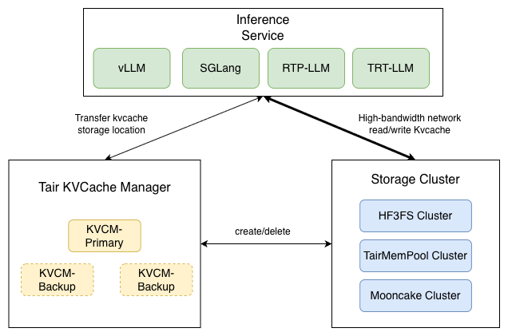

# Tair KVCache

--------------------------------------------------------------------------------

 
    |<a href="https://github.com/alibaba/tair-kvcache/blob/main/README_zh.md"><b>中文版本</b></a>|

--------------------------------------------------------------------------------

[Tair KVCache](https://www.aliyun.com/product/kvcache) is Alibaba Cloud's high-performance KVCache system designed for Large Language Model (LLM) inference scenarios. Through technologies such as distributed memory pooling and dynamic multi-level caching, it achieves acceleration and efficiency improvement while reducing resource costs.
Currently, the global KVCache management system Tair KVCache Manager has been open-sourced.

## Tair KVCache Manager
Tair KVCache Manager is one of the core components of Tair KVCache, designed to provide unified KVCache metadata management services for Large Language Model (LLM) inference scenarios.

### System Architecture

- Tair KVCache Manager is deployed in a centralized mode, responsible for global metadata management of KVCache, providing services such as KVCache queries and storage capacity management.
- Tair KVCache Manager Client/Connector is responsible for interfacing with inference engines, implementing metadata queries and KVCache data transmission.

**Tair KVCache Manager** mainly consists of the following components:

- Access Layer (Server): Provides HTTP and gRPC services
- Cache Logic (CacheManager): Responsible for implementing external interfaces and core business logic
  - Provides multiple matching logics: prefix matching, sliding window matching, KV matching, etc.
  - Implements two-phase write mechanism: obtaining write addresses + notifying after write completion. Ensures data reliability.
  - Storage backend selection: Dynamically selects storage backends based on metrics such as storage backend availability.
- Storage Management (DataStorage): Responsible for managing multiple storage backends
  - Compatible with multiple storage systems: Encapsulates unified interfaces and data location descriptions for heterogeneous storage, supporting systems like HF3FS, Mooncake, NFS, etc.
  - Storage system status management: Real-time monitoring of storage backend availability and storage water levels for use by CacheManager.
- Index Management (MetaIndex)
  - Implements metadata persistence based on external KV storage systems, ensuring metadata reliability during KVCM failures.
  - Unified control of metadata query and update operations, supports batch processing to improve performance, while ensuring update atomicity through mechanisms like sharded locks.
- Capacity Management (Reclaimer & Executor)
  - Flexible control of storage capacity usage: Supports multi-dimensional capacity control such as Instance Group
  - Controls backend storage water levels: Prevents storage backend capacity from exceeding limits
  - KVCache eviction: Evicts KVCache data based on Quota and water levels to control storage capacity water levels.
  - Background thread pool implements asynchronous deletion: Deletion does not block foreground requests, deletion performance is scalable.
- Cache Simulation and Optimization (Optimizer):
  - Replays KVCache access traces, efficiently simulates KVCache access behavior, analyzes key metrics such as KVCache hit rate and capacity consumption.
  - Based on simulation results, guides optimization of parameters like capacity to improve overall ROI.
  - For more information, refer to [KVCacheManager Optimizer Usage Guide](docs/optimizer.md)

If you want to learn more about the detailed design of Manager, refer to: [Alibaba Cloud Tair KVCache Manager: Architecture Design and Implementation of Enterprise-level Global KVCache Management Service](https://mp.weixin.qq.com/s/apZIaiI5zazumEYNQHTdHg)

**Tair KVCache Manager Client/Connector**

Uses a unified transmission library to support KVCache transmission for multiple inference engines and storage backends. Currently supports engines such as vLLM, SGLang, RTP-LLM, TRT-LLM, etc.

# Contact Us
- If you have technical questions or feature requirements related to this project, feel free to submit issues.
- If you have commercial cloud service product consultation needs for KVCache, please refer to [Alibaba Cloud Tair KVCache Product Page](https://www.aliyun.com/product/kvcache) and [Alibaba Cloud Tair KVCache Product Documentation](https://help.aliyun.com/zh/redis/product-overview/tair-kvcache/) to contact us.