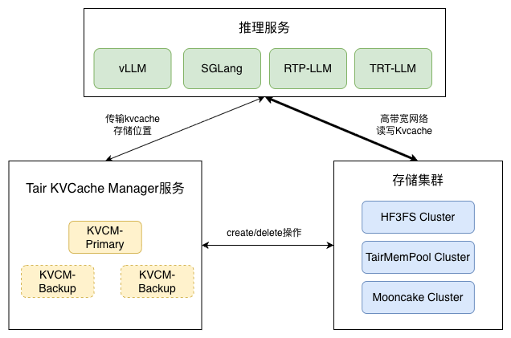
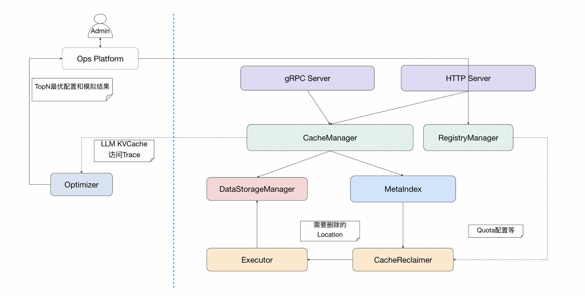

# Tair KVCache

--------------------------------------------------------------------------------

 
    |<a href="https://github.com/alibaba/tair-kvcache/README.md"><b>English Version</b></a>|

--------------------------------------------------------------------------------

[Tair KVCache](https://www.aliyun.com/product/kvcache) 是阿里云为大语言模型（LLM）推理场景设计的高性能 KVCache 缓存系统，通过分布式内存池化、动态多级缓存等技术，实现加速提效的同时降低资源成本。
目前，其中的全局 KVCache 管理系统 Tair KVCache Manager 已经开源。

## Tair KVCache Manager
Tair KVCache Manager 是 Tair KVCache 的核心组件之一，旨在为大语言模型（LLM）推理场景提供统一的KVCache元数据管理服务。
### 系统架构

- Tair KVCache Manager 以中心化模式部署，负责KVCache的全局元数据管理，提供KVCache查询，存储容量管理等等服务。
- Tair KVCache Manager Client/Connector 负责对接推理引擎，实现元数据查询和KVCache数据传输。

**Tair KVCache Manager**主要由以下组件构成：

- 接入层（Server）：提供HTTP和gRPC服务
- 缓存逻辑（CacheManager）：负责实现对外接口和核心业务逻辑
  - 提供多种匹配逻辑：前缀匹配、滑动窗口匹配，KV匹配等。
  - 实现两阶段写入机制：获取写入地址+完成写入后通知。保障数据可靠性。
  - 存储后端选择：根据存储后端可用性等指标，动态选择存储后端。
- 存储管理（DataStorage）：负责管理多种存储后端
  - 兼容多种存储系统：为异构存储封装统一接口和数据位置描述，支持HF3FS、Mooncake、NFS等系统。
  - 存储系统状态管理：实时探测存储后端可用性和存储水位等状态，供CacheManager使用。
- 索引管理（MetaIndex）
  - 基于外部KV存储系统实现元数据持久化，保证KVCM故障时的元数据可靠性。
  - 统一控制元数据的查询更新操作，支持批处理以提升性能，同时通过分片锁等机制保障更新原子性，
- 容量管理（Reclaimer & Executor）
  - 灵活控制存储容量使用：支持Instance Group等多维度容量控制
  - 控制后端存储水位：避免存储后端容量超限
  - KVCache逐出：根据Quota和水位逐出KVCache数据，控制存储容量水位。
  - 后台线程池实现异步删除：删除不阻塞前台请求，删除性能可扩展。
- 缓存仿真和优化（Optimizer）：
  - 重放KVCache访问Trace，高效模拟KVCache访问行为，分析KVCache命中率和容量消耗等关键指标。
  - 基于仿真结果，指导容量等参数的优化，提高整体ROI。
  - 更多信息可参考 [KVCacheManager Optimizer 使用指南](docs/optimizer.md)

如果想要了解更多Manager详细设计，可参考：[阿里云Tair KVCache Manager：企业级全局 KVCache 管理服务的架构设计与实现](https://mp.weixin.qq.com/s/apZIaiI5zazumEYNQHTdHg)

**Tair KVCache Manager Client/Connector**

使用统一的传输库支持多推理引擎和存储后端的KVCache传输。当前支持vLLM、SGLang、RTP-LLM、TRT-LLM等引擎。

# 联系我们
- 如有本项目相关技术问题和功能需求，欢迎提交issue。
- 如有KVCache商业化云服务产品咨询需求，请参考[阿里云Tair KVCache产品页](https://www.aliyun.com/product/kvcache)和[阿里云Tair KVCache产品文档](https://help.aliyun.com/zh/redis/product-overview/tair-kvcache/)联系我们。