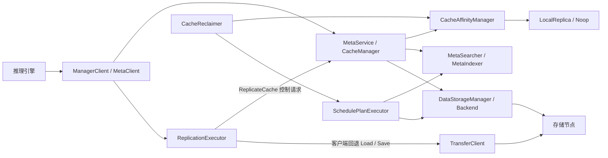
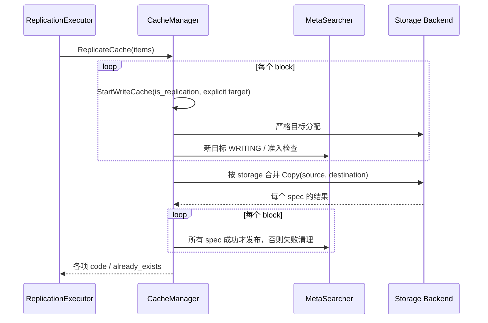

# 缓存亲和性实现参考

先读[整体设计](design-cache-affinity-v1.md)了解方案。本页供实现和排查时查阅，保留调用链、参数默认值、源码依据、已知缺口和测试边界。

本文描述 `kvcm_affinity_merge` 分支的实际行为，不把设计目标视为已完成能力。源码核对基线为 **2026-10-08，KVCM `f0b9254d917bba8c23df8c91b56e49e321718664`**；下文链接随分支移动，核对历史行为时使用此提交。配置示例见[中文指南](cache-affinity-zh_CN.md) / [English guide](cache-affinity-en_US.md)。

## 1. 目标、边界与组件

当前方案围绕调用方所在存储节点组织缓存：普通写尽量就近放置；读取优先选本地、其次同超节点的已有组件；远端读取达到热度条件后返回复制提示；SDK 执行复制；服务端按节点水位触发回收。所有匹配、热度与复制元数据均以 `instance_id` 隔离，不跨 Instance 共享缓存。

这里的“调度”是**缓存副本的放置与选择**。KVCM 不把推理请求分派到某个推理 worker，不提供全局推理负载均衡，也没有后台主动寻找热点并预复制的扫描器。复制提示由读请求触发，客户端可以不执行。



服务端复制由 KVCM 编排目标分配、后端 Copy 和元数据发布；支持 Copy 的后端在存储节点间传输数据。客户端回退则通过 TransferClient 搬运数据。两种路径都不要求 KV 数据流经 KVCM 服务进程。

| 组件 | 当前职责与源码 |
|---|---|
| 策略管理 | [CacheAffinityManager](../kv_cache_manager/affinity/cache_affinity_manager.cc)：选择策略、缓存解析结果、节点指标、热度和提示抑制 |
| 策略算法 | [LocalReplicaAffinityStrategy](../kv_cache_manager/affinity/local_replica_strategy.cc)：`ResolveWrite`、`ResolveRead`、`ResolveEviction` 三个入口 |
| 缓存编排 | [CacheManager](../kv_cache_manager/manager/cache_manager.cc)：普通写、严格目标复制、会话发布与回滚 |
| 元数据 | [MetaSearcher](../kv_cache_manager/manager/meta_searcher.cc)：读选路、Location 准入、保留副本的条件状态修改 |
| SDK 执行器 | [ReplicationExecutor](../kv_cache_manager/client/src/replication_executor.cc)：有界队列、服务端复制、客户端回退、资源与结果统计 |
| 回收 | [CacheReclaimer](../kv_cache_manager/manager/cache_reclaimer.cc) 和 [SchedulePlanExecutor](../kv_cache_manager/manager/schedule_plan_executor.cc)：候选采样、删除准入、物理删除与元数据清理 |

## 2. 身份、位置与协议

### 2.1 节点身份

协议使用 `caller.node_id`、`caller.supernode_id`、`caller.replication_capabilities`，不是旧文档中的顶层 `caller_node_ip`。`node_id` 是后端约定的字符串：内源 mempool 使用 **PACE 当前数字 node id 的十进制字符串**；NFS 使用本机 IP。不能用 provider UUID 替换 mempool 的数字 node id。

[CallerNodeProviderFactory](../kv_cache_manager/client/src/internal/sdk/caller_node_provider_factory.cc) 按 storage 配置顺序选择第一个可初始化的 provider。内源 mempool 通过 `pace_local_providers` 查询：仅在恰好一个 provider 且数字 ID 非零时返回身份，否则返回空。默认每次查询；只有显式配置正的 `caller_node_refresh_seconds` 才缓存。该查询不等价于 provider 健康探测。

当前工厂处理 `TAIR_MEMPOOL` 和 NFS，**没有 `TAIR_MEMPOOL_SSD` 分支**；仅配置 SSD 类型时不能据此声称 SDK 已自动取得 PACE 身份。多 storage、多 PACE 集群的身份选择也没有按请求重新绑定。

[NodeTopology](../kv_cache_manager/common/node_topology.h) 读取环境变量 `KVCM_NODE_TOPOLOGY_FILE` 指定的 JSON：`nodes` 将上述实际 node id 映射到 supernode。按需最多每 5 秒刷新，连续读取失败后旧映射最多保留 30 秒。它与策略文件不同，支持周期重读；不自动发现集群拓扑。

服务端构造策略上下文时，文件中的 caller 映射优先于请求自报的 supernode；二者均为空时才使用 caller 指标中的 supernode。选同超节点副本还要求**候选节点有未过期的指标记录**，文件映射本身不会创建节点指标。因此本地副本可直接按 node id 命中，同超节点偏好却可能因指标过期退化为首候选。

### 2.2 元数据粒度

[CacheLocation / LocationSpec](../kv_cache_manager/meta/cache_location.h) 的层次是：

```text
instance_id → block_key → 多个 CacheLocation（各自有 id / status / create_time）
                          └→ 多个 LocationSpec（name / uri / node_id）
```

一个 CacheLocation 可包含多个 spec，普通非严格分配允许这些组件落在不同节点。`LocationDescriptor.node_id` 必须描述后端**实际分配节点**，随后写入 LocationSpec；不能直接把请求中的偏好节点当作分配结果。

读接口可能把同一 storage 的多个 Location 合成为一个返回值，ID 带 `_merged`。这是读视图，不是新增的持久化副本。排查真实副本及 WRITING/SERVING 状态应使用 `GetCacheMeta` 的完整副本结果 `replica_locations`，不能从合成读结果反推 Location 数量。

`GetCacheMeta.locations` 是兼容字段，每个 key 只取遍历到的第一个 Location，并不保证它是 SERVING 或位于 caller 本地；`replica_locations` 才逐 key 返回全部实际条目。当前 `detail_level` 传到 CacheManager 后未用于裁剪这些结果，不应依赖它控制副本详细程度。

### 2.3 协议与兼容

以 [meta_service.proto](../kv_cache_manager/protocol/protobuf/meta_service.proto) 和 [MetaServiceImpl](../kv_cache_manager/service/meta_service_impl.cc) 为准：

| 接口/字段 | 当前语义 |
|---|---|
| `GetCacheLocationRequest.caller` | caller 身份、拓扑及能力；读结果可携带 `replication_hints` 和能力确认 |
| `StartWriteCacheRequest` | `caller` 影响普通写；`is_replication=true` 时必须带 `replication_target_node_id`，目标独立于 caller |
| `ReplicationHint` | block key、显式 target、完整具名 `source_specs`；单 spec 还提供兼容的 `source_uri` |
| `ReplicateCacheRequest` | 支持原单项字段和批量 `items`；每项有独立 target、sources 和结果 |
| 批量 `ReplicateCacheResponse` | 顶层 OK 表示请求已处理，必须检查每项 `results.code`；`already_exists` 表示目标已具备所需 SERVING 组件 |
| 旧客户端 | 不带 caller 仍能读写；未声明具名 spec 能力时只会收到单 spec 复制提示 |

多 spec 提示要求 caller 的 `replication_capabilities` 包含具名 spec 能力位（值 `1`）。能力检查在热度观察和抑制之前，旧客户端的多 spec 读不会消耗新协议的热度或抑制窗口。`GetCacheLocationLen`、`GetCacheLocationsByBackend` 没有这一套 caller/hint 接口，不能概括成所有查询都触发复制。

## 3. 策略选择、开关与配置

### 3.1 策略优先级

`CacheAffinityManager` 选择 **instance > instance_group > process > noop** 中第一个非空且整体解析成功的策略。高层策略完整替换低层策略，不做字段合并。空串或整体解析失败向下回退；显式 `{"type":"noop"}` 会终止回退链。相同原始 JSON 共享已解析对象。

实例与实例组策略随 registry 保存、恢复。进程策略由 [Server::Init](../kv_cache_manager/service/server.cc) 在启动时读取；**当前没有策略文件监视或管理 API 的进程策略热加载链路**。管理类虽提供加载函数，也不能据此假定编辑文件即时生效。

配置写入与生效方式必须分别看调用链，见 [RegistryManager](../kv_cache_manager/config/registry_manager.cc)：

| 层级 | 当前可用入口 | 更新边界 |
|---|---|---|
| instance | 首次 `RegisterInstance.affinity_strategy_json` | 已存在实例的注册分支不比较、不更新该字段；仅更改此字段再次注册可能返回 OK，但策略保持原值 |
| instance_group | 创建组或 `UpdateInstanceGroup` | 更新需携带完整组配置，`current_version` 等于旧版本且新 `version` 更大；后续决策读取新组对象，已有有效 instance 覆盖仍优先 |
| process | 启动配置中的 `strategy_file` | 文件不监视；改动后需重新加载进程配置 |

策略 JSON 在注册/组配置写入时并不等价于已通过 StrategyFactory 校验；实际选策略时仍可能解析失败并向下回退。应核对持久化配置和实际决策，不能只看注册/更新 RPC 的 OK。

`kvcm.affinity.enabled` 默认 `false`，关闭时所有层级返回 Noop。开启且未指定策略文件时安装服务端内置 LocalReplica 策略；指定文件但读取/解析失败时仅记录警告，不另装内置策略，仍可使用实例/实例组策略。

全局开关控制策略决策；**它不禁止显式 `ReplicateCache` RPC，也不会撤销 SDK 已提交的复制任务**。另外，Noop 下 `GetReplicaLimits` 返回的结构仍默认保留数为 1，对 `ReclaimByLRU` 的影响见第 7.3 节，不能把总开关描述成完全恢复旧回收行为。SDK 的 `auto_replicate` 则只控制读结果自动入队，不禁止显式复制 API。

### 3.2 默认值必须区分两种来源

默认值来自 [LocalReplica Params](../kv_cache_manager/affinity/local_replica_strategy.h)、[ReplicaLimits](../kv_cache_manager/common/affinity_types.h)；服务端内置 JSON 另有覆盖：

| 参数 | 裸 `{"type":"local_replica"}` | 开启 affinity、未指定策略文件 |
|---|---|---|
| `enabled_aspects.write/read/eviction` | 全部 true | 同左 |
| `write.ops` | 无流水线，不输出写偏好 | `prefer_local.on_miss=abort`，`limit=2` |
| `read.on_miss.enabled` | true | 同左 |
| `replication_hot_threshold` | 3 | 同左 |
| `caller_capacity_threshold` / `caller_capacity_buffer` | 0.85 / 0.05 | **0.90 / 0.05** |
| `heat_half_life_ms` / `suppression_window_ms` | 60000 / 60000 | 同左 |
| `max_replication_bytes` / `min_benefit_ratio` / `prefix_bonus` | 0 / 0 / 0 | 同左 |
| `node_water_level.threshold` / `low` / `critical` | 0.85 / 0.70 / 0.95 | 同左 |
| `max_replicas_per_key` / `max_instance_bytes` | 0 / 0，均不设上限 | 同左 |
| `min_retained_replicas` | 1；实际接入范围见第 7 节 | 同左 |

复制容量门槛是 `threshold - buffer`，因此已知指标下两种配置分别允许到 **0.80** 和 **0.85**，相等仍可通过。`critical` 已解析存储，但目前没有对应的独立决策分支。

[StrategyFactory](../kv_cache_manager/affinity/strategy_factory.cc) 接受裸策略或 `{"strategy":{...}}` 包装，要求 `type` 为 `noop` 或 `local_replica`。写流水线必须放在 **`write.ops` 对象**中。旧版把 `filter/sort/limit` 直接放在 strategy 下的示例不适用。

解析器不是完整的严格 schema 校验器：部分字段类型错误会保留默认值，写流水线解析失败也可能仅使 `write_pipeline` 为空，而整个 LocalReplica 策略仍被接受。不能把“加载成功”视为所有配置字段均生效。

## 4. 普通写：偏好分配、准入、发布

调用链为 `StartWriteCache → FilterWriteCache → GenWriteLocation → DataStorageManager::Create → MetaSearcher::BatchAddLocation → FinishWriteCache`，见 [CacheManager](../kv_cache_manager/manager/cache_manager.cc)。

1. 普通写先按已有副本和 `min_replica_count` 去重；选择 storage 的既有逻辑继续负责选后端/层级。
2. 亲和性从未过期的节点指标中取得候选，依次执行 `filter → prefer_local → sample → sort → limit`。每段可省略，顺序固定。`prefer_local` 命中会缩小候选；无候选时管理器直接给空 hints。
3. **普通写是 best effort**：策略 Abort 会降级为空 hints，后端可回退到其他节点。`limit=2` 只是最多返回两个偏好候选，不代表创建两个副本。默认不支持 affinity 的后端仍可走旧 Create。
4. 后端先分配，再将实际 URI/node id 提交元数据准入，生成 WRITING Location 和写会话。准入失败走回滚，不能声称分配前已预留好所有容量。
5. 客户端完成数据写入后调用 Finish；成功 block 的 Location 转为 SERVING，失败 mask 或会话超时触发清理。批量写允许部分 block 发布，不是整批事务。

`MetaSearcher::BatchAddLocation` 在同一个 MetaIndexer 的进程内 admission mutex 下检查：

- `max_replicas_per_key` 统计 **Location 条目数**，含 WRITING/DELETING 和分拆 spec 的条目，不是不同物理节点上的完整副本数。
- `max_instance_bytes` 包含原始副本和 WRITING 预留，按所有 spec URI 的 size 计费；启用字节预算时不能把未知大小当作零成本。
- 两项限制也作用于普通 StartWrite，并非只限制读触发的复制；`enabled_aspects.write=false` 不单独关闭 replica limits。

这些是 StartWrite/BatchAddLocation 路径的限制，不是所有写入入口共享的分布式硬配额；ReportEvent、迁移等路径不能自动推定受同一 admission 约束。

## 5. 读：先选择已有组件，再决定是否提示复制

[meta_searcher.cc 中的 SelectAndMergeForMatch](../kv_cache_manager/manager/meta_searcher.cc) 先过滤 SERVING（以及请求启用时的存储存在性检查），按既有策略选择 storage，再在该 storage 内按 spec 名称收集候选。LocalReplica 对每个 spec 依次偏好：**caller 本节点 → 同 supernode → 第一个候选**。它不为了本地性跨 storage 改选层级，也不把 WRITING 当成可读数据。

关闭 read 行为时仍可沿既有候选读取，只是不应用本地选择和复制提示。关闭 `read.on_miss.enabled` 只停止产生提示，保留本地优先读取。

产生提示需要候选集合中的各 spec 均选出非空源、非空 caller、协议能力满足，并且至少一个选中 spec 不在本地。hint 携带本次选中的全部 spec，包含已在本地的组件；是否足以构成复制目标的完整数据，还要经过执行阶段的 spec 校验。

这里的“全部”是**选中 storage 的当前 SERVING 候选里出现的 spec 名称集合**，策略并不拿实例的全部 `location_spec_infos` 再做完整性检查。`GetCacheLocation.location_spec_names` 在亲和性决策之后过滤读结果，不会同步裁剪已经生成的 hint。例如只查询 KV 组件，也可能得到含 KV 和 Mamba 的复制提示；这有助于复制完整数据，但也意味着不能按返回读组件数估算复制成本。按 spec group 写入而源端只存在部分组件的情况，见第 6.1 节。

| 准入条件 | 实际计算 |
|---|---|
| 热度 | 按 `(instance_id, caller.node_id, block_key)` 计数；每经过一个半衰期做一次二分衰减，`heat_half_life_ms=0` 关闭衰减 |
| 容量 | 有 caller 指标时，要求 `load_ratio <= threshold - buffer`；**缺失/过期指标不会阻止复制提示** |
| 大小 | 配置 `max_replication_bytes>0` 时检查全部源 spec 总大小；启用大小或收益门槛时，size 缺失、为零或溢出均拒绝提示 |
| 收益 | `remote_bytes × decayed_heat × (1 + prefix_bonus / (position + 1)) >= total_copy_bytes × min_benefit_ratio`；没有有效位置时权重为 1 |
| 抑制 | 按同一 instance/caller/key，默认 60 秒只发一次；0 关闭时间抑制 |

热度在容量/成本门槛判断前累积；收益门槛默认关闭，`prefix_bonus` 只有收益判断开启才影响准入。名为 [FrequencySketch](../kv_cache_manager/affinity/frequency_sketch.cc) 的实现是有容量上限的 LRU 计数表，而非 Count-Min Sketch；管理器注入的容量为 100 万条。热度和 [HintSuppressor](../kv_cache_manager/affinity/hint_suppressor.cc) 都是进程内状态，不持久化。

热度计数发生在**元数据远端命中**时，没有等待或接收 TransferClient Load 成功反馈；查询、轮询也可能增加热度。`prefix_position` 仅 PrefixMatch 传入从 0 开始的 key 位置，BatchGet 和滑窗查询使用默认 -1，所以它们的收益权重为 1。更改半衰期会重建该 key 的计数依据。提示抑制表默认最多 10 万条，LRU 淘汰条目或进程重启都可能使提示早于原窗口再次出现，不能把它当成持久化限频器。

提示发出后没有复制结果反馈来提前解除服务端抑制。任务丢弃或复制失败后，需要后续读取及窗口到期重新触发；没有持久化重试任务或“最终必定复制成功”的保证。

## 6. 复制：服务端 Copy 优先，客户端可回退

### 6.1 服务端编排



复制目标必须显式指定，strict 分配不允许偏好失败后落到别处。不支持 affinity 的后端在严格写上返回不支持。目标节点已在 SERVING Locations 中覆盖所需全部 spec 时可跳过复制；覆盖可以来自多个 Location。

[CacheManager::ReplicateCaches](../kv_cache_manager/manager/cache_manager.cc) 校验源/目标 spec 名称一一对应，且 URI 属于同一 storage；不实现跨 storage 的 Copy。按 storage 合并 Copy 调用，每个 block 只有全部组件复制成功才发布，单项失败不取消其他成功项。Copy 结果个数异常按失败处理。

复制申请当前不携带 `location_spec_group_names`，目标按实例全部 spec 分配。若原 block 只写了一个 spec group，hint 即使覆盖当前可读组件，也可能缺少新目标要求的组件，随后校验失败并回滚；没有自动补齐不存在的源数据。`ReplicationHint` 也不锁定目标 storage：`GenWriteLocation` 仍使用既有写入 storage 选择逻辑，若目标与源 URI 的 storage 不同，服务端 Copy 会拒绝。**多 spec 名称校验已实现，不等于任意 spec group 或多 storage 组合的自动复制都已打通。**

### 6.2 SDK 自动与显式复制

[ManagerClientImpl](../kv_cache_manager/client/src/manager_client_impl.cc) 在同时具备 MetaClient 和 TransferClient 的 HYBRID 客户端上创建执行器。`auto_replicate=true` 时，成功 MatchLocation 返回的提示自动提交；默认 false。只使用 MetaClient、长度查询或某个连接器，并不能自动推定复制任务已经接入执行。

无复用 buffer 的任务优先调用批量 ReplicateCache，最多 64 项；配置目标速率后每批降为 1 项，便于逐项排队计费。**仅服务端返回“不支持”才回退客户端复制**；普通分配、复制或发布错误不会被无条件重试。

客户端回退或显式 buffer 复用执行：

1. `StartReplicationWrite` 申请严格目标及会话；若目标已完整存在，结束空会话并返回 already-exists。
2. 按 spec 名称匹配源、目标及已有 buffer；缺少的组件经 TransferClient Load 到 CPU buffer，再 Save 所有目标组件。
3. 检查大小、目标 URI 返回完整性；全部成功后 Finish 成功，否则以失败 mask 清理会话。
4. 成功 Finish 的响应丢失属于发布结果不确定，记录发布失败，**不再发送相反的失败确认**；后续查询/会话清理负责收敛。

`ReplicateWithBuffers[Async]` 允许带共享 owner 的具名 CPU/GPU buffer，内存类型向 TransferClient 透传；这说明接口和 mock 路径存在，不代表所有后端都已通过 GPU 实机验证。旧单指针 API 对多 spec 不能任意猜测名称，改走完整读取。异步接口的 bool 是入队结果；释放回调表示所有权释放，复制成功与否看结果回调 / `GetReplicationStats()`。

执行前若当前 caller **非空且不同于 target**，旧提示会被丢弃；caller 解析为空时没有同样的拒绝条件，不能声称 provider 消失一定撤销旧任务。

### 6.3 资源与时限

[ClientConfig](../kv_cache_manager/client/src/internal/config/client_config.cc) 和执行器的默认值：

| 配置/约束 | 默认与范围 |
|---|---|
| `auto_replicate` | false |
| `replication_workers` | 2，可配置 1–64 |
| 待处理任务个数 | ManagerClient 使用固定上限 1024，无对应 JSON 配置字段 |
| `replication_max_pending_bytes` | 256 MiB，执行器待处理队列的字节估算，不含已出队任务 |
| `replication_max_buffer_bytes` | 256 MiB，进程共享已持有/分配的数据 buffer 预算 |
| `replication_node_bytes_per_second` | 0，不限速；正值在同一 SDK 进程按 target 共享节奏控制 |
| `replication_max_age_ms` | 30000，队列/开始执行/资源等待的过期控制 |
| `caller_node_refresh_seconds` | 0，每次查询；正值允许缓存身份 |

缓冲区复用任务还有 `2 × workers` 的队列名额上限；执行器内按 `(block_key,target)` 去重。共享资源等待队列在实例间轮转，服务端 Copy 也受目标速率约束，但不占用客户端搬运 buffer。计费来自 URI/任务估算；不同 SDK 进程不共享预算或速率，直接 RPC 调用也不受 SDK 队列控制。各执行器应使用一致的进程共享资源配置。

`Submit` 对自动 hint 还会用 `replication_max_buffer_bytes` 检查**单任务估算大小**，即使该任务准备走服务端 Copy，也可能在入队前因超过此值被拒绝。共享限速实现是一笔任务可先发出，再预约 `bytes/rate` 时间，不是网卡层持续整形。公平性作用于进入 `ReplicationResources::Acquire` 的等待者；不限速的服务端 Copy 不经过这一资源等待队列，不能泛化为所有复制任务均有全局公平调度。

任务过期并非运行中 RPC/Load/Save 的强制取消。复制写会话使用独立超时（SDK 传 60 秒）；队列、热度、抑制和资源等待状态均不做重启恢复。

`Shutdown` 设置停止标志后唤醒并 join worker。worker 的退出条件是“已停止且队列为空”，仍可能处理已有队列任务；正在执行的 RPC/传输也不会被强制取消。因此它既不是立即取消所有复制，也没有由 `replication_max_age_ms` 保证的关闭时长上限。服务端写会话超时由轮询清理触发，同样不等于超时瞬间已完成物理删除。

### 6.4 结果统计的口径

`GetReplicationStats()` 返回单个 ManagerClient 执行器的统计，共享资源预算不意味着这些计数也全进程聚合，见 [ReplicationStats](../kv_cache_manager/client/include/common.h) 与执行器的 `CompleteTask/GetStats`。

| 字段 | 解释 |
|---|---|
| `succeeded` / `copied_bytes` | 确认复制并发布成功的任务/字节；字节来自 URI 或 buffer 大小，不是网卡实测流量 |
| `server_copy_succeeded` | 服务端 RPC 成功项，包含 already-exists，因此不等于新增副本数量 |
| `skipped` | 包含目标已存在及 caller 已变化的跳过 |
| `dropped_*` / `duplicates` | 队列、预算、参数或重复导致的拒绝；不应只看 `failed` 判断是否有任务未复制 |
| `queued` / `active` / `pending_bytes` | 当前状态量；`latency_us`、`queue_wait_us` 则是累计耗时，不是平均延迟 |

回调或统计用于观察执行结果，不能替代 GetCacheMeta 的实际副本状态与后端物理数据校验。上述分类也不是可以任意相加的互斥分区。

## 7. 节点指标、压力回收与当前接线缺口

### 7.1 指标新鲜度

CacheManager 初始化预热节点指标，随后默认每 5 秒拉取后端快照；CacheAffinityManager 默认 30 秒未收到新样本后移除节点。相同或更旧的正 `updated_at_us` 不续期、不重置删除释放量；已过期样本也不因重复拉取恢复新鲜度。时间戳为零的合成指标没有上述真实采样语义。

指标过期会移除写候选和节点水位候选；读复制容量门槛则按“指标未知”处理，仍可能产生提示。节点表以 `node_id` 为键，未加入 storage/集群命名空间，不能默认不同 PACE 集群的同号节点已隔离。

### 7.2 回收链路

`ResolveEviction` 对各实例的有效策略计算超水位节点；某实例关闭 eviction 不会跳过后续实例。节点压力分支独立于实例组配额压力，经 `ReclaimByNode` 使用 `node_lru` 索引采样，再复用异步删除的 pending 限额、重复过滤、活动写/迁移保护和删除流程。

该分支还要求元数据 backend URI 带 `reclaim_indexer_type=node_lru`。[MetaStorageBackendManager](../kv_cache_manager/meta/meta_storage_backend_manager.cc) 不会仅因 affinity 开启就自动创建节点索引；缺少索引时采样返回 `EC_NOENT`，本轮不提交节点回收。索引维护行为见 [meta_indexer_node_lru_test.cc](../kv_cache_manager/meta/test/meta_indexer_node_lru_test.cc)。

[NodeLruReclaimIndexer](../kv_cache_manager/meta/reclaim_indexer/node_lru_reclaim_indexer.cc) 按 node 维护 key 的顺序；一次 key 的 Touch 会更新它在索引中关联的所有节点，并非只更新本次读取选中的副本。索引还会登记带 node id 的 WRITING 等条目，能否删除由后续状态、活动会话和迁移检查决定。因此这里的 LRU 不等于各存储节点真实数据读取次数。

超过 `threshold` 开始选择节点；有删除释放量后，按估算水位继续选择，直到达到 `low`。释放量只在后端返回删除成功后记录，并与删除开始时间和指标采样时间校验；新样本只清除该节点的估算。**成功提交异步删除不等于物理空间已经释放。** `critical` 目前不改变此流程。

删除候选虽由 `LocationSpec.node_id` 匹配，提交与删除粒度仍是 **整个 CacheLocation**：只要其中一个 spec 位于压力节点，就可能连同其他节点上的组件一起删除，尚未实现按 spec 拆分删除。

### 7.3 最少保留副本并未在节点路径完整生效

这是当前实现与旧文档最关键的差异：

- `MetaSearcher::BatchMarkDeletingWithRetention` 已实现 RMW：按 spec 名称统计 SERVING Location 数，若删除会低于 minimum 则拒绝该项。
- `SchedulePlanExecutor::PrepareDeleteTaskImpl` 在收到正的 `min_retained_replicas` 时调用上述保护，否则走普通 CAS。
- **`ReclaimByNode` 构造请求时没有设置该字段，沿用请求默认 0。** 当前不能保证节点压力回收保留配置的最低副本数。
- 当前显式设置该字段的调用点在 `ReclaimByLRU`；其他回收、显式删除、TTL/GC 不应据此推定有同等保护。
- `GetReplicaLimits` 在 Noop/全局关闭时返回 `ReplicaLimits{}`，其中默认保留数仍为 1。因此只要传入 affinity manager，`ReclaimByLRU` 也可能在全局关闭时继续保留最低数量。这是与“仅保护节点压力回收”的参数注释不一致的另一面，不能以注释替代调用链结论。

因此，“保留数参数已解析”和“元数据保护函数已有单测”不等于“节点压力回收全链路受保护”。这里记录实际缺口，本次文档整理不改变回收代码。

### 7.4 重启恢复的范围

| 状态 | 当前恢复行为 |
|---|---|
| 实例/组策略与 Location 元数据 | 依赖所选 registry/meta 后端的持久化和恢复；内存后端不能提供进程重启持久性 |
| 实例用量计数 | [MetaIndexer](../kv_cache_manager/meta/meta_indexer.cc) 的 `PersistMetaData` 周期保存计数，`RecoverMetaData` 读取快照，不扫描全部 Location 重算；异常退出可能留下滞后的预算基数，不能等同于崩溃后一致的硬配额 |
| 写会话 | [WriteLocationManager](../kv_cache_manager/manager/write_location_manager.cc) 的 session 表在进程内；遗留 WRITING 不是可读副本，也不是可自动继续执行的复制任务，需后续回收/GC 处理 |
| 节点 LRU | 进程内派生索引；写入通知和双后端恢复的 `BackfillKeysToCache → NotifyIndexersAdd` 可填充。单后端 Open 分支没有等价的全量重建动作，不能把元数据恢复成功直接等同于节点索引恢复完整 |
| 热度、抑制、删除释放量、SDK 队列 | 均在各自进程内，不持久化；各自进程重启后重新采样或触发，不恢复已丢失的复制任务 |

现有 Manager 受控重启测试验证的是元数据及预算恢复，不覆盖任意后端组合的节点索引完整恢复、崩溃瞬间的写会话续传或 provider 物理数据恢复。

## 8. 后端支持与待完成项

| 项目 | 当前状态及实际边界 |
|---|---|
| 内源 mempool 严格放置、node id、容量快照 | 已有适配，真实逻辑位于父仓库 `internal_source`；开源同名 stub 不能代表内源能力 |
| 内源 mempool Copy | 已接 PACE 批量同步 Copy；源/目标须符合 URI、大小及介质约束；成功后才发布 |
| NFS | 支持本机身份及严格本机分配；容量快照是 free=最大值、load=0 的合成值；Copy 未实现，Delete/Exist/Lock/UnLock 仍为占位行为 |
| 其他后端 | 默认普通写兼容，严格 affinity 分配拒绝；必须分别核对是否覆盖后端虚函数 |
| 最少保留副本 | 元数据保护已实现；节点压力未传参数，普通 ReclaimByLRU 却可能在 Noop 下继续保留默认数量，需修正作用范围并补端到端回归 |
| SSD caller 与多集群节点身份 | SSD-only 自动 provider 选择未接；同号 node id 的跨 storage 隔离待完善 |
| 进程策略更新与配置校验 | 启动加载已有；文件自动热加载、全字段严格校验未实现 |
| 已有 instance 的策略更新 | 重复 RegisterInstance 不更新 affinity 字段；不能把注册 OK 当成覆盖成功 |
| spec group / 多 storage 复制 | 提示源集合、复制目标 spec 全集及 storage 选择未统一约束；缺组件或 storage 不同会失败，需专门的端到端场景 |
| 重启后的节点索引 | 双后端 backfill 有通知；单后端 Open 没有全量重建动作，恢复边界需独立验收 |
| 异常退出后的预算 | 计数按周期快照恢复，尚不能宣称与每次 Location 修改同步持久化或重启全量对账 |
| 回收粒度与 critical 水位 | 当前按 Location 删除；spec 级拆分及 critical 独立策略未实现 |
| 复制完成反馈、重试与恢复 | SDK 有结果回调/统计；服务端抑制反馈、持久化任务、跨进程资源配额未实现 |
| 源数据存活保障 | 复制会检查传输结果，但不能把元数据 SERVING 或后端 Lock 接口视为所有后端均有真实数据 pin |
| 实机验收 | 多节点 PACE 数据正确性、真实压力删除、provider 重启和 GPU buffer 传输仍需专门实机用例 |

若继续开发，优先补节点回收的保留数接线及回归，其次验证身份切换/SSD-only 和真实 PACE 复制回收。高级收益模型、全局调度和自动调参不应先于这些生命周期正确性问题。

## 9. 实现与验证索引

以下测试是对应行为的证据入口；测试存在不代表所有路径或硬件已验证：

| 范围 | 源码/测试入口 | 能证明什么 |
|---|---|---|
| 策略与指标 | [affinity/test](../kv_cache_manager/affinity/test/) | 优先级、选路、热度/抑制隔离、指标 TTL、容量估算、成本门槛 |
| 元数据预算与保留 | [meta_searcher_test.cc](../kv_cache_manager/manager/test/meta_searcher_test.cc) | Location 准入与 RMW 保留函数；不代替 ReclaimByNode 接线验证 |
| 复制服务编排 | [cache_manager_test.cc](../kv_cache_manager/manager/test/cache_manager_test.cc) | 严格目标、完整 spec、Copy 结果与发布/清理 |
| SDK 复制 | [replication_executor_test.cc](../kv_cache_manager/client/test/replication_executor_test.cc) | mock 传输的多 spec、buffer 所有权、异常清理、资源预算、限速及结果统计 |
| 真实 Manager 集成 | [affinity_replication_test.py](../integration_test/affinity/affinity_replication_test.py) | 25 个测试：读写/发布/失败重试、实例隔离、协议升级、并发预算、批量结果、完整元数据、受控 Manager 重启 |

真实 Manager 集成使用 NFS 和构造的调用方身份，验证控制与元数据链路；其中 Copy 不支持的分支也会被断言。它不是两台 PACE 节点的实际数据复制测试，Manager 重启测试也不是存储 provider 实机重启测试。内源后端及 PACE 适配的源码/依赖基线见父仓库 `docs/cache-affinity-internal.md`（该文件不属于开源 checkout）。

已存在实例的策略更新、部分 spec group / 多 storage 自动复制、单后端节点索引重建、崩溃后用量对账，是本次按调用链核对出的边界。现有 25 个控制面用例不能作为这些组合已端到端验证的证据；补验收时应分别检查返回值、持久化配置/Location、物理数据以及回收候选，不能只断言 RPC 成功。

维护本文时，应同时核对调用者是否传参、被调用者是否执行、默认配置是否覆盖、测试使用真实后端还是 mock。新增能力要更新对应流程及边界；只新增字段或单测时，不应直接将待完成项改为已完成。
