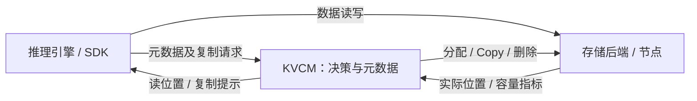

# 缓存亲和性整体设计

## 1. 总体方案

**写时尽量本地，读时优先本地，远端热点按需复制，空间紧张时回收。** 目标是减少反复跨节点读取；复制也会消耗带宽和空间，因此自动复制按策略条件触发。

KVCM 负责缓存副本的放置与选择，推理请求到 worker 的路由由推理系统负责。所有缓存按实例隔离，不跨 `instance_id` 复用。“本地”指 SDK 在请求中上报的存储节点；客户端与已有副本的节点身份一致，才算本地。

### 1.1 谁负责什么

| 角色 | 职责 |
|---|---|
| KVCM 服务端：做决策、记状态 | 根据调用方身份、已有副本、策略和节点容量，决定放哪里、读哪里、是否建议复制、回收哪些缓存 |
| 客户端 SDK：发请求、执行复制 | 上报节点身份，读写数据；启用自动复制后，将提示交给后台执行器 |
| 存储后端（如 PACE）：保存数据 | 执行分配、读写和删除；支持 Copy 时直接完成节点间复制 |

数据在 SDK 与存储节点、或存储节点之间传输，无需经过 KVCM 服务进程。

### 1.2 一次典型流程

以同一实例、同一存储后端内的 A、B 两个节点为例，假设相关策略和 SDK 自动复制已开启：

1. **A 写入**：KVCM 建议放在 A。假设分配成功，数据写完并确认后，A 的副本才可读。
2. **B 远端读**：B 没有本地副本，KVCM 返回 A 的位置，SDK 从 A 读取。
3. **B 按需复制**：B 反复远端命中并通过策略检查后，KVCM 附带“复制到 B”的提示。当前读继续使用 A，SDK 在后台处理复制。
4. **B 本地读**：B 的副本完整复制并发布后，后续查询优先选 B。复制流程不主动删除 A 的源副本。
5. **独立回收**：节点空间紧张时，KVCM 再按节点压力挑选缓存并异步删除；回收不是每次复制后的固定步骤。

复制提示可能被丢弃或执行失败，当前查询不等待复制完成。节点回收的最低副本保护尚未完整接入，见第 3 节。

## 2. 四个环节的设计

### 2.1 写入：本地优先，允许换节点

普通写可按策略用容量等条件筛选候选、优先本地；本地不可用时，允许后端分配到其他节点。这样保留写入成功的机会，KVCM 最终记录的是实际分配位置。

一个缓存块可有多条 `CacheLocation`，每条记录一组具名数据组件（spec）的位置和状态。新分配先登记为 `WRITING`，数据写完并确认后才变为可读的 `SERVING`；失败进入清理。配置数量或字节上限后，这条写入路径会检查预算；数量按 Location 条目统计，正在写入的条目也计入。

### 2.2 读取：选已有位置，热点才建议复制

KVCM 先选择存储后端，再在其中为每个组件按 **本节点 → 同超节点 → 其他已有候选** 选取可读位置。本地按节点身份匹配；同超节点表示拓扑中的同组节点，该级选择还依赖候选节点的有效指标。多个组件可以分别选位置，组合成一次读结果。

仍需远端读取时，按“实例、调用方节点、缓存块”累计热度，再结合容量、大小、收益及提示间隔决定是否建议复制。**热度统计的是远端元数据命中**，不是数据加载成功次数；没有可读源时不产生复制提示。大小和收益门槛可配置，并非默认全部开启。

### 2.3 复制：指定目标，完成后才可读

复制必须严格落到指定目标节点。读触发的复制以调用方节点为目标，放到别处无法改善其本地命中；显式复制则使用请求指定的目标。目标组件全部复制成功并确认发布后才可读，已存在完整可读组件时可跳过。

SDK 在后台执行：自动提示优先走服务端 Copy，只有返回“不支持”才回退到客户端读出再写入；普通错误按失败处理。队列、缓冲区预算和目标速率控制复制开销，约束范围在 SDK 进程内。复用已有数据缓冲区的显式复制路径见[复制执行参考](cache-affinity-implementation.md#replication)。

### 2.4 回收：从高水位向低水位释放空间

服务端周期采集节点容量。节点超过高水位时，使用节点 LRU 索引挑选较久未被访问的缓存，经过活动写入保护、去重等检查后异步删除；依据新指标和成功删除的释放量，向低水位收敛。

节点 LRU 依据 KVCM 的 key 访问记录，不是存储节点的实际数据读取次数。当前按整个 Location 删除，可能涉及多个节点上的组件；只有提交删除任务，还不能认定空间已释放。

## 3. 如何启用，哪些还需补齐

服务端策略按 **实例 → 实例组 → 进程 → Noop（不做亲和性决策）** 选择第一个可用配置，整份覆盖。写、读、回收可以分别开关；服务端亲和性和 SDK 自动复制默认均关闭。

按能力分别启用：

- **位置选择与复制提示**：服务端打开亲和性策略，并提供调用方节点身份。
- **自动执行复制**：SDK 使用同时具备元数据和数据传输能力的 HYBRID ManagerClient，并开启自动复制。
- **节点压力回收**：服务端启用回收策略，并配置 `node_lru` 索引。

仅打开服务端开关不会自动搬运数据，两端开关也不禁止显式复制接口。

主体链路已有实现，但以下能力还不能视为完整：

| 范围 | 已有能力 | 尚需完善 |
|---|---|---|
| 位置选择与复制 | 普通写偏好、按组件读选路、复制提示与执行 | 部分组件组及多存储复制可能因源目标不匹配而失败；SSD-only 身份选择、多集群同号节点隔离未完善 |
| 容量回收 | 节点水位、LRU 候选及异步删除 | **节点回收未传入最低保留副本参数**；普通 LRU 在关闭 affinity 后仍可能保留默认副本数，应优先修正 |
| 更新与恢复 | 组策略更新、元数据恢复及用量快照 | 重复注册不能更新实例策略，进程策略文件不自动重载；单后端节点索引重建、崩溃后用量对账仍有缺口，复制队列不持久化 |

现有单元测试和真实 Manager 集成测试验证了策略及控制链路。真实 PACE 双机复制、压力下物理回收和 GPU 传输仍需实机验收；完整待办和证据见[实现参考](cache-affinity-implementation.md#status)。

## 4. 按需查阅

- [配置与使用](cache-affinity-zh_CN.md) / [English guide](cache-affinity-en_US.md)：启用方式、JSON 示例和效果检查。
- [实现参考](cache-affinity-implementation.md)：源码调用链、协议、默认值、资源限制、完整待办和测试入口。
- [集成测试说明](../integration_test/affinity/README.md)：执行方式与验收范围。

本文对应 `kvcm_affinity_merge` 已核对实现；源码版本和完整依据见[实现参考的核对基线](cache-affinity-implementation.md#baseline)。
