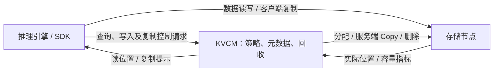

# 缓存亲和性整体设计

## 1. 总体方案

**让缓存尽量靠近使用它的节点：写入时就近放置，读取时优先使用附近副本，反复读取远端缓存时按需复制，节点空间紧张时回收。** 这四个环节构成当前亲和性方案。

KVCM 调度的对象是缓存副本，推理请求到 worker 的路由仍由推理系统负责。缓存始终按 `instance_id` 隔离；这里的“本地”指调用方对应的存储节点，由 SDK 在请求中携带节点身份。

### 1.1 谁负责什么

| 角色 | 职责 |
|---|---|
| KVCM 服务端 | 管理副本位置和状态；结合策略、拓扑及容量指标，决定写入偏好、读取位置、复制提示和回收候选 |
| 客户端 SDK | 上报调用方节点身份，读取数据；启用自动复制后，把服务端提示交给后台执行器，并控制队列、缓冲区和速率 |
| 存储后端（如 PACE） | 实际分配、保存和删除数据；支持服务端 Copy 时，在存储节点间完成复制 |

KVCM 负责控制与元数据，缓存数据由 SDK 与存储节点、或存储节点之间传输，无需经过 KVCM 服务进程。

### 1.2 一次典型流程

假设同一实例的缓存最初在节点 A，调用方位于节点 B：

1. **写入**：A 上的调用方写缓存，KVCM 优先建议放在 A；写完后发布为可读副本。
2. **读取**：B 查询缓存；没有本地副本时，继续读取已有远端副本。
3. **复制**：B 多次远端命中且满足复制条件，KVCM 返回“复制到 B”的提示；SDK 在后台执行。
4. **后续读取**：B 上的新副本发布成功后，B 的后续查询优先选中它。
5. **回收**：节点空间紧张时，KVCM 按节点挑选旧缓存，交给异步删除流程释放空间。

复制由读请求触发，提示不保证一定执行或成功。当前节点回收的最低副本保护还有接线缺口，见第 3 节。

## 2. 各环节如何工作

### 2.1 策略：统一决定写、读和回收

服务端按 **实例 → 实例组 → 进程 → Noop** 选择第一个可用策略，整份覆盖，不逐字段合并。`LocalReplica` 提供写、读、回收三类决策，可分别开关。

服务端亲和性总开关、SDK 自动复制开关默认都关闭。启用服务端策略后可以优化位置选择；再启用 SDK 自动复制，读结果中的提示才会自动进入执行队列。两者不限制显式复制接口。

### 2.2 写入：尽量就近，记录真实位置

普通写可按策略配置用节点容量等条件筛选候选、优先本地，但属于尽力放置：本地不可用时允许后端分配到其他节点。KVCM 保存后端返回的真实位置。

每个缓存块可有多个 `CacheLocation`；一个 Location 内可包含多个具名数据组件（spec）。分配后先登记为 `WRITING`，客户端写完并确认后才转为可读的 `SERVING`；失败则进入清理。副本数和实例字节预算在元数据准入时检查，包含正在写入的条目。

### 2.3 读取：先使用已有副本，再判断是否值得复制

KVCM 先按既有逻辑选择存储后端，再为每个组件选择可读位置，优先级为 **本节点 → 同超节点 → 其他已有候选**。同超节点判断依赖拓扑和有效节点指标；多组件可以组合成一个读结果。

仍需远端读取时，再按调用方和缓存块累计热度，结合容量、复制大小、收益及提示抑制条件决定是否建议复制。这里的热度来自远端元数据命中，不等于数据加载成功次数。当前查询继续使用已有副本，不等待复制完成。

### 2.4 复制：后台执行，完整成功才发布

SDK 通过有界队列执行复制。无复用 buffer 的任务优先请求服务端 Copy；只有服务端返回“不支持”才回退到客户端 Load/Save。普通复制错误按失败处理。

复制必须严格落到指定目标节点，不能像普通写一样改放其他节点。目标先处于 `WRITING`；源、目标组件匹配且一个 block 的全部组件复制成功后，才发布为 `SERVING`。目标已存在完整可读组件时可跳过，失败项进入清理，批量请求逐项返回结果。

### 2.5 回收：按节点压力挑选，异步删除

服务端周期采集节点容量指标。节点超过高水位时，通过节点 LRU 索引选出回收候选，复用活动写入保护、去重和异步删除流程；依据新指标及成功删除的释放量，向低水位收敛。

这条路径需要配置 `node_lru` 索引。当前删除单位是整个 Location，可能包含多个节点上的组件；提交删除任务不代表物理空间已经释放。

## 3. 当前实现边界

写入偏好、读位置选择、复制提示、SDK 执行、严格目标复制和节点压力回收的主体链路已有实现。以下问题仍影响完整性：

| 范围 | 尚未完整解决的部分 |
|---|---|
| 回收正确性 | 节点回收没有传入最低保留副本参数；普通 LRU 却可能在关闭 affinity 后仍保留默认副本数。应优先修正作用范围 |
| 复制与身份适配 | 部分 spec group、多存储组合可能因源目标不匹配而复制失败；SSD-only 自动身份选择、多集群同号节点隔离尚未完善 |
| 配置更新 | 重复注册不能更新已有实例的亲和性策略；进程策略文件只在启动时加载 |
| 恢复与验收 | 单后端重启缺少节点索引全量重建，用量恢复依赖周期快照，复制队列不持久化；真实 PACE 双机、压力回收和 GPU 路径仍需实机验收 |

现有单元测试和真实 Manager 集成测试覆盖策略及控制链路；NFS/mock 测试不能代替 PACE 物理数据与空间释放验证。完整缺口及测试依据见实现参考。

## 4. 按需查阅

- [配置与使用](cache-affinity-zh_CN.md) / [English guide](cache-affinity-en_US.md)：启用方式、JSON 示例和效果检查。
- [实现参考](cache-affinity-implementation.md)：源码调用链、协议、默认值、资源限制、完整待办和测试入口。
- [集成测试说明](../integration_test/affinity/README.md)：执行方式与验收范围。

本文对应 `kvcm_affinity_merge` 当前实现，源码核对基线为 **2026-10-08，KVCM `f0b9254d917bba8c23df8c91b56e49e321718664`**。后续文档整理不改变该实现基线。
