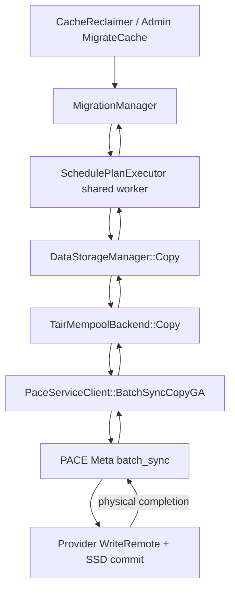
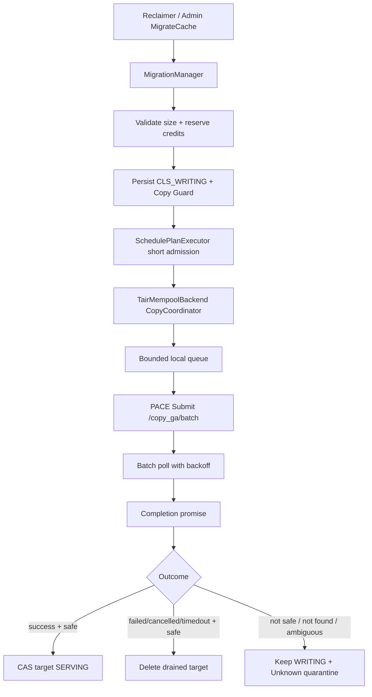
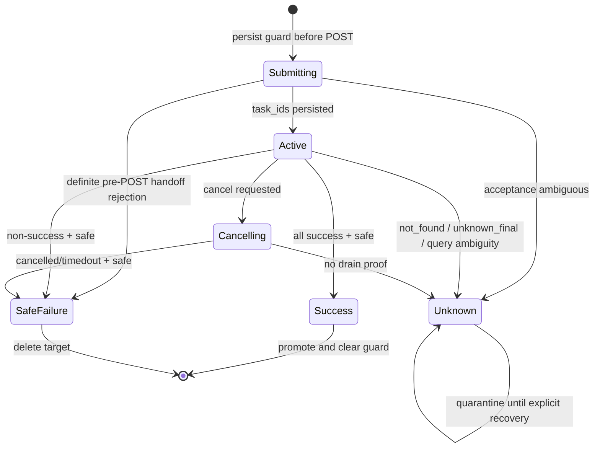

# KVCM × PACE CopyGA 异步化设计

| 项目 | 内容 |
|---|---|
| 状态 | V1 代码完成，202 Linux 编译与定向单测通过；集群联调和故障演练待完成 |
| 决策日期 | 2026-08-24 |
| V1 范围 | KVCM 端到端异步化；PACE Meta/Provider/tair-mempool 零代码改动，KVCM 内源 PACE adapter 复用现有异步 API |
| 涉及模块 | `service`、`manager`、`meta`、`config`、`data_storage`、`metrics`、`protocol` |
| KVCM 审计基线 | `fix/reclaimer-exclude-report-event@0d0371a18faa` |
| PACE 审计基线 | `bugfix/pace-tiered-storage-lightweight-safety@084d88703bd5` |
| 性能依据 | [压测环境 CopyGA 百毫秒延迟差异分析](../../integration_test/tiered_storage/docs/performance/16_COPYGA_LATENCY_GAP_ANALYSIS_2026-08-21.md) |
| 相关问题 | [永久 Copy 失败源隔离与换源缺陷](../../integration_test/tiered_storage/docs/operations/15_KVCM_PERMANENT_COPY_FAILURE_SOURCE_QUARANTINE_2026-08-19.md) |

本文记录 CopyGA 异步化的背景、改造前基线、已选方案、当前 V1 实现、安全契约、验收标准以及明确
暂缓的工作。后续实现若改变本文中的状态机、回收条件、故障语义或模块边界，必须同步更新本文。

## 1. 结论摘要

真实推理请求使用的 KVCache block 为 68 MiB 和 136 MiB，远大于早期 microbenchmark 使用的
4 MiB。压测中 Provider 的 CopyGA 完成时间约为：

| 尺寸 | 典型完成时间 | 有效吞吐 |
|---:|---:|---:|
| 4 MiB（按当前吞吐折算，非实测） | 约 7.5～8.3 ms | 约 0.5 GiB/s |
| 68 MiB | 约 127～139 ms | 约 484～536 MiB/s |
| 136 MiB | 约 259～281 ms | 约 484～525 MiB/s |

68 MiB 到 136 MiB 的延迟接近线性翻倍。当前证据表明，200～300 ms 首先是 100MB+ payload 的真实
数据搬运成本，不是单纯把 KVCM 外层排队误算进 RT。异步化不会降低单次 Copy 的物理耗时；它首先
建立可跨重启恢复、可证明安全回收的目标生命周期契约，其次才是释放 KVCM 共享执行线程、HTTP
client 和存储生命周期锁。`copy_max_concurrency=1` 时，同一个 Instance Group 的 Copy 吞吐不会因为
异步化本身提高；V1 的主要收益是安全地解除长期占用，并为后续受控提高并发打基础。

本设计作出以下核心决策：

1. **V1 只改 KVCM，PACE 不改代码。** KVCM 使用 PACE 已有的 submit/query/cancel API，停止调用
   `/v1/api/copy_ga/batch_sync`。
2. **KVCM 的共享 worker 只做本地异步准入。** PACE HTTP submit、轮询和取消由
   `TairMempoolBackend` 的专用 Copy coordinator 执行。
3. **自动回收以 `terminal && safe_to_reuse_dst` 为唯一凭证。** timeout、`not_found`、响应丢失和
   PACE 重启均不能授权删除或复用目标 GA；唯一例外是有独立外部 fencing 证明并完整审计的
   break-glass 运维动作，它不进入自动策略。
4. **不追求跨故障 exactly-once，采用 fail-closed。** 当前 PACE 没有调用方幂等 ID；无法确认是否
   受理的目标进入 quarantine，宁可暂时占用容量，也不能与迟到写并发复用。
5. **当前并发受 Group task concurrency、在途字节和 quarantine 容量约束。** quarantine 的
   operations/bytes 达到配置上限后，新的异步 operation 被硬拒绝；基于 unknown 比例或连续 unknown
   的持久化 circuit breaker 尚未实现，列为上线增强项，不能把容量 gate 描述成完整熔断器。
6. **保留同步路径作为功能级回滚能力。** 同一 operation 一旦异步提交，不允许中途回退到同步 Copy，
   避免对同一目标重复搬运；二进制回滚是另一条更严格的路径，必须先 drain 到持久 guard 数为零。

PACE Provider 当前固定使用 256 个 HTTP server 线程；在首发 `copy_max_concurrency=1`、一个逻辑
operation 通常只有少量 URI pair 的条件下，单次 Copy 等待 200～300 ms 只占极少量 handler，不构成
当前集群的健康风险。此时真正的限制是迁移吞吐是否追得上热层写入，而不是 Provider HTTP 线程数。
因此 PACE Provider 真异步是有触发条件的扩展性优化，不是 V1 或当前 benchmark 的前置修复。

### 1.1 当前实现快照

| 能力 | 当前状态 |
|---|---|
| KVCM `SYNC` / `ASYNC_REQUIRED` 模式与配置校验 | 已实现 |
| 开源仓通用 async backend 框架 | 已实现；基类 `SupportsAsyncCopy()` 默认 `false`，单独编译本仓时异步 PACE 分支不可达 |
| KVCM 内源 PACE submit/query/cancel adapter | 已在内源 `8cac0396` 实现 `SupportsAsyncCopy()` override 及 coordinator；未修改 tair-mempool 服务端 |
| `TairMempoolBackend` 本地异步 handoff 与后台收敛 | 已实现；单 coordinator 线程，进程内最多 1024 个 operation |
| 持久 `migration_copy_guard`、严格 CAS、Leader 恢复 | 已实现；跃迁同时校验 operation/state，CAS 已生效但 Sync 未确认时仅重试 Sync |
| target fencing，以及通过目标 guard 保护其精确 source identity | 已实现于 Reclaimer、后台 GC 和普通删除路径 |
| quarantine 容量 gate、只读列表、外部 fencing 后的 break-glass | 已实现；自动 reconcile 和持久化 rate breaker 未实现 |
| 永久失败源退避与优先换源 | 已实现于同步/异步共用准入层；当前为进程内有界状态 |
| 202 Linux 编译与定向单测 | 本轮评审修正已在 202 隔离容器通过开源仓 8/8 定向目标、内源 PACE adapter 1/1 及两种组合的主二进制构建；详见 13.2 |
| 集群 same/cross-provider 冒烟、故障注入与长压 | 待执行 |

因此本文中的“必须”同时包含两类语义：已经落到 V1 代码中的安全契约，以及仍需在 Phase C/未来版本
完成的上线门槛。各节会明确标注，不能仅凭设计目标推导某项能力已经实现。

## 2. 术语与能力边界

本文区分三种容易混淆的“异步”：

| 名称 | 含义 | 当前状态 |
|---|---|---|
| KVCM 控制面异步 | Reclaimer/MigrationManager 提交迁移后不阻塞调用线程 | 已具备 |
| PACE 提交异步 | `/copy_ga/batch` 返回 task ID，调用方后续查询 | 已具备，V1 复用 |
| PACE 执行真异步 | Meta/Provider 在受理后不占用普通 worker/HTTP handler 等待物理 Copy | 当前不具备，V1 暂缓 |

PACE task 的几个字段具有严格含义：

- `terminal`：客户端可见状态已经收敛，不再变化；
- `drained`：commit owner 已证明此后不会继续写目标 GA；
- `safe_to_reuse_dst`：当前实现等价于 `terminal && drained`，表示调用方可以安全回收目标；
- `unknown_final`：控制面对账已经停止，但没有 drain 证明，目标必须隔离；
- `not_found`：只说明当前 task registry 中没有记录，不证明 Provider 没有继续写目标。

本文中的 operation 是 KVCM 一次逻辑迁移；一个 operation 可以包含多个 PACE task，每个 task 对应
一个 source/destination URI pair。

`migration_copy_guard` 是跨重启的生命周期权威；现有 `MigrationManager::CopyTaskState` 只负责当前
进程内的调度、取消与 completion 认领。两者不一致时必须以持久 guard 的更保守状态决定是否允许
回收，不能用内存表为空推导远端任务已经结束。

## 3. 改造前基线与问题

### 3.1 改造前同步调用链



异步 V1 落地前，各层行为如下：

1. `MigrationManager` 创建目标 GA 和 `CLS_WRITING` 目标 Location，然后向
   `SchedulePlanExecutor` 提交 Copy，自己通过 future 等待结果。
2. `SchedulePlanExecutor::DoCopyTask()` 在共享 worker 中同步调用 `DataStorageManager::Copy()`。
3. `DataStorageBackend::Copy()` 的接口契约要求返回时 Copy 已经完成。
4. `DataStorageManager::Copy()` 在整个后端调用期间持有 `rw_lock_` 的 shared lock。
5. `TairMempoolBackend::Copy()` 获取一个 PACE client handle，同步调用
   `/v1/api/copy_ga/batch_sync`。
6. PACE 的同步接口内部虽然复用 submit/query 状态机，但 HTTP 调用仍然等到真实 Copy 完成。

因此改造前实现不是阻塞推理请求线程，而是长时间占用 KVCM 的共享迁移执行资源。随着 block 变大和
并发提升，会出现：

- migration continuation worker 被 200～300 ms 的 I/O 占用；
- PACE client handle 长时间不归还；
- Storage update/unregister 等待 `DataStorageManager` 的锁；
- Copy 排队和完成 future 数量增加；
- cancel、shutdown、切主和 storage close 难以安全收敛；
- 共享 executor 的其它 continuation 任务可能被间接延迟。

基线默认 `SchedulePlanExecutor` 有 2 个 worker，migration worker budget 为 1。因此在
`copy_max_concurrency=1` 下，一次 136 MiB Copy 会占满 100% 的 migration worker budget 约
259～281 ms，但不会占满全部 executor worker。这也是为什么 V1 不能把收益描述成“提高 Group C1
吞吐”：它释放的是唯一 migration slot，并改善 storage close、切主和未来扩并发的生命周期基础。

### 3.2 KVCM 改造前生命周期缺口

改造前 `MigrationManager` 的 active task 和 pending future 都在内存中。停止时会清空 active task，遗留
的 `CLS_WRITING` 目标交给 Reclaimer 作为 orphan 回收。Reclaimer 和后台 GC 虽然都会通过
`HasActiveCopyTargetLocation()` 排除当前进程内的 active target，但该 hook 仍是易失内存状态：
`MigrationManager::Stop()` 清表或 Leader 重启后，它不能继续保护远端仍在执行的 Copy。后台 GC 当前
默认关闭；但一旦启用，其 `IsOrphanWriting()` 会纯按创建时间判断 orphan，默认 grace period 为
24 小时、最小为 1 小时。Reclaimer 则可能更早处理 orphan，因此两条路径都属于 Phase A 的 P0 fencing。
同步 Copy 下，future 消失通常意味着进程内调用也一起结束；切换为远端异步后，这个假设不再成立：
KVCM 退出时 PACE 可能仍在写目标。

后台 GC 删除时已经携带 `expected_location_values` 做精确值条件删除；在全新版本中，guard 状态变化
会改变 Location JSON，使在途旧删除请求自动失效。这是把 guard 放入 Location JSON 的正面依据，
但它不是旧二进制兼容保证：`CacheLocation::ToRapidWriter()` 逐字段序列化，旧代码读写新 Location
时会静默丢弃未知 guard 字段，甚至可能把它重新识别为普通 orphan。因此 Reclaimer 和 GC 都必须直接
读取持久 guard 进行 fencing，不能只依赖 active table 或创建时间。

改造前失败结果也只有 `ErrorCode`，无法表达以下差异：

- 明确失败并且目标已经 drained；
- 请求超时，但服务端可能已经受理；
- task registry 中找不到任务；
- PACE 已经发布 `unknown_final`；
- 可以安全删除目标，或必须隔离目标。

如果把这些情况都折叠成 `EC_ERROR` 并沿用“失败即删除目标”，会产生目标 GA 被迟到任务继续写入、
同时又被重新分配给其它请求的风险。

### 3.3 PACE 当前异步接口

PACE 已提供以下接口：

```text
POST /v1/api/copy_ga/batch          submit
GET  /v1/api/copy_ga/batch          query
POST /v1/api/copy_ga/cancel         cancel
POST /v1/api/copy_ga/batch_sync     synchronous wrapper
```

现有 task 状态机已经包含 `terminal`、`drained`、`safe_to_reuse_dst`、cancel、deadline、Provider
status reconciliation 和 `unknown_final`，足以支持低并发、受控的 KVCM V1。

但当前所谓异步只发生在 Meta 的 HTTP 边界：

- Meta 将 node-pair group 放入普通 `MetaThreadPool`，worker 内仍然 `syncAwait`；
- Provider handler 在 `WriteRemote` 后仍等待 completion 和 SSD commit；
- Meta task registry、Provider status registry 都主要存在于进程内；
- 没有 caller-provided idempotency key；
- admission 主要按操作数限制，没有全局 in-flight bytes 限制；
- batch query 逐 task reconciliation，依赖调用方轮询。

更准确的当前调用时序是：

```text
KVCM submit
  -> PACE Meta 返回 task ID
  -> Meta 后台 worker 调 Provider /api/copy_ga
  -> Provider 发起 callback 型 WriteRemote
  -> Provider handler 同步等待最多 30 秒
       -> 30 秒内完成：直接返回 terminal success/failure
       -> 30 秒内未完成：返回 202，terminal observer 后台更新 registry
  -> KVCM query Meta；Meta 必要时再 query Provider status
```

`WriteRemote` 数据面本身已经是 callback 异步实现，但 Provider 的 `CopyGA` handler 使用
`CallbackWaiter::SetAndAwaitCallback()` 的条件变量等待 completion。默认等待预算为 30 秒，可通过
`TAIR_MEMPOOL_COPY_GA_WAIT_TIMEOUT_MS` 调整。当前 68/136 MiB 的 127～281 ms Copy 远低于该预算，
因此正常压测路径通常由 Provider 直接返回终态，而不是先返回 202；`202 + status` 主要是长尾或故障
路径。

#### 3.3.1 Provider 同步等待配置

| 项目 | 当前定义 |
|---|---|
| 配置项 | `TAIR_MEMPOOL_COPY_GA_WAIT_TIMEOUT_MS` |
| 生效组件 | PACE Provider |
| 默认值 | `30000` ms |
| 合法范围 | `1～55000` ms；未配置、非整数或越界时回退到默认 `30000` ms |
| 读取方式 | `CopyGAWaitTimeout()` 内以进程级 `static const` 读取；修改后需要重启 Provider |
| 控制语义 | Provider `/api/copy_ga` handler 等待 `WriteRemote` completion 的本地同步预算 |
| 到期行为 | 当前 terminal protocol 下返回 HTTP 202；物理 Copy 和 terminal observer 继续运行，Meta 后续查询 status |
| 不控制 | 物理 Copy 的 `commit_timeout_ms`、Meta 60 秒 Provider HTTP timeout、Meta 120 秒 reconciliation 窗口 |

部署示例：

```text
TAIR_MEMPOOL_COPY_GA_WAIT_TIMEOUT_MS=5000
```

该值由 `dfcf43f16f3afe7218039dc8ca48e82e13b687cb`（`fix(copy): publish explicit CopyGA result after
backend commit`）引入；此前 `2c6fea124c6d6dcb224a1db7b5676ba88d36e7d2` 首次让 Provider handler
等待真实 IO completion，但沿用 `CallbackWaiter` 的固定 1 秒预算。后续
`89d11eb31a9d1243c4b37bbfe00c6a6743951471`（`fix(copy): bound and drain timed out CopyGA tasks`）
增加 Provider status registry 和 HTTP 202 语义，才使“本地等待到期”不再等同于“物理 Copy 失败”。因此
下调该配置以前必须确认 Provider 和 Meta 都已部署 terminal/status 协议，不能把同样策略直接应用到
旧 Provider。

30 秒是为了覆盖 backend queue 和 sync 长尾，同时保持低于 Meta 对 Provider 的 60 秒 HTTP timeout；
它不是根据当前 100 MiB 级 Copy 的 200～300 ms P99 量化得到的 deadline。作为“同步等待 → 202 异步
接管”的切换阈值，当前建议先配置为 5 秒，并观测 Copy P99.9、HTTP 202 比例、terminal 收敛时间和
unknown/quarantine 数量；有足够数据证明 P99.9 明显低于 1 秒后，再评估降到 3 秒。降低本配置只应
提前释放 handler，不应联动缩短 `commit_timeout_ms` 或 reconciliation/registry retention。

Provider HTTP server 的 `META_SERVER_THREAD_NUM` 当前固定为 256。KVCM 的
`copy_max_concurrency` 是 Instance Group 级**逻辑 operation**硬限制：task 从 preparing、远端 submit、
polling 到 KVCM 最终 promote/safe-failure/unknown 收尾期间都占用 slot，PACE 返回 task ID 不会释放
slot。因此正常慢 Copy 会把压力反向传回 KVCM，而不是让同一 Group 无界地向 PACE 排队：

```text
PACE 变慢
  -> 当前 KVCM operation 更久不终止
  -> Group Copy slot 保持占用
  -> Reclaimer 不再提交新的物理 Copy
  -> 热层下沉吞吐降低，水位继续上升
  -> 可能更早进入 reclaim/写入反压，而不是首先拖垮 Provider HTTP
```

一个 operation 可以包含多个 URI pair，所以 `copy_max_concurrency=1` 不严格等于一个 Provider HTTP
请求；若一个 block 有两个 location spec，则最多可同时形成两个 PACE Copy task。即使按两个 task 估算，
也只占约 `2 / 256 < 1%` 的 Provider HTTP 线程；C8、每个 operation 两个 item 时约为
`16 / 256 = 6.25%`。在当前单 Group C1/C2 范围内，SSD/网络吞吐、PACE 数据面队列和 KVCM 下沉速率
更可能先成为瓶颈，不能仅凭 200～300 ms handler 等待推导 Provider 健康会受影响。

上述反压有三个边界：

1. `copy_max_concurrency` 不是 PACE 全局限制；多个 Instance Group、多个 KVCM 集群、手工 CopyGA 和
   其它调用方会在同一 Provider 汇聚。
2. operation 进入 unknown 后会从 active credit 原子转入 quarantine credit，活跃 slot 随之释放；旧
   PACE task 在没有 drain 证明时理论上仍可能运行。KVCM 可以在 quarantine 未达到 ops/bytes 硬上限前
   接受新 operation，因此真实物理在途数可能是 `active + quarantine`，而不只等于
   `copy_max_concurrency`。
3. Provider 在返回 202 后只通过进程内 terminal observer 更新 registry，Meta 侧主要由调用方 query
   驱动 reconciliation；KVCM coordinator 停止轮询、Meta/Provider 重启或 status TTL 到期都会把任务
   推向 unknown/quarantine，而不是自动恢复成安全失败。

当前 Provider 的最终成功、字节数和 latency 指标主要在 handler 观察到终态时记录；若 handler 先返回
202、completion 后到，terminal observer 会更新 registry，但长尾任务的最终指标可能不完整。该问题
影响可观测性，不改变 `terminal && drained` 的回收安全语义；只有真异步改造时才需要把 exactly-once
终态 metrics 一并迁移到 completion owner。

当前审计基线还有以下容量和保留边界：Meta Copy task registry 默认最多 100,000 条，terminal task
从“发布客户端可见终态”开始保留 30 分钟；Provider status registry 默认保留 600 秒，Meta 的 Provider
reconciliation 默认窗口为 120 秒。V1 必须持续、有界地查询 active task，不能把 task ID 当成永久可
恢复句柄。这里不存在简单的 `operation_deadline < 30min` 单一约束；正确约束分为：

```text
P99_remote_execution + queue/retry/poll_margin < copy_operation_deadline
max_KVCM_recovery_outage + poll_interval < PACE_terminal_retention
PACE_provider_reconcile_timeout < Provider_status_TTL
```

第一条保证正常任务不被过早转 unknown，第二条保证 KVCM 在 PACE 已经完成后仍有机会读到终态，第三条
保证 Meta 对账窗口内 Provider 状态仍可查询。任何 deadline 或 retention 过期都不构成 drain 证明；
超出窗口得到 `not_found` 时仍按 unknown 处理。

V1 接受这些限制，并通过 KVCM 低并发和 fail-closed 策略控制风险；它不把现有 PACE API 描述成
最终的生产级真异步实现。

### 3.4 代码依据

以下位置构成当前判断的主要源码依据，行号变化时应按函数名定位：

| 组件 | 位置 | 改造前行为/审计依据 |
|---|---|---|
| KVCM backend 契约 | `kv_cache_manager/data_storage/data_storage_backend.h` `Copy()` | 同步返回，逐项结果长度必须与输入一致 |
| KVCM storage manager | `kv_cache_manager/data_storage/data_storage_manager.cc` `Copy()` | 持 shared `rw_lock_` 调用 backend |
| KVCM executor | `kv_cache_manager/manager/schedule_plan_executor.cc` `DoCopyTask()` | 共享 worker 同步等待 backend Copy |
| KVCM migration | `kv_cache_manager/manager/migration_manager.cc` `Submit()`、`MonitorLoop()`、`Stop()` | future 在内存中轮询；Stop 清 active task，WRITING 交给 orphan 回收 |
| KVCM Reclaimer | `kv_cache_manager/manager/cache_reclaimer.cc` orphan WRITING 判断 | 通过内存 active target 排除迁移目标；重启/清表后 fencing 消失 |
| KVCM 后台 GC | `kv_cache_manager/manager/cache_garbage_collector.cc` `IsOrphanWriting()`、`BuildDeleteRequest()` | orphan 判定按年龄；另查内存 active target，并使用 Location 精确值条件删除 |
| KVCM Location 序列化 | `kv_cache_manager/meta/cache_location.h` `ToRapidWriter()` | 逐字段序列化；旧二进制会丢弃未知 guard 字段 |
| KVCM size 解析 | `kv_cache_manager/manager/migration_manager.cc`、`manager/meta_searcher.cc` | URI `size` 缺失/非法时可静默保留 0；`BatchAddLocation()` 还有未初始化局部值风险 |
| KVCM storage lifecycle | `data_storage_manager.cc` `UnRegisterStorage()`、`config/registry_manager.cc` `RemoveStorage()` | 已调用 backend `Close()`；但当前先删持久配置再 unregister，Close 失败会造成配置/运行态不一致 |
| 内源 PACE client | `internal_source/kv_cache_manager/data_storage/pace_service_client.cc` `BatchSyncCopyGA()` | 仅封装 `/copy_ga/batch_sync`，HTTP helper 丢弃非 200/204 状态细节 |
| 内源 PACE backend | `internal_source/kv_cache_manager/data_storage/tair_mempool_backend.cc` `Copy()` | 同步持有 client handle，并按输入下标合并结果 |
| PACE Meta API | `tair-mempool/include/meta_service/node_management_service.h` | 已定义 submit/query/cancel 与 terminal/drained 字段 |
| PACE Meta executor | `tair-mempool/src/meta_service/node_management_service.cpp` `SubmitBatchCopyGA()` | node-pair group 进入普通线程池，worker 内 `syncAwait` |
| PACE Provider | `tair-mempool/src/listener/meta_restful_server.cpp` CopyGA handler | `WriteRemote` 后以 `SetAndAwaitCallback()` 最多等待默认 30 秒；未终态时返回 202 |
| PACE Provider HTTP server | `tair-mempool/include/listener/meta_restful_server.h` `META_SERVER_THREAD_NUM` | 当前固定 256 个 HTTP 线程；C1/C2 下少量 200～300 ms 等待不是健康瓶颈 |
| KVCM Group Copy gate | `kv_cache_manager/manager/migration_manager.cc` `BatchSubmit()` | `copy_max_concurrency` 按完整逻辑 operation 生命周期占用，不在 PACE submit 后提前释放 |

内源路径以 `KVCacheManager` 仓库为根，PACE 路径以 `tair-mempool` 仓库为根。本文只记录跨仓契约，
实现时双方分支必须重新核对响应 schema 和默认配置。

## 4. 设计目标与非目标

### 4.1 V1 目标

1. 建立可支撑后续高并发的持久目标生命周期契约：自动路径只有远端终态且有 drain 证明时才允许
   回收目标。
2. 让 KVCM 共享 `SchedulePlanExecutor` worker 不再等待 100MB+ 的物理 Copy。
3. 保持现有 `CLS_WRITING -> CLS_SERVING` 的发布屏障；数据没有安全完成前绝不对读路径可见。
4. 在成功、失败、超时、取消、响应丢失和 `not_found` 下定义唯一、保守的目标 GA 生命周期。
5. 支持 KVCM 重启/切主后识别未完成异步 operation；能恢复的继续查询，不能恢复的隔离。
6. 对 Group Copy concurrency、在途字节和 quarantine operations/bytes 实施有界反压；进程级
   operation 上限由 backend 固定为 1024。unknown rate、轮询 QPS 和持久化 breaker 属于后续增强。
7. 保持同步 Copy 路径可用，并分别定义 feature 关闭和二进制回滚的安全门槛。
8. 先提供 unknown、inflight、quarantine 与失败源计数；进一步拆分本地排队、PACE submit、远端执行
   和端到端完成时间的完整 metrics 属于上线观测增强。

### 4.2 V1 非目标

1. 不降低单次 68/136 MiB Copy 的物理 RT。
2. 不修改 PACE Meta 或 Provider 代码。
3. 不实现 PACE 内部 worker/handler 真异步。
4. 不承诺提交响应丢失后的 exactly-once；缺少 PACE 幂等 ID 时只能安全隔离。
5. 不调整 PACE placement、链路池、SSD backend 或 Copy 数据算法。
6. 不在异步状态机里特殊处理永久失效源；本次同时在同步/异步共用的准入层独立交付有界退避和
   优先换源，但不做 topology epoch、权威删源或持久 source quarantine。
7. 不在 V1 引入 callback、消息队列或跨组件事件推送，仍使用有界 polling。

## 5. 设计决策记录

### D1：V1 复用 PACE 当前异步 API，PACE 零代码改动

**决定：** 使用 `/copy_ga/batch`、`/copy_ga/batch` query 和 `/copy_ga/cancel`，不等待 Provider 真异步
改造。

**原因：** 已有接口已经返回 task ID 和 drain 安全字段，KVCM 可以先建立持久目标生命周期并解除共享
worker 长等待，能够满足低并发 V1。Provider 当前有 256 个 HTTP 线程；C1 且每个 operation 两个 item
时只占约两个 handler，200～300 ms 等待对整体健康的影响可以忽略。先修改 Provider 会扩大双方联调
范围和发布风险，却不能提高 C1 下同一 Group 的物理迁移吞吐。

**代价：** PACE 内部线程仍可能等待 200～300 ms；并发能力受现有线程池、HTTP handler 和 IO 吞吐
限制。该代价在当前 C1/C2 下可接受；V1 不能据此无条件提高到大规模并发，也不能把 KVCM 的 Group
gate 当成 PACE 面向所有调用方的全局 admission。

### D2：异步能力由 backend 显式暴露，不改变同步 `Copy()` 语义

**决定：** 保留 `DataStorageBackend::Copy()`；新增可选的 `CopyAsync()` 能力。不能把现有 `Copy()`
悄悄改成“提交成功即返回”，否则所有旧调用方都会错误地把未完成目标视为成功。

不支持原生异步的后端继续使用同步接口。启用 `ASYNC_REQUIRED` 时，目标后端不支持异步必须明确拒绝，
不得静默降级。

### D3：PACE backend 自己负责 submit/query/cancel 和完成收敛

**决定：** `TairMempoolBackend` 拥有专用 Copy coordinator、队列和轮询器；
`SchedulePlanExecutor` 只完成本地有界准入并拿到最终 future。

当前 V1 使用一个 coordinator 线程串行执行 submit/query/cancel，进程内 operation 硬上限为 1024。
这保证了共享 executor 不再等待物理 Copy。单线程只串行化控制面 HTTP 调用；已经 submit 的多个 PACE
物理任务仍可在远端重叠执行。若控制面 HTTP 本身成为瓶颈，再在 Phase C 容量验证后把 coordinator 扩为
有界 worker pool。

**原因：** PACE task ID、HTTP schema、polling 和 cancel 都是后端协议细节，不应泄漏给通用
`MigrationManager`。同时避免把轮询任务重新放回共享 executor。

开源仓仅定义通用契约，`DataStorageBackend::SupportsAsyncCopy()` 默认返回 `false`；
`open_source/TairMempoolBackend` 是无 PACE 实现的 stub，不会让该分支变得可达。真正的
override 和 PACE 响应映射在内源 `8cac0396 [data_storage] add asynchronous PACE copy
coordinator`，必须作为独立的下游实现评审和测试。当前映射表如下：

| PACE 观测 | KVCM outcome | `terminal` | `safe_to_reuse_dst` | 处置 |
|---|---|---:|---:|---|
| submit 返回完整 task ID 集 | 未终止 | false | false | guard `Submitting -> Active`，继续 query |
| submit 返回可解析的明确 error，未发布 task | failed | true | true | 允许清理目标 |
| submit transport/schema 失败或 task ID 不完整 | unknown | false | false | quarantine，不得回收 |
| query/cancel 所有 item 均 terminal + safe，且 outcome 均 success | success | true | true | promote 目标 |
| query/cancel 所有 item 均 terminal + safe，至少一项 failed/cancelled | failed/cancelled | true | true | 不 promote，允许清理目标 |
| 任一 item 非 terminal/非 safe，或 query/not_found/deadline 后仍无 drain 证明 | unknown | false | false | quarantine，不得回收 |

`ErrorCode` 只用于日志/指标；即使它与 outcome 矛盾，Manager 的回收决策也只看
`terminal && safe_to_reuse_dst`。

### D4：V1 保留 MigrationManager 的 future 边界

**决定：** backend coordinator 在远端 task 终态时完成 promise，`MigrationManager` 仍接收一个最终
future。V1 不同时重写所有 manager completion 流程。

completion 收尾以 operation 粒度 mutex 串行化 submit-acceptance、Cancel 和终态回调，不再用
全局 guard mutex 阻塞无关 operation。每个 operation 在进程内还有唯一 credit ledger：
inflight 只能向 released 或 quarantine 迁移一次，从而即使 Cancel 与 completion 竞争也不会
双重扣减字节额度或制造 phantom quarantine。

**后续：** 当 operation 数明显增加时，把当前 deque + `wait_for` 轮询改成 completion queue/event，
见第 14 节。

### D5：目标 Location 保存持久化 Copy guard，并作为跨重启权威

**决定：** 在目标 `CacheLocation` 的内部 JSON 模型中增加可选 `migration_copy_guard`；保持目标状态为
`CLS_WRITING`，不新增对外暴露的 `CLS_QUARANTINED`。

当前字段如下（代码中的时间字段使用微秒）：

```cpp
enum class MigrationCopyGuardState {
    kSubmitting,  // PACE submit 结果尚未可靠持久化
    kActive,      // task_ids 已持久化，可查询
    kCancelling,  // 不再允许 promote，等待 drain
    kUnknown,     // 无法证明 drain，只允许人工/未来恢复流程处理
};

struct MigrationCopyGuard {
    uint32_t schema_version = 1;
    std::string operation_id;
    MigrationCopyGuardState state;
    std::string source_location_id;
    int64_t source_location_create_time;
    std::string source_storage_name;
    std::string target_storage_name;
    MigrationRetention retention;
    uint64_t total_bytes;
    std::vector<std::string> backend_task_ids;
    int64_t create_time_us;
    int64_t update_time_us;
    std::string last_error;
};
```

该字段只用于 Manager 内部恢复、Reclaimer/GC fencing，不进入 client/connector 的公开
`CacheLocation` proto。持久 guard 是“目标是否允许回收”的跨重启权威，现有内存
`CopyTaskState` 只负责本进程内的调度与 completion 认领。

选择 Location JSON 而不是现有 `__mig_tier_target__` block property 的原因是：Reclaimer 和后台 GC
扫描时天然取得 Location；当前 `MaintenanceScanBatch` 不携带 block property。后台 GC 已使用
`expected_location_values` 做精确值条件删除，因此 guard 的状态跃迁会改变序列化值，使新版本中已在途
的旧删除请求因 expected value 不匹配而失效。这是额外安全网，但不能替代扫描阶段的显式 guard 判断。

Reclaimer 和后台 GC 都必须直接检查持久 guard，并在有任意非安全终止 guard 时跳过回收；现有
`HasActiveCopyTargetLocation()` 仅作为本进程内的快速索引，不能成为正确性依据。后台 GC 不需要新增
对 MigrationManager 的依赖边，直接从已经读取的 Location JSON 判断即可。

当前实现只接受 `schema_version == 1`、已知 state 且 operation_id 非空的 guard。JSON 中显式存在但
无法解码、schema 更高、state 未知或字段不完整时，Location 整体解析失败；Leader 恢复扫描遇到此类
错误会阻止恢复成功，而不是把它静默当成普通 WRITING Location。

`CacheLocation::ToRapidWriter()` 是逐字段序列化，旧二进制不是“无害忽略”未知字段，而是可能在任意
读-改-写路径静默擦除 guard。因此兼容规则是：

- 异步 feature 只能在全部 Manager 节点升级、旧 Leader 不再可能接管后开启；
- 关闭 feature 不等于允许降级 binary，恢复/fencing 代码必须继续运行；
- **任何二进制回滚前，必须停止新异步 submit，并确认全局持久 guard 数为零**；
- 当前二进制遇到高于自身能力的 `schema_version` 时必须 fail-closed：禁止 promote、删除、复用或重写
  该 Location，并触发版本不兼容告警；
- 若无法 drain 到零，只能继续运行能理解 guard 的版本。把 guard 改成独立 key 也不能单独解决旧版本
  安全问题，除非旧 Reclaimer/GC 同样被改为读取该 key。

除初次创建 `kSubmitting` 外，所有 guard 状态跃迁都必须同时用 `operation_id + expected_state` 做条件
更新，禁止只凭 operation ID 把已经持久化的 `kUnknown` 回退为 `kCancelling`。终态发布使用一次条件
metadata mutation 原子地完成“目标变为 `SERVING` 或被安全删除”与“清除 guard”，不能形成已发布目标仍
长期带 guard 的中间态。

条件 mutation 已生效但 `MetaIndexer::Sync()` 超时时，语义是“最终状态可能已经持久、durability ACK
未知”，不能当成普通业务失败，也不能再次执行 CAS、重新 Copy 或创建 phantom quarantine。当前实现
保留已完成的 backend result 和终态 action，只重试 `Sync()`；在 durability 确认前 operation credit
仍由同一个 operation ledger 持有。

### D6：先做无副作用 credit reservation，再持久化 `kSubmitting`，最后发 POST

**决定：** 操作顺序固定为：

```text
parse and validate every source size
  -> reserve group active/byte credits
  -> allocate dst
  -> add CLS_WRITING dst
  -> CAS + Sync kSubmitting guard
  -> activate local task
  -> hand off operation to backend coordinator
  -> POST PACE batch
  -> persist task_ids and transition to kActive
```

reservation 是 Manager 本地 accounting，不产生远端副作用。credit 不足时直接拒绝，不分配 GA、不写
metadata；目标分配或 guard 写入失败时，在确认 backend handoff/POST 尚未发生的前提下回滚目标并释放
credit。guard 持久化成功后，operation 持有 inflight credit，直到安全终止，或原子转入独立 quarantine
计量。backend handoff 明确拒绝、且确认没有远端副作用时，也走 definite pre-submit rollback，不制造
虚假的 UNKNOWN quarantine。

如果进程在 guard 持久化后、POST 前退出，会留下保守的 `kSubmitting` quarantine；如果 POST 已被
PACE 接受但响应丢失，仍留下同样的 quarantine。由于 PACE 当前不支持按 KVCM operation ID 查询，
这两个场景无法自动区分。该顺序避免常见本地拒绝路径白分配 GA、白写 metadata，同时保持“POST 前
guard 必须落盘”的安全屏障。

### D7：未知状态 fail-closed，不自动重试同一目标

**决定：** submit transport timeout、响应无法解析、task `not_found`、`unknown_final`、PACE 重启或恢复
查询超时，都进入 `kUnknown`：

- 不 promote；
- 不删除或复用目标 GA；
- 不对同一个目标自动重新 submit；
- 保留 source；
- 告警并进入隔离容量统计。

重新迁移必须创建新的目标和新的 operation，且需受永久失败源 backoff/quarantine 控制。不能对旧
目标直接重试，否则服务端第一次请求仍可能迟到写入。

### D8：只有 PACE 明确的 drain 证明才能回收目标

**决定：**

```text
success && terminal && safe_to_reuse_dst
    -> WRITING target CAS to SERVING

non-success && terminal && safe_to_reuse_dst
    -> delete target location and GA

otherwise
    -> keep WRITING + guard, quarantine
```

不能用 HTTP 失败、KVCM deadline、cancel ACK、Provider incarnation 变化或等待足够久替代 drain 证明。
本节约束所有自动路径；9.4 的 break-glass 必须先取得独立的外部 fencing 证明，并作为特权、受审计的
异常流程存在，不能被 Reclaimer/GC 调用。

### D9：异步期间同时保护 source 和 target

**决定：** active/恢复中的 guard 同时保护 target 和它引用的精确 source identity：

- target pin 防止 Reclaimer/GC 把 `CLS_WRITING` 目标当 orphan；
- Reclaimer、后台 GC 和普通 metadata 删除路径在扫描同一 block 时，若发现 sibling target guard 引用
  某个 source，则跳过该精确 source；
- source 身份使用 `location_id + create_time`，防止 ID 复用误保护新 Location。

当前实现没有把独立 guard 字段写入 source Location；source 保护来自目标 Location 中持久化的
`source_location_id + source_location_create_time`，以及当前进程 active task 的快速索引。Leader 恢复先
扫描所有 target guard，再允许迁移准入；回收路径每次从同一 block 的 sibling target guard 重建判断。

这里仍有一个已知窄竞态：若普通 source 删除在 guard 建立前已经完成候选准入和 expected-value 快照，
随后才执行 CAS，目标 guard 的新增不会改变 source JSON，因此该旧 CAS 仍可能成功。当前所有新删除
请求都使用精确 Location value CAS，且扫描阶段会识别 guard，但这不能消除“已在途旧 CAS”窗口。若
Phase C 故障注入证明该窗口可达，后续必须把 source pin 持久化到 source JSON，或用单次原子 RMW 同时
安装 source/target fence；当前版本不能宣称拥有跨两个 Location 的原子 source pin。

### D10：任务数、字节数与 quarantine 三重反压

**当前实现：** 保留 Instance Group 级 `copy_max_concurrency`，并新增：

- Instance Group 级 `copy_max_inflight_bytes`；
- Instance Group 级 `copy_max_quarantine_operations` 和 `copy_max_quarantine_bytes`；
- `TairMempoolBackend` 进程内最多 1024 个异步 operation；
- 单 coordinator 线程天然限制 submit/query/cancel 的同时执行数。

异步 feature 开启时必须显式配置正数的 byte limit；不允许用 0 表示无限。任一 source URI 的 `size`
缺失、非法、为 0，或求和溢出时必须在 reservation 前拒绝，不能按 0 或“保守猜测值”继续。首轮保持
`copy_max_concurrency=1`，在 68/136 MiB 真实尺寸下完成验收后才允许升到 2。

当 quarantine bytes/operations 达到阈值时，受影响 Group 的新异步 operation 被硬拒绝；
`ASYNC_REQUIRED` 下不得自动回退到同步接口。该容量 gate 能阻止继续突破已配置隔离容量，但它还不是
一个完整 circuit breaker：unknown 比例/连续 unknown、持久化 open 状态、恢复水位和 half-open probe
均未实现。

operation 转 `kUnknown` 时，当前实现会在同一个本地 accounting 临界区把 op/bytes 从 inflight credit
转移到 quarantine credit，避免先释放后补记或双重计量。重启恢复会扫描持久 guard，重建 inflight 与
quarantine 基线。unknown rate breaker 的 open 状态、原因和 `opened_at` 持久化属于未来工作。

### D11：同步和异步模式只在 operation 边界切换

**决定：** feature gate 支持 `SYNC` 和 `ASYNC_REQUIRED`：

- 新 operation 按当时配置选择模式；
- 已经进入 `kSubmitting/kActive/kCancelling/kUnknown` 的 operation 必须沿异步恢复链收敛；
- 从异步回滚到同步前，先停止新异步准入并等待 active operation drain；unknown quarantine 不阻止
  关闭功能，但必须继续受 Reclaimer/GC 保护；
- 从新二进制回滚到不识别 guard 的旧二进制前，必须额外确认持久 guard 数为零。

不得在异步 POST 结果不明确时回退调用 `/batch_sync`，否则可能双写同一目标。

### D12：未选择方案

| 方案 | 未作为 V1 最终方案的原因 | 可保留用途 |
|---|---|---|
| 把现有 `/batch_sync` 放入独立线程池 | 只能把阻塞从共享 worker 移到专用 worker，仍长期占用线程和 client handle，也没有远端 task 恢复语义 | 异步 V1 未完成前的短期隔离措施 |
| 把 URL 改成 `/batch`，submit 成功就完成 future | 把“任务已创建”误当成“数据已复制”，会提前 promote 未完成目标 | 禁止 |
| 任何错误都删除目标 | timeout、`not_found` 和响应丢失都可能伴随迟到写，存在 GA 复用冲突 | 仅适用于明确未产生远端任务或已有 drain 证明 |
| 对 ambiguous submit 自动重试同一目标 | PACE 当前没有 caller idempotency key，可能形成两个任务并发写同一目标 | PACE 幂等能力完成后重新评估 |
| 由 `SchedulePlanExecutor` 直接负责 HTTP polling | PACE 协议细节上浮到 manager，共享 executor 再次被轮询污染 | 禁止；polling 归 backend coordinator |
| 等 PACE Provider 真异步完成后再改 KVCM | 会把双方改造绑定为一个大版本，而当前 submit/query API 已足够解除 KVCM 长等待 | PACE 真异步独立作为后续优化 |
| 引入跨组件 callback/message queue | 改动和运维面过大，当前低并发 polling 足够 | poll 成为瓶颈后再评估 |

PACE 的 sync wrapper 在 timeout 后也会 cancel/query，并可能返回 task IDs 与 outcome unknown；把它搬到
独立线程池只能隔离线程，不能自动获得目标 drain 证明或重启恢复语义。

### D13：`concurrency=1` 的收益与独立同步线程池取舍

V1 首发维持 C1，不是为了提高同一 Group 的 Copy 吞吐，而是先验证生命周期契约。基于当前默认
2 个 executor worker、migration worker budget 为 1，以及 136 MiB Copy 约 259～281 ms，可作如下
对比：

| 维度 | 当前同步路径（C1） | `/batch_sync` 独立线程池（C1） | 完整异步 V1（C1） |
|---|---|---|---|
| 同一 Group Copy 吞吐 | 受单次物理 Copy RT 限制 | 基本不变 | 基本不变 |
| migration worker 占用 | 唯一 migration slot 被占约 259～281 ms | 仅提交到专用池，但专用线程持续阻塞 | 仅本地 handoff 时间 |
| PACE client handle | 持有完整 Copy RT | 仍持有完整 Copy RT | submit/query 间可按 coordinator 设计复用或归还 |
| Provider HTTP handler | 每个 URI pair 等待完整 Copy RT；C1、两个 item 时约占 `2/256` | 不变 | 不变；V1 只异步化 KVCM，未改 Provider |
| `DataStorageManager` 生命周期锁 | 持有完整 backend 调用 | 若只搬线程仍然长持 | 仅取得 backend `shared_ptr` |
| KVCM 重启后的远端 task 恢复 | 无 | 无；sync wrapper timeout 仍可能 outcome unknown | 有持久 guard + task IDs + query/cancel |
| 安全提高到 C8/C16 的基础 | 无 | 只有线程隔离，没有目标生命周期和 bytes 反压 | 有，但仍需 PACE 容量验收 |

因此，若系统长期只运行 C1～C2，独立同步线程池是更便宜的短期隔离措施；它不能解决远端任务重启
恢复、ambiguous outcome、storage close 和目标安全回收。选择完整异步 V1 的理由是这些生命周期问题
本身必须解决，并为后续并发扩展建立契约，而不是宣称 C1 下吞吐会提升。

从 PACE 侧看，当前 C1 的主要故障表现也不是 HTTP 线程池耗尽，而是 Copy 吞吐小于热层写入吞吐后，
KVCM slot 长期占用、下沉停滞和水位继续上升。只有多个 Group/caller 汇聚、unknown/quarantine 旧任务
与新 active 任务重叠，或显著提高 concurrency 后，Provider handler/Meta worker 才可能成为优先问题。

## 6. V1 总体架构



一次正常迁移的顺序为：

1. `MigrationManager` 严格解析全部 source URI 的正数 `size`，检查求和溢出，并取得 op/byte
   reservation；失败时不分配目标、不写 metadata。
2. 分配目标 URI，创建 `CLS_WRITING` Location，再以精确 CAS + `Sync` 安装 `kSubmitting` guard；guard
   中记录 source 的精确 identity，供所有回收路径 fencing。
3. `SchedulePlanExecutor` 调用 `DataStorageManager::CopyAsync()`；该调用只把已 reservation 的 operation
   交给 backend 有界队列，立即返回最终 future，不执行远端 HTTP。
4. Copy coordinator 获取 PACE client，向 `/copy_ga/batch` 提交，并严格校验 task ID 数量和顺序。
5. 成功拿到 task IDs 后，按 operation_id 和目标 Location 身份条件更新 guard 为 `kActive`。
6. coordinator 按批次轮询。每次响应必须保留 HTTP status、task state、outcome、terminal、drained 和
   `safe_to_reuse_dst`，不能提前折叠成 `ErrorCode`。
7. 所有 item 收敛后，coordinator exactly-once 完成 promise。
8. `MigrationManager` 沿现有完成认领逻辑收尾；成功前再次确认 source 的
   `location_id + create_time + CLS_SERVING`。
9. 成功时原子地把目标从 `WRITING` 转为 `SERVING` 并清 guard；安全失败时删除目标；未知时保留 guard。

## 7. KVCM 接口设计

### 7.1 通用异步 Copy 结果

当前在 `data_storage` 定义：

```cpp
enum class AsyncCopyOutcome {
    kSuccess,
    kFailed,
    kCancelled,
    kUnknown,
};

struct AsyncCopyItemResult {
    AsyncCopyOutcome outcome = AsyncCopyOutcome::kUnknown;
    bool terminal = false;
    bool safe_to_reuse_dst = false;
    ErrorCode error = EC_ERROR;  // only for diagnostics/metrics/backoff
    std::string backend_task_id;
    std::string detail;
};

struct AsyncCopyBatchResult {
    ErrorCode status = EC_UNKNOWN;
    std::vector<AsyncCopyItemResult> items;
    std::string detail;
};

struct AsyncCopyRemoteSubmitResult {
    ErrorCode status = EC_UNKNOWN;
    bool accepted = false;
    bool acceptance_unknown = false;
    std::string operation_id;
    std::vector<std::string> backend_task_ids;
    std::string detail;
};

struct AsyncCopySubmitResult {
    ErrorCode status = EC_UNIMPLEMENTED;
    bool accepted = false;  // 仅表示已交给本地 coordinator
    bool acceptance_unknown = false;
    std::string operation_id;
    std::string detail;
};
```

Backend 接口：

```cpp
virtual bool SupportsAsyncCopy() const { return false; }

virtual AsyncCopySubmitResult CopyAsync(
    const std::vector<DataStorageUri>& src_uris,
    const std::vector<DataStorageUri>& dst_uris,
    const std::string& operation_id,
    const std::string& trace_id,
    const AsyncCopyOptions& options,
    AsyncCopyRemoteSubmitCompletion remote_submit_completion,
    AsyncCopyCompletion completion);

virtual AsyncCopySubmitResult ResumeAsyncCopy(...);
virtual ErrorCode RequestCancelAsyncCopy(const std::string& operation_id);
```

Group op/byte credits 由 `MigrationManager` 在分配目标前保留；backend 本地 queue admission 在
`CopyAsync()` 内以 mutex 原子完成。`DataStorageManager::CopyAsync()` 只短暂持 manager shared lock 取得
backend `shared_ptr`，然后把该 `shared_ptr` 捕获到 remote-submit 与 final completion callback 中作为
生命周期 lease，不跨远端 HTTP 持有 manager lock。

`accepted=true` 只代表 KVCM 本地 coordinator 已接管 operation，不代表 PACE 已受理。PACE POST 的
受理状态和 task IDs 通过独立 `remote_submit_completion` 返回，最终 terminal/drain 结果通过
`completion` 返回；`SchedulePlanExecutor` 把这两路 callback 转成 Manager 现有 future 边界。每条路径
必须 exactly-once 收敛，异常不得留下永久不 ready 的 future。

`outcome + terminal + safe_to_reuse_dst` 是发布和回收判断的唯一语义输入。`ErrorCode` 只用于日志、
metrics、重试/backoff 分类，禁止用 `EC_OK/EC_ERROR` 单独决定 promote、删除或 GA 复用。

### 7.2 PaceServiceClient

新增三个方法：

```cpp
SubmitBatchCopyGA(...);
QueryBatchCopyGA(task_ids, ...);
CancelBatchCopyGA(task_ids, ...);
```

HTTP helper 改为返回结构化结果：

```cpp
struct HttpResult {
    CURLcode curl_code;
    long http_status;
    std::string body;
};
```

不能继续用当前 `bool HttpRequest()` 丢弃 HTTP 状态。异步安全判断至少需要区分：

- 明确的接口拒绝；
- 连接前失败；
- request body 可能已经发送后的 timeout/reset；
- 200 查询结果；
- 404 task not found；
- 429/503 反压；
- 无法解析的响应。

任何无法证明“PACE 未产生 task”的 submit 失败都按 acceptance unknown 处理。

Query 必须逐 item 解析，不能只依据 PACE batch response 的 aggregate `summary.failed`。当前 PACE 会把
`not_found` 计入 failed summary，但对应 item 同时明确给出 `terminal=false`、`drained=false`、
`safe_to_reuse_dst=false` 和 `outcome=unknown`；若只读取 aggregate，KVCM 会错误删除仍可能被写入的
目标。

### 7.3 TairMempoolBackend coordinator

Coordinator 至少包含：

- bounded admission queue；
- operation_id 到 task IDs、输入下标和 promise 的映射；
- 单独的 submit/query/cancel 执行资源；当前为一个 coordinator 线程；
- inflight operation/bytes accounting；
- exactly-once completion；
- stop admission、cancel request 和 drain 协议；
- polling backoff；
- unknown quarantine 回调。

PACE client handle 只按单次 submit/query/cancel HTTP 请求租用，请求返回后立即归还；poll backoff 和
远端物理执行期间不得持续占有 handle，否则异步化只释放了 executor，没有释放 client pool 压力。

当前 polling interval 来自 Group 配置，默认从 20 ms 逐步退避到 1000 ms；一次 operation 的 task IDs
作为一个 batch query。poll jitter、跨 operation query 合并和显式 QPS limiter 尚未实现。由于当前只有
一个 coordinator 线程，这些能力应与未来并发提升一起评估。

### 7.4 DataStorageManager 和 backend 生命周期

`DataStorageManager::CopyAsync()` 只在 `rw_lock_` 内查找并取得 backend 的 `shared_ptr`，随后释放锁。
remote-submit 和 completion callback 捕获该强引用，直到 exactly-once completion。

通用 `DataStorageBackend::Close()` 契约保持不变；lease、coordinator drain 和 cancel/query 逻辑只在
`TairMempoolBackend::Close()` 内实现，避免 V1 把所有 backend 都拖入改造。现有
`DataStorageManager::UnRegisterStorage()` 已经调用 backend `Close()` 并传播非 OK 结果。

当前 `TairMempoolBackend::Close()` 语义为：

1. 关闭新异步准入；
2. 对尚未向 PACE 提交的任务明确失败并完成 promise；
3. 对已经提交的任务发 cancel request，但不把 cancel ACK 当作 drained；
4. 对已提交任务做一次 cancel/query 收敛；没有 drain 证明的任务通过 completion 转为 `kUnknown`；
5. coordinator 清空并退出后 `Close()` 返回。

普通 storage unregister/update 在调用 `Close()` 前先通过
`MigrationManager::HasAsyncCopyStorageReference()` 检查 active/quarantine guard；存在引用时
`UnRegisterStorage()` 返回 `EC_EXIST`，因此不会走进会把任务转 unknown 的 shutdown 路径。当前没有
单独的 configurable close grace 或 `EC_BUSY`。

进程 shutdown 与 storage unregister 必须区分：shutdown 可以在 guard 已持久化后销毁本进程 backend，
因为 Registry 配置仍在，新 Leader 可重建 backend 并恢复；unregister/update 会删除恢复所需配置，
所以有任意引用 guard 时必须拒绝。

`RegistryManager::RemoveStorage()` 已调整为先成功 `UnRegisterStorage()`，再删除持久配置；如果存在
active/quarantine 引用或 backend Close 失败，配置会保留。`UpdateStorage()` 复用 Remove + Add，继承
该顺序。未来若引入长时间 close drain，可再增加更明确的 retryable busy error；V1 不修改通用 backend
契约。

## 8. 状态机与回收契约

### 8.1 KVCM operation 状态



持久 guard 与现有进程内状态的职责映射如下：

| 持久 `MigrationCopyGuardState` | 可能对应的内存 `CopyTaskState` | 权威职责 |
|---|---|---|
| `kSubmitting` | `kPreparing` / `kRunning` | POST 是否可能发生尚未形成可恢复 task IDs；跨重启必须保守隔离 |
| `kActive` | `kRunning` | task IDs 已持久化，可重建轮询 operation |
| `kCancelling` | `kPrepareCancelling` / `kCancelling` | 禁止 promote，等待 drain 证明 |
| `kUnknown` | 可无对应内存 task | 远端最终状态不可证，必须持续 fencing/quarantine |
| 无 guard | `kCompleting` 后完成，或无 active task | 只有 promote 或安全删除完成后才允许无 guard |

持久 guard 决定恢复与回收权限；内存状态只决定当前进程中谁负责 prepare、cancel 和 completion，仍应在
Stop 时清空，避免 stale active table 永久阻塞回收。正常运行中，每次会改变回收权限的内存跃迁都必须先
或原子地落到 guard；若两者不一致，选择更保守的 guard 语义并告警。新 Leader 只从 guard 重建内存态，
不能反向用空内存表清除 guard。

### 8.2 失败矩阵

| 场景 | KVCM 判断 | target | source | 是否自动重试 |
|---|---|---|---|---|
| Group active/byte credit 拒绝 | definite failure | 未分配 | 保留 | 可新建 operation |
| 目标已分配但 guard 未发布，且确认未发 POST | definite failure | 回滚删除 | 保留 | 可新建 operation |
| guard 已发布但 coordinator handoff 明确失败，且确认未发 POST | definite failure | 条件删除 guard/目标 | 保留 | 可新建 operation |
| PACE 明确在建 task 前拒绝整个 batch | definite failure | 删除 | 保留 | 受 backoff 控制 |
| submit transport timeout/reset | acceptance unknown | quarantine | 保留并由 target guard 精确引用保护 | 否 |
| task pending/linking/copying/draining | running | 保持 WRITING 并由 guard fencing | 由 target guard 的精确引用保护 | 否 |
| 全部 success，terminal + safe | success | promote SERVING | 按 retention | 不需要 |
| failed，terminal + safe | safe failure | 删除 | 保留 | 按错误分类/backoff |
| cancelled/timed_out，terminal + safe | safe cancellation | 删除 | 保留 | 由上层决定 |
| `unknown_final` | unknown | quarantine | 保留 | 否 |
| query `not_found` | unknown | quarantine | 保留 | 否 |
| KVCM deadline 到期但 PACE 未终态 | cancelling/unknown | cancel 后继续 query；无 drain 则 quarantine | 保留 | 否 |
| KVCM 重启，guard 有 task IDs | recoverable | 恢复 query | 从 guard 恢复精确引用保护 | 否 |
| KVCM 重启，guard 仅为 Submitting | unknown | quarantine | 从 guard 恢复精确引用保护 | 否 |
| PACE Meta/Provider 重启导致状态丢失 | unknown | quarantine | 保留 | 否 |

### 8.3 多 item batch 语义

一个目标 `CacheLocation` 的全部 `location_specs` 是统一发布单元。只有所有 item 都 success + safe 才能
promote。任一 item 失败时：

- 如果所有已受理 item 都已经 terminal + safe，可以删除整个目标；
- 如果存在任一 unknown/non-drained item，整个目标进入 quarantine；
- 不允许只发布成功的部分 spec；
- result 数量与输入数量不一致按 unknown 处理，不能越界合并或视为普通失败。

这同时要求修复当前 `TairMempoolBackend::Copy()` 在 `batch_results` 短于 `valid_indices` 时直接按下标
合并的防御性缺口。

## 9. Cancel、shutdown、切主与恢复

### 9.1 Cancel

用户取消的含义是“不再 publish 目标”，不承诺立即中止 Provider 的物理搬运：

1. guard 转为 `kCancelling`；
2. coordinator 调用 PACE cancel；
3. 即使后续收到 success，也不 promote；
4. 继续查询直到 `safe_to_reuse_dst=true` 后删除目标；
5. deadline 内没有 drain 证明则转 `kUnknown`。

Cancel 与 completion 共享同一个 operation 粒度 transition mutex。两者竞争时只有一个路径能从当前
guard state 认领终态：若 Cancel 已先把 guard 持久化为 `kCancelling`，迟到 success 只能按 cancelling
语义收尾，禁止 promote；若 completion 已认领终态，Cancel 不得再次释放 credit、改写 guard 或创建
quarantine。operation credit 由 operation ID ledger 保证最多释放/转 quarantine 一次。

### 9.2 KVCM 停止和 HA 切主

当前有序停止顺序为：

1. 关闭新的 migration admission；
2. lifecycle barrier 等待已经进入 prepare/enqueue 的提交返回；
3. 停止 monitor；
4. 把仍 active 的原生异步 guard 转为 `kUnknown` 并计入 quarantine；
5. 清空进程内 active table；后续 backend Close 会停止 coordinator，已提交但没有 drain 证明的任务
   继续按 unknown 收敛。

因此当前“有序 Stop”是 fail-closed 停机，不承诺把 active task 无缝交给下一 Leader；它会主动降级为
UNKNOWN quarantine。只有进程崩溃、旧 Leader 未执行 Stop，且持久 guard 已是 `kActive/kCancelling`、
task IDs 完整时，新 Leader 才能重新 attach 到 PACE task。若 HA 切主要求无 quarantine 的平滑交接，
需要在未来增加有界 drain/lease handoff，而不能宣称 V1 已具备。

新 Leader 启动时：

1. 暂停 Reclaimer、后台 GC 和新的 migration submit；
2. 扫描带 `migration_copy_guard` 的 WRITING Location；
3. 重建 operation 表和 quarantine accounting；回收路径从 target guard 恢复精确 source/target fencing；
4. `kActive/kCancelling` 且有 task IDs 的 operation 继续 query；
5. `kSubmitting/kUnknown` 保持 quarantine；
6. recovery barrier 完成后再启动 Reclaimer 和 GC。

恢复逻辑属于持久 guard 的安全解释器，不受 async submit feature gate 控制：即使配置已切回 `SYNC`，
只要旧 guard 仍可能存在就必须执行。当前扫描采用每批 256 条、批间暂停 2 ms、整轮最长 5 分钟的有界
策略；先完成全量扫描、形状校验、operation 去重和 group/instance/backend 校验，再一次性替换内存
inflight/quarantine accounting，避免半轮失败留下“看似恢复完成”的局部状态。当前 Meta maintenance
接口不支持按 guard/status 服务端过滤，所以仍是一次全量扫描；后续若规模证明不可接受，应新增持久
guard 索引，而不是提供跳过恢复的开关。

扫描、全量校验或 Manager 启动任一关键阶段失败时，节点不能持有 Leader lease 却永久关闭 leader-only
API。当前 Server 会禁用 leader-only 请求、主动 demote，并把下一次 campaign 至少推迟 5 秒，让其它
节点接管或在外部依赖恢复后重试。单个已有 task 无法 attach 时则 fail-closed 转 quarantine，不阻断其它
guard 的恢复。backend 的瞬时 `Available()==false` 不能被当成 task 不存在；Manager 仍调用
`ResumeAsyncCopy()`，由 backend query 返回权威的 running/terminal/unknown 结果。

### 9.3 Reclaimer 和 GC

以下 Location 绝不能作为普通 orphan 删除：

- 带非终止 `migration_copy_guard` 的目标；
- 带 `kUnknown` guard 的 quarantine 目标；
- 被同一 block 任一 target guard 引用的 source `location_id + create_time`。

两条回收路径都必须在候选生成阶段直接读取 guard：

| 路径 | 改造前保护 | 当前 V1 保护 |
|---|---|---|
| Reclaimer | `HasActiveCopyTargetLocation()` 内存 hook | guard 存在且未安全终止时直接跳过；内存 hook 仅作快速路径 |
| 后台 GC | orphan 年龄 + 同一内存 hook | `IsOrphanWriting()`/候选生成显式排除 guard，不得仅凭 24h 年龄删除 |

普通 `SchedulePlanExecutor` metadata 删除也执行同样检查：跳过 guarded target，以及 target guard 指向的
精确 source，并使用完整序列化 Location value 做条件删除。第 D9 节记录的“guard 建立前已经准入的旧
source CAS”仍是已知窗口，不能由本节检查推导出跨 Location 原子性。

后台 GC 的 `expected_location_values` 条件删除继续保留：guard 在扫描后发生任意状态跃迁时，旧 expected
value 必须返回 mismatch。该机制是并发安全网，不是 guard fencing 的替代品。V1 不允许仅凭 guard 年龄、
KVCM deadline 或 PACE task retention 自动解除 quarantine。

### 9.4 Quarantine 运维出口

当前 V1 已提供 HTTP/gRPC 两个最小接口：

1. 按 Instance Group/operation 列出 guard，展示 source/target、task IDs、字节数、状态、年龄和最后一次
   query 结果；
2. 对 `kUnknown` guard 执行 break-glass release；请求必须携带非空 operator 和外部 fencing evidence，
   服务端以 operation ID/state 做精确 CAS，并写 error 级审计日志；
3. 不提供“仅按年龄批量删除”命令。

当前**没有**手工 reconcile、普通 safe-release 或服务端自动验证外部证据的能力。对永远无法获得 drain
证明的记录，break-glass 的调用者必须先取得外部 fencing 证据，例如所有相关旧
   Provider incarnation 已永久停止且目标 storage/segment generation 已失效，能够证明旧 operation
   不可能在恢复后继续写。接口中的 evidence 字符串是审计材料，不是由 KVCM 验证出的安全证明。

“人工确认”本身不是安全证明。没有外部 fencing 时只能查看并继续 quarantine。手工 reconcile 与取得
`terminal && safe_to_reuse_dst` 后的普通安全释放，仍应作为生产上线前的运维增强补齐。

## 10. 反压与调度

### 10.1 为什么不能只限制 task 数

4 MiB、68 MiB 和 136 MiB 在当前接口中都算一个 Copy task，但其资源成本相差 17～34 倍。只使用
`copy_max_concurrency` 会让配置对真实 IO 压力失真。

当前 V1 实际维护以下 accounting/gate：

```text
group_active_copy_ops        // 复用 copy_max_concurrency
group_inflight_bytes
group_quarantine_ops
group_quarantine_bytes
backend_process_operations   // 固定上限 1024
```

尚未实现独立的 process queued bytes/inflight bytes、poll QPS limiter 或可配置 backend queue limit。

字节口径使用 operation 中所有 source URI 的 `size` 之和。当前
`MigrationManager::PrepareCopyTask()`/batch prepare 把 `spec_size` 初始化为 0 后调用返回 `void` 的
`StandardUri::GetParamAs()`；参数缺失或解析失败会静默保留 0。`MetaSearcher::BatchAddLocation()` 还有
`spec_sz` 未初始化后参与累加的现存风险。Phase A 必须先统一修正这些路径：

- 每个 source URI 必须包含可完整解析的正整数 `size`；
- 同时校验 `CacheLocation::spec_size == location_specs.size()`，并逐个验证每个 spec URI 的 size；
- 求和必须检查 `uint64_t` 溢出及 `size_t` 截断；
- 缺失、非法、为 0、溢出一律在 reservation 前返回 `EC_BADARGS` 或等价明确错误；
- 不允许按 0 绕过，也不使用“保守最大值”继续分配，因为这会让 credit 和实际目标容量产生不可解释的
  偏差。

准确 bytes 校验完成后才取得 Group active/byte reservation；reservation 失败必须是零 GA、零 metadata
副作用。

### 10.2 初始部署参数

首轮参数原则：

- `copy_max_concurrency=1`；
- `copy_max_inflight_bytes` 至少覆盖一个最大业务 block，但只允许一个 136 MiB operation 在途；
- 通过 Group concurrency/bytes 把正常 backlog 保持在很小范围；backend 固定 1024 上限只是最终
  fail-safe，不能把 1024 当成目标排队深度；
- polling 使用退避，不采用 PACE sync wrapper 的 1 ms 高频轮询；
- 提高并发前必须完成第 13 节的 68/136 MiB 并发矩阵。

文档不固化 512 MiB 或 1 GiB 等生产值；最终值必须根据最大 block、Provider 数、SSD/网络吞吐和前台
延迟验收确定。配置必须记录当时最大 block 假设。

### 10.3 无进展退避与当前容量 gate

当普通 byte/op credit 用尽或 backend queue 拒绝时，Reclaimer 本轮视为无进展并按正常周期退避。
不能因为水位仍超阈值就零间隔持续 submit。

quarantine 与普通 credit 不同：当前达到 `copy_max_quarantine_operations/bytes` 后，
`ReserveAsyncCopyCredit()` 会硬拒绝受影响 Group 的新异步 operation；已有 query/cancel/completion 不受
影响。安全释放使 accounting 回到阈值以下后，准入自动恢复。

这只是基于当前隔离容量的硬 gate，并非持久 circuit breaker：窗口 unknown 比例、连续 unknown、
`opened_at/reason` 持久化、PACE health probe、显式 reset 和 half-open 均未实现。在这些能力补齐前，
不能声称“错误风暴即使尚未耗尽 quarantine 配额也会被主动熔断”；生产参数应把 quarantine 上限设成
可承受的保守值，并对 unknown 增量告警。

### 10.4 PACE task registry 容量

Meta 默认最多保留 100,000 个 Copy task，terminal 记录从终态发布后继续保留 30 分钟。稳态近似为：

```text
retained_terminal_task_records ~= terminal_item_completion_rate_per_second * 1800
```

例如 68 MiB 单 item 在 127～139 ms、并发 8 且完全跑满时，理想完成率约 58～63 item/s，对应约
104k～113k 条 30 分钟保留记录，已经可能超过默认上限；真实 operation 若包含多个 item，还要按 item
数放大。因此提高并发前必须同时核算 registry 容量、终态保留时长和全体调用方流量，不能只看 SSD
吞吐。

PACE batch submit 在发布 task 前原子检查容量；如果 KVCM 收到并成功解析明确的“registry capacity
不足”响应，这是没有发布该 batch task 的 definite rejection，可以安全回滚尚未提交的目标。若 HTTP
响应丢失、timeout 或无法解析，仍按 acceptance unknown，不得把后续 `not_found` 当成未受理证明。

### 10.5 Metadata 写放大

异步 guard 会增加条件 metadata 写，必须在提高并发前量化：

| 路径 | 正常 happy path 的 Location mutation |
|---|---:|
| 当前同步 Copy | 2 次：新增 WRITING；最终 CAS 为 SERVING |
| 异步 Copy | 3 次：新增 WRITING+Submitting；持久化 task IDs/Active；最终 CAS 为 SERVING 并清 guard |

因此 happy path 不是笼统的“2 倍 + N”，而是从 2 次增至 3 次，约 1.5 倍。cancel、Unknown、恢复和人工
reconcile 只在状态真实跃迁时增加写；纯 polling 不得每轮刷新 `updated_at_ms` 或重写相同 guard，否则
高频 query 会把控制面读放大变成 metadata 写风暴。压测必须单独统计 guard transition write QPS、CAS
mismatch 和 meta backend P99。

## 11. 配置与兼容性

当前 migration config 已增加：

| 配置 | 含义 | 当前校验/默认值 |
|---|---|---|
| `copy_execution_mode` | `SYNC` / `ASYNC_REQUIRED` | 默认 `SYNC` |
| `copy_max_inflight_bytes` | Group 在途 Copy 字节上限 | 异步模式必须显式为正数 |
| `copy_max_quarantine_operations` | Group 隔离 operation 容量 gate | 异步模式必须显式为正数 |
| `copy_max_quarantine_bytes` | Group 隔离目标字节容量 gate | 异步模式必须显式为正数 |
| `copy_operation_deadline_ms` | KVCM 自动对账上限 | 默认 600000 ms；不能授权回收 |
| `copy_poll_initial_interval_ms` | 首次/初始 query interval | 默认 20 ms |
| `copy_poll_max_interval_ms` | polling 退避上限 | 默认 1000 ms，必须小于 deadline |

以下配置尚不存在，不能写入部署配置假定它们生效：可配置 queued operations/bytes、
`copy_shutdown_grace_ms`、unknown rate window/min samples/max rate、连续 unknown 阈值、breaker recovery
ratio 和显式 reset。backend operation 上限当前是代码内固定的 1024。

deadline/retention 的配置约束为：

```text
normal_copy_P99 + queue_retry_poll_margin < copy_operation_deadline_ms
max_expected_KVCM_recovery_outage + copy_poll_max_interval_ms
    < PACE_terminal_retention_ms
PACE_reconcile_timeout_ms < Provider_status_TTL_ms
```

其中 terminal retention 从终态发布开始计时，不能把
`copy_operation_deadline_ms < PACE_terminal_retention_ms` 当成充分或必要条件。配置校验无法证明外部
PACE 参数时至少告警并输出两侧实际值。

兼容规则：

- 配置缺失时保持同步行为；
- `ASYNC_REQUIRED` 遇到不支持异步的 backend 必须拒绝并告警；
- 旧节点仍可能成为 Leader 时不得开启异步；
- 关闭异步 feature 不清理既有 guard；恢复逻辑必须始终编译并运行；
- 回滚到不识别 guard 的旧二进制前，必须通过全局 `guard_count == 0` 运维 gate；当前没有单独的
  rollback-gate API，需要先扫描/list 确认所有实例无 guard；
- `operation_deadline` 只停止自动控制面对账，不代表目标安全。

## 12. 可观测性

当前实现提供两层观测：

| 当前观测 | 说明 |
|---|---|
| `MigrationStats.async_copy_unknown` | 本进程累计进入 unknown 的异步 operation |
| `MigrationStats.async_copy_inflight_operations/bytes` | 当前 Group 汇总后的在途数量/字节 |
| `MigrationStats.async_copy_quarantine_operations/bytes` | 当前恢复/运行时重建的隔离数量/字节 |
| `MigrationStats.source_*` | 失败源登记、抑制、换源、无可用源和当前 entry 数 |
| `migration.source_failures_recorded_total` 等低基数指标 | 失败源修复的 registry counter/gauge |
| quarantine list API | 逐 operation 查看持久 guard、task IDs、字节和错误 |

以下细分指标仍是后续工作：本地 handoff/queue wait、PACE submit RT、远端 execution/end-to-end RT、
poll QPS/result、task-not-found、按状态 guard 数、guard transition/CAS mismatch、recovery/cancel 分类，以及
持久 breaker 状态。当前代码没有 `migration.copy_circuit_breaker_*`，不能以不存在的指标作为上线 gate。

日志统一携带：

```text
instance_group, instance_id, block_key, operation_id,
source_location_id, target_location_id,
pace_task_ids, bytes, state, terminal, safe_to_reuse_dst, trace_id
```

不得把 PACE submit RT 当作 Copy RT。端到端分析继续区分：本地 queue、submit、PACE execution、poll
收敛和 KVCM promote/delete。Provider `write_remote_us` 仍是物理数据路径的主要指标。

## 13. 测试与验收

### 13.1 设计验收清单

下列条目是完整验收清单，不等同于“全部已经自动化”。已落地的核心路径由 13.2 列出的开源仓测试和
内源下游 adapter 测试分别覆盖；
标为未来的条目不得作为当前 V1 能力声明。

1. `CopyAsync()` 本地准入成功后立即返回，不等待模拟远端 completion。
2. Group byte/op reservation 拒绝时不分配 GA、不写 metadata、不发 PACE 请求；backend 本地 handoff
   拒绝发生在 guard 后，但必须证明未 POST，并安全回滚而不是进入 remote UNKNOWN。
3. submit task ID 数量或类型错误按 unknown 收敛，不越界合并。
4. success 但 `safe_to_reuse_dst=false` 不 promote。
5. failed/cancelled/timedout 但未 drained 不删除目标。
6. `not_found` 和 transport ambiguity 创建/保留 `kUnknown` guard。
7. promise 在成功、异常、stop 和 cancel 所有路径 exactly-once 完成。
8. target guard 与精确 source identity 使用 Instance 隔离及 location create_time；另做已准入 source CAS
   窄竞态故障注入。
9. 清空 `MigrationManager` active table 后，guarded WRITING 仍分别被 Reclaimer 和 GC 直接排除。
10. GC 扫描后 guard 状态跃迁会使 `expected_location_values` 条件删除返回 mismatch。
11. source URI `size` 缺失、非法、为 0、求和溢出，或 `spec_size` 与 specs 数量不一致时，在任何副作用
    前拒绝。
12. quarantine 达到 ops/bytes 阈值后硬停新 submit，已有 query/completion 仍可收敛；unknown rate
    breaker 为未来工作。
13. storage unregister 在 active/quarantine operation 存在时返回 `EC_EXIST`；backend close 失败时持久
    storage 配置不能先被删除。
14. `ErrorCode` 与 `AsyncCopyOutcome` 冲突时，回收判断只服从 outcome/terminal/safe 三元组。
15. binary rollback 前通过扫描/list 验证 guard 为零；专用自动 gate 为未来工作。
16. 新版本所有 Location read-modify-write/序列化路径都完整保留 guard 和 `schema_version`；未知 guard
    schema 必须 fail-closed。
17. breaker 打开状态跨进程重启保持，并在低水位、PACE probe 和显式 reset 后关闭（未来工作）。
18. Cancel 与 completion 并发时只有一个终态 owner，credit 只释放或转 quarantine 一次，迟到 success
    不得越过已经持久化的 `kCancelling` promote。
19. 终态 CAS 已生效而 `Sync()` 首次失败时，只重试 durability barrier；不得重复 CAS、Copy、清理或
    生成 phantom quarantine。
20. Leader recovery 能从持久 guard 重建 active/quarantine accounting；扫描准备、全量校验或 attach
    任一失败都不得发布部分 accounting，Server 必须 demote 而不是持租约 wedge。
21. backend 暂时 `Available()==false` 时，恢复路径仍调用 `ResumeAsyncCopy()` 查询已有 task，不能直接
    合成为 `EC_NOENT`/unknown。

### 13.2 202 Linux 编译与定向单测结果

验证必须遵循 `integration_test/tiered_storage` 的流程，只在 202 测试机的隔离容器源码目录执行，
**不在 macOS 本机编译**。2026-08-25 已在独立验证目录
`/flash/airfan-validation/kvcm-async-copy-review-20260825-r1/` 完成本轮重跑；同步到 202 的 14 个改动
文件均先与本地逐文件核对 SHA-256，容器内仅对改动行执行 clang-format，格式结果再用 patch 回写本地。

验证分为两个彼此独立的组合：

1. 开源仓 `stub_source -> open_source`：验证通用 async framework、manager/meta/service 修正和同步
   fallback；主二进制构建完成 1488 个 action，随后 8 个定向测试目标全部通过。
2. 内源 `stub_source -> internal_source@8cac0396`：该源码快照的 adapter 关键文件与 202 容器逐文件
   SHA-256 一致；验证真正可达的 PACE async adapter，并再次构建生产形态主二进制。202 隔离容器没有
   公司 Git SSH 私钥，因此构建仅通过 `--override_repository` 复用 202 当天已有的只读依赖快照；没有
   修改 WORKSPACE、产品源码或依赖版本。

开源仓 in-tree 验证目标：

```text
//kv_cache_manager:kv_cache_manager_bin                                     PASS (build)
//kv_cache_manager/data_storage/test:DataStorageManagerTest                 PASS
//kv_cache_manager/meta/test:meta_dummy_backend_test                        PASS
//kv_cache_manager/manager/test:MetaSearcherTest                            PASS
//kv_cache_manager/manager/test:SchedulePlanExecutorTest                    PASS
//kv_cache_manager/manager/test:MigrationManagerTest                        PASS
//kv_cache_manager/manager/test:CacheReclaimerTest                          PASS
//kv_cache_manager/manager/test:CacheGarbageCollectorTest                   PASS
//kv_cache_manager/service/test:AdminServiceImplTest                        PASS
```

内源下游 adapter 验证目标（不属于本开源仓源码树）：

```text
//stub_source/kv_cache_manager/data_storage/test:TairMempoolAsyncBackendTest PASS (1/1)
//kv_cache_manager:kv_cache_manager_bin                                     PASS (internal production build)
```

其中 `MigrationManagerTest` 额外覆盖 `UNKNOWN` guard 的 break-glass 精确 CAS、quarantine
计量释放及缺失 operation/证据拒绝；`AdminServiceImplTest` 覆盖 quarantine 列表字段映射、Group 过滤和
`external_fencing_confirmed=true` 强校验。它们只证明 KVCM 运维出口的代码契约，不能替代 Phase C 中
由操作者实际取得外部 fencing 证据的故障演练。

开源仓测试覆盖通用状态机、guard 严格 CAS/schema fail-closed、pre-submit 失败不误入 quarantine、
cancel/completion 终态 owner、CAS 已生效但 Sync 未确认、恢复 accounting、Reclaimer/GC/普通删除
fencing，以及失败源退避/换源的实际 `OnTaskFailed()` 接线。PACE submit/query/cancel 响应到
`terminal/safe_to_reuse_dst` 的最承重映射只由内源 `TairMempoolAsyncBackendTest` 覆盖，不能把该下游
suite 写成本仓自动化证据。

现有内源 legacy `TairMempoolBackendTest` 在该组合基线上引用了外源尚不存在的
`DATA_STORAGE_TYPE_TAIR_MEMPOOL_SSD` enum，属于两个基线间的既有契约不一致，未用合并另一条 42 文件
SSD 分支的方式绕过。生产主二进制和本次新增的专用 async backend suite 均已通过；合并前仍需由基线
维护者统一该 enum 后再恢复 legacy target 全量验证。

### 13.3 待执行故障注入

1. PACE 接受 submit 后丢弃响应。
2. task 创建后 query 返回 404。
3. Copy 中重启 KVCM Leader，并由新 Leader 恢复 query。
4. Copy 中重启 PACE Meta 或 Provider，验证目标进入 quarantine 而非删除。
5. cancel before submit、during copy、completion race。
6. KVCM deadline 后 Provider 迟到 success。
7. storage update/unregister 与 Copy 并发。
8. executor/coordinator shutdown 时本地 queued、远端 active 和 unknown 三类任务分别收敛。
9. mixed result batch：部分 success、部分 failed、部分 unknown。
10. 后台 GC grace period 到期且 active table 为空，guarded target 仍不得删除。
11. quarantine list 与 break-glass 审计流程；普通 reconcile/safe-release 实现后再补对应自动化。

核心自动化断言为：**没有 `safe_to_reuse_dst=true` 时，任何普通业务、Reclaimer、GC、shutdown 或恢复
路径都不得删除或复用目标 GA。** 唯一不受此断言覆盖的是 9.4 定义的特权 break-glass；它必须先有
独立外部 fencing 证明并留下完整审计，不得被自动触发。

### 13.4 待执行性能与稳定性验收

测试矩阵：

- 4 MiB、68 MiB、136 MiB；
- same-provider、cross-provider；
- Copy concurrency 1、2、4；更高并发只有前一级通过后才执行；
- 空闲环境和真实推理压测环境；
- 持续 30 分钟和长稳测试。

验收关注：

- `SchedulePlanExecutor` worker 占用时间从物理 Copy RT 降为本地准入时间；
- 前台 KVCM API 和共享 continuation 的 P99 不因 Copy RT 线性增长；
- payload 校验、SSD commit、source retention 正确；
- queue、线程、FD、内存和 task registry 有界；
- 没有未知任务被误删，没有 quarantine 未计量；
- quarantine operations/bytes 容量 gate 能阻断新的 submit，且不会阻断已有 task 的安全收敛；若上线
  要求错误率熔断，再验证未来的持久 unknown-rate breaker；
- concurrency 提升带来的聚合吞吐收益大于前台延迟和 PACE 饱和代价。

## 14. 明确暂缓的未来工作

### 14.1 PACE Provider 真异步返回

**当前不做。** 未来让 Provider 在 `WriteRemote` 成功受理后返回 HTTP 202，由已有 terminal observer 在
后台更新 Provider registry。Meta 收到 non-terminal 后进入 draining，通过 status 对账。

该改动可以释放 Provider HTTP handler 和 Meta 普通 worker，但必须补齐 LinkPool/fallback 路径的资源
所有权和终态 metrics。它解决的是 PACE 控制面在高并发下的资源效率，不降低 68/136 MiB 的物理
Copy RT，也不会自动提高 C1 的 Group 吞吐。

当前无需仅因“单次 Copy 为 200～300 ms”启动该改造：Provider 有 256 个 HTTP 线程，首发 C1 且少量
item 时 handler 占用低于 1%，KVCM active slot 又会持续到 PACE 终态，不会在正常路径无界提交。评估
时应优先用实测的 concurrent handler、Meta queue wait、Provider HTTP pool utilization、健康/节点管理
请求 P99，以及 `active + quarantine` 物理在途数，而不是只看单次 Copy RT。

触发条件包括：

- 多个 Instance Group、KVCM 集群或其它 CopyGA caller 汇聚，使 KVCM 的单 Group gate 无法代表 PACE
  全局负载；
- `active + quarantine` 物理在途任务持续增长，或需要把 Copy concurrency 提升到当前 PACE 普通
  线程池无法承载的水平；
- Meta/Provider handler 饱和或 queue wait 成为端到端 RT 的主要部分；
- Copy 明显影响 PACE 健康检查、节点管理或其它控制请求。

### 14.2 caller-provided idempotency key

**当前不做。** PACE 后续接受 KVCM `operation_id/client_request_id`，相同 ID 幂等返回原 task IDs，并支持
按 request ID 查询。

完成后可自动处理“PACE 已受理但 submit response 丢失”的窗口，显著减少 `kSubmitting` quarantine。

触发条件包括：submit ambiguity/quarantine 在真实运行中出现，或业务要求自动恢复而不能接受人工清理。

### 14.3 PACE task 持久化与拓扑 epoch

**当前不做。** Meta/Provider task registry 后续需要可恢复 operation ledger，并把 topology/provider
epoch 纳入 task 和 GA 身份。这样 PACE 重启后才能区分仍可恢复、明确失败和永久失效。

触发条件包括：要求 PACE Meta/Provider 滚动升级对在途 Copy 透明，或 task `not_found` 成为主要
quarantine 来源。

### 14.4 PACE ops + bytes admission

**当前不做。** PACE Meta 和 Provider 后续增加全局、每 Provider、每 node-pair 的在途任务数与字节数
限制，使用 bounded queue，并在产生副作用前返回 429/503 和 `retry_after_ms`。

V1 由 KVCM 控制负载；当出现多个 KVCM caller、绕过 KVCM 的 Copy 调用方或 PACE 自身需要故障隔离时，
该能力变为必需。

### 14.5 更高效的状态通知

**当前不做。** 后续可增加 POST batch-status、operation aggregate、long-poll 或完成事件，替代 GET URL
拼接和高频 polling。

触发条件包括：poll QPS、URL 长度、逐 task reconciliation 或 Meta CPU 成为瓶颈。

### 14.6 KVCM completion queue

V1 为减少改动继续使用最终 future。operation 数量提升后，将 `MigrationManager::MonitorLoop()` 的
deque round-robin `wait_for` 改为 backend completion queue + condition variable，避免 O(N) 空轮询。

### 14.7 Quarantine 自动化对账与容量治理

V1 已实现最小只读列表、要求 operator/evidence 的 break-glass，以及 quarantine operations/bytes 容量
gate。手工 reconcile、取得 drain 证明后的普通 safe-release、服务端 fencing evidence 校验、持久化
unknown-rate circuit breaker、自动恢复、容量预测和批量治理仍是后续工作。任何“按年龄自动删除”都
必须有新的 drain 证明，不能仅依赖超时或人工点击。

### 14.8 永久失败源隔离与自动换源

Copy 异步化只改变执行和生命周期，不应把 `node not found` 等失败源被反复选择的问题隐含在
异步状态机里处理。该问题已作为独立 V1 落在同步/异步路径共用的 `MigrationManager` 准入层：按
`(instance, block, location id, create time, target storage)` 记录进程内失败状态，使用 5 秒起步、
30 分钟封顶的指数退避；存在其它完整副本时优先换源，全部候选仍在 backoff 时本轮不分配目标、
不提交 Copy。

由于当前 PACE 错误仍被折叠为聚合 `ErrorCode`，V1 不自动删除 source，也不持久化“永久失效”结论。
rich error、topology epoch、持久 quarantine 和权威 stale-location 清理继续保留为未来工作。详见
[永久 Copy 失败源隔离与换源缺陷](../../integration_test/tiered_storage/docs/operations/15_KVCM_PERMANENT_COPY_FAILURE_SOURCE_QUARANTINE_2026-08-19.md)。

## 15. 分阶段交付计划

### Phase A：安全基础（代码与定向单测完成）

- rich `AsyncCopyOutcome` 和 `safe_to_reuse_dst`；
- `migration_copy_guard` 及条件更新；
- target guard，以及由 sibling target guard 派生的精确 source fencing；
- Reclaimer 与后台 GC 分别直接读取 guard fencing，并保留 expected-value 条件删除；
- 明确 persistent guard 与 volatile `CopyTaskState` 的权威映射；
- 修复所有相关 URI `size` 解析、未初始化值、正数校验和溢出检查；
- Group op/byte reservation；pre-submit 明确失败安全回滚；
- feature gate、byte/quarantine 配置与容量 gate；
- guard/quarantine stats、最小 list/break-glass 审计接口；
- operation/state 双条件 CAS、operation 粒度 transition 串行化和唯一 credit ledger；
- CAS 已生效但 Sync 未确认时仅重试 durability barrier；
- 有界 recovery 扫描、全量校验后原子重建 accounting，以及恢复失败主动 demote；
- 二进制回滚前 guard 清零的运维约束。

尚未完成的安全增强是跨 Location 原子 source pin、持久 rate breaker、普通 reconcile/safe-release 和专用
binary rollback gate；其上线要求按第 9、10、13、16 节执行，不能被“Phase A 代码完成”掩盖。

### Phase B：KVCM 原生异步（代码与定向单测完成）

- `PaceServiceClient` submit/query/cancel；
- `TairMempoolBackend` coordinator；
- `DataStorageManager`/backend lifecycle lease；
- storage Close 失败时 Registry 配置删除顺序/补偿修复；
- `SchedulePlanExecutor` 短准入；
- cancel、fail-closed shutdown、Leader recovery；
- 202 Linux 主二进制构建、开源仓定向 suite 与内源 PACE adapter suite。

集群故障注入和性能验证属于 Phase C，尚未完成。

### Phase C：受控上线

- 全 Manager 节点升级，确认旧 Leader 不会接管；
- `copy_execution_mode=SYNC` 下先验证兼容；
- 单个 Instance Group 开启 `ASYNC_REQUIRED`；
- concurrency 1 运行 same/cross smoke 和真实 68/136 MiB 压测；
- 演练 crash recovery、Stop→UNKNOWN、quarantine list、break-glass 审计和容量 gate；
- 在生产开启前决定是否补齐普通 reconcile/safe-release 与持久 rate breaker；
- 观察 quarantine、PACE task registry 估算/实值、前台延迟和资源水位；
- 验证关闭 feature 后 guard 仍受保护，并演练 guard 清零后的二进制回滚 gate；
- 通过后再评估 concurrency 2。

### Phase D：按证据启动 PACE 后续改造

只有第 14 节的触发条件成立时，才分别启动 Provider 真异步、幂等、持久化、字节 admission 或状态
通知工作，不把它们作为 V1 的隐含依赖。

## 16. 已知限制与上线声明

完成 Phase C 前，以下是“代码能力声明”，不是“已上线验证声明”：

- KVCM 共享迁移 worker 不再等待完整 CopyGA 物理执行；
- KVCM 对远端异步任务使用 drain-safe 的目标生命周期；
- Reclaimer 和后台 GC 不会因进程内 active table 丢失或 WRITING 年龄到期而回收 guarded target；
- quarantine 有进程内重建计量、operations/bytes 容量 gate、只读列表和受审计的 break-glass 出口；
- 低并发下可以安全复用 PACE 现有异步接口。

不能声明：

- PACE 内部已经完全非阻塞；
- 136 MiB Copy RT 已降到 10 ms；
- submit response 丢失可以自动 exactly-once 恢复；
- PACE 重启对在途 Copy 透明；
- C1 下同一 Group Copy 吞吐会因异步化自动提高；
- 可以无条件提高 Copy 并发；
- 当前有并行 HTTP submit/query worker pool（单 coordinator 只能串行控制请求，远端物理任务可重叠）；
- 已有持久化 unknown-rate circuit breaker、手工 reconcile 或普通 safe-release；
- 有序 Stop 能无 quarantine 地把 active operation 交给新 Leader；
- source pin 与 target guard 是跨两个 Location 的原子事务；
- 存在持久 guard 时可以回滚到不识别 guard 的旧二进制；
- `not_found` 表示目标可以回收。

V1 的核心取舍是：**用最小 PACE 改动先建立可恢复、可证明回收的目标生命周期契约，同时解除 KVCM
长阻塞；对无法证明 drain 的场景以有上限、有运维出口的 quarantine 换取数据安全。** 后续是否继续改
PACE，由真实并发、线程池饱和、task registry 容量、unknown 比例和运维恢复目标驱动，而不是在本轮
一次性扩大改造范围。
