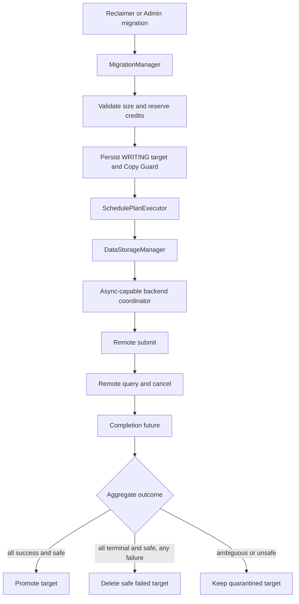
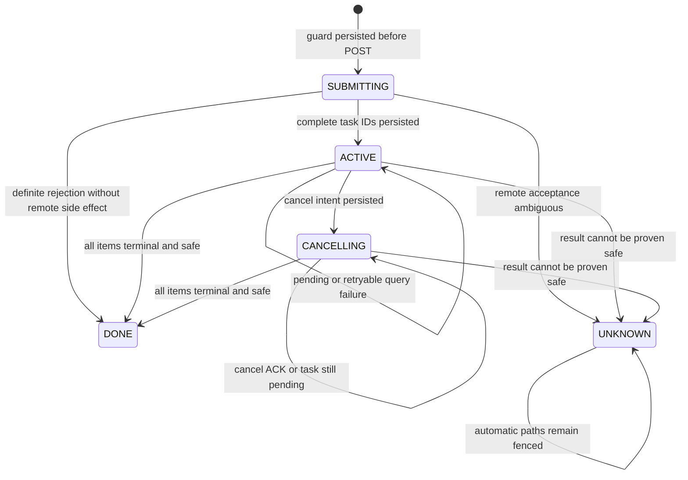

# KVCM × PACE CopyGA 异步化设计

| 项目 | 内容 |
|---|---|
| 状态 | V1 已实现，默认关闭；需要 backend 显式声明异步能力 |
| 默认模式 | `MIGRATION_COPY_SYNC` |
| 异步模式 | `MIGRATION_COPY_ASYNC_REQUIRED` |
| 改造范围 | KVCM 通用异步 Copy 框架、持久化 Copy Guard、恢复、回收保护、反压与配置 |
| Backend 依赖 | submit/query/cancel、稳定 task ID，以及可靠的 `terminal` / `safe_to_reuse_dst` 语义 |
| 核心不变量 | 只有 `terminal && safe_to_reuse_dst` 才能自动删除或复用目标 |

本文是异步 CopyGA 的权威设计文档。它描述公开的接口与配置、持久状态机、失败语义和上线约束，
不记录特定部署环境、内部仓库分支或一次性测试过程。

## 1. 背景

### 1.1 为什么需要异步化

早期 CopyGA 测试主要使用 4 MiB block，单次耗时通常只有数毫秒。真实 KVCache block 可能达到
68 MiB 或 136 MiB，物理 Copy 耗时随数据量近似线性增长，进入数百毫秒量级。

同步路径会让以下资源等待完整物理 Copy：

- Migration executor worker；
- storage backend 调用栈；
- PACE HTTP client；
- `DataStorageManager` 的 backend 生命周期锁；
- 同一 Instance Group 的 Copy slot。

把调用移到后台不会降低物理搬运耗时，但可以缩短 KVCM 共享执行资源的占用，并为后续安全提高
Copy 并发建立基础。

### 1.2 改造前调用链

```text
MigrationManager
  -> SchedulePlanExecutor
    -> DataStorageManager::Copy()
      -> backend synchronous Copy
        -> wait for remote data movement
      <- per-item ErrorCode
    <- future ready
  -> publish or delete target
```

同步返回只表达“本次调用结束”。当 HTTP timeout、连接中断或远端重启发生时，KVCM 无法仅凭
`ErrorCode` 判断远端是否仍会写目标。如果此时立即删除并复用目标，迟到写可能破坏其他数据。

### 1.3 三层异步边界

本文区分三个层次：

| 层次 | 含义 | V1 |
|---|---|---|
| KVCM executor 异步 | executor 只完成本地 handoff，不等待远端 Copy | 已实现 |
| backend coordinator 异步 | backend 后台 submit、query、cancel 并收敛结果 | 由支持异步的 backend 实现 |
| Provider 数据面异步 | Provider handler 不等待物理 Copy | 不在本次范围 |

Provider 内部是否异步不会改变 KVCM 的安全模型。只要远端可能在 API 返回后继续写，KVCM 就必须
持有目标 fence，直到取得明确的 drain 证明。

## 2. 目标与非目标

### 2.1 目标

1. executor 在 backend 接受本地 handoff 后立即释放。
2. 同步 backend 行为保持不变；异步能力必须显式 opt-in。
3. 远端 task ID、source identity、target identity 和字节数可跨 Leader 恢复。
4. timeout、cancel、重启和响应丢失均采用 fail-closed 语义。
5. Reclaimer、后台 GC 和普通删除路径都不能回收未决目标。
6. operation、在途字节和 quarantine 容量均有硬上限。
7. 同一 operation 只选择一种执行模式，不在异步提交后回退到同步 Copy。

### 2.2 非目标

1. 不降低单次物理 Copy 的数据面耗时。
2. 不改变所有 backend 的 `Copy()` 同步契约。
3. 不把 timeout、task age 或 HTTP 状态码解释为目标可复用证明。
4. 不实现跨 Location 的分布式事务。
5. 不保证远端 submit exactly-once；没有幂等键时，响应不确定必须隔离。
6. 不自动删除无法证明安全的 quarantine 目标。
7. 不在本次改造中实现 Provider 的异步执行队列或全局字节 admission。

## 3. 安全模型

### 3.1 术语

| 术语 | 含义 |
|---|---|
| operation | KVCM 一次逻辑 Copy，可能包含多个 URI pair |
| item | operation 中的一对 source/destination URI |
| local handoff | backend coordinator 接受本地任务，不代表远端已受理 |
| remote acceptance | 远端明确返回完整 task ID 集 |
| terminal | task 不再继续状态迁移 |
| safe to reuse | 远端保证不会再读写目标，可以删除或复用 |
| guard | 写入目标 `CacheLocation` 的持久化 Copy fence |
| quarantine | 无法取得安全证明而保留的目标及其 guard |

### 3.2 核心不变量

1. **自动回收凭据唯一。**

   ```text
   may_reuse_destination = terminal && safe_to_reuse_dst
   ```

   `ErrorCode`、timeout、cancel ACK、task `not_found`、进程退出和等待时长都不能替代该条件。

2. **成功发布也要求安全终态。** 所有 item 必须同时满足：

   ```text
   outcome == success && terminal && safe_to_reuse_dst
   ```

3. **提交不确定时不得重发。** 如果 request 可能已送达，但没有拿到完整 task ID 集，目标进入
   quarantine。重复 POST 可能让两组 task 并发写同一目标。

4. **source 和 target 同时受保护。** target guard 存在期间：

   - 目标不能被普通删除、Reclaimer 或 GC 回收；
   - guard 中记录的精确 source `location_id + create_time` 不能先被淘汰；
   - 同一 block 到同一 target storage 不得重复提交。

5. **未知 schema 必须 fail-closed。** 显式存在但无法解析的 guard 不能被静默降级为普通
   `CLS_WRITING` Location。

6. **回收判断不读取诊断错误码。** `AsyncCopyItemResult::error` 只用于日志、指标和分类；
   publish/delete 只读取 `outcome + terminal + safe_to_reuse_dst`。

### 3.3 Backend 的纵深校验

远端通常会同时返回 `terminal`、`drained` 和 `safe_to_reuse_dst`。PACE adapter 应重新计算：

```text
effective_safe =
    terminal &&
    drained &&
    server_safe_to_reuse_dst
```

这可以避免版本偏斜或服务端派生字段错误直接授权目标复用。通用 KVCM 层只消费最终的
`safe_to_reuse_dst`。

## 4. 方案选择

### 4.1 候选方案

| 方案 | 结果 | 原因 |
|---|---|---|
| `batch_sync` + timeout 后内存对账 | 未采用 | 正常路径仍长时间占用 worker、client 和锁；响应不确定时缺少可靠恢复身份 |
| async submit/query + 纯内存 operation | 未采用 | 能释放 worker，但切主后丢失 task ID、fence 和容量 accounting |
| async submit/query + 持久 Copy Guard | 采用 | 同时解决资源占用、HA 恢复和目标安全回收 |

因此仓库只有 `SYNC` 和 `ASYNC_REQUIRED` 两种模式，不存在
`ASYNC_MEMORY_RECONCILE` 等第三种运行模式。

### 4.2 总体架构



### 4.3 组件职责

| 组件 | 职责 |
|---|---|
| `MigrationManager` | admission、guard 状态机、credit、恢复和最终 metadata CAS |
| `SchedulePlanExecutor` | 创建执行计划并完成短本地 handoff |
| `DataStorageManager` | capability 检查、backend 转发和生命周期管理 |
| async backend | submit/query/cancel、polling、响应校验和 exactly-once completion |
| Reclaimer / GC | 直接读取持久 guard 并跳过受保护 Location |
| Admin API | quarantine 只读查询和受审计的 break-glass |

## 5. 正常执行流程

一次异步迁移按以下顺序执行：

1. 解析所有 source URI 的正数 `size`，校验 item 数量和总和溢出。
2. 在任何外部副作用前申请 operation 和 byte reservation。
3. 分配目标 URI，创建非 SERVING 的 `CLS_WRITING` Location。
4. 通过精确 CAS 写入 `MCGS_SUBMITTING` guard，并执行 metadata durability barrier。
5. executor 调用 `DataStorageManager::CopyAsync()` 完成本地 handoff。
6. backend coordinator 向远端 submit，并通过独立 callback 返回 acceptance 和完整 task ID 集。
7. KVCM 以 operation ID 和 guard state 为条件，把 guard 更新为 `MCGS_ACTIVE`。
8. backend 按退避间隔 query；需要取消时发送 cancel intent，但继续 query。
9. completion exactly once 返回逐 item 结果。
10. `MigrationManager` 重新校验 source identity，并认领唯一终态 owner。
11. 所有 item success+safe 时，原子地把目标改为 `CLS_SERVING` 并清 guard。
12. 所有 item terminal+safe 但存在失败时，删除目标。
13. 任一 item 不安全或结果不确定时，把 guard 改为 `MCGS_UNKNOWN` 并计入 quarantine。

本地 queue 拒绝发生在远端 POST 前，可以安全回滚。POST 之后的任何不确定都必须保留目标。

## 6. 通用异步接口

### 6.1 结果模型

```cpp
enum class AsyncCopyOutcome {
    kSuccess,
    kFailed,
    kCancelled,
    kUnknown,
};

struct AsyncCopyItemResult {
    AsyncCopyOutcome outcome;
    ErrorCode error;                 // diagnostic only
    bool terminal;
    bool safe_to_reuse_dst;
    std::string backend_task_id;
    std::string detail;
};

struct AsyncCopyBatchResult {
    ErrorCode status;
    std::vector<AsyncCopyItemResult> items;
    std::string detail;
};
```

Batch success 必须由逐 item 条件聚合，不能只读取 backend aggregate status。

### 6.2 两阶段受理

`CopyAsync()` 返回只表示 local handoff：

```cpp
struct AsyncCopySubmitResult {
    ErrorCode status;
    bool accepted;
    bool acceptance_unknown;
    std::string operation_id;
    std::vector<std::string> backend_task_ids;
    std::string detail;
};
```

远端 acceptance 通过 `AsyncCopyRemoteSubmitCompletion` 独立返回。两者不能混淆：

- local `accepted=true`：coordinator 接管了任务；
- remote `accepted=true`：远端返回了完整 task ID 集；
- `acceptance_unknown=true`：请求可能产生远端副作用，但没有权威 handle。

### 6.3 Backend 能力

```cpp
class DataStorageBackend {
public:
    virtual bool SupportsAsyncCopy() const;

    virtual AsyncCopySubmitResult CopyAsync(
        const std::vector<DataStorageUri>& src,
        const std::vector<DataStorageUri>& dst,
        const std::string& operation_id,
        const std::string& trace_id,
        const AsyncCopyOptions& options,
        AsyncCopyRemoteSubmitCompletion remote_submit_completion,
        AsyncCopyCompletion completion);

    virtual AsyncCopySubmitResult ResumeAsyncCopy(
        const std::vector<std::string>& backend_task_ids,
        size_t expected_items,
        const std::string& operation_id,
        const std::string& trace_id,
        const AsyncCopyOptions& options,
        AsyncCopyCompletion completion);

    virtual ErrorCode RequestCancelAsyncCopy(
        const std::string& operation_id);
};
```

基类默认不支持异步。开源仓中的异步框架只有在具体 backend override
`SupportsAsyncCopy()` 后才可达；`ASYNC_REQUIRED` 遇到不支持的 backend 必须明确失败，不能静默
回退同步。

`ResumeAsyncCopy()` 只能重新 query 已有 task ID，绝不能发起第二次物理 Copy。

### 6.4 DataStorageManager 生命周期

`DataStorageManager::CopyAsync()` 在锁内只查找并取得 backend `shared_ptr`，随后释放锁。远端
submit 和 completion callback 持有该强引用，避免长时间持有 manager 锁。

storage unregister/update 必须先确认没有 active 或 quarantined guard。存在引用时拒绝删除 backend
配置，因为新 Leader 恢复需要相同 backend。进程 shutdown 可以 detach coordinator，但不能把未决
任务合成为安全失败。

## 7. 持久 Copy Guard

### 7.1 为什么放在 CacheLocation

Guard 写入目标 `CacheLocation` JSON，因此：

- Reclaimer 和后台 GC 无需依赖 `MigrationManager` 内存表；
- Leader 切换后仍能恢复；
- guard 状态跃迁会改变 Location 的完整值，使 GC 在途的
  `expected_location_values` 条件删除自动失效；
- source identity 与目标生命周期绑定在同一权威记录中。

旧二进制的逐字段反序列化可能擦除未知字段，因此产生过 guard 后不能直接回滚到不识别它的版本。

### 7.2 Guard 内容

`MigrationCopyGuard` 至少持久化：

- schema version 和 operation ID；
- guard state；
- source `location_id + create_time + storage_name`；
- target storage；
- migration retention；
- total bytes；
- backend task IDs；
- create/update time 和 last error。

显式存在但 schema 非当前版本、状态未知或 operation ID 为空的 guard 必须解析失败，不能当成“无 guard”。

### 7.3 状态机



`DONE` 不是持久 guard state。成功时目标 promote 与 clear guard 在一次条件更新中完成；安全失败时
删除目标。内存 task 状态只负责调度，持久 guard 才是恢复和回收的权威。

所有 guard 跃迁必须同时校验：

- operation ID；
- expected guard state；
- 目标 Location identity/value。

这样 cancel、completion 和恢复线程不能互相覆盖状态。若 CAS 已生效但 durability barrier 超时，只能
重试 barrier，不能重复 CAS、Copy、删除或 quarantine。

## 8. 结果与失败语义

### 8.1 Operation 聚合

| 逐 item 结果 | Operation 动作 |
|---|---|
| 全部 success + terminal + safe | promote 目标 |
| 全部 terminal + safe，至少一个非 success | Copy 失败并删除目标 |
| 任一非 terminal 或 safe=false | 继续 query；到 deadline 后 cancel，再无法确认则 quarantine |
| `not_found` / `unknown` | quarantine |
| HTTP/解析错误 | 保持原状态并退避重试 |
| item 数量、顺序或 task ID 不匹配 | unknown，不能部分采信 |

一个 Location 内的多 item 采用全有或全无语义。V1 不做部分发布或部分清理。

### 8.2 Submit ambiguity

只有能证明 POST 没有产生远端副作用时，才允许安全回滚，例如本地参数校验失败或 local admission
拒绝。

以下情况必须按 acceptance unknown：

- request 可能已经写出后发生 timeout/reset；
- response body 丢失或无法完整解析；
- task ID 数量不足、为空或重复；
- transport 未完整结束，即使缓冲区中存在看似可解析的 error body。

当前协议没有 caller-provided idempotency key，因此上述情况不能自动重发。

### 8.3 Query 与 cancel

Query 必须逐项校验 task identity。HTTP 404 或 task `not_found` 只表示当前 registry 找不到记录，
不表示目标已经 drained。

Cancel 只表达意图：

- `EC_OK` 表示 coordinator 接受 cancel request；
- cancel ACK 不是 terminal 证明；
- cancel 后继续 query；
- 如果迟到结果为 success+safe，允许 success 胜出。

Cancel 与 completion 共享唯一终态 owner，credit 只能释放或转 quarantine 一次。

### 8.4 Timeout

四类时间彼此独立：

| 时间 | 语义 |
|---|---|
| connect timeout | 单次控制请求建立连接的预算 |
| submit timeout | 单次 submit HTTP 总预算 |
| query timeout | 单次 query/cancel HTTP 总预算 |
| operation deadline | KVCM 自动跟踪正常完成的总预算 |

任一 timeout 都不是 drain 证明。Query timeout 只影响本轮 poll；operation deadline 到期后请求 cancel，
若仍无安全终态则 quarantine。

## 9. 恢复、关闭与回收

### 9.1 Leader 恢复

新 Leader 在开放 leader-only 请求和启动 Reclaimer/GC 前扫描 guarded Location：

1. 有界分页扫描全部 Instance；
2. 校验 guard schema、identity、bytes 和 Group 配置；
3. 重建 active/quarantine operation 与 byte accounting；
4. 对 `ACTIVE/CANCELLING` 且 task ID 完整的记录调用 `ResumeAsyncCopy()`；
5. 无法恢复的记录转为 `UNKNOWN`，保持 fence；
6. 全部扫描和校验成功后一次性发布恢复结果。

恢复失败不能发布部分 accounting，也不能让节点持有 Leader lease 却不提供服务；服务端应主动 demote
并由其他节点重试。

Backend 暂时 unavailable 与 backend 不存在语义不同。恢复已有 task 时仍应尝试 query，不能因为一次
availability probe 失败就丢失恢复路径。

### 9.2 Shutdown 与 storage close

受控 shutdown 的顺序是：

1. 停止新 leader-only 请求；
2. 停止 Reclaimer/GC；
3. 停止 MigrationManager 接受新 operation；
4. detach 已持久化 task ID 的 backend job；
5. 由新 Leader 从 guard 重新接管。

已经提交且 task ID 已持久化的 job 不应在 Close 时逐个串行 cancel，也不应被批量标成
`UNKNOWN`。仍处于 `SUBMITTING` 且没有 task ID 的 operation 必须 fail-closed。

### 9.3 Reclaimer 与后台 GC

两条路径的 fencing 机制不同：

| 路径 | Fence 来源 |
|---|---|
| Reclaimer | 读取目标 guard，并保护 target 与精确 source identity |
| 后台 GC | 直接读取 Location JSON 中的 guard |

GC 不能仅凭 `CLS_WRITING` 年龄删除 guarded target。Guard 状态变化后，旧
`expected_location_values` 应使条件删除失败。

### 9.4 Quarantine

`MCGS_UNKNOWN` 表示 KVCM 无法证明目标可回收：

- source 保持可服务；
- target 保持非 SERVING；
- operation/bytes 计入 quarantine；
- 自动路径不再 submit 同一目标；
- 容量达到 gate 后停止新的异步 Copy，但允许已有任务继续收敛。

最小运维接口包括：

- 按 Instance Group 列出 quarantine；
- 查看 operation、task IDs、source/target、bytes 和最后错误；
- 只有取得独立外部 fencing 证明后，才允许受审计的 break-glass release。

Break-glass 不是自动恢复策略。按年龄、重试次数或人工点击本身都不能构成 drain 证明。

### 9.5 二进制回滚

关闭异步模式不会清除已有 guard。回滚到不识别 guard 的二进制前必须：

1. 停止新异步 submit；
2. 等待 active operation 收敛；
3. 处理全部 quarantine；
4. 扫描确认全局 guard count 为 0；
5. 再执行 binary rollback。

## 10. 反压与调度

### 10.1 Credit

仅限制 `copy_max_concurrency` 不足以约束大 block。V1 同时维护：

```text
active_operations
active_bytes
quarantine_operations
quarantine_bytes
```

推荐准入顺序：

```text
validate source sizes
  -> reserve operation and byte credits
  -> allocate destination
  -> persist SUBMITTING guard
  -> local backend handoff
  -> remote submit
```

size 缺失、非法、为 0 或求和溢出时必须在副作用前拒绝。Operation 从 active 转 quarantine 时，credit
转移必须原子，不能先释放 active 再增加 quarantine。

### 10.2 Coordinator

Backend coordinator 应具备：

- 有界 local queue；
- operation ID 到 task ID 的映射；
- polling backoff；
- 批量/分片 query；
- exactly-once callback；
- stop admission 和 graceful detach。

一个 coordinator 线程串行发送同步 HTTP 时，最坏轮询时间会随 operation 数增长。Backend 应合并同一
轮到期 task，限制 query URL 长度，并让实际 admission 与
`operation_deadline / query_timeout` 的可处理规模匹配。提高 Copy 并发前必须验证 queue wait、poll
周期和 timeout 比例。

### 10.3 失败源退避

`node not found` 等失败不应让 Reclaimer 持续选择同一旧 source。同步和异步路径共用
`MigrationManager` 的进程内失败记录，key 为：

```text
(instance_id, block_key, source_location_id,
 source_create_time, target_storage_name)
```

失败后使用有上限的指数退避；存在其他完整副本时优先换源，所有候选都在 backoff 时本轮不分配目标、
不 submit。由于 backend 错误分类仍可能不够精确，V1 不据此自动删除 source，也不持久化“永久失效”
结论。

## 11. 配置

### 11.1 MigrationConfig

| 字段 | 默认值 | 说明 |
|---|---:|---|
| `copy_execution_mode` | `SYNC` | `SYNC` / `ASYNC_REQUIRED` |
| `copy_max_concurrency` | 1 | Group Copy operation 并发 |
| `copy_max_inflight_bytes` | 0 | 异步模式必须显式为正 |
| `copy_max_quarantine_operations` | 0 | 异步模式必须显式为正 |
| `copy_max_quarantine_bytes` | 0 | 异步模式必须显式为正 |
| `copy_operation_deadline_ms` | 600000 | 自动跟踪总预算 |
| `copy_poll_initial_interval_ms` | 20 | 初始 poll 间隔 |
| `copy_poll_max_interval_ms` | 1000 | 最大 poll 间隔 |
| `copy_connect_timeout_ms` | 1000 | 建连预算 |
| `copy_submit_timeout_ms` | 3000 | submit 总预算 |
| `copy_query_timeout_ms` | 3000 | query/cancel 总预算 |

### 11.2 校验约束

```text
0 < poll_initial <= poll_max < operation_deadline
0 < connect <= submit < operation_deadline
0 < connect <= query < operation_deadline
16 * max(submit, query) <= operation_deadline
```

`ASYNC_REQUIRED` 还要求三个容量 gate 都为正。配置校验保证单次控制请求不会吃掉大部分 operation
deadline，但不能替代部署容量评估。

外部协议还需要满足：

```text
normal_copy_P99 + queue_and_poll_margin < operation_deadline
max_expected_leader_outage + poll_max
    < remote_terminal_record_retention
```

远端 terminal retention 从任务终态发布开始计时，不能简单用
`operation_deadline < retention` 代替完整约束。

Storage 自身的 `timeout` 继续控制 Create/Delete/health 和同步 Copy 等旧调用；三个 async HTTP timeout
只作用于异步控制请求，不应通过全局下调 storage timeout 来替代。

## 12. 可观测性

### 12.1 当前核心指标

- active operation/bytes；
- quarantine operation/bytes；
- async unknown 累计数；
- source failure recorded/suppressed/alternate-selected/no-eligible-source；
- 当前 source failure entry 数；
- quarantine list API。

### 12.2 日志字段

状态转换日志至少包含：

```text
instance_group, instance_id, block_key, operation_id,
source_location_id, source_create_time, target_location_id,
backend_task_ids, bytes, guard_state, outcome,
terminal, safe_to_reuse_dst, trace_id
```

高频 polling 使用 DEBUG 或采样，状态跃迁和 quarantine 使用 INFO/WARN。

不要把 submit RT 当成 Copy RT。性能分析应分别观察：

- local queue wait；
- submit HTTP；
- remote execution；
- poll convergence；
- metadata promote/delete。

## 13. 测试

### 13.1 自动化范围

通用框架测试至少覆盖：

1. backend capability 和 local handoff；
2. pre-submit 拒绝无远端副作用；
3. size 缺失、非法、溢出和 item 数不一致；
4. guard schema、状态跃迁和严格 CAS；
5. success/safe、safe failure、unknown 的聚合；
6. cancel/completion 竞争和 exactly-once credit；
7. Leader recovery、resume 和恢复失败；
8. Reclaimer、GC 和普通删除 fencing；
9. quarantine capacity gate 与 break-glass 前置校验；
10. source failure backoff 与 alternate source；
11. config JSON/proto round-trip 和 timeout 约束；
12. binary build。

具体 PACE adapter 还应覆盖：

- submit/query/cancel 响应 shape 与 task identity；
- transport ambiguity；
- query URL 分片或批量合并；
- deadline/cancel 后继续收敛；
- close detach；
- task `not_found`；
- same-provider 和 cross-provider payload 校验。

### 13.2 故障注入

上线前至少验证：

1. 远端接受 submit 后丢失响应；
2. task 创建后 query 返回 `not_found`；
3. Copy 中切换 KVCM Leader；
4. Copy 中重启远端 metadata 或 Provider；
5. cancel 与 completion 竞争；
6. deadline 后迟到 success；
7. storage update/unregister 与 Copy 并发；
8. mixed-result batch；
9. guard 年龄超过 GC grace period；
10. quarantine list 和 break-glass 审计。

所有测试共享一个硬断言：没有 `terminal && safe_to_reuse_dst` 时，普通业务、Reclaimer、GC、
shutdown 和恢复路径都不得删除或复用目标。

## 14. 上线与兼容

### 14.1 上线顺序

1. 升级所有可能成为 Leader 的 KVCM 节点。
2. 保持 `MIGRATION_COPY_SYNC` 验证兼容性。
3. 确认目标 backend `SupportsAsyncCopy()`。
4. 为一个 Instance Group 配置 operation/byte/quarantine gate。
5. 开启 `MIGRATION_COPY_ASYNC_REQUIRED`，从 concurrency 1 开始。
6. 完成正常、跨 Provider、cancel、切主和远端重启验证。
7. 观察 active/quarantine、远端 registry 容量和前台延迟。
8. 前一级稳定后再提高并发。

### 14.2 兼容规则

- 配置缺失时保持同步行为；
- 异步 backend 不可用时 `ASYNC_REQUIRED` 明确失败；
- 旧节点仍可能成为 Leader 时不得开启异步；
- 同一 operation 异步提交后不能回退到同步；
- 关闭 feature 不清理 guard；
- binary rollback 前必须确认 guard 为零；
- 所有 Location 读改写路径必须保留 guard。

## 15. 已知限制与未来工作

V1 已建立 KVCM 端的持久 fence 和异步控制面，但仍有以下限制：

- 没有 caller-provided idempotency key，submit ambiguity 只能 quarantine；
- 远端 task registry 若不持久化，重启后可能返回 `not_found`；
- source pin 与 target guard 不是跨两个 Location 的原子事务；
- quarantine 只有查询和 break-glass，没有自动权威对账；
- source failure backoff 为进程内状态，且错误分类仍是聚合 `ErrorCode`；
- 单 coordinator 的控制请求吞吐需要随并发单独验收；
- Provider 是否异步、是否具备全局 ops/bytes admission 不由本方案保证。

后续工作按实际指标触发：

1. 远端支持 caller request ID 幂等和按 operation 查询；
2. task registry 持久化并引入 topology/provider epoch；
3. Provider 增加 ops/bytes admission 和有界队列；
4. query 改为 POST body、long-poll 或完成事件；
5. KVCM 增加 completion queue、持久 unknown-rate breaker 和普通 safe-release；
6. 引入权威 stale-source 清理机制。

在这些能力完成前，不能声明：

- timeout 或 `not_found` 后目标可以自动回收；
- 远端重启对在途 Copy 完全透明；
- 可以无条件提高 Copy 并发；
- 异步化会降低物理 Copy RT；
- 存在 guard 时可以回滚到不识别 guard 的旧二进制。

V1 的取舍是：复用现有远端异步任务协议，先解除 KVCM 长阻塞，并用持久 guard、恢复、容量 gate 和
fail-closed quarantine 保证目标生命周期安全。更深的 Provider 改造由真实负载和故障数据决定。
