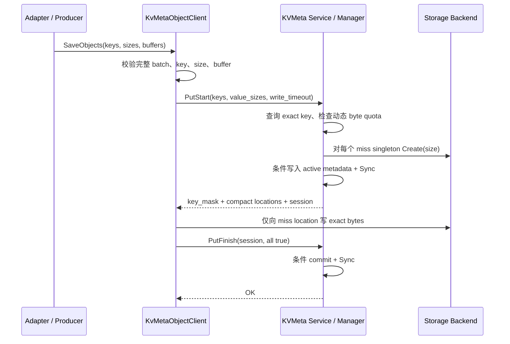
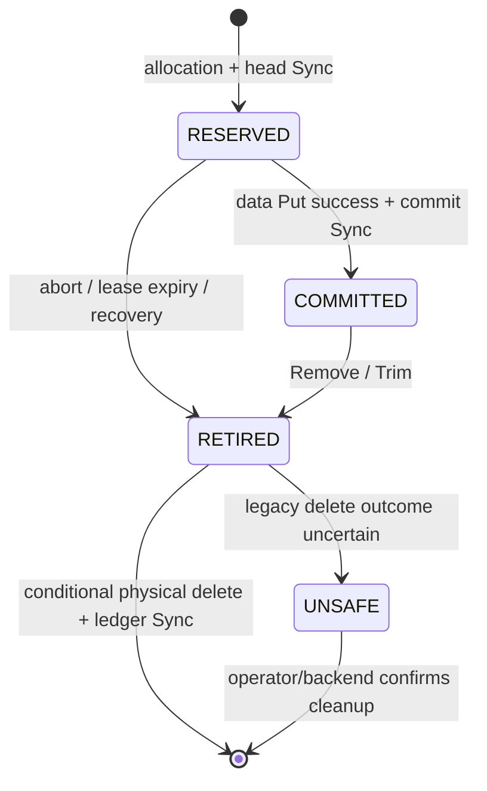

# KVMeta EMB Cache 系统设计（变长对象）

## 1. 文档定位

本文描述 KVCM 为 EPD（Encoder/Prefill/Decode）分离场景提供的 KVMeta V1 EMB Cache：为什么需要一条
独立链路、各组件如何协作、对象如何写入和回收，以及它如何与既有 KV cache 主链路隔离。虽然底层 API 以
opaque object 表达 embedding/tensor bytes，它的系统语义是**可丢弃、可重建、有界容量的 Cache**，不是持久化对象库，
也不能成为推理链路的唯一数据源。

KVCM 的系统边界、普通 KVCache 主链路、HA 和 GC 职责划分见
[KVCM 总体设计与模块架构](module_architecture.md)；协议字段和逐 RPC 契约见
[KVMeta 通用对象 API](../api/kv_meta_service.md)。上层适配器分别见：

- v6d 仓库：`docs/tair-kvcm/kvcm-emb-storage.md`；
- RTP-LLM 仓库：`docs/multimodal/kvcm_emb_storage.md`。

### 1.1 仓库与交付边界

| 仓库层次 | 本功能的代码范围 |
|---|---|
| KVCM `github-opensource` | KVMeta 协议、独立服务、manager、object client、通用 exact-size SDK 路径和开源 backend/stub |
| KVCM 内部父仓 | 固定开源子仓版本，并为真实 TairMempool/PACE SDK 实现 variable-size policy |
| v6d | 提供可选 Python `KVCMEmbeddingStore`，不改变 v6d 原有 KV cache 传输 |
| RTP-LLM `github-opensource` | 提供可选 multimodal producer/receipt/reader/release/GC 和构建开关 |
| RTP-LLM 内部父仓 | 固定包含上述实现的开源子仓版本，不另复制一套 KVCM EMB 状态机 |

因此“开源 KVCM”和“内部 KVCM”不是两套 KVMeta：通用协议与状态机只有一份；内部仓只补充无法在开源仓实现的
PACE 数据面。部署时，各父仓必须固定到包含匹配协议和 client API 的子仓 revision。

### 1.2 结论先行与实现状态

当前 V1 是可用于受控灰度的最小安全方案：它通过独立协议、namespace、请求门和 singleton allocation 支持变长
对象，并坚持“不能证明归属就不删除”。容量侧同时具备周期水位回收和由失败准入触发的按需回收；一个低于水位、
但会被大对象顶穿的 cache 不会永久卡在 `NOSPC`。它没有修改固定 block 接口，也不会让 KV cache 请求获取 KVMeta
的锁。

“可用于灰度”不是无条件的生产就绪声明。上线必须同时满足第 12.3 节的语义 key、推理 fallback、真实物理 GC、
读宽限期、时钟和隔离要求；尤其是物理 `Delete` 为 no-op 且没有外部 TTL/sweeper 的 backend，不能作为有界容量的
生产 EMB Cache。

V1 不是最终形态。设计复盘后，后续重点不应是把 `vector<size>` 直接塞进共享 `DataStorageBackend::Create`，而应在
KVMeta 侧增加可选的异构对象 capability adapter，并用 generation-aware allocation 和持久化 retired cleanup
ledger 解决安全重试。这样既能降低 singleton 调用放大，也不会改变主链路 backend ABI/语义。第 13 节给出完整
演进设计。

| 层次 | 状态 | 能力与边界 |
|---|---|---|
| V1 | 当前代码已实现 | exact-size、singleton allocation、写租约、周期水位 + 按需准入 LRU Reclaimer、metadata-first 单次删除、HA 恢复 |
| V1.1 | 建议下一阶段，尚未实现 | KVMeta 独立 QoS、orphan 指标/审计、backend capability 探测；不改变协议语义 |
| V2 | 目标设计，尚未实现 | generation/fencing、幂等 operation、持久化 ledger、可续约读写 lease、异构批量和 object set |

文中没有标注“V1.1/V2”的流程均描述当前实现；演进章节中的接口和字段是设计草案，不能作为现有 API 使用。
长期看，EPD 对外应优先暴露“发布并租用一组 tensor chunks”的 object-set API；exact-key API 保留为底层通用能力和
小对象兼容入口。这样生命周期与一次推理请求对齐，而不是让业务自行拼接大量 key 的回滚和 GC 状态。

## 2. 背景、目标与非目标

### 2.1 为什么不能直接复用 KV cache 链路

既有 `MetaService + CacheManager + TransferClient` 面向模型 KV cache block：instance 注册时就确定
`location_spec_infos`，同一 spec 的 block 大小固定。Encoder/ViT 输出的 embedding、position id 和额外输入则是
opaque tensor byte stream，不同请求、不同 tensor，甚至同一批次中不同对象的字节数都可能不同。

如果把任意长度 embedding 塞进固定 block 链路，会同时破坏：

- `TransferClient` 对固定 block size 的校验；
- storage backend 对同批对象等长、共享物理文件或 allocation 的假设；
- CacheReclaimer、Migration 和 Cache GC 按 KV cache 语义维护容量与生命周期的假设。

因此本设计新增 KVMeta exact-key、exact-size 侧路，而不放宽原链路约束。

### 2.2 从 Cache 基本原理推导出的契约

EMB Cache 的第一性约束不是“能存变长 bytes”，而是“任何缓存故障都不能改变推理语义，同时有限资源一定能回收”。
由此得到以下不可退让的不变量：

| 原理 | V1 契约 | 直接后果 |
|---|---|---|
| source of truth 在上游 | embedding 必须能由输入与确定版本的 encoder/preprocess 重新计算 | miss、`NOSPC`、超时、服务不可用和 Load 失败必须允许 fail-open 到重算 |
| false miss 可接受，false hit 不可接受 | 不确定、损坏或正在写/回收的记录都不发布为 hit | 正确性优先于命中率；不能把异常位置当作 miss 后又读取它 |
| key 表示不可变值 | 同一 `(instance_id, key)` 在整个可见生命周期内只能对应同一语义、同一 bytes | `key_mask=true` 的“同尺寸已存在”只是幂等优化，size 相等绝不是内容相等证明 |
| 容量必须有闭环 | 准入、淘汰、metadata GC、物理 GC 和 fallback 缺一不可 | 只有 `Remove` 没有自动 Reclaimer，不是可持续运行的 Cache |
| hit 只是带时效的位置快照 | V1 没有 read lease，Get 成功不等于后续数据面读取必定成功 | URI Load 与回收竞争时按 miss/重算处理，不能阻塞核心推理链路 |
| 隔离优先 | EMB 侧路的协议、锁、worker、namespace 和容量独立 | 可选 Cache 的拥塞或损坏不能扩散到既有 KV cache 主链路 |

业务 cache key 必须由稳定、规范化的输入构造，至少覆盖：tenant、模型/encoder 权重 revision、预处理与 tokenizer
revision、输入内容 digest、tensor role/chunk index、dtype、shape/layout 以及 cache schema version。推荐先 canonicalize
这些字段再计算 digest，而不是拼接易歧义字符串。任何会改变输出 bytes 的因素都必须改变 key；KVCM 不解析这些
字段，也不会比较已存 value 内容。若调用方不能证明这一点，启用 hit 会产生 silent false hit，应视为上线阻断项。

RTP 的正确使用模型是 cache-aside：先查 Cache，全部对象成功 Load 才消费；任一 miss、位置校验失败或数据面错误，
丢弃本批局部结果并重算。并发 miss 应在 RTP 侧做有界 singleflight，或对 `WRITE_IN_PROGRESS` 使用带 jitter 的短
退避；超过推理延迟预算后直接重算，不能无限等待另一个 producer。重算结果仍是权威值，写回 Cache 失败不能使
本次推理失败。

V1 对“错误命中”的防护边界也必须说清：服务端会验证 key identity、状态、backend、URI 和 size，但没有内容
checksum，无法发现 backend 返回了长度正确的静默损坏 bytes。生产 backend 必须提供端到端完整性校验，或由业务
receipt 携带 digest 并在消费前验证；否则不能宣称满足 false-hit 安全要求。V2 才计划把 digest/ETag 纳入服务契约。

### 2.3 目标

- 同一请求可以读写不同字节数的对象，且 URI、元数据和 caller buffer 的长度严格一致；
- 以完整业务 key 精确寻址，即使一级哈希碰撞也不能串读、串删；
- 用 `PutStart`/`PutFinish` 写会话保证未完成对象不可读，并在失败、超时和换主后收敛；
- 对容量、请求规模、并发 session 和字符串长度设置明确上限；
- 为 C++/Python 上层提供组合好的 `KvMetaObjectClient`，同时保留底层元数据与数据面 API；
- 默认关闭；启用后与固定 block MetaService 共享主 gRPC listener，但保持独立 protobuf namespace、请求门、锁和
  后台维护，并明确共享 RPC worker、进程和存储仍需部署 QoS 才能获得性能隔离。

### 2.4 V1 非目标

- 不提供 TTL/LFU 淘汰；自动容量回收当前只支持近似 LRU，业务仍可通过 release、`Remove` 或 `Trim` 提前回收；
- 不承诺一个多 key 写会话在并发 `Get` 看来具有同一瞬间的原子可见性；
- 不在 KVCM 中保存 tensor shape、dtype、切片顺序或 RTP receipt；KVCM 只保存 opaque bytes；
- 不改变 `DataStorageBackend::Create(keys, object_size)` 和普通 `TransferClient` 的固定大小接口；
- 不提供 server-side read lease。V1 调用方必须保证 consumer Load 完成前不触发同对象的 Remove/Trim/GC；
- 不保证取消已经进入不可取消 backend 的 I/O。KVMeta 会在返回前等待它结束，以保护 caller-owned buffer。

## 3. 总体架构

KVMeta 把一次对象访问拆成控制面和数据面：

- **控制面**：KVMeta gRPC 服务负责 instance、exact-key metadata、物理 allocation URI、写会话和回收；
- **数据面**：调用方根据服务端返回的 URI，通过 `KvMetaTransferClient` 直接读写实际 storage backend；
- **组合层**：`KvMetaObjectClient` 编排控制面事务和 exact-size 数据搬运，是推荐入口。

```mermaid
flowchart LR
    producer["Producer：Encoder / ViT"]
    consumer["Consumer：LLM / Decode"]
    adapter["RTP 或 v6d 适配器"]
    object_client["KvMetaObjectClient"]
    meta_client["KvMetaClient"]
    transfer_client["KvMetaTransferClient"]
    grpc["主 gRPC Server<br/>Meta + KVMeta services"]
    service["KvMetaServiceImpl"]
    manager["KvMetaManager"]
    registry["Registry / MetaIndexer"]
    storage_manager["DataStorageManager"]
    sdk["SdkWrapper::InitForKvMeta"]
    backend["NFS / HF3FS / Mooncake / TairMempool ..."]
    receipt["业务控制面 receipt\nkey + size + tensor metadata"]

    producer --> adapter --> object_client
    object_client --> meta_client --> grpc --> service --> manager
    manager --> registry
    manager -->|Create / Delete| storage_manager --> backend
    object_client --> transfer_client --> sdk -->|Get / Put exact bytes| backend
    adapter --> receipt --> consumer
    consumer --> object_client
```



KVCM 不传递图中的 receipt。RTP 自己在 ViT 与 LLM 之间传递 tensor metadata；v6d 也要求调用方在独立控制面
保存这些信息。RTP 和 v6d 是两个并列的客户端适配器，RTP 生产链路不依赖 v6d。

### 3.1 组件职责

| 组件 | 职责 | 不负责 |
|---|---|---|
| `KvMetaServiceGRpc` / `KvMetaServiceImpl` | 独立 RPC 路由、请求门控、参数边界、错误码映射、响应形状校验 | 不直接搬运对象 bytes |
| `KvMetaManager` | exact-key metadata、allocation、动态 byte quota、写会话、独立 LRU 回收、HA 恢复、Remove/Trim | 不进入普通 KV cache 写入/淘汰流程 |
| `RegistryManager` / `MetaIndexer` | 保存 KVMeta 专用 instance 和 `CacheLocation` | 不理解 tensor 语义 |
| `DataStorageManager` | 选择 backend，创建/删除物理对象 | 不执行客户端 buffer 搬运 |
| `KvMetaClient` | metadata RPC、多地址 failover、响应校验 | 不搬运数据 |
| `KvMetaTransferClient` | 按 URI 和真实长度执行同步 Get/Put | 不管理写事务 |
| `KvMetaObjectClient` | 组合注册、Get、PutStart、数据搬运、PutFinish 和回滚 | 不保存 shape/dtype/receipt |
| RTP/v6d 适配器 | tensor 校验、切片、receipt 或 buffer 封装、业务生命周期 | 不改变 KVCM 一致性语义 |

### 3.2 代码落点

| 层次 | 主要实现 |
|---|---|
| 协议 | `kv_cache_manager/protocol/protobuf/kv_meta_service.proto` |
| 服务入口 | `kv_cache_manager/service/kv_meta_service_impl.{h,cc}`、`service/grpc_service/kv_meta_service_grpc.{h,cc}` |
| 启停与 HA 装配 | `kv_cache_manager/service/server.{h,cc}`、`server_config.{h,cc}` |
| metadata 与 session | `kv_cache_manager/manager/kv_meta_manager.{h,cc}`、`kv_meta_instance.h` |
| C++/Python client | `kv_cache_manager/client/include/kv_meta_*`、`client/src/kv_meta_*`、`client/kv_meta_object_client.py`、`client/pybind/py_client_binding.cc` |
| exact-size 数据面 | `kv_cache_manager/client/src/internal/sdk/sdk_wrapper.{h,cc}` 及各 backend SDK |
| 内部 PACE 适配 | 内部仓 `internal_source/kv_cache_manager/client/src/internal/sdk/tair_mempool_sdk.{h,cc}` |

主链路隔离的防护还落在 `cache_reclaimer.cc`、`cache_garbage_collector.cc` 和普通
`transfer_client_test.cc` 回归用例中。第 14 节给出当前实现的完整测试分层。

## 4. 与 KV cache 主链路的隔离

隔离是本设计的首要约束。V1 在代码路径、元数据和生命周期上提供强制隔离；CPU、网络、内存和物理 backend 的
性能隔离仍取决于部署方式；共享 RPC listener 和进程不构成性能隔离保证。

### 4.1 启停与 RPC 路由隔离

- `kvcm.kv_meta.enabled=false` 为默认值。此时不创建 `KvMetaManager`、session expiry worker、KVMeta service adapter，
  也不改变主 gRPC ServerBuilder 的 service 注册集合；
- 配置 `kvcm.kv_meta.enabled=true` 后，`KvMetaServiceGRpc` 注册到 `kvcm.service.rpc_port` 对应的同一个
  `grpc::ServerBuilder`，不创建第二个 listener 或 `grpc::Server`；
- 升级时，遗留 `kvcm.kv_meta.rpc_port=0` 作为禁用占位可继续解析且不会启用任何资源；非零旧端口会 fail
  closed，要求服务端 flag 与客户端 endpoint 一起显式迁移，避免静默连接到已移除的第二 listener；
- 固定 block RPC 路径以 `/kv_cache_manager.proto.meta.MetaService/` 开头，KVMeta RPC 路径以
  `/kv_cache_manager.proto.kv_meta.MetaService/` 开头；既有 MetaService proto 和方法集合不变。

共享端口只是传输复用，不是身份认证。V1 沿用 KVCM 的受信网络模型，知道 instance/key 的 client 可以调用
Get/Remove；生产环境必须用网络策略限制主 RPC 端口来源。V2 ownership token 仍需绑定经过认证的
tenant/instance，不能用随机 key 或 token 猜测难度代替服务认证。

### 4.2 元数据与容量隔离

- 公共 `instance_id` 会编码为保留的 KVMeta 内部 instance id，并携带完整 schema marker；
- 整个 `__kv_meta_v1__` 前缀都由 KVMeta 保留。旧 Meta/Admin handler 和 CacheManager 旧接口在读取、写入、删除、
  Trim、Migration 或事件任务入队前拒绝该 namespace；Admin instance 列表过滤内部实例，避免绕过 KVMeta 的事务和
  回收不变量；
- KVMeta instance 必须放入专用 Instance Group。group 类型从其持久化成员的保留 namespace 派生，KVMeta 和普通
  KVCache 注册共用同一个 `CacheManager` 控制面临界区：空 group 由第一类成功注册决定类型，之后反向混入会在
  registry mutation 前被拒绝。运行期校验仍会对旁路写 registry 或 split-brain 造成的混合状态 fail closed；
- 普通 CacheReclaimer、Migration 和 Cache GC 跳过 KVMeta instance；KVMeta 由自己的 Reclaimer 线程处理，二者不
  共用删除 executor、pending budget 或 group admission lock；
- KVMeta 使用对象真实字节数维护 group/type quota，不把 marker `block_size=1` 当作对象用量。

### 4.3 代码路径隔离

- `KvMetaManager` 不调用 `StartWriteCache` / `FinishWriteCache`；
- 变长策略只由 `KvMetaTransferClient` 调用 `SdkWrapper::InitForKvMeta` 时开启；
- KVMeta 初始化会克隆 wrapper/backend config 后写入 variable-size policy，避免复用同一 `ClientConfig` 的普通
  `TransferClient` 通过指针别名看到该策略；
- 普通 `TransferClient` 保留原来的固定大小校验、阻塞提交、超时和 backend fallback 行为。

### 4.4 Leader 生命周期隔离

升主时先启动 Registry/CacheManager 的既有恢复、启动 GC/Migration 并开放主服务，再在独立线程等待
CacheManager 的显式恢复完成信号后恢复 KVMeta（`DoRecover` 的返回只表示恢复已启动时也不会提前扫描）。恢复成功
且 session worker、KVMeta Reclaimer 启动后才开放 KVMeta 请求门。KVMeta 恢复失败不会阻止主服务可用。

降主或 Stop 时先关闭 KVMeta 请求门、session/Reclaimer 准入并取消 Trim，然后按既有顺序排空主服务请求、停止
主 GC 和 Migration，最后 join KVMeta recovery/session/Reclaimer worker。内存 session 被丢弃而不是在主清理
线程逐个做 storage I/O；残留 active/retired metadata 由下一任 leader 恢复。

### 4.5 性能与故障域边界

| 资源 | V1 已隔离 | 仍可能共享的部分 | 生产建议 |
|---|---|---|---|
| RPC | protobuf service 路由、请求门和 metrics namespace 独立 | listener、gRPC sync worker、进程 CPU/内存 | 在调用方/网关限制 KVMeta 并发；高负载时使用独立进程/cgroup |
| 锁 | KVMeta group admission shard 只由 KVMeta 获取 | Registry/MetaIndexer 的底层实现 | KVMeta 使用专用 Instance Group 和 metadata namespace |
| 后台线程 | recovery、session expiry、KVMeta Reclaimer 独立，失败不阻塞主服务放流 | 进程线程数和 CPU quota | 监控 gate、pending bytes/object 和重试 |
| 容量 | 按真实 bytes 使用专用 group/type quota | backend 的真实总容量 | storage candidate 指向专用 pool/namespace |
| 数据面 | 使用独立 `KvMetaTransferClient` 策略 | NIC、PCIe、SDK connection、存储设备 | 配置 backend 侧带宽/IOPS 限流；强隔离部署使用独立资源池 |

因此部署分两档：

- **兼容部署**：KVMeta 与 KV cache 共进程，但必须使用专用 group、namespace、并发上限和存储 quota；适合灰度；
- **强隔离部署**：KVMeta 使用独立 KVCM 进程/资源组及独立 storage pool；即使复用协调服务或 Registry 的物理
  集群，也必须使用独立 namespace/leader lock，不能与 KV cache 实例争抢同一个 leader 身份；适合大规模 EPD
  流量。

当前代码已经具备兼容部署的功能隔离，但尚未提供完整的 KVMeta 独立限流器或 `kvmeta_only` server role，这两项属于
V1.1，而不是当前能力。

## 5. 对象与元数据模型

### 5.1 对外对象标识

一个对象由 `(instance_id, key)` 唯一标识。两者在协议中均为 protobuf `string`；KVCM 按序列化后的字节长度
执行边界检查，不解析 key 的业务结构，也不保存 value checksum。`instance_id` 应作为 tenant/model cache namespace，
`key` 应是第 2.2 节所述全部语义输入的 canonical digest，而不是只使用图片 URL、请求 id 或容易复用的业务主键。

V1 的不可变规则是：一个 key 一旦 committed，就不能原地覆盖。后续相同 key、相同 size 的 `PutStart` 直接返回
hit；已 committed 的相同 key、不同 size 返回 `SIZE_MISMATCH`。active reservation 的 size 仍是未提交状态，无论
竞争请求的 size 是否相同都返回可重试的 `WRITE_IN_PROGRESS`；原 writer 回滚或租约过期后，不同 size 的请求仍可
取得新 reservation。服务端没有能力判断“相同 key、相同 size、不同内容”，因此 key 版本化是正确性的组成部分，
不是命中率优化。模型热更新、预处理配置变更或 tensor schema 变更时，必须切换 namespace/key version，而不能
依赖 Trim 恰好先完成。

### 5.2 exact-key 与哈希碰撞

`MetaIndexer` 的一级 key 是 `int64`，因此 KVMeta：

1. 将完整业务 key 哈希为一级 key；
2. 将完整 key 可逆编码进稳定 `location_id`；
3. 所有 Get、条件更新和删除同时匹配一级 key 与完整 `location_id`。

同一请求里一级哈希相同的不同 key 会拆到不同 metadata layer。恢复和 Trim 也会反解 `location_id` 并重新核对
完整 key 与哈希。因此哈希碰撞最多增加一次分层访问，不能造成错误命中或误删。

### 5.3 `ValueLocation`

每个可读对象的位置满足以下不变量：

| 字段 | 约束 |
|---|---|
| `type` | 必须是已注册、可识别且具备对象所有权语义的 storage type |
| `spec_size` | 固定为 `1` |
| `location_specs` | 恰好一个元素，名字固定为 `value` |
| `location_specs[0].uri` | scheme/hostname 必须对应所选 backend；backend name 不超过 512 bytes，且仅允许字母、数字、`.`、`_`、`-`，authority 不得带 userinfo/port |
| `value_size` | 对象有效字节数，必须大于 0 |
| URI `size` 参数 | 必须与 `value_size` 完全相等 |
| backend 所有权字段 | Mooncake URI `key` 必须是完整 canonical KVMeta object key；TairMempool/PACE path 必须是完整的 `/<uint64 offset>`，可选地址字段必须是 `uint16`；文件型 path 必须是无空/dot segment 和尾随 `/` 的非根绝对路径；可打包文件型 backend 的 `blkid` 必须缺失或严格等于 `0` |
| KVMeta namespace | file identity 必须精确等于已注册 backend 配置的 root/mount/root_dir 与 `kvmeta/<instance-hash>/<key-hash>/<32-byte nonce>` 拼出的路径；Mooncake `key` 必须精确对应同一 object key；canonical 或后缀相同但位于其他 root/namespace/key 的 URI 也不是 Delete authority |

这里的对象 storage type 只包括 HF3FS/VCNS-HF3FS、Mooncake、TairMempool DRAM/SSD、NFS 和测试用 Dummy。
EventReport location 是外部 block 的观测记录，不代表 KVMeta 对该物理对象具有独占创建/删除权；proto 与 C++ enum
为 wire compatibility 保留其编号，但服务端和官方 exact-object client 都拒绝把它用于 EMB 对象。

服务端、metadata client、object client 和 transfer wrapper 都会独立验证这些不变量；原始 URI 还必须不超过
64 KiB、query 参数不超过 64 个，且没有控制字符、fragment、空 query key、重复 query key、userinfo 或 port，
每个 query item 必须显式包含 `=`，`size` 必须完整解析为正整数。拒绝显式 `:0` 也很重要：通用 parser 会把它
规范化成“无 port”；同理，裸 query `flag` 会被规范化成 `flag=`。ownership 层若接受这些文本，损坏记录可能与合法
backend URI 形成别名。进程内已有的 metadata size 校验缓存若存在，也必须与 URI `size` 相等；恢复后缓存不存在时
重新解析 URI，而不是信任旧 hint。任一层发现损坏都 fail closed，不会把不可信 URI 交给数据面，也不会把“配额
长度”和“对外读取长度”分叉。

### 5.4 对象状态

KVMeta 复用 `CacheLocation` 的存储格式，但不复用 KV cache 状态机：

- **active**：`status=CLS_NEW` 且 `create_time` 为带 tag 的正数，编码写租约 wall-clock deadline；Get 不可见；
- **committed**：仍为 `status=CLS_NEW`，但 `create_time` 为负数；Get 可见；
- **retired**：`status=CLS_DELETING` 且 `create_time` 为带 tag 的正数；通常编码 Reclaimer grace deadline；两阶段
  retirement 的过渡 fence 使用带 tag 的最大值，表示“已读隔离但尚未发布有限 deadline”。两者均对 Get 不可见，
  metadata 在宽限期结束前仍保留对物理 allocation 的归属证明；
- **absent**：metadata 不存在。

滚动升级时，旧版本遗留的无 tag 正 marker 按“创建时间 + `max_write_timeout_seconds`”推导保守截止时间。
HA 节点必须保持时钟同步，并把可能的最大漂移计入写租约配置。

## 6. 端到端流程

### 6.1 注册

`KvMetaObjectClient::Create` 首先通过 `KvMetaClient::RegisterInstance` 注册专用 instance，取得服务端权威
`storage_configs`，再创建 exact-size transfer client。相同 instance/group/schema/user data 的注册幂等；身份或
schema 不一致则失败。注册同时验证 group 已配置当前实现能够执行的 LRU 回收策略，并且每个
`storage_candidates` 都唯一、已注册且具备 exact-object ownership；storage spec 的动态类型必须与 backend type
一致，文件型配置还必须能生成词法规范的绝对
`kvmeta/<instance-hash>/<key-hash>/<32-byte nonce>` namespace（例如 NFS 拼接型 `root_path` 必须保留目录分隔符）。
预检按两个 16-digit hash、32-byte nonce、最大 `uint64 size` 和可能出现的 singleton `blkid=0` 计算最坏 URI，避免
短样例能注册、真实 allocation 却在返回后才超过 URI 上限。
没有有效 Reclaimer、候选缺失/重复、namespace 不安全或混入 EventReport 的 group 返回 `SERVICE_NOT_READY`，不会先
创建一个只能靠人工删除维持的“对象库”。
KVMeta 与普通 KVCache 的注册都会在 mutation 前读取同 group 的持久化成员，并在同一进程内串行化检查；因此已有
KVMeta group 不能被后续 legacy 注册污染，已有普通 group 也不能被 KVMeta 占用。单 leader 是该控制面串行化的部署
前提。已有持久化 instance 的幂等重注册/恢复不执行新的 mutation，因此不会被历史 mixed group 阻断，保证普通
KVCache indexer 仍能恢复；运行期的全量 group schema 校验只让 KVMeta side path 对 out-of-band registry mutation
保守 fail closed。

### 6.2 写入



关键语义：

- `key_mask` 与原始 keys 等长；`true` 仅表示同 key、同尺寸对象已经 committed。它不比较内容，调用方必须先满足
  第 2.2/5.1 节的不可变语义 key 契约；
- `locations` 只包含 `key_mask=false` 的 miss，按它们在请求中的相对顺序紧凑排列；
- 全部命中时不创建 session，也不返回 location；
- 任一 key 已 active 时整批返回 `WRITE_IN_PROGRESS`；已 committed 但尺寸不同则返回 `SIZE_MISMATCH`；
- object client 会额外用 `Get` 确认 masked hit 已可读，以兼容已经具备 V1 字段、但仍保留早期 active-mask
  行为的滚动升级版本；这不表示缺少 V1 新字段的原始 proto 实现可以混用；
- 数据写入返回的实际 URI 必须与服务端给出的 URI 语义一致（允许 query 参数重排）；URI
  无法解析、参数重复或任一 canonical component 改变都会整批回滚；
- `PutFinish.success_keys` 与紧凑 `locations` 对齐。任一 `false` 会回滚本 session 的全部新对象；
- commit/rollback 逐 key 执行并带失败补偿，不承诺多 key 同时可见；
- reservation 已持久化、write session 尚未发布的窗口只使用一条 metadata-first 补偿路径。它覆盖首次
  `Sync` 失败、location 转换失败，以及 `Availability()` 通过后又与其他 group 竞争导致 session 最终发布失败。
  只有补偿删除已持久化证明 metadata absent，才能返回原始的 timeout/`NOSPC`/not-leader；无法证明时返回
  `OUTCOME_UNKNOWN` 并只关闭 KVMeta admission/maintenance，交由 leader recovery 对账。显式 abort、session expiry
  和 partial commit 补偿遵循同一 ownership 规则：在持久化当前视图前不推断 allocation 已无引用，metadata absence
  无法证明时不创建下一代。固定 block KVCache 主链路不读取该 gate；
- metadata JSON 的 exact match 才授予本请求条件删除权。若 reload 得到一个不属于本请求、但指向相同物理 URI 的
  owner，服务端既不删除该 metadata，也不释放该 URI，而是 fail closed 交给 recovery；物理地址相同不能替代
  generation/owner identity；
- 只有本次 exact compare-and-delete 成功且 `Sync` 完成，才授予随后的物理 Delete。条件删除返回 absent 不是
  幂等成功：另一个 actor 可能已释放旧地址并让 backend 把它复用于 successor，因此旧 URI 保留为 orphan，KVMeta
  gate 关闭并由 recovery 重建 ownership/usage。Reclaimer 的 metadata retry 是唯一预期的 absent：它持有进程内
  pending fence、阻止 successor，并且仍只在持久化 absent 后进入自己的一次性物理删除阶段。

### 6.3 读取

`LoadObjects` 先校验完整请求，再执行一次 request-aligned `Get`。只有所有 key 均命中、所有 location 和期望 size
均一致时才分派数据 I/O；任一 miss 或异常 location 都不会产生部分读取。数据面批量读取也按 all-or-nothing 使用：
任一对象 Load 失败，RTP 不得消费同批中已经读到的局部 tensor，而应把整组当作 miss 并重算。若业务/backend
提供内容 digest，还必须在发布给推理计算前完成校验。

V1 `Get` 返回的是 location snapshot，不会在服务端创建 read lease 或 pin allocation。object client 可以保证本次
Load 返回前 caller buffer 不被后台 I/O 继续访问，但不能阻止另一个 client 的 Remove/Trim 或自动 Reclaimer 在
之后退休该 URI。上层必须用 ownership/release 协议协调；自动回收的 `delay_before_delete_ms` 至少应覆盖
`P99.99(Get 响应到最后一字节读取完成) + 调度/网络/backend 尾延迟 + 时钟与 failover 裕量`。固定 grace 仍是概率性
保护，不是读租约证明；读取 URI 失败必须降级为 miss/重算。RTP 仍应在最后一个 consumer 完成后显式 release。

显式 `Remove` 和 `Trim` 不使用 Reclaimer grace。它们是所有者/运维指令，调用方必须先排空 consumer；不能因为配置
了 `delay_before_delete_ms` 就假设显式删除也会等待。

### 6.4 删除与 Trim

- `Remove(keys)` 精确删除 committed metadata，`Sync` 后再删除物理 allocation；不存在的 key 幂等成功；
- 任一 key 仍 active 时，整批 `Remove` 返回 `WRITE_IN_PROGRESS`，不产生删除副作用；
- 多 key 删除中只要 metadata 已有任一项改变，后续 metadata/物理步骤再失败就返回 `OUTCOME_UNKNOWN`，而不是可被
  误解为“完全未执行”的普通 I/O 错误；调用方必须先查询/审计，不能在新 generation 可能出现后盲目重放。若
  metadata persistence 不确定，服务端还会关闭 KVMeta admission，避免其他 client 在 durable owner 未知时创建下一代；
- `Trim(TS_REMOVE_ALL_CACHE)` 删除 metadata 和可归属的物理对象；
- `Trim(TS_REMOVE_ALL_META)` 只删 metadata，物理数据保留，仅用于明确的修复场景；
- `TS_TIMESTAMP` 在 V1 中不支持；
- 存在 active/finalizing session 或 pending automatic reclaim 时，Trim 整体返回 `WRITE_IN_PROGRESS`；
- Trim 在 group shard 下发布 per-instance fence 后立即释放 shard，长时间 metadata scan 和物理 Delete
  不阻塞同 group 的其他 instance。同 instance 的新 `PutStart`/`Remove`/重复 Trim 会在 fence 活跃期间
  fail closed，Reclaimer 也不会退休该 group 的新对象；
- Trim 跨最多 256 对象的物理删除 batch 累计 metadata 副作用。任一早期 batch 已改变 metadata 后，后续的
  降主取消、scan 错误、校验错误或物理 Delete 错误统一返回 `OUTCOME_UNKNOWN`，不会返回可被 client
  整个重放的 `SERVER_NOT_LEADER` 或普通 I/O 错误。某 batch 的 metadata barrier 失败或删除过程异常、无法判定
  persistence 时，销毁 per-instance Trim marker 之前会先关闭全局 KVMeta gate，防止 marker 消失后重新准入。

### 6.5 自动 LRU 回收

KVMeta 是 Cache，独立 `KvMetaReclaimer` 是容量准入闭环的必需组件，而不是可选清理脚本。它复用 Instance Group
的 `reclaim_strategy.trigger_strategy.used_percentage`、`delay_before_delete_ms` 以及现有 CacheReclaimer 的
sampling/batch/idle 参数，但不把 KVMeta 对象塞进固定 block Reclaimer。

回收有两个触发源：

1. **周期水位压力**：让 group bytes、各 storage type bytes 和聚合 key count 回落到阈值；
2. **准入需求压力**：`PutStart` 因已有 cache 占用而返回 `NOSPC` 时，记录这个具体请求所需的 group bytes、目标
   storage type bytes 或目标 instance metadata keys，并立即唤醒 worker。它解决 `used < watermark`、但
   `used + request > hard capacity` 时单纯 `Wake()` 永远无对象可回收的问题。

对 byte 维度，设硬容量为 `C`、扣除已退休 pending credit 后的有效用量为 `Ueff`、水位为 `T`、被拒请求为 `R`：

```text
watermark_pressure = max(0, Ueff - floor(C * (T - epsilon)))
admission_pressure = max(0, Ueff + R - C)
effective_pressure = max(watermark_pressure, admission_pressure)
```

group 和 storage type 分别计算；metadata key 准入按**目标 instance**的 `used_keys + requested_keys - max_keys`
计算，不能用 group 聚合值误淘汰另一个 instance。相同 group 的并发需求按每个维度取最大值而不是求和：这足以让
至少一个请求在重试时进入，同时避免一批相同重试把整个 Cache 淘空。大于 group/type 硬容量，或单批新 key 数
本身大于 instance `max_key_count` 的不可能请求不会发布回收需求，也不会为永远无法成功的请求清空有效 Cache。

被拒绝的 `PutStart` 不在 RPC 主链路等待 GC；它返回 `NOSPC`，由调用方在延迟预算内做有界 jitter/backoff 后重试，
或直接重算并跳过写回。这样 backend 删除、metadata Sync 和采样延迟都不会阻塞推理主链路。

一次回收轮次按以下阶段执行：

1. 汇总专用 group 的真实 bytes、各 storage type bytes 和 key count；已经进入退休流程的 bytes/key 作为
   pending credit 扣除，避免 grace 期间重复、过量淘汰；
2. 在严格有界的 sampling budget 内轮转 instance，以 no-touch 方式取得访问时间和完整 location。采样得到的是
   **近似 LRU**，不是全量精确 LRU；per-instance 准入需求会优先占用采样 slot，避免 full instance 排在大量 peer
   之后等待多轮 rotation；active、已 retired 或 schema 不合法的对象不会成为候选；
3. 选择候选时先满足目标 instance key、storage type 等更具体的压力，再补 group 通用压力；每一类内部仍按
   `last_access_time` 排序。具体维度释放的 bytes 同时抵扣 group 压力，避免先淘汰一个全局最老但无关的对象，随后
   又淘汰真正受限对象的重复回收；
4. 持有 KVMeta 专用 group shard，以完整旧值 CAS 将 `committed` 改为带远期过渡 marker 的 `retired`，并对每个
   instance 执行 `Sync`。这是 reader fence：只有本批所有成功转换的 fence 都已持久化后才允许开始计算 grace；从
   各自 CAS 起新的 `Get` 返回 miss，同 key `PutStart` 返回 `WRITE_IN_PROGRESS`；
5. 在最后一个 reader fence 持久化之后取得统一时间锚点，再以完整 fence 值 CAS 写入有限 grace deadline 并再次
   `Sync`。任一阶段结果畸形、fence persistence 失败或 indexer 消失都会立即关闭 KVMeta maintenance/admission，
   不发布 pending、也不触发物理 Delete；换主 recovery 对过渡 marker 最多按 recovery force deadline 保守等待，
   因而只可能延迟释放，不能缩短旧 reader 的宽限期。若有限 deadline 的 `Sync` 仅返回失败，batch 会携带
   `metadata_durable=false` 进入 pending，并在 finalization 前重试该 barrier；
6. 把对象连同同一个时间锚点放入按 deadline 排序的 pending queue。worker 不会 sleep 等待某个 group 的 grace，
   因此其他 group 可以继续回收；
7. grace 到期后，再次完成 metadata persistence barrier，精确删除 retired metadata 并 `Sync`，最后只发起一次
   物理 Delete。物理结果不确定时不重放，交给 backend orphan 回收。

完整状态链是 `committed -> retired(读不可见、仍计账) -> grace -> metadata deleted/quota released -> physical
Delete attempted`。metadata GC 与物理 GC 是两个阶段；只看到逻辑 usage 下降，不能推导 backend 空间已经释放。

metadata delete 已进入内存但 `Sync` 失败时，Reclaimer 会先封闭该 KVMeta group 的新 `PutStart`，再按 100ms 到
30s 的指数退避重试；这样不会让新一代对象进入“旧 metadata 已消失、旧物理删除尚未安全完成”的 ABA 窗口。现有
write session 可以继续 finalization。重试中的 `EC_NOENT` 只有在同一 pending batch 先前已取得 exact-delete 成功证据
时才成立；没有该证据的缺失，或 stable location id 下出现 replacement owner，都会关闭 KVMeta maintenance，且不
发起物理 Delete。进程内 pending 上限为 1024 个 batch、20000 个对象和 4TiB；每轮选择同时按
剩余 batch、对象数和 bytes 裁剪，单个候选或完整 key 放不下时跳过并继续寻找可容纳对象，避免同一超限向量永久
阻塞回收。所有剩余额度仍会在持有 group shard 时再次校验；真正达到上限只暂停新的退休，不影响普通 KVCache
主链路。

## 7. 不同 value size 的实现

既有 backend 接口一次 `Create(keys, object_size)` 只能接收一个 size。KVMeta 不修改它，而是为每个实际 miss
执行 singleton `Create`：

```text
PutStart keys       key-a       key-b       key-c
value_sizes          1536        4096         768
                         \          |          /
singleton Create   Create(1536) Create(4096) Create(768)
```

这样既允许同一请求内尺寸不同，也避免某些文件型 backend 把多个 key 打包进同一物理文件后，按 key 删除时误删
相邻对象。每一代 allocation 使用随机物理 object key；同一业务 key 的新写入不会复用上一代 URI。服务端按
backend 的真实 Delete identity 检测重复 singleton，而不是比较完整 URI：例如 file/HF3FS 的 `size` query 不属于
物理 identity，相同 host + path 即使 size 不同也会在 metadata 发布前被拒绝并只清理一次。

singleton 是兼容性选择，不是理想吞吐模型。一个 64-object miss 最多触发 64 次控制面 Create 和 64 个数据面
singleton 任务；它保证行为明确，但在高 QPS、小对象场景会放大 RPC、allocator 和线程调度开销。第 13.2 节的
KVMeta capability adapter 允许支持方一次接收不同 size，同时让不支持方继续安全回退到当前路径。

数据面仍可并行处理多个对象，但 wrapper 会把每个对象作为 singleton SDK 调用，逐项验证：

- `value_sizes[i] == URI.size == sum(buffer[i].iovs[*].size)`；
- IOV 非空、非零、不 ignored，地址非空，memory type 只能是 CPU/GPU；
- URI 合法、hostname 已注册、backend scheme 与 metadata type 一致；KVMeta 数据面还会用注册响应中的权威
  storage config 重建完整文件路径，并要求 object key 严格符合
  `kvmeta/<canonical instance hash>/<canonical key hash>/<32-byte nonce>`；跨 root、只有前缀但结构不完整或多余 segment
  的 path 都在 SDK I/O 前失败；普通固定 block TransferClient 不启用这条侧路规则；
- 原始 URI authority 不含 userinfo/port，且不含 fragment 或重复/空 query key，避免 parser 规范化或静默覆盖
  `size`、`blkid` 等安全字段；每个 query item 必须显式使用 `key=value`，不能用会被规范化成 `key=` 的裸 key；
- Mooncake 的物理寻址完全依赖 URI `key`，因此该参数必须是完整 canonical KVMeta object key；任意非空文本或
  scheme/host/size 不能单独证明对象所有权；
- TairMempool/PACE 的物理 offset 必须是完整可解析、不带符号且不溢出的 `/<uint64>` path；缺失或非法 path
  不得与真实 offset 0 混同，必须在 SDK I/O 之前拒绝；
- PACE 的 `node_id`、`media_type`、`range_id` 为兼容旧 URI 可以缺失并默认 0；一旦出现就必须是完整、不带符号且
  不溢出的 `uint16`，不能让空值或坏值静默别名到真实地址 0；
- PACE V1 URI 只携带 opaque address，不回显传给 Create 的逻辑 object key，因此 URI 本身不能证明“本次调用创建”。
  服务端只能依赖 singleton 调用/响应严格一一对应、注册 backend 的 allocator 独占契约，并检测同批及并发写入的
  物理地址复用；无法保证每次 Create 返回 fresh exclusive allocation 的 PACE backend 不得上线；
- file/HF3FS/VCNS-HF3FS/Dummy 的 path 必须是词法规范的绝对、非根对象路径；空 path、`/`、空 segment、
  `.`/`..` segment 和尾随 `/` 永远不能被解释成 singleton allocation，更不能进入 Delete；
- 可打包文件型 backend 的 `blkid` 缺失或严格解析为 `0`，不允许独立 transfer 调用方伪造共享 allocation 偏移；
- 整个 batch 在任何数据 I/O 前完成校验。

`MemoryType::GPU` 还要求实际 client/backend 以 CUDA 或 MUSA 能力构建。以开源 `LocalFileSdk` 为例，CPU-only
构建会在 allocation、mmap 和数据搬运之前返回 `ER_UNSUPPORTED_MEMORY_TYPE`；不能跳过 device copy 后仍返回
成功。RTP 的 GPU ViT 镜像因此必须使用 GPU-enabled KVCM client artifact，CPU artifact 只用于 CPU contract
test。

### 7.1 内部 TairMempool/PACE 适配

KVCM 内部仓的真实 `TairMempoolSdk` 在 variable-size policy 开启时：

- 接受 `0 < URI.size <= max_object_bytes`，不再要求 size 命中固定 spec 表；
- 必须使用服务端预分配的 PACE 地址；地址无效时直接失败，不在 client 侧重新 allocation；
- 禁用 gather/scatter 分组，按 IOV 原顺序构造一个连续对象，避免按 size 分组改变逻辑 offset；
- `actual_remote_uris` 保持与输入 URI 逐项一致。

KVMeta service serializer、metadata client、object client 和 transfer wrapper 都会检查 backend ownership shape；
transfer wrapper 在 SDK dispatch 前严格解析 PACE path，只在语法完整时才把解析后的 offset 交给 SDK，因此真实 `/0` 与
缺 path、负数、带正号、trailing text 或 `uint64` 溢出不会落到同一 allocation。同一 type 配置多个
Mooncake/TairMempool storage candidate 时，每个 candidate 使用独立 runtime SDK config；注册内存、共享内存、
timeout 和 variable-size policy 的注入不会修改 per-type template，也不会污染同 type 的后续 candidate。

普通固定 block 模式继续使用原 size 表、lazy allocation fallback 和既有 gather/scatter 行为。开源仓中的
TairMempool 是无真实 PACE 依赖的 stub，只保留严格、无异常的 URI 字段解析；实际 TairMempool I/O 必须使用
内部构建。

## 8. 并发、一致性与容量

### 8.1 并发写入

KVMeta 按 Instance Group 分片加 admission lock，把“读取实际 usage、选择 backend、allocation、metadata
reservation”串在同一容量准入临界区内，防止不同尺寸并发写超出 group/type quota。该锁只属于 KVMeta 侧路，
普通 KV cache 不获取。

metadata reservation 使用完整旧值条件保护。跨进程 `PutStart` 竞争失败后，会重新读取赢家并验证 exact key、
状态、backend、URI 和 size：只有相同尺寸的 committed 对象可视为命中；不同尺寸的 committed 对象返回
`SIZE_MISMATCH`；active 赢家的 size 尚未成为不可变对象契约，因此无论尺寸是否相同都返回
`WRITE_IN_PROGRESS`，本请求的候选 allocation 被回收。

### 8.2 Remove/新一代写入的 ABA 防护

对 committed 对象，`Remove` 从条件删除 metadata、持久化到物理删除结束一直持有同一 group admission shard。
Reclaimer finalization 也在该 shard 下完成 metadata delete 和本次物理 Delete 调用。下一代同 key `PutStart` 只能在
Delete 调用返回后进入；当 backend 保证“返回即终态（成功已删除，失败已取消且以后不会继续执行）”时，这能阻止旧
Delete 与新 allocation 重叠。

必须明确，这把进程内锁不能给 provider 内部仍在运行的超时请求加 fencing。如果 Delete 返回 timeout/抛异常后仍
可能晚到完成，释放 shard 后的新对象又可能复用同一地址，第一次 Delete 本身仍会误伤后继 generation；“V1 不自动
重放”只能避免第二次删除，不能撤销已经发出的晚到操作。因此 V1 生产 backend 还必须满足以下至少一项：Delete
返回具有上述终态语义；物理 object key 在故障窗口内不可复用；或 backend 自身使用 generation/条件删除。立即复用
地址、Delete 可能晚到且没有 generation/fencing 的 backend 是上线阻断项，不能以 group lock 代替证明。

session timeout 和 `PutFinish` finalization 同样计为 in-flight。Trim 不能与它们同时删除相同 allocation。

### 8.3 Reclaimer 并发与配额语义

Reclaimer 与 `PutStart`、`PutFinish`、`Remove`、`Trim` 的短 metadata transition 共用 KVMeta 专用 group
shard，因此重新检查水位、退休 metadata 和建立 pending/Trim marker 之间没有 admission 窗口；
普通 KVCache 不获取该锁。候选采样和 Trim 长扫描/物理 I/O 都在锁外执行，Reclaimer 进入锁后会
重新读取实际 usage、检查 Trim marker，并用 exact-value CAS 防止淘汰已变化的对象。

退休对象在物理删除前仍计入 MetaIndexer usage；Reclaimer 单独维护 pending credit，只用于判断下一轮还需淘汰多少，
不会改变 `PutStart` 的硬容量准入。若 metadata finalization 的 Sync 失败且内存记录已经消失，整个专用 group 的新
allocation 会暂时 fail closed，直至 persistence barrier 成功或 leader recovery 接管。

失败准入发布的 demand 是一个异步“需要多少可用空间”的提示，不是预留，也不向原请求授予下一次写入权。需求以
sequence 防止较旧的 worker snapshot 清除并发产生的新需求；达到目标、请求被证明不可能或 group 被删除后才清理。
下一次重试仍在同一个 group shard 下重新读取真实 usage 并执行完整准入，因此不存在“GC 已承诺空间但被其他 writer
超卖”的旁路。pending credit 只防止 Reclaimer 自己重复退休，不能让 `PutStart` 在 metadata 真正删除前提前使用空间。

多个压力维度可能重叠。选择器按“目标 instance key -> 聚合 key 与 type 的交集 -> type bytes -> group bytes”处理，
让一次退休尽量同时解决多个约束。该顺序会在容量正确性要求下偏离纯全局 LRU，但仍在每个候选集合内部选择最老
对象；相比为了形式上的全局 LRU 淘汰更多有效 Cache，这是更符合准入目标的策略。

### 8.4 固定上限

以下是生产默认 `KvMetaManager::Limits`，客户端以相同或更严格的值预校验：

| 项目 | 上限 |
|---|---:|
| 每 RPC keys | 64 |
| 单 key | 512 bytes |
| instance id / instance group / write session id | 各 512 bytes |
| `user_data` | 64 KiB |
| 单 location URI | 64 KiB |
| 单 value | 1 GiB，且不能为 0 |
| 单 batch value 总量 | 4 GiB |
| 每 KVCM 进程 active write sessions | 4096 |
| 单写会话 timeout | 1800 秒 |

`PutStart` 在 allocation 前预检 Instance Group 总容量、storage type 容量和 active session 可用性。session 在最终
登记时还会做一次原子检查，若这一步因并发达到上限，服务端会删除本次 reservation 并持久化 absence，再释放候选
allocation。只有证明 absence 后才返回 `NOSPC`；否则返回 `OUTCOME_UNKNOWN` 并关闭 KVMeta 准入，不会留下没有
session 接管的 active reservation。

容量规划不能只令 `capacity >= 平均对象大小`。建议同时满足：单个允许请求不大于 group 和至少一个候选 type 的硬
容量；watermark 以下的空闲 headroom 覆盖常见请求以避免首请求 `NOSPC + retry`；sampling/batch 足以在重试预算内
释放尾部大对象；instance `max_key_count` 覆盖业务工作集。按需回收保证最终可进展，不承诺第一次写入的低延迟。

## 9. 超时、失败与 failover

### 9.1 写租约

写租约从服务端开始处理 `PutStart` 时计时，覆盖 allocation、active metadata 持久化、数据面 Put 和
`PutFinish`。如果 session 登记前租约已经耗尽，服务端回滚候选 allocation 并返回超时。

`KvMetaObjectClient` 初始化时要求：

```text
write_timeout_seconds * 1000
    > put_timeout_ms + 3 * metadata.call_timeout_ms
```

三个 metadata 窗口分别预留给 PutStart 交接、masked-hit 兼容性 Get 和 PutFinish。该检查只证明名义预算可行，
不是 backend 的强制取消保证。

V1 的正确性前提是 backend 在 write lease 到期前停止访问该 remote allocation。SDK 为保护 caller buffer 会 drain
已经开始且不可取消的 I/O，但 drain 不会自动续约服务端 session；若 provider 无视自己的 timeout 并越过 write
lease 继续 Put，expiry 物理删除可能与旧 Put 竞争。生产 backend 必须证明 I/O 有硬 deadline/cancellation，或把
write lease 配置为覆盖经过验证的最坏 drain 时间；仅满足上面的名义不等式不够。

回滚和 expiry 始终先完成 exact-value metadata 删除及 `Sync`，然后只尝试一次物理 Delete。expiry worker 会把
provider 的标准/未知异常收敛为脱敏告警并继续处理后续 session，不让可选 KVMeta 侧路异常终止进程。物理删除
失败后不进入进程内重试队列，因为现有可复用地址型 URI 没有 allocation generation；不确定结果若被重放，可能
删除已经复用同一地址的后继对象。条件删除意外返回 absent 时也不发出第一次物理 Delete，因为地址可能已经由外部
actor 释放并复用。这里选择可运维回收的 orphan，而不是数据破坏。

独立的 `KvMetaServiceGRpc` adapter 还在每个 handler 最外层覆盖 request-context 创建和 service implementation 调用。
标准或未知异常都被截断为不含 provider 文本、key 或 endpoint 的固定错误，并返回非 OK gRPC `INTERNAL`；response
中的局部结果会先清空。对 Put/Remove/Trim 等 mutation，这个 transport 状态明确表示结果未知，client 不得把它
当成普通应用错误自动重放。该防火墙只编译进独立 KVMeta gRPC service，不改变既有 Meta/Admin 主链路处理方式。

### 9.2 caller buffer 生命周期

exact-object worker 使用非阻塞入队，因此 `sdk_config.queue_size` 必须至少为 64。队列压力导致部分任务无法接纳
时，wrapper 会停止尚未开始的任务并等待已接纳任务结束后返回。

到达数据面 deadline 后，排队任务不再发起 I/O；已经运行的 backend I/O 若不可取消，KVMeta 会安全 drain。
因此调用耗时可能超过名义 timeout，但返回后 backend 不再访问 caller-owned buffer。普通 TransferClient 保留
原有超时行为。

### 9.3 多地址与结果不确定

`KvMetaClient` 支持最多 64 个去重 endpoint，单地址最长 1024 bytes，单次调用的总 `call_timeout_ms` 最大
600000ms。成功 endpoint 会成为后续请求的首选。可安全重试的调用会把剩余总预算在尚未尝试的 endpoint 间
分配，避免首个黑洞地址耗尽全部时间；快速失败未消耗的预算会留给后续地址。mutation 遇到不确定 transport
结果仍立即返回，不使用这一重试机制。

- `Get`、`GetInstanceInfo` 和同配置的幂等 `RegisterInstance` 遇到 transport error 可以尝试下一地址；
- 所有 RPC 收到服务端明确的 not-leader/not-ready 响应时可以 failover；
- `PutStart`、`PutFinish`、`Remove`、`Trim` 遇到 transport error 时不自动重放，因为无法判断服务端是否执行；
- C++ client 用 `ER_INVALID_GRPCSTATUS` 表示 transport 不确定结果；服务端完成部分 mutation 但回滚/对账无法证明
  唯一最终状态时返回 `ER_SERVICE_OUTCOME_UNKNOWN`。两者都要求调用方查询或审计，不能盲目重试 mutation。

未提交 active allocation 最终由 session timeout 或下一任 leader 的 recovery 清理。

## 10. HA 恢复

KVMeta recovery 只扫描带完整 KVMeta schema 的保留 namespace，并执行：

1. 分批扫描 metadata；
2. 对未到期 active lease 保持请求门关闭并等待，等待可被降主/Stop 以不超过 100ms 粒度取消；
3. 对未到期 retired metadata 等待其持久化 grace deadline；两阶段 retirement 遗留的远期过渡 marker 按
   recovery force deadline 保守等待；到期后完成 metadata-first 删除；
4. 对已过期、归属可确认的 active/retired metadata 做条件删除并持久化，再对 allocation 做一次物理清理；条件删除
   意外发现 owner 已不存在或已变化时 recovery 失败并保持 gate 关闭，不使用旧 URI 清理；
5. metadata 阶段失败则保持 KVMeta 请求门关闭；物理清理失败只产生脱敏 orphan 告警，不重放不确定 Delete；
6. 完成一个无 metadata 删除、无 metadata 错误的稳定扫描后，按 committed URI 的真实 `size` 重建 KVMeta
   byte usage；
7. 启动 session expiry 和 Reclaimer worker，最后开放 KVMeta 请求门。

一次 recovery 从升主开始最多按 `max_write_timeout_seconds` 等待 active lease；损坏或异常远期的持久化 deadline
不能无限阻塞 KVMeta 侧路恢复。

active/retired deadline 使用 wall clock 持久化，进程内调度等待使用 steady clock。换主节点若时钟明显超前，可能把
仍有效的旧写入或读宽限期判断为过期；若明显落后，会延后可用性和回收。因此所有候选 leader 与 backend 节点必须
有受监控的时间同步，部署测得的最大绝对漂移要计入 write lease 和 `delay_before_delete_ms`。V1 没有用单调 leader
epoch 替代这一前提；无法保证时钟与旧 I/O 终止的环境应等待 V2 fencing，而不能缩短 recovery 等待强行放流。

恢复删除使用完整序列化旧值做条件保护；若无法证明 metadata 或 URI 属于当前 KVMeta 对象，宁可保留形成 orphan，
也不会冒险删除可能已被新一代引用的数据。

Trim 和 recovery 每 1000 个 key 检查取消，并把物理删除拆成最多 256 个对象的批次，避免大 namespace 长时间阻塞
降主。

## 11. 配置与部署

### 11.1 服务端

```text
kvcm.service.rpc_port=6381
kvcm.kv_meta.enabled=true
```

KVMeta client 的 `addresses` 使用同一个主 RPC endpoint。除此之外，KVMeta 复用现有 Registry、MetaIndexer、
Instance Group quota 和 storage backend 配置。部署必须提前创建仅供 KVMeta 使用的 Instance Group。

自动回收不增加新的环境变量，直接使用该专用 Instance Group 的现有配置：

- `reclaim_strategy.reclaim_policy` 必须为 `POLICY_LRU`；其他策略 fail closed，不会按错误语义删除；
- `trigger_strategy.used_percentage` 必须位于 `[0, 1]`，同时应用于 group bytes、各 type bytes 和 group key count；
- `delay_before_delete_ms` 是已取得 URI 的读宽限期，必须非负且不大于 `max_write_timeout_seconds * 1000`；
- sampling size、batch size 和 idle interval 复用普通 CacheReclaimer 的运行参数，但 worker 和 pending 状态独立。
- `PauseReclaimer` 会同时停止新的 KVMeta retirement；已进入 pending 的对象仍会完成 metadata-first
  finalization，避免长期停在半回收状态。

`RegisterInstance` 会在写入 registry 前校验上述 group reclaim 配置、storage candidates 和进程级
sampling/batching；运行中若 group/reclaim/storage 配置被热更新为不支持的值，或 sampling/batching 被关闭，已有
committed hit 仍可读、Remove/Trim 仍可用于排空，但任何包含 miss 的新 `PutStart` 都在 storage allocation 前返回
`SERVICE_NOT_READY`。Reclaimer 对非法 reclaim 配置停止选择新候选并告警。这样配置错误不会继续扩大占用，也不会
影响普通 KVCache group；修复配置后无需重建已注册 instance。

V1 metadata 只持久化 backend `global_unique_name`，没有持久化 backend config epoch。只要仍存在 KVMeta metadata、
pending retirement 或可能的 orphan，同一个 unique name 就必须保持绑定到同一物理 namespace 和删除语义；不能把它
热重绑到另一套 root/bucket/pool 后继续服务。确需变更时先停止 KVMeta admission、排空并完成 namespace/orphan
审计，再使用新的 unique name。否则旧 metadata 的 Delete 可能被路由到新 namespace，这属于生产阻断项。

可观测指标位于 `kv_meta_reclaimer.*` namespace：

- `round_count`、`retired_object_count`、`retry_count`、`error_count`；
- `reclaimed_object_count`、`reclaimed_bytes` 表示 metadata 已持久化删除后释放的逻辑 quota；
- `physical_delete_attempted_object_count` 表示已提交给 backend 清理的对象数；
- `physical_delete_uncertain_object_count`、`physical_delete_uncertain_bytes` 表示 backend 返回错误、结果长度异常或
  抛异常后，物理删除结果不确定的保守计数；
- `pending_limit_reject_count` 表示达到独立 pending 硬上限、拒绝新 retirement 的次数；
- `admission_demand_count` 表示因可回收容量不足而发布的按需回收信号数；
- `pending_object_count`、`pending_bytes`、`blocked_group_count` 和 `admission_demand_group_count` 是当前状态 gauge。

因此告警应同时观察逻辑回收和 physical uncertain 指标。backend 明确返回成功但自身实现为 no-op（例如当前开源
NFS backend）属于 backend 能力边界，无法由上述 uncertain 指标推断真实磁盘释放量。持续非零的
`admission_demand_group_count` 与 RTP 连续 `NOSPC`/fallback 同时出现，表示 Reclaimer 被暂停、策略不支持、采样/
batch 太小、没有可退休 committed 对象，或 backend/metadata finalization 无法推进；不能只扩大重试次数掩盖。

### 11.2 对象客户端

推荐配置 `KvMetaObjectClientConfig`：

- `metadata.addresses`、`metadata.instance_id`、`metadata.call_timeout_ms`；
- `instance_group`、`user_data`；
- `transfer_client_config`；
- `transfer_init_params.role_type=WORKER`；
- `transfer_init_params.self_location_spec_name="value"`；
- `max_object_bytes`、`write_timeout_seconds`；
- Mooncake 等需要 worker memory span 的 backend，通过 `transfer_init_params.regist_span` 提供 base/size；
- TairMempool/PACE 等需要共享内存映射时，通过 `SharedMemoryRegistration` overload 提供 base/size/fd。

transfer JSON 必须同时满足：

```json
{
  "instance_group": "<与 metadata 注册一致>",
  "instance_id": "<与 metadata 注册一致>",
  "block_size": 1,
  "location_spec_infos": {"value": 1},
  "sdk_config": {
    "queue_size": 64
  }
}
```

`block_size=1` 和 `value=1` 只是隔离 schema marker，不代表对象固定为 1 byte；真实长度始终来自每次请求的
`value_sizes` 和 `ValueLocation.value_size`。

要求 caller-side memory registration 的 backend 必须使用与其注册方式匹配的客户端构造参数。RTP 当前适配器既
没有提供 `regist_span`，也没有调用 shared-memory overload，因此不能选择要求该能力的 transfer 配置；v6d 暴露了
`memory_base/memory_size/fd`。

## 12. GC、完整性与生产准入

### 12.1 逻辑 GC 与物理 GC

metadata 删除先 `Sync`，再调用 backend Delete，确保仍可读 metadata 不会指向已经提前释放的 URI。该顺序适用
committed Remove/Trim、automatic reclaim，也适用 active rollback、expiry 和 recovery。Reclaimer 还会在删除
metadata 前先把 committed 对象持久化为 retired，并等待配置的 read grace。

若 metadata 已经持久化删除、随后物理 Delete 返回错误或抛异常，该 URI 已成为不可达 orphan：Remove/Trim 等整体
mutation 返回 `OUTCOME_UNKNOWN`，session abort/expiry 则按其自身契约返回或记录 cleanup 错误；后台 worker 记录一次
脱敏告警，recovery 则继续完成稳定扫描和 byte usage 重建。所有路径都不自动重放不确定
Delete，因为现有 backend URI 没有 allocation generation，地址复用后重放旧删除可能破坏后继对象。这个规则只
消除“由 KVCM 发起第二次 Delete”的风险；若第一次调用返回后仍可能在 provider 内部晚到执行，V1 同样无法 fence。
运维必须证明 Delete 终态/地址不复用/条件删除契约，并依赖 backend 的独立 orphan 清理策略处理无法确认的 allocation。

KVMeta 自己的 storage wrapper 会把 Create/Delete provider 的标准异常、未知异常和 Delete 结果数量不匹配转换为
明确错误码，防止异常越过可选侧路终止服务线程。批量 PutStart 的后续 singleton Create 抛异常时，已经取得 URI
的前序候选会做一次补偿删除；抛异常的调用若在 provider 端产生了未返回 URI，仍按 orphan 处理，不猜测重试。
由于该 orphan 无法由 metadata recovery 定位，Create 异常返回 `OUTCOME_UNKNOWN` 并关闭 KVMeta gate，避免故障期间
每个重试继续泄漏一个 allocation；普通 KVCache gate 不受影响。
Create 响应数量错误、非 `OK` 结果携带 URI 或 ownership shape 非法时，响应中的 URI 可能指向共享或已有对象，因此
不能作为 Delete authority。数量正确但 file path/Mooncake key 不对应传给该次 Create 的随机 KVMeta object key，
或者 file path 只保留相同 `kvmeta/...` 后缀却位于注册 backend 配置之外的 root 时同样处理：canonical URI 和正确
后缀都只能证明“可解析”，不能证明“由本次操作在该 namespace 创建”。服务只清理早先独立证明的 singleton allocation，
对当前响应保留 orphan 并关闭 KVMeta admission/maintenance；这是数据完整性优先于瞬时空间回收的有意选择。
该 provider 契约损坏映射为
`INTERNAL_ERROR`，不能伪装成业务对象 `SIZE_MISMATCH`。只有“单一响应、backend identity/ownership shape 完整、
但声明 size 错误”时归属仍可证明，服务端才对该 allocation 做恰好一次补偿 Delete。

V1 在 metadata 删除时同步扣减 usage。若后续物理 Delete 失败，orphan 已不可寻址，也不再计入 KVMeta quota，
因此 metadata usage 仍然准确，但可能低于 backend 实际占用。没有 generation token 时保留 URI 并自动重放同样
不安全；V1 选择记录脱敏告警并交给 backend/namespace 回收。V2 用持久化 cleanup ledger 保留安全清理所需身份，
并在物理删除成功前继续计费，从根本上解决这项容量漂移。

backend 的物理回收能力沿用现有实现。例如当前开源 NFS backend 的 `Delete` 返回成功但实际是 no-op，KVMeta
不会为 EMB 侧路改变其共享行为。这种 backend **不能单独作为有界容量的生产 Cache**：自动 LRU 只能让 metadata
容量收敛，真实磁盘会持续增长，而且 `physical_delete_uncertain_*` 也不会报警。只有部署了可证明生效的 namespace
TTL、定期整 namespace 轮换/sweeper，且底层容量有独立硬保护时才可使用；否则必须换用支持真实物理删除的 backend。

### 12.2 读回收竞态与内容完整性

V1 没有 read lease：管理面 Remove/Trim、业务 release 或配置过短的 Reclaimer grace 都可能与已经取得 URI 的
Load 竞争。部署必须按第 6.3 节的尾延迟公式设置 `delay_before_delete_ms`，把 release 放在最后一个 consumer 完成
之后，并把全量 Trim 当作需要先排空 consumer 的维护操作；仅等待 KVCM 请求计数归零并不能观察客户端已经开始的
数据面读取。自动 Reclaimer 有 grace，显式 Remove/Trim 没有。

这类竞态的允许结果是 Load 失败并回退重算，而不是读出另一代对象。随机物理 object key、singleton allocation、
exact-value metadata CAS 和“不重放不确定 Delete”共同降低 ABA 风险；对会立即复用地址且不能校验 generation 的
backend，V1 仍依赖写租约、单 leader、删除时序以及 Delete 返回终态；provider 可在返回后晚到完成时，这些机制
不足以保证安全，必须停用该 backend 或等待 V2 fencing。

V1 只验证 URI identity、scheme、hostname 和逻辑 size，不计算 value checksum。backend 若静默返回同长度错误
数据，KVCM 无法识别。因此生产部署必须至少满足以下之一：backend 自带端到端 checksum 并在读取错误时失败；或
RTP receipt 保存基于权威 producer bytes 的 digest，consumer 在使用前验证。仅依赖 TCP/storage “通常可靠”不满足
embedding Cache 的 false-hit 正确性要求。

### 12.3 生产准入清单

下面各项是上线门槛，不是后续优化项：

| 检查项 | 必须成立的条件 | 不满足时的处理 |
|---|---|---|
| 语义 identity | key 覆盖 tenant、模型权重、预处理、输入 digest、tensor schema/version；同 key 永不改变 bytes | 禁止启用读命中 |
| 推理 fallback | miss、`NOSPC`、`WRITE_IN_PROGRESS`、timeout、not-leader、Load/checksum 失败均可在延迟预算内重算 | Cache 不得进入核心推理强依赖 |
| 回收闭环 | 专用 group 配置有效 `POLICY_LRU`、合法 watermark、非零 sampling/batch；Reclaimer 未长期暂停 | fail closed 并告警，不能靠手工 Remove 维持 |
| 物理 GC | backend Delete 确实释放资源，或存在已验证的 TTL/sweeper/namespace 轮换和底层硬容量保护 | no-op Delete backend 禁止作为独立生产方案 |
| 删除终态 | Delete 返回后不会再晚到修改该 allocation，或 URI 不复用/具备 generation 条件删除 | 可复用地址且异步晚到的 backend 禁止上线 |
| backend identity | 每个 `global_unique_name` 在 metadata/orphan 生命周期内不可重绑到不同 namespace/config；变更使用新名称 | 停止 KVMeta、排空并审计后再迁移 |
| consumer 生命周期 | grace 覆盖读尾延迟，显式 release 在最后消费后，Trim 前排空 consumer | Load 失败只能回退；不可把短 grace 当 read lease |
| 时间与租约 | leader/backend 节点时钟同步，最大漂移计入 write lease、recovery 和 read grace；backend I/O 有可验证 deadline/drain | 扩大安全裕量或停用该 backend |
| 故障与内容完整性 | provider 异常被隔离；backend checksum 或 receipt digest 可发现静默损坏 | 不允许把“长度正确”视为内容正确 |
| 主链路隔离 | 专用 Instance Group、namespace、quota/storage pool；KVMeta 并发和资源有上游/网关限制 | 高负载改为独立进程/cgroup/pool |
| 安全边界 | 主 RPC 端口仅受信网络可达；tenant/instance/key 不作为认证替代品 | 先完成网络策略/身份隔离 |
| 可观测与灰度 | 同时观察 hit/byte-hit、重算率、`NOSPC`、demand/pending、回收速率、orphan 和 backend 实际容量 | 先小流量压测与故障注入，不直接全量 |

其中 hit ratio、byte-hit ratio、重算和推理延迟是 RTP 侧业务指标；KVCM 的 metadata 命中或逻辑 usage 不能替代它们。
生产验收必须包含 cache 服务不可用、容量打满、回收暂停、慢读碰到自动回收、物理 Delete 失败、换主和静默损坏
注入，证明最终结果仍由重算保证正确、主 KV cache 链路无延迟/错误回归、底层空间能够长期收敛。

## 13. 更优的演进设计（尚未实现）

### 13.1 方案选择

演进实现必须始终满足以下不变量；吞吐、回收速度和兼容便利不能覆盖这些条件：

1. 普通 KV cache 的 proto、backend ABI、fixed-block 校验、GC/Migration 和默认资源预算不因 KVMeta 能力而改变；
2. `Get` 只能发布已经 committed、尚未 retired 且与返回 allocation identity 一致的对象；
3. 未证明旧读写 I/O 已终止时，不得物理回收或复用对应 allocation；
4. mutation 结果不确定时，只有具备持久化 operation id 和 backend 幂等/条件执行契约才允许自动重放；
5. allocation 未被 backend 证明回收前，其 `allocated_size` 必须继续占用配额；
6. capability 缺失、降级、返回错序或版本不匹配一律 fail closed，不能在 mutation 之后切换 fallback。

| 方案 | 优点 | 主要问题 | 结论 |
|---|---|---|---|
| 放宽固定 KV cache block size | 表面改动少 | 破坏 TransferClient、backend packing、GC/Migration 假设 | 拒绝 |
| 把 `Create(keys, sizes)` 加到共享 backend 接口 | 能批量变长 allocation | 扩大公共 ABI 和主链路回归面，所有 backend 都要理解新语义 | 不作为演进主线 |
| 保持 V1 singleton | 风险最小、兼容全部 backend | 调用放大，Delete 失败只能形成 orphan | 保留为 fallback |
| KVMeta capability adapter + generation | 只影响侧路，可批量、可安全重试 | 需要内部 backend/SDK 配合 | 推荐终态 |

推荐方案继续复用 KVCM 的 registry 和 backend 配置，但把“变长批量、allocation 身份、条件删除”封装在 KVMeta 专用
adapter 中。普通 `DataStorageBackend`、`TransferClient`、CacheReclaimer、Migration 和固定 block proto 不读取这些
capability，也不改变既有调用。

实现上由 `KvMetaManager` 持有独立的 adapter registry。只有配置 `kvcm.kv_meta.enabled=true` 时才创建 adapter：
legacy adapter 委托现有 `DataStorageManager` 做 singleton Create/Delete；支持方通过独立 target/factory 提供新接口。不要给共享
`DataStorageBackend` 追加必选 virtual method，也不要让普通 selector 返回或缓存 KVMeta capability。

### 13.2 KVMeta 专用 storage capability

概念接口如下，名称仅用于表达契约：

```cpp
struct KvMetaObjectSpec {
    std::string object_key;
    std::uint64_t logical_size;
};

struct KvMetaAllocation {
    DataStorageUri uri;
    std::string allocation_id;   // backend 生成、不可复用
    std::uint64_t logical_size;
    std::uint64_t allocated_size;
};

CreateObjects(specs) -> vector<KvMetaAllocation>
DeleteObjectsIfMatch(vector<{uri, allocation_id}>) -> per-object result
```

adapter 对 backend 暴露显式 capability：

- `BATCH_VARIABLE_SIZE`：一次请求可接收不同 `logical_size`，并保证每项独立所有权/删除；
- `IDEMPOTENT_CREATE`：相同 backend operation id 重放时返回同一组 allocation，不重复分配；
- `GENERATION_DELETE`：删除同时匹配 URI 与不可复用 `allocation_id`，并返回可判定的逐对象终态；
- `HARD_IO_DEADLINE`：deadline 后 backend 保证不再访问 caller buffer 或 remote allocation；
- `FENCED_IO`：Get/Put 也校验 allocation generation 或 lease token；
- `ASYNC_DELETE_STATUS`：可查询不确定删除的最终状态。

服务端只在 capability 完整且返回数量、顺序、size、backend identity 全部通过校验时使用批量路径，否则在 allocation
前回退到 V1 singleton。已经发出批量 mutation 后结果不确定时不能切换路径重试。

条件删除的结果至少区分 `DELETED`、`TARGET_ABSENT`、`IDENTITY_MISMATCH` 和 `OUTCOME_UNKNOWN`。前三者只有在
backend 能证明目标 `allocation_id` 已不再占用物理资源时，才允许移除 ledger entry 并释放配额；
`OUTCOME_UNKNOWN` 必须保留 ledger 与配额并按相同 operation/allocation identity 查询或重试。只返回布尔值、仅凭
URI 不存在，或把 provider timeout 当作删除成功，都不满足 `GENERATION_DELETE` capability。

capability 必须按 `storage_name + config_epoch` 协商和持久化，不能当作整个 Instance Group 的静态布尔值。一次
allocation/session 使用创建时的 capability snapshot；运行中 backend 配置变更或 capability 降级时 fail closed，
不能让同一 generation 的 Put、Get、Delete 分别按不同契约执行。

对于文件/对象存储，随机且永久不复用的 object key 可以作为 `allocation_id`；对于 TairMempool/VCNS 这类可复用
地址，token 必须由 allocator 生成并由 SDK 在 I/O/Delete 时校验，不能由 KVCM 根据 URI 自行猜测。

V2 wire format 继续把现有 `ValueLocation.value_size` 解释为 `logical_size`，并以 additive field 增加
`allocated_size` 和 opaque `allocation_id`；不能继续假设 URI `size` 等于业务长度，也不应把
fencing/ownership token 拼进容易被普通日志记录的 URI。新 client 只有协商到对应 protocol/capability 后才解析
这些字段，旧 client/server 组合继续 fail closed。

V2 必须满足 `0 < value_size <= allocated_size`。caller buffer 和 checksum 只覆盖 `value_size`；对齐产生的 padding
由 backend 管理，Get 不得把 padding 拷回调用方，避免读取未初始化字节或把物理分配粒度误当成 tensor 长度。

### 13.3 专用记录和持久化清理账本

V2 不再用 `create_time` 正负号长期承载对象状态，而使用版本化的 KVMeta record。为了避免物理删除故障长期阻塞同
key 的新一代对象，record 不应只有一个 `DELETING` 状态，而应包含一个可选 current head 和有界 retired ledger：

- `schema_version`、完整 key identity；
- `head`：当前 `RESERVED` 或 `COMMITTED` generation，可为空；
- `retired_allocations`：等待物理回收的旧 generation；
- 每个 generation 保存 `logical_size`、`allocated_size`、storage type、URI、`allocation_id`；
- active head 额外保存 `write_session_id`、lease deadline、leader epoch；
- retired entry 保存安全级别、删除 attempt、最后错误类别和下一次调度时间；不保存 provider 异常原文。

下图描述单个 generation 的生命周期；同一 exact record 可以同时包含一个新 head 和若干旧 retired entry。



`Get` 只返回 committed head，并为高层 object client 签发有界 read lease；object-set 场景优先使用一份 set-level
consumer lease，避免逐对象 RPC。删除时在一次 exact-record CAS 中清空 head、把相同 allocation 移入 retired
ledger 并 `Sync`；从这一刻起不再接纳新读取，但已有 lease 仍受保护。worker 等 lease 释放或过期后再执行
`DeleteObjectsIfMatch(uri, allocation_id)`，成功后才移除 retired entry 并释放 `allocated_size` quota。返回错误、
进程崩溃或换主时，下一任 worker 从 ledger 继续，而不是从日志猜测 URI。

location snapshot 与 read lease 必须由同一个 `GetAndAcquire`/`AcquireObjectSet` 线性化操作返回，不能先 Get 再单独
加 lease，否则两次 RPC 之间仍存在 Remove 释放 allocation 的窗口。lease release/renew 使用 operation id 幂等，
client crash 则由有界 expiry 收敛。

generation-aware backend 可以在 ledger 持久化后允许同 key 创建新 head，因为旧 entry 的条件删除不可能命中新
generation。若 metadata backend 将清理账本做成独立 key，则“移除 head + 创建 ledger entry”必须有原子事务或
WAL；当前 MetaIndexer 没有跨 key 事务保证时，优先把有界 retired list 放在同一个 exact record 中。每 key、每
instance 的 retired entry/bytes 都必须有硬上限，达到上限时新 allocation 在 mutation 前失败，不能无限增长记录。

V2 adapter 遇到不支持 `GENERATION_DELETE` 的 legacy backend 时，仍沿用 V1 的 group lock 和单次物理 Delete；
结果不确定时把身份记为 `UNSAFE`，之后不得由服务自动重放。该 entry 继续计费，直到 namespace 轮换或 backend
工具确认回收，防止 orphan 被当作空闲容量继续超卖。因为不会再发出旧 Delete，后续新 generation 不会被 KVCM
的重试误伤。

### 13.4 重试、活跃写和 fencing

generation-aware Delete 解决“旧 Delete 误删已复用地址”的 ABA 问题，但它本身不能阻止旧 producer 在 allocation
释放后继续向同一地址写数据。因此：

- committed 对象只有在已签发 read lease 排空后，才能用 `GENERATION_DELETE` 安全重试物理删除；generation 防止
  误删后继 allocation，read lease 防止破坏仍在进行的当前 generation Load；
- active allocation 在 lease 到期前仍不得回收；
- 若希望新 leader 不等待旧 lease，backend 必须同时支持 `FENCED_IO`：新 leader 先使旧 generation/leader epoch
  失效，后续 Put 被 backend 拒绝，再进入条件删除；
- client 在数据 I/O 仍活跃时通过幂等 `RenewWriteLease`/`RenewReadLease` 续约，object client 负责在实际 drain 完成后
  停止续约；服务端限制单次扩展和累计租约，防止失控保活；
- 只有 `HARD_IO_DEADLINE` 或 `FENCED_IO` 能证明旧 I/O 已停止时才能物理回收；两者都不具备时即使 lease 到期也
  只能进入隔离/人工确认状态，不能仅凭换主或 wall-clock 提前释放地址。

leader epoch 必须由协调层单调签发，并参与 record CAS；仅使用进程内 group lock 不能处理网络分区下的双 leader。
具备 `FENCED_IO` 时同一 epoch 还要传到 backend，由 backend 拒绝旧 epoch 的 Put/Delete。legacy backend 无法提供
该保证时，系统仍依赖单 leader 协调和租约等待，文档与指标必须把它标为较弱故障域，不能宣称完成端到端 fencing。

安全重试还必须区分“服务端内部重试”和“客户端重放 RPC”：

- 内部 cleanup worker 使用 ledger 中固定的 `allocation_id`，只重放条件删除；
- `CreateObjects` 只有在 backend 声明 `IDEMPOTENT_CREATE` 且使用持久化 operation id 时才能重放；
- V2 `PutStart` 应接收 client-generated `operation_id`，同一 id 返回同一 session/allocation，terminal result 在有界
  retention 内可查询；
- `PutFinish` 的 committed/aborted terminal result 也按 session/operation id 保留；响应丢失后的重复 Finish 返回同一
  结果，不能退化为无法区分“已完成”和“从未存在”的 `SESSION_NOT_FOUND`；
- V2 `Remove` 必须携带 `operation_id + expected_allocation_id`，或改为使用 object-set ownership token。只按 key
  重放可能删除第一次请求之后创建的新 head，仍然不安全；
- 大范围 `Trim` 应创建可查询、可取消的 maintenance job 并返回 `job_id`，重试查询同一 job，而不是再次启动扫描；
- 不具备上述字段的 V1 mutation 继续保持“transport outcome 不确定时不自动重放”。

idempotency/terminal-result record 必须持久化、按 namespace 限额并有大于 client 最大重试窗口的 retention；过期后
返回明确的 `OUTCOME_UNKNOWN`，不能悄悄执行成一笔新 mutation。

所有 retry 使用有界指数退避、jitter、每 backend 并发上限和熔断器。错误日志只记录 backend type、错误类别、数量、
attempt 和延迟；key、URI、endpoint、credential 只允许进入受权限保护的审计存储，不能进入普通日志。

### 13.5 Object set、manifest-last 与服务端 lease

RTP 一个 receipt 可能跨多个 64-object 写事务。V1 依赖客户端逐批回滚和进程内 pending map；producer crash 后只能由
namespace/backend 清理。V2 可增加与 tensor 语义无关的 object-set：

1. `BeginObjectSet` 创建 `set_id` 和 bounded lease；
2. 各批对象携带同一 `set_id` 写入，但仍按 key/size 独立校验；
3. 全部对象 committed 后，服务端最后发布只含 key、size、allocation identity 的 ownership manifest；
4. RTP 只在 manifest committed 后发送业务 receipt；shape/dtype/role 仍由 RTP 保存；
5. consumer 按 `set_id` acquire/renew/release，失联后由服务端 lease 将整组转入 `DELETING`。

manifest-last 提供“整组是否可发布”的单点判断，不要求底层 metadata 支持 N-key 同时可见，也消除了大部分客户端
跨批回滚状态。lease 必须覆盖 receipt 传递和最慢 consumer，并支持显式续约；不能用一个固定短 TTL 代替消费协议。
`set_id` 不是授权凭据：Begin 必须额外返回不可猜测、绑定 instance/set generation 的 ownership token，renew/release
使用 operation id 幂等执行且不得记录 token；token 还必须绑定已认证 tenant，不能单独充当服务身份。若一个 set
允许多个 consumer，服务端应签发独立 child lease，而不是依赖无法在进程崩溃后收敛的裸引用计数。

manifest 可选保存 backend ETag 或内容 checksum 以发现静默损坏，但该能力必须协商并可关闭；KVCM 仍不解析
shape/dtype。GPU 路径只有在 backend/设备能直接计算校验值时才建议默认开启，不能为了 checksum 强制回拷主机并
影响主链路带宽。

### 13.6 QoS、背压与观测

V1.1/V2 应增加只属于 KVMeta 的资源预算：RPC in-flight、待 allocation bytes、data-plane task、cleanup queue、每
backend IOPS/bytes/s、recovery scan rate。达到上限时在 allocation 前返回明确的 `RESOURCE_EXHAUSTED`，不借用主
链路线程或无限排队。

预算采用 global → Instance Group → instance 的分层限制，并对 group 做公平调度，避免一个大 embedding 租户占满
4096 个全局 session。容量准入应维护 `reserved + committed + retired` 的聚合 byte counter，而不是每次写入扫描
group 内所有 instance；恢复时再用 durable record 校准。cleanup 执行队列可以有界，但 durable ledger 不能因队列满
而丢弃；队列过载时应暂停新的 allocation，并让 worker 从 ledger 分页续扫。

至少暴露以下脱敏指标：

- request latency/error 和 gate 状态；
- active session/object/bytes、committed logical/allocated bytes；
- deleting/orphan object/bytes、最老 retired/unsafe ledger age、retry/circuit-breaker 状态；
- singleton 与 batch capability 命中率、每对象 allocation 放大；
- recovery 扫描量、耗时、取消次数和无法识别 record 数。

### 13.7 兼容与分阶段落地

1. **V1.1**：先增加指标、独立限流/队列和部署校验；不改变 wire format；
2. **capability 协商**：Register 响应增加 additive protocol version/capability，client 对语义不兼容版本 fail closed；
3. **generation + cleanup ledger**：先接入一种内部 backend，双写审计但不重试，再开启条件删除 worker；
4. **异构批量**：在同一 adapter 上启用 `BATCH_VARIABLE_SIZE`，保留 singleton fallback 和对照指标；
5. **object set**：最后引入 server-side lease，RTP/v6d 按 capability 灰度使用。

每阶段都必须验证 capability 缺失、混合版本、返回错序/短结果、split brain、进程在每个状态转换点崩溃、地址立即
复用、旧 writer 延迟 Put、删除结果丢失以及 cleanup 熔断。任何 backend 不能证明 generation/fencing 契约时，都
必须保留 singleton fallback，并让无法证明安全的 allocation 进入隔离/人工确认；不能自动重放不确定删除，也不能
以可用性为理由降低安全条件。

## 14. 当前实现的测试边界

测试按层覆盖：

- Manager/Service UT：注册隔离（含双向和并发混合注册）、exact-key、不同 size、容量、session、Remove/Trim、HA
  recovery、生命周期，
  以及 rollback、Remove、Trim、expiry、recovery 中物理 Delete 返回错误/短结果/标准或未知异常时的一次性删除、
  Remove 已改变 metadata 后的 `OUTCOME_UNKNOWN`、reservation rollback 双重 Sync 失败时的 KVMeta-only
  fail-closed、metadata/usage 收敛、worker 存活和恢复继续放流；独立 Reclaimer 还覆盖 group/type bytes、key-count
  和零水位、低于水位的大请求按需回收、storage type 按需回收、per-instance key 准入、重叠压力不误伤无关
  Cache、不可能请求不清空有效对象、group LRU、active 排除、跨 instance 小样本轮转、pending credit 防过淘汰、
  跨 group grace 隔离、reader fence 后锚定 deadline、fence Sync 失败关闭准入且不删除、pending object/byte
  边界裁剪、Pause、非 LRU 注册拒绝、非法热更新关闭新 allocation、metadata Sync 重试/admission fail-closed、
  物理删除不重放、意外 absent owner 不触发物理删除、危险根路径不进入 Reclaimer Delete，以及降主后有限
  deadline/过渡 fence 的 retired recovery；
- Client/SDK UT：响应对齐、重复参数/fragment/EventReport/Mooncake 空 key、非 canonical authority、危险文件 path、
  PACE offset/地址字段、URI size/buffer 校验、CPU build 对 GPU buffer 的 fail-closed、failover、超时 drain、
  普通 TransferClient 回归；
- 内部 TairMempool UT：variable-size policy、严格 URI、禁 fallback、禁 gather/scatter；
- v6d UT/真实服务测试：CPU/CUDA buffer 封装、不同长度读写和 remove；
- RTP UT/native 测试：manifest、切片、批处理、回滚、release、GC 和 shutdown；
- 跨仓 contract test：真实 KVCM 服务 + KVCM wheel 中的 Python object client + RTP producer/receipt，覆盖同一
  receipt 内不同 size、显式 release 和 deadline GC；C++ reader、完整 RTP 进程和 GPU backend 由 RTP 对应测试层
  单独验证。

硬件相关 backend 和 RTP 全进程 GPU 测试仍需在对应部署镜像/CI 环境中执行；跨仓 contract test 不能替代它们。
