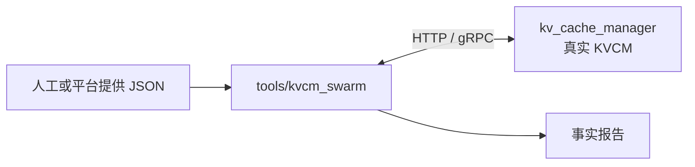
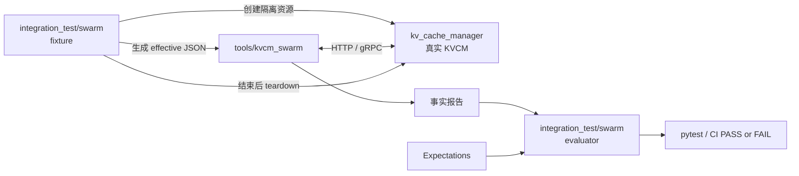
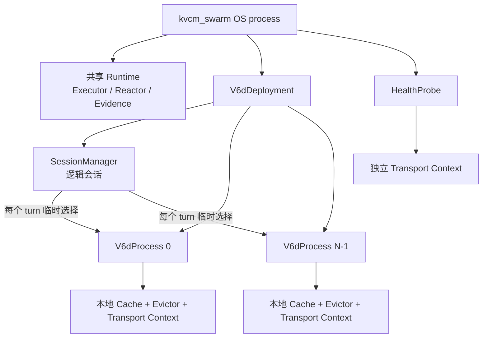

# KVCM Swarm 设计

状态：已确认（2026-08-18）

本文定义 KVCM Swarm 的目标、边界、系统模型、V6D workload、正确性契约和验收口径。
代码分层、异步运行时、状态所有权与测试设计见
[`kvcm_swarm_impl.md`](kvcm_swarm_impl.md)。

---

## 1. 背景与目标

KVCM 的主要使用场景由大量独立客户端共同形成。单 API 压测或少量手写集成测试不能完整
回答以下问题：

1. 实际部署面对大规模客户端时，KVCM 的性能、稳定性和资源曲线是否符合预期；
2. 日常 CI 中，主要客户端链路是否仍能闭环，基本正确性和性能是否发生回归。

KVCM Swarm 用同一套客户端行为模型服务这两个目标：

| 使用方式 | 目标 | 核心输出 |
| --- | --- | --- |
| 部署验证 | 编排大量有独立身份、连接、会话和生命周期的客户端 | 成功率、延迟、发生器 lag、连接与资源用量、多规模容量曲线 |
| CI 持续验证 | 以可复现的小规模场景覆盖主要使用链路 | 事实报告、正确性检查、样本覆盖和场景门禁 |

Swarm 不是单 API 请求循环，而是一个**可扩展的客户端行为运行器和证据系统**。它在不搬运
真实 KV bytes 的前提下，向真实 KVCM 发送具有客户端身份、连接、时序、缓存和 workload 形态
的元数据请求，并统一输出流量事实、性能数据和客户端能够证明的正确性观测。

### 1.1 设计原则

- **行为优先**：模拟客户端身份、连接、会话、时序、本地缓存和生命周期，而不是只复制 API 比例。
- **一套模型服务两种规模**：CI 与部署验证使用同一个独立 C++ 生成器；环境准备和场景判定在生成器之外。
- **事实与判定分离**：生成器记录请求、检查和运行事实；独立 evaluator 按场景配置判定 PASS/FAIL。
- **只证明有证据的结论**：无法从客户端可靠观察的性质明确标为 `NOT_RUN` 或 `INCONCLUSIVE`。
- **行为可扩展**：V6D 是首个业务 behavior，不是公共运行时的隐式领域模型。
- **并发不占线程**：客户端数量和在途 RPC 数量不受 Executor worker 数量限制；网络等待不占执行线程。

## 2. 功能范围与边界

### 2.1 当前交付

当前版本交付两个并列的顶层 behavior：

- `v6d_deployment`：模拟一个包含多个 V6D process 的 deployment，完成注册、心跳、查询、
  热层上报、容量驱动的冷写、热层删除和下线；
- `health_probe`：模拟独立探活，只调用 `CheckHealth`。

`event_reporter` 后续以新的顶层 behavior 接入，而不是成为 `v6d_deployment` 的模式开关。

| 能力 | 当前范围 |
| --- | --- |
| 被测对象 | KVCM Manager 元数据服务面 |
| 客户端形态 | 一个或多个 V6D deployment；每个 deployment 包含多个 V6D process；另有独立 health probe |
| 数据 | metadata-only，不搬运 KV bytes |
| 热层 | 单层 `ST_EVENT_REPORT_L2` reporter |
| 冷层 | `StartWriteCache → FinishWriteCache` 元数据闭环 |
| 查询 | V6D 使用的 PREFIX、COVERAGE 和冷层 selector |
| 传输 | 当前测试拓扑使用的明文 HTTP 和 insecure gRPC |
| 输出 | 请求事实、延迟/成功率、正确性检查、workload 形态、发生器容量和结构化报告 |

小规模真实 Manager 闭环是当前交付门槛。对某个大规模客户端数量作出性能或稳定性声明，
还必须通过对应部署环境的多规模容量测试。

### 2.2 非目标

当前版本：

- 不访问数据面，不验证真实后端带宽、字节内容、SDK 写失败或物理字节记账；
- 不验证 KVCM 之外的 MetaService，不根据 `metadata_backend_mode` 直读外部后端；
- 不要求合成 logical block hash 与生产请求逐字节相同，但保持 group 隔离和 V6D key 转换契约；
- 不复刻推理引擎内部的完整 Mamba key 物化算法；
- 不模拟 circuit breaker、故障注入、客户端中断、孤儿 WRITING、部分失败写或 retry；
- 不处理 `snapshot_required`，不发送启动或周期性全量 snapshot；
- 不默认启用 L1P5 + L2 双 reporter；
- 不支持 HTTPS、TLS 或 mTLS；
- 不为历史 bug 构造专用业务序列，也不把 Manager 缺陷规避写成客户端行为。

报告必须包含 metadata-only、实际规模、transport 和已知限制，不能把结果外推成数据面、
故障恢复或未经验证的生产容量结论。

## 3. 行为与协议依据

`v6d_deployment` 同时依据当前 KVCM 协议和固定版本的 Vineyard/V6D 实现：

| 输入 | 版本或提供方式 | 用途 |
| --- | --- | --- |
| 当前 tair-kvcache workspace | 本文所在 revision | protobuf、服务端校验和 EventReport 语义的权威来源 |
| Vineyard/V6D 源码与测试 | Vineyard/V6D repository commit `cfaafbed5d3f45f495fd653c0f65e74d33554770`，作为只读行为证据 | V6D 生命周期、请求时序、副本门限、本地 LRU 与冷写行为 |
| Connector 行为说明 | 上述 revision 中的 `docs/v6d-connector-dependencies.md` 和 `tests/benchmarks/bench_kvs.py` | group key 映射和 query 解释 |
| 生产 workload 观测 | 受控实现环境单独提供，不入库 | per-group key 数量、查询长度、复用和共享形态；只用于建模与报告 |

责任边界如下：

1. 当前仓库的 protobuf、服务端校验和 API 文档决定协议形状；
2. 推理引擎决定每个 cache group 实际产生哪些 block hash/key；
3. 固定 Vineyard revision 决定 V6D 收到 key 后的映射、请求时序和生命周期；
4. Swarm 只做已确认的协议适配：`ST_VINEYARD` 映射为 `ST_EVENT_REPORT_L2`，
   `BLOCK_DELETE` 补齐 `spec_names`，lookup 按 key 一一携带 `location_spec_names`。

Vineyard worktree 是只读证据，不是构建依赖。获得新的生产 Connector 证据后，如果与当前
模型实质冲突，必须同步修订行为、实现和验收。

## 4. 系统组成与责任边界

KVCM Swarm 相关代码分布在三个区域。它们位于同一仓库，但不是同一个程序，也不拥有同一种
状态：

| 代码区域 | 角色 | 主要职责 | 明确不负责 |
| --- | --- | --- | --- |
| `tools/kvcm_swarm/` | 独立 C++ 客户端行为运行器 | 读取 JSON，运行 behavior，生成真实 HTTP/gRPC 流量，维护模拟客户端状态并输出事实报告 | 创建 KVCM 部署资源、读取测试门禁、保存服务端权威状态 |
| `integration_test/swarm/` | CI / 集成测试编排 | 创建隔离测试资源，生成 effective run config，启动 Swarm，按 expectations 判定结果并 teardown | 实现客户端行为、进入 RPC 热路径、替 KVCM 保存业务状态 |
| `kv_cache_manager/` | KVCM 产品代码和被测系统 | 提供真实服务，处理请求，保存 metadata、location、allocation、quota 和 storage 等权威状态 | 理解 Swarm 的 session/workload，或为测试提供特殊业务分支 |

`tools/kvcm_swarm/` 中的 `LocalCache`、`ExpectedLocations` 和 session 都是模拟客户端自己的
状态。它们用于决定客户端下一步行为和检查可观察结果，不是 `kv_cache_manager/` 内部状态的
副本，更不能代替 KVCM 对 location 和 allocation 的权威判断。

### 4.1 两种运行方式

部署验证或手工运行只需要已有 KVCM 环境和一份 C++ run config：



CI / 集成测试在 Swarm 运行前后增加环境和判定编排，但不改变中间的客户端行为：



C++ `kvcm_swarm` 直接完成本地校验、preflight、初始化、warmup、steady、drain 和报告，正常
使用不依赖 Python。CI fixture 读取动态 endpoint 和实际 quota，并把最终值写入 C++ 配置；
Scenario Evaluator 只读取报告和判定配置。CI 不代理 RPC，也不因某项门禁未满足而改变流量。

C++ 工具不得调用 `AddStorage`、`CreateInstanceGroup`、`UpdateInstanceGroup` 或等价部署管理
API。注册、业务请求和使用临时 identity/key 的 preflight 属于客户端行为；测试资源的创建和
销毁只属于 `integration_test/swarm/`。

### 4.2 Swarm 进程内部对象与所有权



| 对象 | 拥有的状态 | 不拥有的状态 |
| --- | --- | --- |
| `V6dDeployment` | 共享 instance 配置、process 集合、SessionManager、workload、检查器 | Executor 线程 |
| `V6dProcess` | 独立 reporter、heartbeat、连接上下文、本地 cache、LRU 与 eviction pipeline | workload session |
| `SessionManager` | session 的逻辑历史、类别、turn 计划和进度 | process 本地 object、长期 lease 或 reporter location |
| `Session` | 稳定 id、逻辑 token 历史、turn 状态、上次 process | 本地 cache 生命周期 |
| `HealthProbe` | 探活时钟、连接和统计 | V6D 状态 |

迁移只改变下一轮选择的 process。它不会搬运旧 process 的本地 cache，不会转移热 location
所有权，也不会改变冷层 allocation。

### 4.3 Behavior 扩展边界

新 behavior 正常只增加自身模块、专属配置、registry 注册、专属检查和必要的新 API 描述。
公共运行时不理解 V6D session、prefix、location owner 或 selector；未来 `event_reporter`
自行拥有 reporter identity、事件序列、generation、snapshot/retry 和生命周期。

## 5. 运行阶段、调度与背压

### 5.1 明确的运行阶段

一次运行依次经过：

```text
local validation → preflight → initialize → warmup → steady → drain
```

| 阶段 | 行为 | 统计口径 |
| --- | --- | --- |
| local validation | 只解析和校验配置，不创建 transport、不发 RPC | 配置结果 |
| preflight | 用临时 identity/key 验证真实链路 | 独立 phase，不计入 C1–C5 和性能门禁 |
| initialize | 按启动节奏创建并注册全部 process；全部 ready 后才开放 session | 连接与注册风暴单独统计 |
| warmup | 运行正常 workload，建立 session、cache 和连接状态 | 默认不作性能门禁 |
| steady | 沿用 warmup 的全部状态继续运行 | 性能与主要正确性窗口 |
| drain | 停止 admission 和新 turn，闭合在途操作、刷出本地热对象并下线 | 清理和残留单独统计 |

配置使用 `runtime.warmup`、`runtime.steady` 和 `runtime.drain_timeout`，不再用含义重叠的
`duration + warmup`。warmup 到 steady 不重建 session、cache、连接或 RNG。RPC 按实际提交
到网络时所在阶段归属；steady 提交而在 drain 完成的 RPC 仍属于 steady。

steady 结束后不再接纳 session，也不再开始新 turn。已开始的 turn 在统一 deadline 内完成或
取消；遗漏的计划时刻不消耗逻辑 turn，也不能在恢复后突发补齐。heartbeat、leader discovery
和 health probe 在 process 下线或全局 drain deadline 前继续运行。

不同负载档位使用独立 run，不在阶段切换时自动改变 rate 或 process 数。

### 5.2 异步与调度语义

每个 process 至少有独立的 heartbeat 和 leader poll deadline，每个 session 有独立 turn deadline。
发起 RPC 后必须释放 Executor 执行能力，响应、超时或取消发生后再恢复对应 operation。
任何线程不得仅因等待网络响应而被长期占用。

逻辑客户端数量和同时在途 RPC 数量不由 Executor worker 数量决定。固定少量 reactor/CQ 线程
可以等待 I/O；不能用一请求一阻塞线程或一 process 一线程来伪装异步。

### 5.3 业务与控制流量

运行时提供两个相互隔离的有界调度 lane，或提供等价的不可饥饿语义：

- business：lookup、`BLOCK_ADD`、正常 `StartWriteCache/FinishWriteCache`、`BLOCK_DELETE`；
- control：heartbeat、leader discovery、health probe、drain 与清理请求。

business 达到在途上限时，due turn 异步等待 permit，记录 queue delay 和 generator lag，不占
Executor worker，也不补发追赶。control 有独立保留容量，不能被 business 耗尽。

`max_active_sessions` 达到上限时，计划到达直接记为 rejected admission，不排到未来，也不
改变后续 arrival timeline。admission rejection、持续背压或 generator lag 超阈值表示发生器
已饱和，Evaluator 必须把该 run 判为无效容量样本，而不是 KVCM 失败。

## 6. V6D 客户端行为

### 6.1 Deployment、process 与连接身份

一个 `V6dDeployment` 代表一个模型 deployment，包含配置数量的 `V6dProcess`。process 模拟
一个 V6D/vineyard daemon 和一个推理节点，但不是操作系统进程，也不绑定线程。

同一 deployment 的全部 process 共享一个 KVCM `instance_id`，通过唯一的 `host_ip_port` 和
process id 区分。Reporter identity 为：

```text
instance_id + ST_EVENT_REPORT_L2 + host_ip_port
```

每个 process 拥有独立、懒创建的 transport client context。底层 HTTP/gRPC 能力由
`kv_cache_manager/client/src/internal/async_rpc/` 提供；Swarm 在其外层增加流量准入和证据记录：

- gRPC 对每个实际 endpoint 创建一个独立 channel，并在 channel 内复用并发 RPC；
- HTTP 对每个 endpoint 使用小型、懒增长的连接池；控制请求有不会被 business 饱和阻塞的容量；
- 不同 session 若选择同一 process，则共享该 process 的连接；不同 process 不共享连接；
- 全部 process 共用进程级 reactor/CQ 和 Executor，不创建 per-process 网络线程；
- `HealthProbe` 拥有自己的 transport context，不与 V6D 共用业务连接。

这种模型保留真实多客户端连接状态。只需要更高 QPS 而不需要更多连接时，应减少 process、
增加 session rate，而不是提供易误用的共享连接模式。

process population 在一期是静态的。`process_startup_interval` 为 `0`、固定 duration 或
`{min,max}` 均匀分布：`0` 表示突发启动，范围表示平滑并带可复现 jitter。任一 process 注册
失败都使 initialize 失败；所有 process ready 后才开始 session admission。一期不模拟 process
运行期 churn 或 restart。

process 地址由 `process_host_ip` 和 `process_port_base` 明确派生：process *i* 的
`host_ip_port` 为 `<process_host_ip>:<process_port_base + i>`。地址必须能作为 location id
组件并能被 `vineyard://host:port/mem` 解析，且在整个 run 内唯一。

每个 process 使用本地 cache 容量作为并发 turn 的字节预算。turn 生成本轮实际 group object 后，
按这些 object 的 size 求和申请预算；同一 process 上所有活动 turn 的预算总和不能超过
`local_cache.capacity_bytes`。一期不对共享 prefix 或不同 turn 的相同 object 去重，避免引入额外的
共享所有权模型。预算等待是异步的、受 turn deadline 约束并计入报告；超时表示发生器饱和，不是
KVCM 结果。

配置仍必须保证 cache 能容纳最坏情况下的完整单 turn 工作集。静态校验保证任意单个 turn 可以
运行，实际字节预算则允许较小 turn 在不超出 cache 容量的前提下获得更高并发。

### 6.2 正常生命周期与 API 契约

1. 每个 process 调用一次 `RegisterInstance`，同一 deployment 使用相同的 instance group、
   `instance_id` 和静态 spec/group 配置；
2. 首个 `ReportEvent` 同包发送 `NODE_REGISTER` 和 `HEARTBEAT`；
3. 按独立 deadline 持续 heartbeat 和 leader discovery；
4. 消费 workload 产生的 per-group key，执行本地命中、远端热层查询、冷层查询与 materialize；
5. 对新 seal 或新 materialize 到本地的 group object 发送 `BLOCK_ADD`；
6. process cache 容量压力驱动后台 eviction pipeline；pipeline 在热 location 仍存在时完成
   `StartWriteCache → FinishWriteCache → 本地移除 → BLOCK_DELETE`；
7. drain 时刷出剩余可驱逐热对象，然后尽力发送 `HOST_DOWN` 并释放本地资源。

| API / 事件 | 触发与关键字段 | 响应使用 |
| --- | --- | --- |
| `RegisterInstance` | 每 process 一次；共享 deployment 配置；`block_size=1`，`model_name=v6d`、`dtype=bytes`、`tp/dp/pp=1`、`use_mla=false`；每个 spec 为单成员 spec group | 保存 `storage_configs` 和 `metadata_backend_mode`；共享 `instance_id` 的静态配置不一致则失败 |
| `NODE_REGISTER + HEARTBEAT` | 首个 EventReport batch；`ST_EVENT_REPORT_L2` 和 process 唯一 reporter identity | 逐 item 确认 |
| 周期 `HEARTBEAT` | 单调的本地 `system_status` 计数器 | 记录事实，不触发 circuit breaker |
| `GetCacheLocationsByBackend` | `QT_BATCH_GET`；key/spec 一一对应；热层使用该 batch 明确的 PREFIX 或 COVERAGE，冷层对 `RegisterInstance` 返回的 `storage_configs` 中实际存在的冷层 storage type 使用 WEIGHTED_RANDOM | 保留原始逐 key数组，排除自身热地址，不把 selector 结果解释成 candidate 全集 |
| `BLOCK_ADD` | seal 或 materialize batch；每项只有该 object 的一个 spec；`medium=mem`，URI 为 `vineyard://<self>/mem` | item 成功后确认 process 本地热 location |
| `StartWriteCache` | 只由 cache pressure 或 shutdown flush 触发；每批最多 128 key；`min_replica_count=2`，默认 write timeout 30 秒 | 保存 write session、mask 和冷 URI；masked 表示已有副本满足门限 |
| `FinishWriteCache` | metadata-only：不写 bytes；writable 项声明成功；全 masked 也闭合返回的 write session | 成功后确认新冷 location；masked 不伪造 allocation |
| `BLOCK_DELETE` | 本地移除后，只删除本 process 已确认上报的热 location，携带对应 `spec_names` | item 成功后退休 owner/location/spec |
| `GetClusterInfo` | 独立周期轮询；任一 V6D API 返回 `SERVER_NOT_LEADER` 时刷新 endpoint，并对原请求最多重试一次 | 更新 meta endpoint；原始失败和重试均记录 |
| `HOST_DOWN` | drain 最后有界尽力发送 | 记录结果，不阻塞本地清理 |

一个 group object 只有一个 size/spec，spec 名为 `v6d_<object_size>`。ADD、DELETE、lookup 和
StartWrite 使用同一 object 上的 spec；批量请求中的 key 与 spec 始终等长并逐项对应。
`BLOCK_ADD` batch 对应一次 seal/materialization batch，`BLOCK_DELETE` batch 对应一次 eviction
batch，不能为了凑固定批量而跨越不相关的生命周期边界。

同一 reporter identity 的 `ReportEvent` 不做全局串行化。heartbeat、`BLOCK_ADD` 和
`BLOCK_DELETE` 按各自 operation 的真实时序并发；同一 key 的 ADD/DELETE 仍由本地 object
生命周期保证不重叠。初始化完成 `NODE_REGISTER` 后 process 才进入 ready，drain 闭合在途业务后
才发送 `HOST_DOWN`。

KVCM 返回的 `NODE_NOT_REGISTERED` 是真实服务端错误，必须按原始 service status 记录并参与场景
判定，不能作为流量生成器噪声忽略，也不能通过改变 V6D 并发行为来规避。

冷写的三个 RPC（`StartWriteCache`、`FinishWriteCache`、随后的 `BLOCK_DELETE`）各自使用独立
的有界预算，而不是继承可能已过期的批次 deadline；批次 deadline 只决定是否允许开始新批次。
这样"已打开的 write session 必须闭环"和"任何等待都有界"可以同时成立。

当前只模拟健康客户端正常路径。若真实请求失败或结果不确定，不能伪造成功，也不能为了释放
容量而跳过已取得 write session 的闭环。

## 7. Workload、Session 与一次 Turn

### 7.1 Token 级 workload

上游 workload 以 logical token 描述，而不是以 block 描述，因为不同 cache group 的 block size
可以不同。每个 session class 定义：

| 参数 | 含义与采样时机 |
| --- | --- |
| `turns` | session 创建时采样一次总轮数 |
| `turn_interval` | 每轮安排下一轮时重新采样 |
| `initial_tokens` | 创建 session 时采样一次初始上下文长度 |
| `new_tokens_per_turn` | 每个 turn 采样并追加的 token 数 |
| `rewrite_tail_tokens` | 每个 turn 采样；重写当前上下文尾部并重新派生受影响 group block |
| `shared_prefix_probability` | 创建时决定是否从共享 prefix pool 选择 root |

数值和 duration 均支持标量或 `{min,max}` 闭区间均匀分布。一期不提供 normal、log-normal、
任意概率表或表达式 DSL。

共享 prefix pool 只提供 `root_count` 和 `prefix_tokens`。root 在 session 创建时均匀选择一次；
未命中共享概率的 session 使用唯一 root。一期不引入 Zipf 或热点 DSL。配置必须保证可能采样的
`prefix_tokens` 不超过对应 session class 的 `initial_tokens`。

每个 group 定义：

| 参数 | 含义 |
| --- | --- |
| `id` | 稳定 group id，参与 object key 派生 |
| `kind` | `full_attention` 或 `mamba` |
| `block_size` | 该 group 的 token 粒度 |
| `object_size` | 单个 object 的 byte size，并决定 V6D spec |
| `lookup_selector` | Full Attention group 明确选择 `prefix` 或 `coverage`；Mamba 固定使用 coverage |
| `key_presence_rate` | 仅 Mamba 使用；0 到 1，决定完成 block 是否实际有 key |

Full Attention 为每个完整 block 生成 key。Mamba 是否生成 key由稳定的内容和 group hash 决定，
不依赖异步 completion 次序；并非每个 logical block 都有 Mamba key。不完整尾部不 seal、
不查询也不上报。不同 group 使用独立 hash salt/namespace。

### 7.2 Session 调度与生命周期

每个 deployment 只有一个逻辑上的 `SessionManager`。它持有 session 的逻辑 token 历史、类别、
turn 数、下一轮时间和调度状态；session 不持有 process-local object 或跨 turn lease。

`session_arrival.rate` 是**整个 deployment 的总到达率**，不是每个 process 的到达率：

- `even` 使用固定到达间隔；
- `poisson` 使用指数分布的到达间隔；
- 二者长期平均 rate 相同，时间线由 seed 派生并可复现。

首轮在 ready process 间均匀选择。后续每轮以 `session_affinity` 概率继续使用上次 process，
否则从其他 ready process 中选择。同一 session 同时最多一个 turn，不同 session 可以在同一
process 上拥有并发 RPC。

`turn_interval` 从上一个计划时间推进，不能使用完成时间不断漂移。到期时上一轮仍未完成，
不启动重叠 turn；过期 slot 记录为 skipped，但不消耗逻辑 turn，也不在恢复后补发。

session 的正常终止条件只有 `turns` 用尽，不另加与之竞争的 lifetime 参数。最后一个 turn 的
operation 归并后，session 立即释放当轮临时 lease 并退役；它不会清空 process cache、触发
`BLOCK_DELETE` 或创建 replacement。普通 RPC 失败是该 turn 的观测结果，不自动销毁 session。

### 7.3 Key 派生

对 workload 实际为某个 group 产生的 block hash，按 Connector 契约派生：

```text
object_key = block_hash + "_" + group_id
block_key  = signed_big_endian_int64(SHA256(object_key)[0:8])
```

同一 group 的相同内容产生相同 key；不同 group 即使内容相同也产生不同 key；没有上游 key 的
位置不创建占位 object。固定 seed 下，arrival、session class、token 内容、group key 存在性和
process routing 的计划结果可复现，不要求真实网络 completion 顺序可复现。

### 7.4 一次 turn

```text
选择 V6dProcess
  → 生成本轮 logical token 历史和各 group 的实际 sealed object
  → 从该 process cache 获取本地对象的短期 lease，识别本地缺失
  → 每个 Full Attention group 独立按配置 selector 做 batch lookup
  → Full 结果给出最大可复用 token 边界
  → 把所有 Mamba group 在该边界内实际存在的候选合并为一次 COVERAGE lookup
  → 对热层未命中项查询冷层；远端热命中或冷命中均模拟 materialize
  → 真正未命中项模拟 compute + seal
  → 必要时等待 process cache 腾出容量，再插入 materialized/sealed object
  → 对本轮新进入本地 cache 的 object 按 materialization batch 发送 BLOCK_ADD
  → 提交 session 逻辑进展并释放本轮全部 lease
```

每个 Full group 的查询 batch 只使用一个明确 selector，不在同一次调用里混合 PREFIX/COVERAGE。
Mamba lookup 只包含实际存在且不超过 Full 最大复用边界的候选。最终可复用 token 边界取全部
group 结果的交集。

turn 不执行 spill，也不等待与本轮无关的后台 eviction。只有当 materialize 所需容量不足时，
turn 才等待 cache 释放容量，并把等待记录为 cache backpressure。KVCM 请求失败不会让整个
上游 turn 自动重放；session 逻辑进展只提交一次，只有服务端明确确认的 cache/reporter/
expected-location 变化才提交为成功。

## 8. Process 本地缓存与冷写

### 8.1 容量模型

每个 `V6dProcess` 拥有独立、按 bytes 计量的 LRU cache。基础配置只暴露：

```text
local_cache.capacity_bytes
```

每个 cache entry 包含 object、size、LRU 位置、短期 lease 数和 `resident/evicting` 状态。
Session 不拥有 entry；turn 只在使用期间持有 lease。被 lease 的 object 不能进入 eviction。
配置必须保证任一 `groups[].object_size <= capacity_bytes`。

插入导致容量不足时，从未被 lease 的 LRU 尾部选择 victim，交给每个 process 唯一的后台
eviction pipeline。若没有可驱逐 object，materialization 异步等待并记录 backpressure；不能
超配容量、驱逐在用对象或阻塞 Executor worker。

一期不提供 high/low watermark、周期扫描、quota-aware admission、`spill_rate` 或
`local_evict_prob`。本地命中只由 process cache 的真实状态决定。

### 8.2 Eviction pipeline

后台 pipeline 每批最多处理 128 个 object，并对同一个 key 的生命周期串行化：

```text
选择 unleased LRU object，并标记 evicting
  → 确认本地热 object 仍存在
  → StartWriteCache(min_replica_count=2)
  → writable：跳过 bytes，FinishWriteCache 声明成功
  → masked：不创建新 cold allocation，但仍闭合 write session
  → write session 闭环成功
  → 从本地 cache 移除并释放容量
  → 发送带 spec_names 的 BLOCK_DELETE
```

不同 key 的 batch 可以并发，同一 key 的 ADD、eviction、DELETE 必须有稳定顺序。Start 或 Finish
失败、超时或结果未知时，不得把 object 当作已安全冷写后删除；entry 保留并记录阻塞/未知状态。

`StartWriteCache` 只在两个时机发生：

1. 正常运行中，process cache 容量压力选择 victim；
2. graceful shutdown 中，刷出仍在本地的可驱逐热 object。

它不由 turn 随机触发，也不由 session 退役触发。

### 8.3 热冷位置所有权

| 层 | backend / selector | location owner |
| --- | --- | --- |
| 热层 | `ST_EVENT_REPORT_L2`；PREFIX/COVERAGE | 实际发送 `BLOCK_ADD` 的完整 reporter identity |
| 冷层 | 场景提供的 storage；WEIGHTED_RANDOM | KVCM/storage allocation，不绑定调用 process |

`StartWriteCache` 的调用者只是写请求发起者，不是返回的冷层 location owner。会话迁移、调用
process 下线或其他 reporter 删除都不会改变冷层 allocation。

metadata-only 仍会创建真实冷层元数据、选择 storage 并参与 quota/watermark 计算，只是不写
真实 bytes。因此 Swarm 可以验证 allocation、可查询性和 quota 路径，不能证明数据内容、后端
带宽或 SDK 失败语义。

现有 usage 口径混合热层 EventReport metadata 与冷层 allocation，且刷新异步。Swarm 记录 usage
峰值、drain 序列和最终值，但 usage 收敛只作观察，不作一期门禁。

## 9. 正确性与证据模型

### 9.1 ExpectedLocations

Swarm 按 location provenance 保存预期，而不是给 block 一个布尔值：

| 来源 | provenance | 移除依据 |
| --- | --- | --- |
| 热层 `BLOCK_ADD` | block key、spec、完整 reporter identity | owner 的 `BLOCK_DELETE` 或 reporter 生命周期 |
| 冷层 allocation | block key、spec、storage URI | KVCM/storage 的权威回收或隔离测试环境 teardown |

location 支持 `pending-create`、`confirmed`、`unknown` 和 `removed`；热层删除另有
`pending-delete`。完整性只要求 `confirmed` 出现；soundness 将仍可能存在的 pending/unknown
纳入允许集合。热层 unknown 保留 create/delete 方向用于结束报告；checker 只保存实际参与
判定的状态，不复制 write session、generation、RPC deadline 等 operation 数据。

`BLOCK_DELETE` 明确成功后立即变为 `removed`，不设置客户端删除可见性 grace。服务端
`cleanup_grace_ms` 是 heartbeat 超时后的 reporter 恢复窗口：grace 内物理元数据可暂留，
但 reporter 已 unavailable，普通查询不应返回其 location。`HOST_DOWN` 成功则立即注销 reporter。

`removed` 的判定按**查询窗口**而不是完成时刻的快照进行：每条 location 记录进入
`removed` 的时刻，若它在某次查询发出之后才被删除，则该查询返回它仍然合法；只有在查询
发出之前就已删除的 location 才是违规。这不是 grace 常量，而是消除"与并发删除比较事后
快照"带来的伪违规。

### 9.2 正确性契约

| 编号 | 契约 | 判定方式 |
| --- | --- | --- |
| C1a | selector soundness | 客户端接受的每个远端热 location 都匹配 instance、key、spec、backend，并属于可能存在且未退役 reporter |
| C1b | remote availability | 自然 workload 中完成时仍 stable remote-eligible 的查询，在 deadline 内至少返回一个合法远端热 location |
| C2 | 批量响应形状 | 长度、逐项关联和顺序符合 API 契约 |
| C3 | 容量压力下的正常淘汰与副本门限 | 同时覆盖 writable 与 masked；writable 完成 cold allocation；masked 不产生新 URI；两者都先闭合 write session 再删本地热 location；压力覆盖由服务端 quota 高水位观测或累计 allocation 周转证明 |
| C4 | 服务端指标交叉校验 | 一期不新增同口径 API；固定为非门禁 `INCONCLUSIVE/TODO` |
| C5 | 探活有界响应 | `CheckHealth` 在配置 deadline 内响应，并与业务 API 分开报告 |

C1b 只被动分类正常 lookup，不增加专用 RPC、pin、强制迁移或 correctness-only 阶段。
对某个 key 判定 remote-eligible，需要 requester 对该 key 无仍可能存在的自身热 location，且
另一个 live reporter 对相同 key/spec 有 confirmed location。PREFIX 只检查首个未 mask key；
COVERAGE 收集所有符合条件的未 mask key。响应必须在这些 eligible key 中至少返回一个合法远端
热 location，不能由同批次中的其他 key 代替。查询期间 hot candidate 或 reporter liveness
revision 变化则样本记为 `invalidated`，不进入 C1b 分母；冷层 allocation 变化不会使热层样本失效。

未满足 eligibility 的查询允许合法返回空。`stable_remote_eligible_queries` 样本不足表示场景
覆盖不足，不表示 selector 通过或失败；应调整普通 workload 的共享 prefix、迁移和容量参数。

PREFIX/COVERAGE 只返回按 selector 选择的 peer，不承诺枚举全部 candidate。C1 不检查全局最优
peer 或完整 candidate 集。

### 9.3 事实报告与场景判定

报告至少包含：

- 每 phase、behavior、API、lane 的请求数、成功率、错误分类、queue delay 和延迟分位；
- 每项契约的状态、执行量、违规量和有界代表性明细；
- C1 的 eligible、stable、returned、invalidated 和 violation query 数；
- planned/admitted/rejected session、active/lifetime、turn lag 与 skipped slots；
- cache hit、occupancy、eviction、backpressure（区分容量超时、同 key 冷写中跳过和 drain 取消）、
  cold allocation 与残留；
- transport context、channel/连接数、新建与复用连接、在途 RPC、线程、RSS 和启动耗时；
- workload shape、usage observation、实际 config、seed、环境事实和限制；
- drain、shutdown flush、HOST_DOWN、preflight 和 fixture cleanup 结果。

JSON 是稳定事实源，JSONL 保存超出内存上限的违规明细，人读摘要从同一结构渲染。空报告、
字段缺失或报告生成失败属于执行失败。生成器退出码只表达配置、前提、执行和报告是否完成；
独立 Evaluator 根据最低样本、成功率、延迟、必选检查和发生器饱和状态作场景判定。

生产 workload 形态相似度、usage 收敛、命中率绝对值、C4 和低样本分位值均为参考项，
不作当前 KVCM 门禁。`usage_observations` 只包含客户端可观察量（已确认的冷层 allocation
数量/bytes、热层 reporter location、本地残留），并显式声明未查询服务端 usage：一期没有同
口径服务端 API，C4 固定非门禁。

## 10. 启动、清理与运行场景

### 10.1 Preflight 与清理权限

本地配置校验无副作用。随后 preflight 使用隔离的临时 identity/key 验证 meta/admin endpoint、
注册、`NODE_REGISTER + HEARTBEAT`、热层 `BLOCK_ADD → query` 和 metadata-only
`StartWriteCache → FinishWriteCache → cold query`。热层与冷层使用两个不同的临时 key：同一个
key 上刚上报的热 location 会满足副本门限并使冷写被 masked，从而静默跳过冷层验证。

preflight 对自己创建的微小临时 cold key 可以调用 `RemoveCache`，以兑现其自清理承诺；该例外
不进入正常 workload 模型。正常 workload 与 graceful shutdown 均不调用 `RemoveCache`。

drain 顺序为：

1. 停止 session admission 和新 turn；
2. 在 deadline 内完成或取消在途 turn，并释放全部短期 lease；
3. 完成已经开始的 eviction/write session；
4. 把仍在本地且可驱逐的热 object 加入 shutdown flush，尽力完成冷写和 `BLOCK_DELETE`；
5. 发送 `HOST_DOWN`，释放连接、timer 和本地状态；
6. 报告确认的 cold allocation 数量/bytes、未刷出热 object 和清理限制。

正常 shutdown 不删除 cold allocation。CI 使用专用隔离 instance group，并由 fixture teardown
清理整个环境；部署验证应使用专用 instance group，或明确接受运行后 residual metadata。

### 10.2 CI 与部署验证

CI 至少覆盖：HTTP/gRPC 正常闭环、共享 `instance_id` 的多 process、session 迁移与共享 prefix、
独立 health probe、容量压力下 writable/masked、C1a/C1b/C2/C3/C5 和 teardown。

大规模部署验证至少覆盖三个规模点，并分别观测注册/连接风暴、warmup 后 steady 的业务性能、
KVCM 资源、Swarm CPU/RSS/线程/连接、实际发包率和 generator lag。若发生器背压或 lag 超预算，
该 run 只能说明生成器容量不足，不能生成 KVCM 容量结论。

## 11. 配置模型

JSON 是 C++ 工具唯一运行配置入口。下例展示核心字段；高级资源上限仍由 loader 提供明确默认值
并写入 effective config：

```json
{
  "name": "v6d-normal-http",
  "seed": 42,
  "runtime": {
    "warmup": "5s",
    "steady": "30s",
    "drain_timeout": "20s",
    "workers": 8,
    "limits": {
      "max_in_flight_business_rpcs": 4096,
      "max_in_flight_control_rpcs": 512
    }
  },
  "target": {
    "endpoints": {
      "meta_http": "http://127.0.0.1:6382",
      "meta_grpc": "127.0.0.1:6381",
      "admin_http": "http://127.0.0.1:6492",
      "admin_grpc": "127.0.0.1:6381"
    },
    "instance_groups": {
      "kvcm-swarm": {"quota_bytes": 1048576}
    }
  },
  "behaviors": [
    {
      "id": "v6d-a",
      "type": "v6d_deployment",
      "transport": "http",
      "config": {
        "process_count": 16,
        "process_startup_interval": {"min": "0ms", "max": "5ms"},
        "instance_group": "kvcm-swarm",
        "instance_id": "v6d-deployment-a",
        "local_cache": {"capacity_bytes": 67108864},
        "session_arrival": {"rate": 40, "mode": "poisson"},
        "session_affinity": 0.7,
        "limits": {"max_active_sessions": 10000},
        "heartbeat_interval": "10s",
        "min_replica_count": 2,
        "shared_prefix_pool": {
          "root_count": 64,
          "prefix_tokens": {"min": 128, "max": 512}
        },
        "groups": [
          {
            "id": "full-0",
            "kind": "full_attention",
            "block_size": 16,
            "object_size": 4096,
            "lookup_selector": "prefix"
          },
          {
            "id": "mamba-0",
            "kind": "mamba",
            "block_size": 64,
            "object_size": 1024,
            "key_presence_rate": 0.25
          }
        ],
        "session_classes": [
          {
            "name": "chat",
            "weight": 1.0,
            "turns": {"min": 4, "max": 12},
            "turn_interval": {"min": "40ms", "max": "80ms"},
            "initial_tokens": {"min": 512, "max": 1024},
            "new_tokens_per_turn": {"min": 32, "max": 128},
            "rewrite_tail_tokens": {"min": 0, "max": 32},
            "shared_prefix_probability": 0.4
          }
        ]
      }
    },
    {
      "id": "health-a",
      "type": "health_probe",
      "transport": "http",
      "config": {"interval": "3s"}
    }
  ],
  "evidence": {
    "output_json": "report.json",
    "violations_jsonl": "violations.jsonl"
  }
}
```

`admin_grpc` 可省略，默认与 `meta_grpc` 相同：当部署未拆分 admin RPC 端口时
AdminService 与 MetaService 在同一 gRPC 端口上，`health_probe` 的 gRPC 形态需要这个地址。
省略时的实际取值必须写入 effective config。

`local_cache.capacity_bytes` 必须同时不小于最大 `groups[].object_size` 和由
`session_classes` 与 `groups` 推导出的**最坏单 turn 工作集**，否则单个 turn 无法把自己使用
的 object 全部保持 resident。运行时依据每个实际 turn 的 object size 总和申请 per-process
字节预算，不使用最坏值推导固定并发 turn 数。

配置分为三类，不得合并：

1. C++ run config：连接、运行和事实输出；
2. CI fixture config：隔离资源、环境注入和 teardown；
3. evaluator expectations：样本、成功率、延迟和必选检查门禁。

CI fixture 只把实际 endpoint、instance group、instance id 和 quota 写入待运行的 C++ config，不改写
workload 形态。C++ 直接按最终 JSON 运行，不依赖 Python 包装或二次归一化。

## 12. 交付验收与演进

当前版本必须满足：

- C++ 二进制仅凭 JSON 连接已有环境并产出完整报告，不依赖 Python；
- behavior registry 可独立创建 `V6dDeployment` 与 `HealthProbe`；
- 一个 deployment 共享 `instance_id`，每个 process 拥有独立 reporter、cache 和连接上下文；
- token workload、group-specific key、Mamba 稀疏 key、per-key spec 和 selector batch 语义有确定性测试；
- session 只拥有逻辑上下文，turn lease 与 process cache 生命周期严格分离；
- capacity-driven LRU eviction 覆盖 writable/masked，且先闭合 write session 再删热 location；
- HTTP/gRPC 都完成小规模 Manager 闭环，C1a/C1b/C2/C3/C5 达到场景执行量且零违规；
- 同时在途 RPC 超过 Executor worker 时，无关 session、heartbeat 和 health probe 仍按 deadline 推进；
- business 饱和不饿死 control，generator saturation 不被解释成服务端结果；
- warmup、steady、drain 连续保留状态，shutdown flush、HOST_DOWN 和 cold residual 如实报告；
- 结束时释放线程、连接、timer、临时文件和本地状态。

V6D heartbeat interval 只要求在本地为正。CI/集成测试 fixture 负责保证其相对测试环境的
EventReport heartbeat timeout 留有足够余量；直连既有环境时若无法获得服务端参数，报告该环境
约束未经验证，但不根据猜测拒绝运行。

200/1000 process 等目标规模是第一版 ready 后的专项评估，不作为当前功能交付门禁。专项评估需要
保存 QPS、queue delay、RSS、连接/channel、turn budget wait、backpressure 和错误率；KVCM 自身
达到容量或暴露错误不自动等同于 Swarm 实现失败。

以下能力保持为独立后续需求：

- `event_reporter` 的事件模型、snapshot/retry 和验收；
- 客户端中断、孤儿 WRITING、部分失败写和故障注入；
- L1P5 + L2 双 reporter、真实 KV bytes、TLS/mTLS；
- process churn/restart、复杂到达/热点分布 DSL；
- 服务端同口径指标或 candidate/debug 审计 API。

Manager usage 异常应先用实现无关的最小客户端定位，再决定是否形成回归测试；Swarm 不为它
增加特殊 skip 或规避路径。
