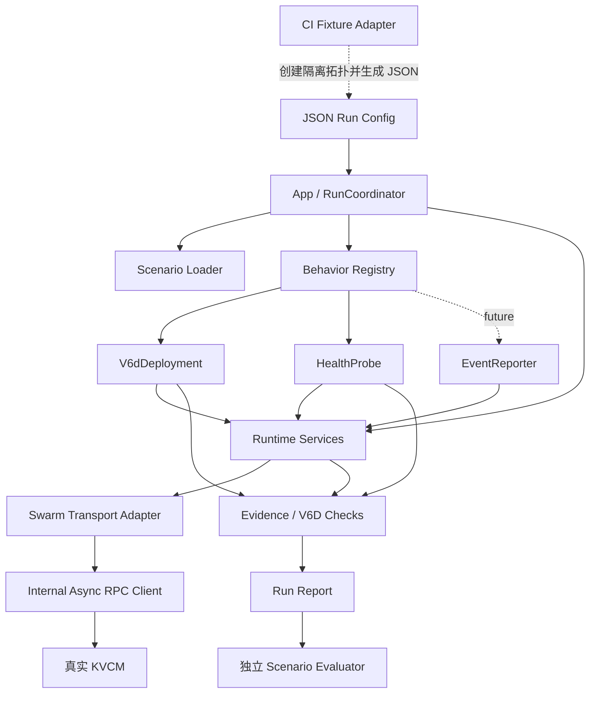
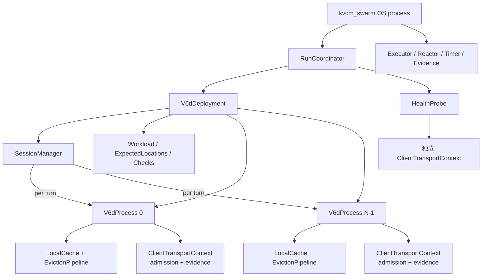
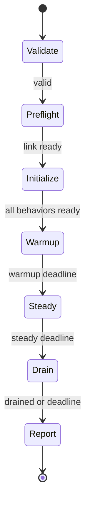
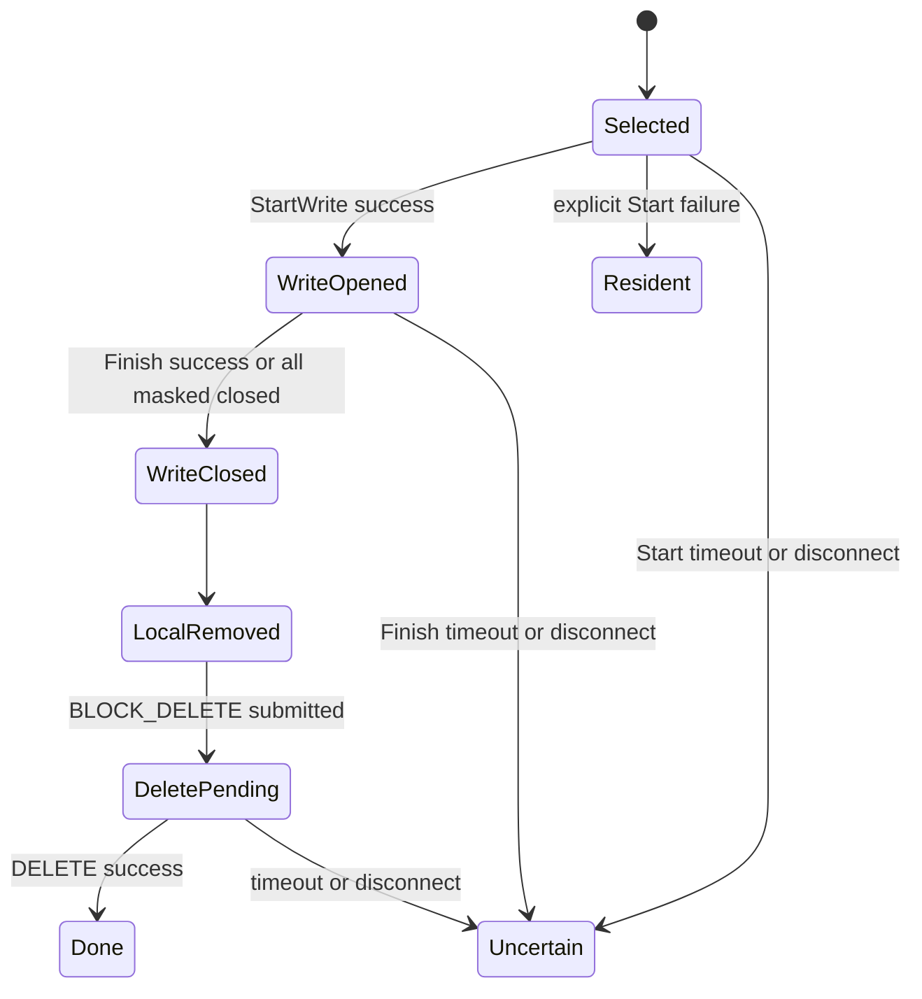
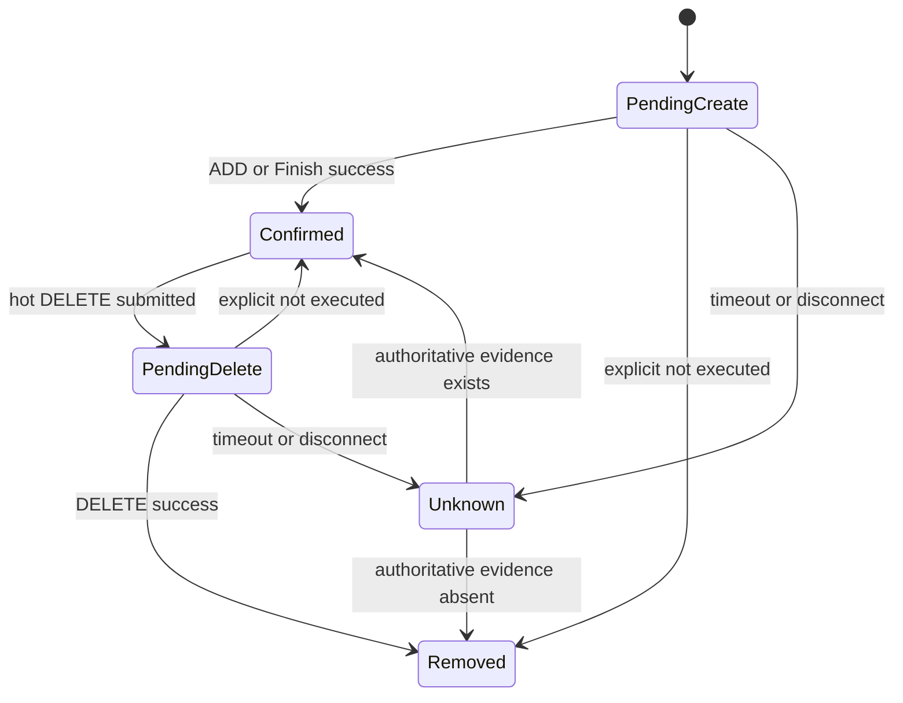

# KVCM Swarm 实现设计

状态：设计已确认（2026-08-18）

配套功能设计：[`kvcm_swarm.md`](kvcm_swarm.md)。本文定义代码分层、运行阶段、异步执行、
领域状态、transport 所有权、缓存驱逐、事实报告和测试策略。

同一套实现需要同时支持 CI 小规模回归和真实部署的大规模性能/稳定性验证。因此实现必须
分离：逻辑客户端与线程、业务 behavior 与公共运行时、事实记录与场景门禁、生成器运行与
测试环境准备。

文中的类和签名是概念接口。coroutine、callback、显式可恢复状态机、typed/Generic gRPC stub、
锁和队列等局部机制可按仓库现状选择，但不能改变本文定义的行为、所有权、异步语义和证据口径。

---

## 1. 实现目标与不可变约束

### 1.1 目标

- 完成 V6D 正常元数据链路和独立 `CheckHealth` 探活；
- HTTP 与 gRPC 共用请求模型、领域状态、指标和正确性检查；
- C++ `kvcm_swarm` 直接读取 JSON 并完成全部阶段，不依赖 Python 包装；
- 输出稳定事实报告，供进程外 Scenario Evaluator 选择不同门禁；
- process、session 和同时在途 RPC 数量不与线程数线性绑定；
- 新 behavior 通过 registry 接入，不把 V6D 领域状态放进公共运行时；
- 小规模真实 Manager 测试与大规模部署验证使用同一行为实现。

### 1.2 行为证据

除当前 workspace 外，实现者需要只读访问：

Vineyard/V6D repository commit
`cfaafbed5d3f45f495fd653c0f65e74d33554770` 是只读行为证据，不是构建依赖。
实现前校验 checkout，不修改、不链接、不复制源码。主要入口：

- `src/v6d/server/tair_kvcm/store.py`：注册、lookup、spec、Start/FinishWrite 和 EventReport；
- `src/v6d/server/peers/tiered_vineyard/peer.py`：本地容量/LRU、淘汰和 shutdown flush；
- `tests/integration_tests/test_tiered_vineyard_tair_kvcm_integration.py`：共享 instance 和
  `min_replica_count=2` 的生命周期；
- `docs/v6d-connector-dependencies.md`、`tests/benchmarks/bench_kvs.py`：group key 映射和
  Full Attention/Mamba query 解释。

当前仓库协议优先于旧 Vineyard payload。已确认的兼容映射为：

| 旧 V6D 行为 | 当前 Swarm |
| --- | --- |
| `ST_VINEYARD` | `ST_EVENT_REPORT_L2` |
| `BLOCK_DELETE` 无 spec | 携带 object 对应的非空 `spec_names` |
| lookup 携带全部 spec | `location_spec_names` 与 `block_keys` 等长并逐项对应 |

### 1.3 系统级约束

以下约束不能被局部实现选择改变：

- behavior 发起 RPC 后释放 Executor；网络等待不占 worker；
- 每个 V6D process 拥有独立 reporter、本地 cache 和 transport context；
- session 只拥有逻辑历史，不拥有 process-local object 或跨 turn 引用；
- turn 与后台 eviction 是两条独立状态机；
- cache pressure 和 graceful shutdown 是 `StartWriteCache` 的唯二触发源；
- 先闭合 write session，再本地移除，最后发送 `BLOCK_DELETE`；
- 生成器记录事实，Evaluator 才做场景 PASS/FAIL；
- C++ 生成器不创建或修改 storage/instance group。

## 2. 总体架构与依赖

实现分成三个代码归属，必须保持进程与责任边界：

| 代码区域 | 运行形态 | 实现边界 |
| --- | --- | --- |
| `kv_cache_manager/client/src/internal/async_rpc/` | 项目内部 C++ 库 | 公共异步 RPC 接口、取消、协议编解码、HTTP/gRPC transport 与连接统计；不暴露进 `kv_cache_manager_client.so` |
| `tools/kvcm_swarm/` | 可独立启动的 C++ 二进制 | 客户端 behavior、异步 runtime、RPC adapter、在线检查和事实报告 |
| `integration_test/swarm/` | pytest / CI 进程 | fixture、runner、expectations、Evaluator 和 teardown；只在运行前后编排 |
| `kv_cache_manager/` | 独立 KVCM 服务进程 | 现有产品实现和服务端权威状态；不得加入 Swarm 专用模拟或测试捷径 |

部署验证可以直接用 JSON 启动 `tools/kvcm_swarm` 并连接已有 KVCM，不经过
`integration_test/swarm`。CI 则先由 fixture 创建隔离 storage/instance group 和 effective
config，再启动同一个 C++ 二进制；运行结束后 Evaluator 读取报告，fixture 回收环境。两种方式
共用完全相同的生成器与 behavior 实现。



依赖方向：

- `runtime`、`protocol adapter`、`transport adapter`、`evidence` 不依赖具体 behavior；
- 项目级 async RPC client 不依赖 Swarm，只返回原始 transport/service 结果；
- behavior 依赖公共层，并在自己目录拥有领域状态；
- `v6d_deployment` 是唯一理解 session、token workload、prefix、process cache、V6D selector
  和 expected location 的模块；
- `health_probe` 和未来 `event_reporter` 不依赖 V6D；
- app 拥有阶段切换、统一停止和最终报告；
- CI fixture 与 Evaluator 都在生成器进程外。

### 2.1 进程内对象



`V6dProcess` 是领域对象，不是线程，也不直接等同于一个 runtime task。一个 process 上的多个
session 可以同时等待 RPC；短时共享状态通过 strand、mailbox 或等价串行化机制更新。

## 3. 目录与构建边界

```text
tools/kvcm_swarm/
  BUILD
  main.cc
  app/
    run_coordinator.h .cc
    preflight.h .cc

  scenario/
    config.h
    loader.h .cc

  runtime/                         # 不含 V6D 类型
    executor.h .cc
    reactor.h .cc
    timer.h .cc
    rate_controller.h .cc
    admission.h .cc               # business/control lanes
    rng.h
    stop_token.h

  protocol/                        # async_rpc 类型的 Swarm 侧别名
    api.h
    json_codec.h

  transport/
    transport.h
    transport_provider.h .cc
    call_recorder.h                # admission 与 observation adapter

  evidence/
    observation.h
    sink.h .cc
    histogram.h .cc
    report.h .cc

  clients/
    client_behavior.h
    registry.h .cc

    v6d/
      config.h .cc
      deployment.h .cc
      process.h .cc
      session_manager.h .cc
      workload.h .cc
      key_mapper.h .cc
      local_cache.h .cc
      eviction_pipeline.h .cc
      expected_locations.h .cc
      checks.h .cc

    health/
      config.h .cc
      health_probe.h .cc

kv_cache_manager/client/src/internal/async_rpc/
  async_rpc_client.h               # transport-neutral client interface
  cancellation.h
  api.h .cc
  json_codec.h .cc
  grpc_client.h .cc
  http_client.h .cc
  provider.cc

integration_test/swarm/
  fixture.py                       # 只管理隔离测试环境
  runner.py                        # 调用二进制并采集进程外事实
  evaluator.py                     # 读取报告和 expectations
  fixtures/
  scenarios/
  expectations/
  test_*.py

kv_cache_manager/                  # 已有产品代码和被测系统
  service/                         # HTTP / gRPC 服务入口
  manager/                         # 请求处理与 Manager 领域逻辑
  meta/                            # 服务端权威 metadata
  data_storage/                    # storage、allocation、quota 和 watermark
```

V6D 的 workload、cache 和 expected locations 不放到公共层。未来 behavior 只有在使用同一
API 时复用 protocol 描述，不复用 V6D 领域对象。Swarm 可以依赖当前仓库的 protobuf、协议描述
和必要的客户端基础设施，但不得绕过公开 API 读取 `kv_cache_manager/` 内部状态，也不得把
fixture 或 Evaluator 链接进 C++ 生成器。

## 4. Behavior 契约与生命周期

### 4.1 Registry 接口

```cpp
// 概念接口，不要求逐字实现。
struct BehaviorSpec {
    std::string id;
    std::string type;
    TransportKind transport;
    std::string config_json;
};

struct RuntimeServices {
    Executor& executor;
    Reactor& reactor;
    TimerService& timers;
    AdmissionController& admission;
    TransportProvider& transports;
    EvidenceSink& evidence;
    SeedDeriver& seeds;
};

class ClientBehavior {
public:
    virtual Task Initialize(Deadline) = 0;
    virtual void StartTraffic() = 0;
    virtual Task Drain(Deadline) = 0;
    virtual std::string_view TypeName() const = 0;
};

class BehaviorFactory {
public:
    virtual ValidationResult Validate(const BehaviorSpec&) const = 0;
    virtual std::unique_ptr<ClientBehavior>
    Create(const BehaviorSpec&, RuntimeServices&) const = 0;
};
```

公共 loader 只解析 behavior envelope，并将 `config` 对象保留为 JSON 交给相应 factory。
每个 behavior 使用自己的 `Jsonizable` 配置类型直接反序列化：字段缺失、类型错误和未知字段属于
JSON 结构校验，范围、枚举和跨字段约束由配置对象的 `Validate()` 完成。运行时使用的同一个配置
对象也负责输出 effective config，避免解析模型、运行时模型和报告模型各维护一套字段映射。

`StartTraffic` 启动由 timer 驱动的长期 operation，不阻塞调用线程。warmup 到 steady 只改变
`RunCoordinator` 的 phase，不重新调用 `StartTraffic`、不重建 behavior。`Drain` 必须可重复调用。

registry 在编译期注册：

```cpp
registry.Register("v6d_deployment", MakeV6dFactory());
registry.Register("health_probe", MakeHealthProbeFactory());
```

当前不引入动态插件 ABI 或万能客户端 DSL。`RuntimeServices` 不得包含 V6D SessionManager、
prefix pool、local cache、ExpectedLocations 或 event reporter generation。

### 4.2 配置所有权

顶层 loader 只解析 runtime、target、behavior envelope 和 evidence。registry 根据 `type` 把
`BehaviorSpec.config` 交给对应 factory；factory 负责强类型解析、未知字段拒绝、跨字段校验和
effective config 输出。

一个 `BehaviorSpec` 创建一个顶层 behavior。process 数、probe stream 数或其他逻辑客户端数量
由 behavior 自己管理，不由 registry 展开。

### 4.3 扩展 `event_reporter`

`event_reporter` 接入时自行拥有 identity、generation、事件队列、snapshot/retry、生命周期和
检查，只复用 RuntimeServices、transport、protocol API 和通用 evidence envelope。它不能读取
V6D session、cache、prefix 或 ExpectedLocations，也不能要求公共运行时理解事件语义。

## 5. RunCoordinator 与运行阶段

### 5.1 状态机



`runtime` 配置：

```cpp
struct RuntimeConfig {
    Duration warmup;
    Duration steady;
    Duration drain_timeout;
    uint32_t workers;
    RuntimeLimits limits;
};
```

阶段语义：

1. `Validate`：纯本地、无副作用；
2. `Preflight`：创建 transport 后用临时 identity/key 验证真实链路；
3. `Initialize`：创建 behavior，按 process 启动时间线注册；全部 ready 后继续；
4. `Warmup`：启动正常 traffic，建立 session、cache 和连接；
5. `Steady`：仅切换 phase，继续使用全部 warmup 状态；
6. `Drain`：停止 admission 和新 turn，闭合在途操作、shutdown flush、HOST_DOWN；
7. `Report`：冻结聚合器并写出完整事实。

RPC observation 的 phase 在请求获得 permit 并实际提交给 transport 时确定，completion 不改写
phase。阶段切换本身不能清空 histogram、RNG、cache 或连接；报告按 phase 分桶。

### 5.2 DrainCoordinator

steady 结束时：

1. 关闭 session admission 和 turn ready queue；
2. 有界等待已经开始的 turn；等待窗口用尽后由 deployment 级 turn stop 明确取消它们（turn 内
   的 lookup、容量预算等待和 cache 等待观察该 token；`BLOCK_ADD`/`BLOCK_DELETE` 不取消，因为
   对应 object 已经进入或已经离开本地 cache），保证所有 `TurnContext` 释放 lease；被取消的
   操作单独计数，不计为 lookup 失败或容量背压；
3. 等待已开始的 eviction；已获得 write session 的 operation 优先执行 Finish；
4. 把剩余 unleased resident object 加入 shutdown flush；
5. 在保留的最终预算内发送每个 process 的 `HOST_DOWN`；
6. 无论远端清理是否成功，都停止 timer、关闭连接并释放本地状态。

heartbeat、leader poll 和 health probe 在所属 process 下线或全局 deadline 前继续。DrainCoordinator
不得无限等待单个 RPC；无法闭环的 write attempt、未刷出的 object 和未发/失败的 HOST_DOWN
全部进入报告。

正常 drain 不调用 `RemoveCache`。冷层 allocation 保留给 KVCM/storage 或 CI 隔离环境 teardown。
preflight 为自己创建的微小临时 cold key 可以使用 `RemoveCache`，但必须独立统计，不能复用为
正常 workload cleanup。

## 6. 公共异步运行时

### 6.1 Executor、Reactor 与 completion

Executor 只执行短计算、状态推进和 completion continuation；HTTP/gRPC 使用非阻塞 I/O：

- behavior、process、session、connection 和 RPC 数量均不等于线程数；
- `co_await`、callback 返回或状态机挂起后立即释放 worker；
- 固定少量 reactor/CQ 线程等待网络事件；
- 禁止同步网络调用占用 worker，也禁止一请求一阻塞线程池；
- response、timeout、cancel 通过 operation generation 竞争，只有一个结果完成 operation；
- 迟到 completion 不访问已销毁 session/process，也不重复提交状态。

测试必须在 Executor worker 明显少于逻辑客户端和 in-flight RPC 的情况下证明：一批慢 RPC
不会阻止无关 session、heartbeat、health probe 或 drain deadline 推进。

### 6.2 Admission lanes 与公平性

```cpp
enum class TrafficLane { kBusiness, kControl };

struct RuntimeLimits {
    uint32_t max_in_flight_business_rpcs;
    uint32_t max_in_flight_control_rpcs;
    uint32_t http_connections_per_endpoint;  // advanced，effective value 必须报告
};
```

business 包含 steady lookup、ADD、Start/FinishWrite 和 DELETE；control 包含 heartbeat、leader
discovery、health probe，以及 drain/cleanup operation。control 拥有独立 permit 或等价保留容量，
business 饱和不能占用它。

等待 permit 是异步的，记录 planned time、permit wait、actual submit time 和 queue depth。
业务恢复后不进行 catch-up burst。drain 开始后取消尚未提交的 business turn operation；已经打开
write session 的闭环按 drain control 语义推进。

发生以下任一情况，报告标记 `generator_saturated`：

- session admission 被资源上限拒绝；
- business permit wait 持续超过场景阈值；
- 实际发包率或 turn schedule lag 超过阈值；
- cache backpressure 长时间阻止 materialization。

Evaluator 先检查该标记，再解释 KVCM 性能数据。

### 6.3 Clock、rate 与 RNG

- deadline 和 schedule 使用单调时钟，报告时间另用 wall clock；
- planned time 从上一 planned time 推进，不从 completion time 累积漂移；
- deployment、process、arrival scheduler 和 session 都由 global seed + stable id 派生独立 RNG；
- session 内 timing、token content、group key presence 和 routing 使用相互独立的子流；
- 固定 seed 保证计划输入可复现，不承诺真实网络 completion 顺序可复现。

标量配置归一化为 `SampleSpec<T>{min == max}`，`{min,max}` 表示闭区间均匀分布。整数包含
端点，duration 按 runtime 时钟精度采样。

## 7. Protocol 与 Transport

### 7.1 异步调用接口

```cpp
enum class ServiceEndpoint { kMeta, kAdmin, kDebug };

struct ApiInfo {
    std::string_view rpc_name;
    std::string_view http_path;
    ServiceEndpoint endpoint;
    const google::protobuf::Descriptor* response_type;
};

struct RpcResult {
    TransportError transport_error;
    int service_status;
    Duration permit_wait;
    Duration rpc_latency;
    RawError raw_error;
};

class ClientTransportContext {
public:
    virtual Task<RpcResult> Call(Api api,
                                 const Message& request,
                                 Message& response,
                                 TrafficLane lane,
                                 Deadline deadline,
                                 StopToken stop) = 0;
};
```

项目级 async RPC client 保留原始批量响应长度、顺序和错误码，不解释 session、selector、
location owner 或检查语义。Swarm adapter 在调用前异步取得 admission permit，在调用后记录
identity、phase、permit wait 和 RPC observation。leader retry 由 V6D operation 明确发起并记录
原始失败与重试，不由任一 transport 层隐藏。

### 7.2 Client context 所有权

`TransportProvider` 在项目级 `AsyncRpcClientProvider` 上为每个模拟客户端创建 context，但不把
所有 process 合并成一个共享 client：

```cpp
auto context = provider.CreateClientContext(
    ClientIdentity{behavior_id, process_id}, transport_kind, limits);
```

每个 `V6dProcess` 独占一个 context；`HealthProbe` 独占另一个。context 内按 endpoint 懒创建：

- gRPC：每个唯一 endpoint 一个 channel，通过 HTTP/2 multiplex 并发 RPC；
- `TransportProvider` 拥有全部 context 的生命周期，调用方只持有非拥有指针，保证报告阶段仍
  能采集包括 preflight 在内的连接统计；
- HTTP：每个唯一 endpoint 一个小型池，最多达到 advanced cap；
- control 请求在 business 连接/permit 饱和时仍有可用提交能力；
- scheme、host、port 和 leader generation 属于连接 identity；meta/admin 不能串用 socket。

所有 context 共用项目级 HTTP reactor/gRPC CQ 和 Swarm Executor。实现不能为每个 context
创建线程。报告按
behavior/process/endpoint 输出 context 数、channel 数、当前/峰值 socket、new/reused connection、
establishment latency、in-flight、RSS 和总线程数。

当前只支持明文 HTTP 与 insecure gRPC。HTTPS、TLS 或 mTLS 配置必须显式拒绝，不能静默降级。

### 7.3 实现选择与 contract test

typed stub、GenericStub 或满足约束的现有 client 都允许。若复用现有 client，必须确认它不隐藏
retry、响应数组、连接池和错误转换。每个实际 API 都需要 HTTP/gRPC contract test，而不是只
证明 client 能构建。

## 8. V6D 领域模型

### 8.1 Deployment 与 process

```cpp
struct V6dDeployment {
    std::string instance_group;
    std::string instance_id;
    RegistrationSpec registration;
    std::vector<CacheGroupSpec> groups;
    std::vector<std::unique_ptr<V6dProcess>> processes;
    SessionManager sessions;
    ExpectedLocations expected;
    V6dChecks checks;
};

struct V6dProcess {
    V6dProcessIdentity identity;
    ReporterState reporter;
    std::unique_ptr<ClientTransportContext> transport;
    LocalCache cache;
    EvictionPipeline evictor;
    MaintenanceSchedule maintenance;
};
```

`process_count` 在启动后固定。process 0 在 initialize 起点启动，后续 process 的 planned start
依次增加一个从 `process_startup_interval` 采样的间隔；`0` 表示同一时刻发起。注册调用可异步
并行，但全部成功并完成首个 NODE_REGISTER/HEARTBEAT 后才通过 ready barrier。

`V6dProcess` 持有一个不占 Executor worker 的异步字节预算。turn 在生成本轮实际 group object 后，
以 object size 之和申请预算；全部活动 turn 的预算总和不得超过本 process 的 cache capacity。
一期直接累加各 turn 工作集，不对共享 prefix 或相同 object 去重。等待、当前/峰值保留字节和超时
进入报告；超时标记发生器饱和。

同一 reporter 的 `ReportEvent` 不使用全局 serializer。heartbeat 与 block mutation 可以并发，
transport 保留每个请求的原始结果；`NODE_NOT_REGISTERED` 按真实 service error 记录。初始化和
drain barrier 分别保证 `NODE_REGISTER` 先于正常流量、`HOST_DOWN` 晚于在途业务，同一 key 的
ADD/DELETE 顺序由 object lifecycle 保证。

同一 deployment 的 process 共享 `instance_id` 和不可变 registration spec；任一静态配置不一致
在本地校验阶段失败。每个 process 的 `host_ip_port` 唯一，reporter identity 为：

```text
instance_id + ST_EVENT_REPORT_L2 + host_ip_port
```

`registration.block_size` 固定为 V6D 协议值 1，与 workload group 的 token block size 无关。

### 8.2 SessionManager

```cpp
struct Session {
    SessionId id;
    SessionClassId class_id;
    LogicalTokenHistory history;
    std::optional<ProcessId> last_process;
    std::optional<ProcessId> active_process;
    TimePoint created_at;
    TimePoint next_turn;
    TurnState state;                // idle / in_flight / retiring
    uint64_t turn_generation;
    uint32_t remaining_turns;
    SessionRngStreams rng;
};

struct SessionArrivalConfig {
    double rate;                    // 整个 deployment 的 sessions/second
    ArrivalMode mode;               // even / poisson
};
```

SessionManager 是逻辑 owner，不要求单全局锁。可以按 session id 分片 timer、ready queue 和状态，
但同一 session 永远落在同一分片，process 选择和 `in_flight` 转换必须线性化。

Session **不保存**：

- process-local cache entry 指针；
- 跨 turn lease/refcount；
- reporter location owner；
- cold allocation owner。

`last_process` 只服务 affinity。`active_process` 只在当前 turn 存在。session 退役只销毁逻辑
history 和调度状态，不对任何 process cache 产生副作用。

planned arrival 不读取 active session、RPC latency 或 completion 顺序。达到
`config.limits.max_active_sessions` 时直接 rejected，不推迟或降低 rate。报告 planned、admitted、
rejected、active current/peak、completed、aborted 和 lifetime。

### 8.3 Workload 与 key

```cpp
enum class CacheGroupKind { kFullAttention, kMamba };

struct CacheGroupSpec {
    std::string group_id;
    CacheGroupKind kind;
    uint32_t block_size_tokens;
    uint64_t object_size_bytes;
    std::string spec_name;          // v6d_<object_size>
    std::optional<FullSelector> lookup_selector;
    double key_presence_rate;       // 仅 Mamba
};

struct SessionClass {
    std::string name;
    double weight;
    SampleSpec<uint32_t> turns;
    SampleSpec<Duration> turn_interval;
    SampleSpec<uint64_t> initial_tokens;
    SampleSpec<uint64_t> new_tokens_per_turn;
    SampleSpec<uint64_t> rewrite_tail_tokens;
    double shared_prefix_probability;
};

struct GroupObject {
    TokenBoundary boundary;
    std::string group_id;
    std::string block_hash;
    std::string object_key;
    int64_t block_key;
    uint64_t object_size;
    std::string spec_name;
};
```

创建 session 时按 weight 选择 class、采样 turns/initial_tokens，并决定共享 root。每个 turn：

1. 重写 `min(rewrite_tail_tokens, current_tokens)` 个尾部 token；
2. 追加 `new_tokens_per_turn` 个 token；
3. 只重新计算受影响的 group block；
4. Full Attention 为每个完成 block 生成 key；
5. Mamba 用稳定的 content + group hash 与 `key_presence_rate` 判断该完成 block 是否有 key；
6. incomplete tail 不 seal、不查询、不上报。

共享 prefix root 在 session 创建时均匀选一次。没有共享的 session 使用自身 id 派生唯一 root。
不同 group 使用不同 hash salt。V6D mapper 只处理实际存在的 group block：

```text
object_key = block_hash + "_" + group_id
block_key  = signed_big_endian_int64(SHA256(object_key)[0:8])
```

没有 Mamba key 的位置不创建占位对象。

## 9. 一次 Turn 的实现

### 9.1 TurnContext

```cpp
struct TurnContext {
    SessionId session_id;
    uint64_t turn_generation;
    ProcessId process_id;
    ProposedLogicalHistory proposed;
    std::vector<LocalLease> leases;       // 仅本 turn 有效
    std::vector<OperationHandle> operations;
};
```

SessionManager 领取 due session、选择 process、设置 active process、递增 generation 并变为
`in_flight` 是一个线性化步骤。TurnContext 捕获稳定 id/generation，所有 completion 归并前再次
校验。TurnContext 销毁必须释放全部 lease。

### 9.2 Lookup 与 materialization

```text
BeginTurn
  → 生成 proposed token history 和 per-group sealed objects
  → process.cache.Acquire：本地 resident object 获得短 lease
  → 对本地缺失的每个 Full group 构造独立 batch
  → V6dChecks::BeforeLookup 保存 ExpectedLocations revision snapshot
  → 异步 hot lookup；对 unresolved 再异步 cold lookup
  → 逐 Full group解释结果，得到最大可复用 token 边界
  → 收集该边界内所有 Mamba group 实际存在的候选
  → 单个 COVERAGE batch 做 hot lookup；unresolved 再做 cold lookup
  → V6dChecks::OnLookup 检查 soundness/availability/shape
  → remote hot/cold hit 模拟 load；true miss 模拟 compute + seal
  → co_await cache.ReserveAndInsert，必要时等待 eviction 释放容量
  → 对新进入本地 cache 的 object 按 materialization batch 发送 BLOCK_ADD
  → FinishTurn：提交逻辑 history、更新已确认事实、释放 lease
```

Full group 的 `lookup_selector` 在配置中明确为 `prefix` 或 `coverage`。一次 batch 只有一个
selector；不同 Full group 不混在同一调用。Mamba 固定为 COVERAGE；所有 group 的实际候选可
合并，因为 key/spec 逐项对应。最终可复用边界取各 group 结果的交集。

process cache 是本地命中的唯一真值。远端热 hit 和 cold hit 都只表示可以 materialize；完成
materialize 后对象才进入本地 cache 并上报该 process 的热 location。

Turn 内不调用 StartWriteCache。容量足够时，turn 不等待 eviction；容量不足时只等待真正需要的
free bytes，并将等待作为 `cache_backpressure`，而不是 RPC latency。

开始 lookup 前，turn 先按其实际 object size 总和取得 process 字节预算。该预算约束活动 turn
可能同时持有的 lease 总量；LocalCache 自身仍负责 resident object 的实际 used bytes、LRU victim
和 eviction。两层都使用同一个 capacity 上限，但职责不同：预算避免活动 turn 互相持有容量而
无法推进，LocalCache 处理不再被 turn 使用的历史 resident object。

一个已经开始的上游 turn 无论 KVCM 请求成功与否都只提交一次逻辑 history。只有明确成功的
BLOCK_ADD、cache location 和 expected-location 状态可以确认；timeout/断连进入 unknown，不能
被当作成功。`SERVER_NOT_LEADER` 的一次显式 endpoint 刷新/retry 不等于重放整个 turn。

### 9.3 Turn scheduling

session class 的 `turns` 在创建时采样一次，`turn_interval` 在每个完成点安排下一轮时采样。
`next_turn` 从上一 planned time 推进。若上一轮未完成，过期 slot 记录为 skipped 且不扣
`remaining_turns`；安排未来第一个 slot，不做 burst catch-up。

最后一个 turn 全部归并后 session 退役。普通 RPC 失败不终止 session；不可恢复的本地一致性
错误可 abort，但必须记录原因。

## 10. LocalCache 与 EvictionPipeline

### 10.1 LocalCache 接口与状态

```cpp
enum class CacheEntryState { kResident, kEvicting };

struct CacheEntry {
    GroupObject object;
    CacheEntryState state;
    uint32_t leases;
    LruHook lru;
};

class LocalCache {
public:
    std::optional<LocalLease> Acquire(const ObjectId&);
    Task<LocalLease> ReserveAndInsert(GroupObject, Deadline, StopToken);
    std::vector<ObjectId> SelectVictims(uint64_t bytes_needed, size_t max_batch);
    void MarkRemoved(const ObjectId&);
};
```

每个 process 的 cache 独立按 bytes 记账，并始终满足 `used_bytes <= capacity_bytes`。Acquire
只接受 resident entry，并递增短期 lease；lease 归零后 entry 才可成为 victim。LRU 在本地 hit
和成功插入/materialize 时更新。

`ReserveAndInsert` 发现 free bytes 不足时选择 unleased LRU victim 并唤醒 EvictionPipeline，
然后异步等待容量条件变量/事件。没有 victim 时保持等待并报告 blocked bytes、waiters 和时长；
不持锁等待，不让容量负数，也不驱逐被 turn 使用的 object。

唤醒有两个来源，缺一不可：
1. `ReserveAndInsert` 发现容量不足；
2. 某个 resident entry 的最后一个 lease 释放且当前存在容量 waiter。

只有 (1) 时，"选 victim 时全部 object 都被 lease"会让 pipeline 永久休眠。pipeline 只在
`pending_wait_bytes() > 0` 时选择 victim，因此不存在无需求时的随机 spill；一批没有取得进展
时短暂退避，不空转。

`ReserveAndInsert` 的失败原因必须区分：`capacity_timeout`（真实背压）、
`skipped_evicting`（同 key 正在冷写，属于单 key 生命周期串行化的正常结果）和
`cancelled`（drain 取消）。合并成一个计数会让健康的容量压力运行看起来像失败。

同一 key 的插入、lease、eviction 和上报由 process strand + per-key generation 串行化。已经
标记 evicting 的 entry 不再被新 turn Acquire，避免新使用与冷写/删除交叉。

### 10.2 Eviction operation

cache entry 只有 resident/evicting；远端协议细节由独立 operation state 保存：



一期每个 process 只有一条逻辑 eviction pipeline；它可以批量处理最多 128 个 object。batch 内
不同 key 可并发等待 RPC，但同一 key 不并发存在两个 lifecycle operation。
ADD 的批量边界来自一次 seal/materialization，DELETE 的批量边界来自一次 eviction batch；
批处理不能合并到破坏单 key 生命周期顺序。

完整顺序：

1. 选择 unleased LRU entry，标记 evicting；
2. 在本地热 object 仍存在时调用 `StartWriteCache(min_replica_count=2)`；
3. writable 项跳过 bytes 并通过 `FinishWriteCache` 声明成功；
4. masked 项不创建 cold allocation，但仍闭合返回的 write session；
5. write session 明确闭环后从 LocalCache 移除并唤醒容量 waiter；
6. 发送带 object spec 的 `BLOCK_DELETE`；
7. 更新 process hot location 与 ExpectedLocations。

Start/Finish 明确未执行可以把 entry 恢复 resident；结果未知时不能释放本地 object 或容量，
operation 保持可诊断的 uncertain/protected 状态，最终由 deadline 与报告处理。DELETE 未知发生
在本地已释放之后，ExpectedLocations 保留删除方向并使相关检查在无法收敛时为 INCONCLUSIVE。

`spill_rate`、`local_evict_prob`、high/low watermark、周期扫描和 quota-aware admission 均不
存在。eviction 由 `ReserveAndInsert` 的容量需求触发；drain 则显式把全部可驱逐 resident entry
送入同一 pipeline 作为 shutdown flush。

### 10.3 Reporter location 与 cold allocation

每个 process 维护 `local_reported_blocks`，元素至少包含 block key、spec、URI、reporter identity
和 generation。只有 BLOCK_ADD item 明确成功才进入 confirmed；BLOCK_DELETE 只能从本 process
集合选择。session migration 不转移集合内容。

冷层 location 由 block key、spec 和 URI/storage identity 标识，没有机器 owner。调用
StartWrite 的 process 只拥有 operation，不拥有 allocation；write session 属于 eviction operation，
不进入 location identity。两类 provenance 不能塞进一个带必填 process id 的结构。

## 11. ExpectedLocations 与在线检查

### 11.1 状态机



状态按 location identity 保存；热层 unknown 只额外保留 create/delete direction，删除时保存
`removed_at` 供在途查询判定。hot candidate-set 与 reporter liveness 分别使用全局 revision，
不为每条 location 复制 revision、generation、deadline 或 write session。
`BLOCK_DELETE` 明确成功立即 removed，不设置删除可见性 grace。heartbeat timeout 后的服务端
`cleanup_grace_ms` 只保留物理元数据，reporter liveness 已 unavailable；显式 HOST_DOWN 成功
立即退休对应热 location。

### 11.2 LookupExpectation 与 C1

lookup 提交前，checker 从 LocalCache、ExpectedLocations 和 reporter liveness 获取只读 snapshot：

- 对待判定 key，requester 没有仍可能存在的自身 L2 location；
- PREFIX 只取首个未 mask key；COVERAGE 收集全部具有 confirmed live remote candidate 的未 mask key；
- 保存涉及的 candidate-set revision 和 reporter liveness revision。

完成时 revision 变化则记 `invalidated`。稳定时，C1a 检查所有客户端接受的远端 location；
C1b 要求响应在 eligible key 集合中至少返回一个合法远端热 location，不能由同批其他 key 的
命中代替。零 stable eligible 输出 `NOT_RUN`；
Evaluator 再根据场景最低样本判覆盖是否充分。

checker 不发送额外 RPC、不 pin object、不强制迁移，也不复制服务端完整 selector。PREFIX/
COVERAGE 不承诺枚举 candidate 全集，因此不检查全局最优 peer 或完整候选集合。

### 11.3 C2–C5

- C2：在 transport 保留的原始逐 key响应上检查长度、顺序和关联；
- C3：eviction pipeline 的代码顺序保证 write session 闭合后才本地移除和发送 DELETE；checker 在
  pipeline 完成点统一核对 writable/masked、cold allocation、本地移除和 DELETE 的逐项数量，避免
  维护一套重复的 eviction 状态机；
- C4：当前无同口径服务端 API，固定非门禁 `INCONCLUSIVE/TODO`；
- C5：HealthProbe 检查独立 deadline 内的 `CheckHealth`。

usage 收敛和 workload shape 都是 observation，不是 invariant。

## 12. 配置、Preflight 与报告

### 12.1 配置读取与校验

```text
JSON
  → 通用 envelope 解析
  → BehaviorFactory 专属强类型解析
  → 全部跨字段约束校验
  → immutable effective ScenarioConfig
  → 写入最终 run_config
```

本地校验不创建 transport、不发 RPC。至少拒绝：未知字段/type、非法单位、重复 identity、
不支持的安全 transport、endpoint 冲突、共享 instance 下静态配置不一致，以及以下 V6D 约束：

- `process_count > 0`，process identity 可唯一生成，并跨 behavior 全局唯一；
- 跨 behavior 的排他身份（`instance_id`、reporter 地址）由 behavior 通过
  `BehaviorFactory::Claims()` 声明，loader 只做唯一性与 target 一致性校验，不认识领域类型；
- `session_arrival.rate > 0`，`session_affinity` 在 0 到 1；
- 至少一个 Full Attention group，group id 唯一；
- Full group 必须有合法 `lookup_selector`，Mamba 不接受该字段；
- `key_presence_rate` 只用于 Mamba 且在 0 到 1；
- object size、token block size、cache capacity 为正，最大 object 不超过 per-process capacity，
  且 per-process capacity 不小于由 `session_classes` 与 `groups` 推导的最坏单 turn 工作集；
- spec name 从 object size 唯一派生并在 ADD/DELETE/lookup/StartWrite 中一致；
- 可能使用 shared prefix 的 class 满足 `initial_tokens.min >= prefix_tokens.max`；
- heartbeat interval 为正；CI/集成 fixture 负责校验其相对测试环境服务端 timeout 的余量；
- warmup 非负，steady/drain timeout 为正；business/control 上限为正。

运行配置不支持 base + overlay。CI fixture 只注入测试环境实际 endpoint、instance group、instance id
和 quota，不修改 workload 形态；C++ 直接按最终 JSON 运行，不依赖 Python 包装或二次归一化。

### 12.2 Preflight

PreflightRunner 复用正式 protocol/transport，使用临时 instance/reporter/key 依次验证：

1. meta/admin endpoint；
2. RegisterInstance；
3. NODE_REGISTER + HEARTBEAT；
4. BLOCK_ADD → hot query；
5. StartWriteCache → FinishWriteCache → cold query。

RPC 使用独立 `preflight` phase，不计入 workload/C1–C5。中途失败也执行有界清理：热 location
用 BLOCK_DELETE/HOST_DOWN，自己创建的微小 cold key 可用 RemoveCache。preflight 不创建或
更新 storage/instance group。

### 12.3 Evidence schema

```cpp
struct RpcObservation {
    std::string behavior_type;
    std::string behavior_id;
    std::optional<std::string> process_id;
    Api api;
    Phase phase;
    TrafficLane lane;
    TimePoint planned_at;
    TimePoint submitted_at;
    RpcResult result;
};

struct InvariantObservation {
    std::string behavior_type;
    std::string check_name;
    CheckStatus status;             // PASS / FAIL / NOT_RUN / INCONCLUSIVE
    uint64_t checked;
    std::string reason;
    DetailFields details;
};
```

稳定 JSON 至少包含：

```json
{
  "run": {},
  "run_config": {},
  "phases": {},
  "runtime": {
    "generator_lag": {},
    "admission": {},
    "resource_usage": {}
  },
  "behaviors": {},
  "rpc": {},
  "transport": {},
  "cache": {},
  "invariants": {},
  "workload_shape": {},
  "usage_observations": {},
  "limitations": [],
  "cleanup": {}
}
```

V6D 报告至少包括 session、turn、per-group key/query、local hit、materialization、occupancy、
eviction、writable/masked、cache backpressure、cold allocation 和 residual bytes。transport
报告 context/channel/socket/connection reuse/in-flight/establishment；runtime 报告线程、CPU、RSS、
queue 和 lag。

JSONL 流式保存详细违规，内存只保留有界预览。报告失败或为空属于执行失败。stdout/Markdown
从同一报告模型渲染，不维护第二套统计逻辑。

### 12.4 独立 Evaluator

Evaluator 只消费报告与 expectations，判断：

- 核心 API 最低样本、成功率和 latency threshold；
- C1a/C1b/C2/C3/C5 最低执行量与零违规；
- `NOT_RUN`、`INCONCLUSIVE`、字段缺失和空报告 fail closed；
- generator_saturated、admission rejection、lag/backpressure 是否使容量样本失效；
- C1b 使用 `stable_remote_eligible_queries`，而不是 location 数。

C4、usage 收敛和 workload 形态默认只显示，不门禁。

## 13. 所有权与并发边界

| 对象 | Owner | 并发规则 |
| --- | --- | --- |
| `ScenarioConfig` | app | 启动后不可变 |
| `RunCoordinator` | app | 唯一 phase/stop source |
| `RuntimeServices` | app | 只暴露线程安全或明确线程归属接口 |
| `ClientBehavior` | registry 创建，RunCoordinator 持有 | 可拥有多个异步 operation |
| `ClientTransportContext` | 对应 process/behavior | 连接独立，reactor/CQ 共享 |
| `V6dDeployment` | V6D factory | 拥有 processes、sessions、checks |
| `V6dProcess` | deployment | 短状态在 strand 上推进，不在 strand 内等待 I/O |
| `LocalCache` | 对应 process | bytes/LRU/lease 由 process 同步域保护 |
| `EvictionPipeline` | 对应 process | 一条逻辑 pipeline；same-key 串行，batch 内异步 |
| `Session` | SessionManager shard | 同时最多一个 turn，不保存 cache 引用 |
| `TurnContext` | 当前 turn operation | 临时 lease；completion 后必释放 |
| hot reporter location | 实际上报的 process | 仅 owner 可 DELETE |
| cold allocation | KVCM/storage | 发起 process 只保存 operation provenance |
| ExpectedLocations | V6D deployment | 分片状态 + revision snapshot，不跨 RPC 持锁 |
| EvidenceSink | runtime | per-shard 累加或短临界区，最终 merge |

任何锁、strand 或 shard 都必须有明确 owner；网络、hash 和等待不得位于共享临界区。报告锁等待、
strand queue delay 和 generator lag，便于发现实现本身成为瓶颈。

## 14. 测试设计

### 14.1 纯单元测试

- loader：未知字段、阶段时长、endpoint、身份、group/spec、token/prefix、cache capacity 和 limits；
- registry/fake behavior：只依赖 RuntimeServices，证明公共层无 V6D 类型；
- async runtime：少量 worker 承载更多慢 in-flight RPC；deadline、公平性、取消、迟到 completion；
- admission：business 饱和时 control 可推进，无 catch-up burst，generator saturation 分类；
- rate/RNG：even/poisson golden timeline、SampleSpec 边界、子随机流与 completion-order 独立性；
- phase：warmup/steady 状态连续、submit-time 归属、steady 结束不再开始 turn、drain 幂等；
- process startup：0/固定/范围 interval、ready barrier、注册失败 abort、无 per-process thread；
- transport：每 process context 隔离、同 process session 复用、endpoint identity、lazy connection、
  连接 cap/control reserve 和资源统计；
- session manager：总 deployment arrival rate、affinity、single-turn、skipped slot 不扣 turn、
  active limit rejection、迁移和退役不影响 cache；
- workload：token 增长/尾部重写、共享 root、不同 block size、Full 完整 key、Mamba stable sparse
  key、group salt、incomplete tail、SHA-256 signed int64 golden vector；
- query planning：Full per-group selector batch、Full upper bound、Mamba 单 coverage batch、多 group
  交集、hot/cold fallback 和 per-key spec；
- local cache：byte LRU、lease、victim、容量 waiter、oversize 拒绝、same-key generation；
- eviction：batch 128、writable/masked、Finish 前不移除、Start/Finish/DELETE failure/unknown、
  shutdown flush 和不调用 RemoveCache；
- expected locations：热/冷 provenance、全部状态转换、revision、heartbeat cleanup grace；
- C1 classifier：PREFIX/COVERAGE、自身 location、stable/invalidated/zero sample；
- report/evaluator：schema、phase、NOT_RUN/INCONCLUSIVE、空报告、饱和 fail closed。

### 14.2 Transport contract test

- 每个 API 的 HTTP/gRPC request/response 类型和 service endpoint；
- meta/admin 交错请求不串连接；
- timeout/connect/decode/service status 分类和原始错误保留；
- leader endpoint 切换；
- 批量数组长度/顺序保留到检查层；
- 旧 V6D 到当前 EventReport 的三项映射；
- preflight 使用临时 identity/key，失败仍清理，只有该路径允许 RemoveCache 临时 cold key；
- protocol API 表不包含 storage/instance group 管理操作。

### 14.3 小规模真实集成测试

至少拆成：

1. HTTP 正常 workload 闭环；
2. gRPC 正常 workload 闭环；
3. local cache 容量压力下的 writable/masked 与 C3；
4. 业务负载下的独立 HealthProbe；
5. drain、异常退出、fixture teardown 和 residual 报告；
6. 不经过 Python，直接用 JSON 连接既有测试环境。

正常闭环使用至少两个共享 `instance_id` 的 process。固定 seed 的普通共享 prefix、session
迁移和容量参数需要产生足够 C1b/C3 样本，但测试不能额外发送 correctness-only lookup、pin
object、强制某次迁移或随机 StartWrite。

C3 观察自然顺序：单热副本 eviction 得到 writable 并形成 cold location；其他 process
materialize 并 BLOCK_ADD 后形成副本；后续 eviction 得到 masked，且不产生新的 cold URI。
两次都必须先闭合 write session，再本地移除和 BLOCK_DELETE。

usage 时间序列与 workload shape 输出但不决定测试成败；C4 固定非门禁。

### 14.4 Ready 后的大规模部署评估

大规模部署评估不阻塞第一版 ready。开始声明 200/1000 process 等目标规模能力后，每个声明规模
至少：

- 记录 Manager 拓扑、资源、storage、process/session/rate 和完整 effective config；
- 使用不少于三个规模点；
- 分开 initialize、warmup、steady 和 drain；
- 同时报告 KVCM 指标与 Swarm CPU、RSS、线程、连接、队列和 lag；
- 让 in-flight RPC 明显多于 Executor worker，验证真实 transport 仍不占等待线程；
- generator_saturated 时拒绝生成 KVCM 容量结论。

### 14.5 扩展边界测试

测试用 `fake_behavior` 只发送通用 RPC 或 timer 事实，通过 registry/RuntimeServices 运行，
且不链接 V6D workload/cache/check target。未来实现 `event_reporter` 时，对其依赖和修改范围
增加同类构建测试。

## 15. 可替换机制与必须保持的设计

可替换：coroutine/callback/状态机、typed/Generic stub、mutex/strand/shard 细节、histogram 算法、
类名和文件粒度。

必须保持：

- behavior 与公共层依赖方向；
- 显式阶段和 submit-time attribution；
- business/control 不可饥饿语义；
- 每 process 独立 client context、cache 和 reporter，但无 per-process thread；
- session 逻辑所有权、turn 临时 lease 和 process cache 生命周期分离；
- token workload、Full/Mamba key 形态、selector batch 和 per-key spec；
- capacity-driven eviction 与 shutdown flush，不存在随机 spill；
- write session、local removal、BLOCK_DELETE 的严格顺序；
- 热 location owner 与无机器 owner 的 cold allocation provenance；
- C1 被动分类、stable eligibility 和不确定状态表达；
- 生成器事实、Evaluator 门禁、CI fixture 资源管理三者分离；
- metadata-only、usage 只观察和正常路径的范围；
- 异步网络等待不占 Executor worker，发生器饱和不污染服务端结论；
- `event_reporter` 作为独立 behavior 的扩展边界。

如果实现证明这些约束无法同时满足，必须先同步更新功能设计、实现设计和验收，不能通过隐藏
retry、共享连接、随机 spill、扩大线程池或下沉 V6D 领域对象来隐式改变设计。
