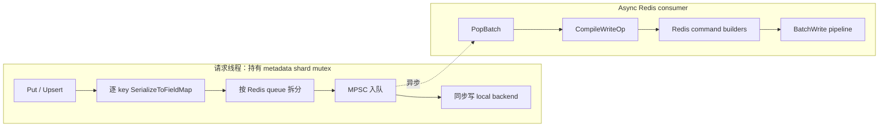
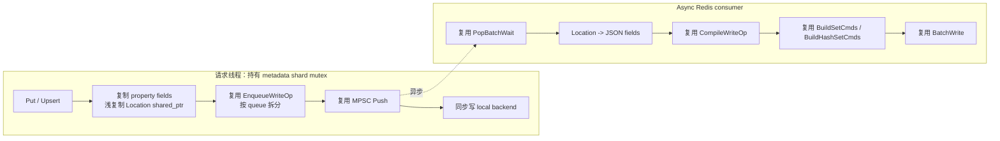

# MetaAsyncRedisBackend 消费者侧序列化优化设计

| 项目 | 内容 |
|---|---|
| 状态 | 设计完成，尚未开发 |
| 更新时间 | 2026-08-18 |
| 涉及模块 | `meta` |
| 核心目标 | 将 Async Redis 写入中的 `CacheLocation` JSON 序列化移出请求线程和 metadata shard mutex 临界区 |

本文档描述 `cached + persistent_type=async_redis + cache_type=local` 模式下的 Redis 写入优化。方案调整
`MetaAsyncRedisBackend` 队列负载、消费者命令编译过程和现有序列化函数的所有权接口，继续复用现有 queue 路由、
MPSC 队列、batch、barrier、Redis command builder 和 pipeline，不改变 `MetaStorageBackendManager`、local backend
或 Redis 数据格式。

## 1. 背景与现状

`MetaIndexer` 会按 metadata mutex shard 对写请求分批，并在持有 batch 对应 shard mutex 时调用
`MetaStorageBackendManager`。cached 模式下，manager 依次执行：

1. 调用 persistent backend；Async Redis 在请求线程序列化并入队。
2. 根据 persistent backend 返回的逐 key 错误码，同步更新 local backend。
3. 返回后释放 metadata shard mutex。

当前 `MetaAsyncRedisBackend::Put/Upsert` 在请求线程中逐 key 调用 `SerializeToFieldMap`。每个 Location 会执行
`CacheLocation::ToJsonString()`，同时创建 Redis field name、JSON string 和 `FieldMap` 节点。完成序列化后，
`EnqueueWriteOp` 再按 Redis queue 拆分 `WriteOp`。消费者出队后只负责添加 Redis key 前缀、构造命令并执行
pipeline。



这里的 Redis 网络 I/O 已经异步化，但最主要的编码开销仍位于请求临界区。Location 数量、spec 数量或 URI
长度增加时，JSON 序列化时间会线性增长，并延长同 shard 后续写请求的等待时间。

## 2. 目标与非目标

### 2.1 目标

1. `Put/Upsert` 请求线程不再执行 `CacheLocation::ToJsonString()`。
2. 消费者从队列取出 `WriteOp` 后完成 Location JSON 序列化。
3. Redis 最终命令、逐 key 顺序、queue 路由、barrier 和错误处理语义保持不变。
4. 尽量复用现有异步 Redis 链路和 `SerializeToFieldMap`，把改动限制在 `meta` 模块内部。
5. 队列拥有写入快照，调用方返回或销毁输入容器后，消费者仍可安全访问数据。
6. 避免为了延后序列化增加一次 property string 深拷贝。

### 2.2 非目标

本次不处理以下事项：

1. 不把 local backend 写入迁移到 Async Redis consumer。
2. 不修改 `MetaStorageBackendManager` 的 persistent-first、local-second 顺序。
3. 不新增 `async_max_bytes`，队列反压继续使用 key 数量。
4. 不调整 `async_queue_count`、`async_max_batch`、`async_wait_us` 等默认配置。
5. 不修改同步 `MetaRedisBackend`。
6. 不新增 Redis 命令格式、合并规则或 pipeline 重试机制。
7. 不新增消费者侧序列化指标；序列化耗时计入现有 `async_batch_flush_time_us`。
8. 不借此重构 MPSC 队列、barrier 或 RedisClient。

## 3. 方案比较

### 3.1 方案一：WriteOp 保存结构化快照，消费者原地补齐 Redis fields（推荐）

生产者把 properties 复制到现有 `field_maps`，并额外保存 `CacheLocationMapVector`。properties 本身已经是
Redis 可直接使用的 string fields，不需要 JSON 编码；消费者把 property map move 给 move-aware
`SerializeToFieldMap`，补齐 `L#<location_id> -> JSON` 后继续复用现有 command builder。

优点：

- JSON 序列化完整移出请求线程。
- 只保留一份 Location/property 合并实现，不在 Async Redis 内新增重复 helper。
- 保留现有 `field_maps`、`CompileWriteOp` 和 RedisClient builders，改动集中。
- property 在生产者侧只复制一次，与当前 `SerializeToFieldMap` 的 property copy 次数一致。
- queue 拆分仍通过 move 转移各 key 的负载。

代价：

- `WriteOp` 在出队前会持有 Location map 节点、location id 和 shared_ptr。
- 消费者编译命令时同时短暂持有结构化 Location、JSON fields 和最终命令，需及时释放已经编译的负载。

### 3.2 方案二：WriteOp 分别保存 locations + properties，不调整 serializer 所有权接口

`WriteOp` 不保留 `field_maps`，而是新增并分别保存完整 `locations/properties`。消费者构造临时 `FieldMapVec`，
再调用只接受 const reference 的原有 `SerializeToFieldMap` 和现有 builders。

优点是数据模型直观。缺点是需要为 `WriteOp` 新增 property payload；properties 为了队列所有权已经复制过一次，
消费者构造 `FieldMap` 时还会再深拷贝一次 property key/value。与方案一相比代码和运行时开销都更大，不采用。

### 3.3 方案三：共享 batch payload，sub-op 只保存下标

先构造一个不可变的 batch payload，各 queue 的 `WriteOp` 保存 `shared_ptr` 和下标列表。这样可以避免按 queue
拆分 Location/property 容器，但消费者需要通过间接索引读取跨 queue 共享对象，并引入新的共享生命周期和
数据结构。

该方案更适合后续专门优化超大 batch 的队列拆分开销；本次目标是最小改动，不采用。

## 4. 推荐方案总体设计



请求线程仍需建立可独立存活的队列快照，但只执行：

- key vector 复制；
- property map/string 复制；
- Location map 节点和 location id 复制；
- `shared_ptr<const CacheLocation>` 引用计数增加；
- queue 路由、容量等待和入队。

`CacheLocation::ToJsonString()`、Location Redis field name 构造和 JSON field 插入全部移动到 consumer。

## 5. 数据结构调整

### 5.1 WriteOp

在现有 `WriteOp` 中增加 Location 结构化负载：

```cpp
struct WriteOp {
    WriteOpType type;
    KeyTypeVec keys;

    // kPut/kUpsert：生产者阶段只包含 properties；消费者补齐 location fields。
    FieldMapVec field_maps;
    CacheLocationMapVector locations;

    // kDeleteLocations 保持现状。
    std::vector<std::vector<std::string>> field_names_vec;
};
```

各操作的有效负载约束如下：

| 操作 | `keys` | `field_maps` | `locations` | `field_names_vec` |
|---|---:|---:|---:|---:|
| Put | N | N | N | 0 |
| Upsert | N | N | N | 0 |
| Delete | N | 0 | 0 | 0 |
| DeleteLocations | N | 0 | 0 | N |

`Put/Upsert` 即使某个 key 没有 property 或 Location，对应 vector 也必须保持 N 个元素，以维持逐 key 对齐。
这是 `MetaStorageBackend` 接口和 `BatchMetaData` 已保证的内部不变量；`MetaAsyncRedisBackend` 不重复执行
shape 校验，queue 拆分也不增加操作类型或空 vector 的冗余判断。

### 5.2 数据所有权

`WriteOp` 必须拥有所有可能晚于请求生命周期访问的数据：

- keys、location id、property key/value 由队列容器持有；
- Location value 使用现有 `shared_ptr<const CacheLocation>` 共享不可变对象；
- 不保存对 `BatchMetaData`、调用方 vector、map 或 `RequestContext` 的引用、裸指针或 `string_view`。

`CacheLocationConstPtr` 是当前 local/Redis 元数据链路已经使用的不可变值契约。本方案只延长其共享生命周期，
不允许通过其他 mutable alias 并发修改同一个 `CacheLocation`；这种修改在当前 local backend 中同样不安全。

## 6. 详细数据流

### 6.1 生产者 Put/Upsert

`MetaAsyncRedisBackend::Put/Upsert` 调整为：

1. 设置 `WriteOpType`。
2. 复制 keys。
3. 将 properties 复制到 `op.field_maps`，形成调用时刻的 property 快照。
4. 复制 `CacheLocationMapVector`；其中 Location value 只增加 immutable shared_ptr 引用。
5. 调用现有 `EnqueueWriteOp`。

生产者直接完成容器赋值，不增加逐 key 转换循环：

```cpp
op.keys = keys;
op.field_maps = properties;
op.locations = locations;
```

生产者不再调用 `SerializeToFieldMap`，也不再设置 Async Redis 请求级 `index_serialize_time_us`。
上层已经保证三个输入 vector 逐 key 对齐，此处不增加重复 shape 校验。

properties 保留在生产者侧复制的原因不是提前做 JSON 序列化，而是队列必须拥有稳定数据；property 本身已经是
目标 Redis field 的 string key/value。Location JSON 才是需要从临界区移走的重计算和大字符串分配。

### 6.2 queue 拆分

继续使用现有 `queue_to_indices` 和 `GetQueueIndexForKey`。创建 `sub_op` 时：

1. reserve keys。
2. 复用现有 `!op.field_maps.empty()` 分支，同时 reserve `field_maps` 和 `locations`。
3. 按原始 index 把 key、property fields 和 Location map move 到对应 `sub_op`。
4. 继续使用 `WaitForQueueCapacity` 和 `queues_[qi]->Push`。

Put/Upsert 的两个 vector 都为 N，Delete/DeleteLocations 的两个 vector 都为空，因此无需新增
`op.type`、`!op.locations.empty()` 或 size 判断：

```cpp
if (!op.field_maps.empty()) {
    sub_op.field_maps.reserve(indices.size());
    sub_op.locations.reserve(indices.size());
}
// ...
if (!op.field_maps.empty()) {
    sub_op.field_maps.push_back(std::move(op.field_maps[idx]));
    sub_op.locations.push_back(std::move(op.locations[idx]));
}
```

一个 queue 容量不足时，仍只把该 queue 对应的原始 key 标记为 `EC_TIMEOUT`。未被接受的 `sub_op` 由当前线程
析构；成功 queue 的数据和顺序不受影响。manager 根据返回错误码跳过失败 key 的 local 写入，现有一致性边界
不变。

### 6.3 消费者序列化与命令构建

`CompileWriteOp` 改为消费可变的 `WriteOp &`。现有 `SerializeToFieldMap` 的第二个参数从 const reference 改为
按值接收，使同一实现既能复制同步调用方的 property，也能接管异步消费者已经持有的 property map：

```cpp
FieldMap SerializeToFieldMap(const CacheLocationMap &locations, PropertyMap properties) {
    for (const auto &[loc_id, loc_ptr] : locations) {
        auto [it, inserted] = properties.try_emplace(PROPERTY_LOCATION_PREFIX + loc_id);
        if (inserted && loc_ptr) {
            it->second = loc_ptr->ToJsonString();
        }
    }
    return properties;
}
```

同步 Redis 继续以 lvalue properties 调用，仍只复制一次 property map；异步消费者逐 key move，避免第二次深拷贝：

```cpp
op.field_maps[i] = SerializeToFieldMap(op.locations[i], std::move(op.field_maps[i]));
```

随后保持现有行为：

- Put 调用 `RedisClient::BuildSetCmds`，产生每 key 的 `DEL`，非空 fields 再产生 `HSET`。
- Upsert 调用 `RedisClient::BuildHashSetCmds`，空 fields 继续是 no-op。
- Delete 和 DeleteLocations 分支不变。

`try_emplace` 保证 property field 与 `L#<location_id>` 冲突时仍由 property 获胜，并避免为最终会被覆盖的 Location
构造无用 JSON。null Location 插入的默认 string 为空，保持当前 Redis value 语义。

命令构建完成后，立即 clear 已消费的 `locations` 和 `field_maps`。`BatchFlush` 已在调用前累计
`segment_key_count`，Redis `CmdArgs` 也拥有自己的 string，因此释放 `WriteOp` 负载不会影响 barrier 统计或 pipeline。
这样可以避免已编译 item 的结构化 payload 一直保留到整个 batch flush 结束。

### 6.4 barrier、Sync 和关闭

本方案不改变以下顺序：

```text
WriteOp(s)
  -> consumer serialization
  -> command range
  -> SyncBarrierItem records preceding command range
  -> BatchWrite
  -> command range 全部成功后 Fence
```

因此：

- `Sync(keys)` 仍等待 barrier 之前已入队写入完成 Redis pipeline。
- 部分 pipeline 失败仍按现有 command segment 判断对应 barrier 成功或失败。
- `Close()` 仍先通知 consumer，再由 `DrainQueue` 在 deadline 内编译并刷写剩余 item。
- drain timeout 丢弃 item 时，结构化 payload 随 queue node 一起释放。

## 7. 正确性与兼容性

### 7.1 Redis 数据语义

优化前后的最终命令必须逐字符串一致：

- key prefix 不变；
- Location field name 仍为 `L#<location_id>`；
- null Location 仍序列化为空字符串；
- Location JSON 继续调用同一个 `CacheLocation::ToJsonString()`；
- property 覆盖同名内部 field 的最终行为不变；
- Put、Upsert、Delete 和 DeleteLocations 命令类型与顺序不变。

### 7.2 快照一致性

生产者在 `Put/Upsert` 返回前完成容器快照：

- 调用方之后修改或销毁 keys、maps、property strings 不影响队列。
- local backend 和 Redis queue 共享相同的 immutable Location value，不复制或重新构造 Location。
- local backend 采用 shared_ptr replacement 更新值，不会原地修改已经入队的 Location。

这保证 Redis consumer 晚于请求返回执行时，仍写入该次操作接受时的逻辑值。

### 7.3 错误语义

Location JSON 序列化当前没有业务错误返回值；主要失败来源是内存分配异常。现有生产者序列化和 consumer
command 构建均未提供可恢复的 allocation failure 语义，本次不扩大范围增加 per-key serialization error。

以下错误路径保持现状：

- queue capacity timeout：原始 key 返回 `EC_TIMEOUT`；
- Redis pipeline 失败：累计 `pipeline_error_count`，barrier 按 segment 失败；
- consumer 关闭 drain 超时：剩余 write op 被统计并丢弃。

payload shape 继续由现有上层接口契约保证，本方案不在 Async Redis 下层新增重复错误路径。

## 8. 性能与内存分析

### 8.1 请求临界区收益

优化前，请求线程承担：

```text
Location JSON 序列化
+ Location Redis field/string 分配
+ property fields 复制
+ queue 拆分和入队
+ local backend 写入
```

优化后，请求线程承担：

```text
Location map/location id 浅快照
+ immutable shared_ptr 引用增加
+ property fields 复制
+ queue 拆分和入队
+ local backend 写入
```

收益主要来自移除 `ToJsonString()`、JSON buffer 和 Location Redis field value 的分配。Location spec 越多、
URI 越长，预期收益越明显。property-only 或空 Location 请求没有可迁移的 JSON 开销，只要求不出现可观回退。
实际百分比依赖 payload，不在没有 benchmark 数据时给出固定承诺。

### 8.2 消费者吞吐

序列化进入 consumer 后会增加 `BatchFlush` 的 CPU 时间，但可以利用现有多个 Redis consumer thread 并行处理
不同 queue。风险是 consumer 处理速度低于生产速度时 queue depth 上升，最终触发既有 key-count backpressure。

本次不增加 `async_max_bytes`。上线评估必须观察：

- `max_async_queue_size`、`avg_async_queue_size`；
- `async_batch_flush_time_us`；
- `async_flush_key_count`；
- `async_pipeline_error_count`；
- 请求侧 `put_io_time_us/upsert_io_time_us` 和 metadata `lock_wait_time_us`。

`lock_wait_time_us` 只统计获得 metadata shard mutex 的等待，不直接统计持锁时间。持锁时间下降会在并发压测中
间接体现为等待下降，单请求测试应同时观察 backend I/O 时间。

### 8.3 内存变化

队列中不再提前保存 Location JSON，而是保存 Location map 节点、id 和 immutable shared_ptr。对于包含较大 JSON
的 Location，排队阶段通常减少内存；但消费者编译当前 item 时会短暂同时持有结构化 Location、序列化 fields 和
最终 Redis commands。

通过每编译一个 `WriteOp` 就释放其结构化 payload，峰值限制为：

```text
尚未编译 items 的结构化 payload
+ 当前 item 的结构化 payload和序列化 fields
+ 已构造的 Redis commands
```

队列仍按 key 数限制；超大单 key payload 的内存风险与当前按 key 计数的队列模型一致，本次明确不引入字节配额。

## 9. 指标语义

Async Redis 不再在请求线程设置 `index_serialize_time_us`。该指标继续适用于同步 Redis 写入，但不能再表示
Async Redis 的消费者序列化耗时。

`BatchFlush` 的计时从 command compile 之前开始，因此消费者序列化自动包含在现有
`async_batch_flush_time_us` 中。本次不新增独立的 async serialization metric，避免扩展
`AsyncWriteStats`、CacheManager instance metrics 和各 reporter。

`async_enqueue_time_us` 继续只覆盖 `EnqueueWriteOp` 内的 queue 分组、容量等待和 push，不包含进入该函数之前的
结构化快照复制。完整请求侧开销仍可由外层 `put_io_time_us/upsert_io_time_us` 观察。

## 10. 代码影响范围

预计修改：

| 文件 | 修改内容 |
|---|---|
| `meta/mpsc_write_queue.h` | `WriteOp` 增加 `CacheLocationMapVector locations`，明确各操作 payload invariant |
| `meta/meta_async_redis_backend.h` | `CompileWriteOp` 改为消费可变 `WriteOp` |
| `meta/meta_async_redis_backend.cc` | Put/Upsert 建立结构化快照；queue 拆分移动 locations；consumer move property 后调用现有 serializer |
| `meta/utils.h`、`meta/utils.cc` | `SerializeToFieldMap` 改为按值接收 properties，并通过 `try_emplace` 保持覆盖语义 |
| `meta/test/meta_async_redis_backend_test.cc` | 增加消费者序列化等价性、冲突和快照生命周期覆盖 |

明确不修改：

- `MetaStorageBackendManager`；
- `MetaLocalBackend` 和 LRU cache；
- `RedisClient` command builder/pipeline；
- `MetaStorageBackend` 公共虚接口；
- 配置类和 metrics reporter；
- 模块依赖方向，因此无需更新模块架构图。

## 11. 测试方案

### 11.1 单元测试

只新增覆盖本次行为变化的测试：

1. Put/Upsert：Location + property 经消费者延迟序列化后，生成的命令与改造前一致。
2. property 与 `L#<location_id>` 同名时 property 获胜。
3. Put/Upsert 返回后销毁或修改输入容器，再调用 `Sync`，consumer 仍写入接受时的快照。

Delete/DeleteLocations、multi-queue 顺序、Sync barrier、partial pipeline failure、backpressure 和 Close/drain 已有测试
继续作为回归覆盖，不为未改变的逻辑增加重复测试。

### 11.2 回归测试

至少运行：

```text
meta_async_redis_backend_test
meta_redis_backend_test
meta_storage_backend_manager_test
meta_storage_backend_manager_real_redis_test（环境具备 Redis 时）
meta_indexer_test
```

### 11.3 性能验证

使用相同 key 数、Location/spec 数量和 URI 长度，对比改造前后：

1. Async Redis `Put/Upsert` 生产者调用耗时 p50/p95/p99。
2. 多线程写同 metadata shard 和随机 shard 的吞吐及 `lock_wait_time_us`。
3. `max/avg_async_queue_size` 是否持续上升。
4. `async_batch_flush_time_us` 增幅是否被 consumer 并行度吸收。
5. 进程 RSS 和 queue 满载时的内存峰值。
6. `Sync` 延迟和 pipeline 错误率是否回归。

验收标准：

- Redis commands 和读回数据无差异；
- 包含非空 Location JSON 的负载下，请求侧 Put/Upsert 耗时和并发 shard lock wait 下降；
- property-only 或空 Location 负载不出现可观性能回退；
- 稳态 queue depth 不持续增长；
- flush throughput、Sync 正确性和 pipeline error rate 不回归；
- 无新增配置即可上线，必要时只使用已有 `async_queue_count/async_max_batch` 调优。

## 12. 实施顺序与回滚

建议按以下顺序实施：

1. 将 `SerializeToFieldMap` 改为 move-aware 的按值接口，并验证同步 Redis 语义不变。
2. 扩展 `WriteOp` payload，沿用上层已经保证的 shape invariant。
3. 修改 Put/Upsert 生产者，保存 properties 和 locations 快照，停止执行 Location JSON 序列化。
4. 复用现有 queue fan-out，通过同一个 `field_maps` 分支 reserve/move locations。
5. 在 consumer compile 阶段调用现有 serializer 补齐 Location fields，并及时释放 payload。
6. 增加三类针对性单元测试，运行现有回归测试和基准测试。

方案没有配置或持久化格式变更。若性能或内存结果不符合预期，回滚上述代码即可恢复生产者序列化；Redis 中
已有数据、queue 路由、Sync barrier 和 local cache 均不需要迁移。
