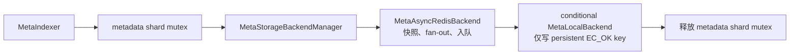
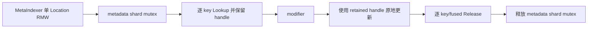
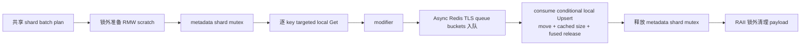

# Local Metadata Get/RMW 热路径优化设计

| 项目 | 内容 |
|---|---|
| 状态 | 设计完成，待开发 |
| 更新时间 | 2026-08-18 |
| 涉及模块 | `meta`、`common/cache` |
| 目标负载 | LRU shard 数 `2^15 = 32768`；随机 key；查询 1K～10K key；RMW 内部 batch 通常约 128 key |
| 核心目标 | 区分 `async_redis + local` 与纯 local 链路，在不改变一致性和容量语义的前提下减少 Get 分配、RMW metadata mutex 持锁时间及 local LRU 锁开销 |

本文只优化现有 `MetaIndexer -> MetaStorageBackendManager -> MetaLocalBackend / MetaAsyncRedisBackend` 链路，
不新增 backend 类型、运行时配置或平行 RMW 框架。消费者侧 Redis 序列化继续遵循
[MetaAsyncRedisBackend 消费者侧序列化优化设计](meta_async_redis_consumer_serialization.md)。

## 1. 链路边界

### 1.1 Async Redis + Local

配置形态为 `persistent_type=async_redis + cache_type=local`：



该模式的通用 Location RMW 使用 targeted Get，读取指定 `(key, location_id)`；它不调用
`GetLocationValuesCompact`。写入严格保持 persistent-first、local-second，Async Redis 入队失败的 key 不得写 local。

### 1.2 纯 Local

配置形态为单 `persistent_type=local`、没有 cache backend。ReportEvent 的单 Location RMW 可以走已有
retained-handle fast path：



纯 local 没有 Redis 快照、queue fan-out、persistent/local 双写和 Recover fallback。它已经有 request-local scratch、
retired Location 锁外析构和 retained handle 复用，本设计只修正其不适合 32768 shard 的 dense LRU 操作及重复的
metadata shard 分组，不重新实现这条 fast path。

### 1.3 两种模式共享的 Local 查询

`GetHostCacheState` 等 value-only 查询最终都读取 `MetaLocalBackend`：

- 纯 local 直接读取 local persistent backend；
- cached Running 读取 local cache backend；
- cached Recover 必须保留 cache miss 回源 Redis 的逻辑。

compact 输出属于查询数据布局优化，逐 key LRU Lookup/Release 属于 local cache 实现优化；两者会同时影响纯 local 和
cached Running。Recover 路由只属于 cached 模式。

## 2. 当前热点与适用范围

| 热点 | Async Redis + Local | 纯 Local | 共享组件 |
|---|---:|---:|---:|
| value-only Get 的 N 个小 vector | 是 | 是 | `MetaLocalBackend` compact Get |
| 通用 targeted RMW Get 使用 dense LookupBatch | 是，主要目标 | 通常由单 Location fast path绕过 | `MetaLocalBackend` targeted Get |
| conditional local Upsert 复制/锁开销 | 是 | 否 | local merge/LRU primitive 可复用 |
| retained-handle 单 Location RMW dense lookup/release | 否 | 是 | local/LRU primitive 可复用 |
| Async Redis queue fan-out 分配 | 是 | 否 | `MetaAsyncRedisBackend` |
| 通用 RMW 临时容器和临时 MetricsRegistry | 是 | 单 Location fast path已单独优化 | `MetaIndexer` 通用 RMW |
| metadata shard 分组 | 是 | 是，当前有另一份 dense 实现 | `MetaIndexer` batch plan |

临时 MetricsRegistry 在获取 metadata mutex 之前创建，删除它降低的是整个请求的构造、注册和堆分配开销，不直接
缩短 mutex 临界区。RMW batch 临时容器、Async Redis fan-out 和 local conditional Upsert 才位于临界区内。

## 3. 为什么不使用当前 dense LRU Batch

随机 key 在 `S` 个 shard 中落入的期望非空 shard 数为：

```text
E[occupied] = S * (1 - (1 - 1/S)^N)
```

当 `S=32768` 时：

| key 数 N | 期望非空 shard | 相比逐 key最多减少的加锁次数 |
|---:|---:|---:|
| 128 | 127.752 | 0.194% |
| 1,000 | 984.910 | 1.509% |
| 10,000 | 8,618.299 | 13.817% |

当前 dense `LookupBatchWithScratch/ReleaseBatchWithScratch` 需要准备并扫描与 32768 shard 等长的数组。RMW 内部
batch 约 128 key 时几乎没有锁合并收益，compact 查询的实际 chunk 也远小于 shard 数。因此本设计覆盖的以下路径
全部使用逐 key LRU 操作：

1. value-only compact Get；
2. Async Redis + Local 的通用 targeted RMW Get；
3. Async Redis + Local 的 conditional Upsert；
4. 纯 local 单 Location retained-handle RMW。

本次不改通用 `MetaLocalBackend::Upsert` 的 unconditional dense fast path。该接口主要影响纯 local 的其他写入形态，
还包含 duplicate、all-hit、all-miss、mixed 和严格容量顺序语义，需要独立基准和设计，不能附带在 cached conditional
Upsert 优化中修改。

metadata shard 分组与 dense LRU Batch 不同：它不获取 LRU shard 锁，并且必须输出升序 shard。本设计通过 bitset
枚举替代 map/dense vector，不恢复 sort packed pair 或运行时自适应 sort 分支。

## 4. 目标、非目标与不变量

### 4.1 目标

1. 将通用 RMW 中可预分配、可复用的 MetaIndexer 临时容器操作移出 metadata mutex。
2. value-only Get 直接输出 `CompactLocationsPerKey`，同时保持逐 key LRU Lookup/Release。
3. 通用 targeted RMW Get 和纯 local 单 Location RMW 不再使用 dense LRU Batch。
4. 降低 cached conditional local Upsert 的 map/string 复制、内存统计、时钟和 LRU shard 锁开销。
5. 以最小改动优化 Async Redis queue fan-out 分配。
6. 删除通用 RMW 的临时 MetricsRegistry/Collector/RequestContext。
7. 复用一个 metadata shard batch plan 优化通用 `MakeBatches` 和纯 local 单 Location分组。

### 4.2 非目标

1. 不把 local 写迁移到 Async Redis consumer。
2. 不改变 persistent-first、local-second、逐 key错误过滤或 Recover fallback。
3. 不修改 Redis command、序列化格式、barrier、pipeline 或重试策略。
4. 不新增 `async_max_bytes`、动态阈值、backend 枚举或其他配置。
5. 不修改通用 unconditional local Upsert 的 dense fast path。
6. 不为了完全消除小 vector 分配而给所有 backend 增加一组 `Into` 虚接口。
7. 不删除与本次热点无关的既有校验或重构整个 local backend。

### 4.3 必须保持的不变量

- 一个 RMW batch 从读取旧值、modifier 到所有同步写阶段完成，始终由相同 metadata shard mutex 保护。
- cached 写入先得到 Async Redis 逐 key入队结果，local 只消费 `EC_OK` entry。
- queue 内原请求顺序不变；不同 queue 之间仍不承诺全局顺序。
- `MakeBatches` 按 metadata shard 升序输出，同 shard 内保持请求顺序，一个 shard 整体加入后再检查软上限。
- 成功 Lookup 的 handle 必须且只能 Release 一次；retained handle 在写入或失败退出前一直有效。
- item shared/unique mutex 的保护范围和严格容量下的 hit/miss 请求顺序不变。
- Recover 状态不进入并发纯 local compact 快路径。
- `CacheLocationConstPtr` 发布后不可变；内存估算缓存不能掩盖可变对象的 size 变化。

## 5. 总体设计

### 5.1 Async Redis + Local RMW



### 5.2 纯 Local 单 Location RMW


两条链路只共享 batch plan、local item helper 和 LRU primitive，不共享 Redis payload、Recover 状态或 retained-handle
生命周期。

## 6. 详细设计

### 6.1 通用 RMW scratch 生命周期

**适用链路：** Async Redis + Local 的 `ReadModifyWriteBlock/ReadModifyWriteLocationImpl`，以及其他仍走通用 RMW 的
backend 组合。纯 local 单 Location fast path已经采用独立 scratch，不套第二层通用 scratch。

为 block RMW 和通用 Location RMW 分别增加函数内 request-local scratch。两条路径 payload 不同，不合并成带大量
optional 字段的大对象。scratch 只容纳 MetaIndexer 自己拥有的：

- read locations/location ids、key status 和错误码；
- upsert/delete `BatchMetaData`；
- global index、existing-update position 和 key-level state；
- backend 返回 vector 的最终所有权，用于将析构推迟到锁外。

处理顺序：

1. 根据最大内部 batch 在第一次加锁前 reserve 已知容量。
2. 每轮锁前只准备逻辑长度和已知 inner vector capacity，不重复 clear 已为空的容器。
3. cleanup guard 必须先于 `ScopedBatchLock` 构造。
4. 任意正常返回、错误分支或 `continue` 都先析构 lock，再由 guard 清理 payload。
5. guard 逐项 clear 并保留可复用 capacity；对 `vector<vector<T>>` 清理内层元素，不能直接销毁整个外层后声称保留了
   inner capacity。

```cpp
RmwScratch scratch;
scratch.Prepare(max_batch_size);

for (auto &batch : batches) {
    scratch.PrepareForBatch(batch);       // 锁外，仅准备容量/逻辑长度
    ScratchResetGuard reset_guard(scratch); // 先构造
    ScopedBatchLock lock(*this, batch.batch_shard_indexs, &stats.lock_wait_time_us);

    // 原有 read -> modifier -> ExecuteRmwUpsert/Delete；允许 continue。
} // lock 先释放，reset_guard 再 clear
```

现有 backend 接口返回 `std::vector` by value，因此 vector storage 仍可能在 backend 调用中分配。结果可 move 给 scratch
使其 payload 析构发生在锁外，但本设计不为几十到约 128 个 ErrorCode 增加贯穿所有 backend 的 `Into` overload。
modifier 根据当前值创建 map/string/CacheLocation 的分配同样必须留在锁内。本项只优化可预知的 request-shaped
分配和非必要析构，不宣称消除临界区内全部 allocation。

`unique_put_keys` 不在第一阶段引入自定义 flat set 或 arena。内部 batch 通常约 128 key，先保留现有语义并通过 profile
确认占比；不能仅调用 `unordered_set::reserve()` 就宣称节点分配已经移出锁。

### 6.2 value-only compact Get：两种模式共享

**适用链路：** 纯 local 查询和 cached Running 查询。**不适用：** targeted RMW Get。

保留 `CompactLocationsPerKey::{offsets, values}`，将 `MetaLocalBackend::GetLocationValuesCompact` 改为逐 key：

```text
out.Clear(key_count, key_count)
access_time_us = now()
for key in keys:
    handle = cache.Lookup(key)
    if miss:
        result = EC_NOENT
        out.FinishKey()
        continue
    读取旧 access time，TouchAccessTime(access_time_us)
    item shared_lock 下 append location shared_ptr 到 out.values
    cache.Release(handle)
    out.FinishKey()
ObserveBatch(revisit_intervals)
```

不再创建 `key_views`、全量 `handles` 或 `Cache::BatchOperationScratch`，也不调用 dense
`LookupBatchWithScratch/ReleaseBatchWithScratch`。一个 backend chunk 共用 timestamp，revisit interval 继续先读取旧值
再批量 Observe。

manager 路由保持：

- 无 cache：调用 persistent backend；
- cached + Recover：继续现有 cache miss 回源和结果合并；
- cached + Running：直接调用 cache backend 的 compact 虚接口，不先构造 `KeyVector/LocationsPerKey` 再转换。

`SupportsConcurrentLocationValueReads()` 可在 cached、Running 且 cache 为生产 `MetaLocalBackend` 时返回 true。
`SupportsSingleLocationRmw()` 必须改为独立的 pure-local 精确类型判断，不能因扩展并发查询能力让 cached 模式误入
retained-handle RMW。

普通返回 `LocationsPerKey`、`CacheLocationMap` 或 property 的 Get 不宣传 compact 收益；如果调用方最终仍要 N 个
vector/map，compact 后再次物化只会增加一次转换。

### 6.3 Async Redis + Local 的 targeted RMW Get

**适用链路：** cached 模式的通用 `ReadModifyWriteLocationImpl`。**主要影响：** 约 128-key 内部 batch 的读半程。

当前实际调用链是：

```text
MetaIndexer::ReadModifyWriteLocationImpl
  -> MetaStorageBackendManager::GetLocations[WithKeyStatus]
  -> MetaLocalBackend::GetLocationsWithKeyStatus
```

该路径读取指定 location id，不能复用 all-location compact Get。修改 local targeted 实现：

1. batch 共用一个 `access_time_us`。
2. 每个 key 执行一次 `Lookup`；miss 直接填充该 key 的位置化 EC_NOENT/null 输出。
3. hit 时在 item shared mutex 下逐 requested id 查找，保持每个 id 的输入位置和错误码。
4. 立即逐 key Release，不保存全 batch handle，不调用 LookupBatch/ReleaseBatch。
5. manager 的 Recover fallback、ambiguous all-NOENT key-existence 判断和 persistent 结果合并保持不变。

Block RMW 使用 `GetLocationIds`，当前已经逐 key Lookup/Release，不增加另一套 helper。生产 pure-local 单 Location RMW
走 6.5 的 retained-handle 路径；其他直接调用 local targeted API 的场景会同步获得逐 key实现，但不改变返回语义。

### 6.4 Async Redis + Local 的 consume conditional Upsert

**适用链路：** persistent backend 已完成同步序列化或异步快照之后的 cached local 写。**不适用：** 单 backend
pure-local 写。

在 `MetaCacheBaseBackend` 增加一个有默认实现的内部能力：

```cpp
virtual std::vector<ErrorCode> UpsertConsume(
    RequestContext *request_context,
    const KeyTypeVec &keys,
    CacheLocationMapVector &locations,
    PropertyMapVector &properties,
    const std::vector<ErrorCode> &previous_error_codes) noexcept;
```

默认实现转发现有 const conditional `Upsert`，因此 dummy backend、decorator 和测试 backend 无需新增实现。
`MetaLocalBackend` 覆盖后只消费 `previous_error_codes[i] == EC_OK` 的 entry；失败 entry 不访问、不 move。

manager 仍先调用 persistent backend。Async Redis 此时已经持有独立 properties/location shared_ptr 快照，成功 entry
的原 BatchMetaData payload 不再被后续读取，因此 local 可以：

- miss：move 整个 `CacheLocationMap/PropertyMap` 到现有 rvalue `MetaMemCacheItem::Create`；
- hit + 新字段：使用 C++17 node handle 尽量复用 map node/key/value string；
- hit + 已有字段：保留 item 的 key node，把新 value move/swap 进 item，并把旧 shared_ptr/string 交换回输入 node；
- duplicate key：继续按原请求顺序逐 key merge；
- mixed hit/miss：继续保持严格容量下的原顺序。

copy 和 consume 入口共用一个 merge 核心，不复制两份字段遍历、charge 或错误处理代码。conditional Upsert 不增加
duplicate 检测、LookupBatch 或 shard_count 判断；上层已经决定逐 key顺序。

交换回输入 node 的旧 Location/property 由上层 BatchMetaData/RMW scratch 持有，等 metadata mutex 释放后统一
clear，避免替换字段时在 item mutex 和 metadata mutex 内析构大 URI/string。该 consume 接口只用于
BatchMetaData owner 在加锁前构造、并在解锁后清理 payload 的 manager 调用链；普通 const Upsert 不改变所有权和
析构时机。

### 6.5 纯 Local 单 Location retained-handle RMW

**适用链路：** `SupportsSingleLocationRmw()` 为真的单 local backend。**不适用：** Async Redis + Local。

继续复用现有：

- `SingleLocationRmwScratch`；
- read handle 跨 modifier 保留；
- `CacheLocationViewVector` borrowed view；
- skipped hit 在插入 miss 之前释放；
- `retired_locations` 在 metadata mutex 外析构；
- capacity、key 顺序和 created-key 统计。

只替换 dense LRU 操作：

1. `GetSingleLocationsWithKeyStatusIntoImpl` 逐 key `Lookup` 并把 handle 放入现有 scratch。
2. retain_handles=true 时继续保留到匹配的 Upsert；不在读结束 Release。
3. 被 modifier skip 的 handle 仍按当前顺序逐 key Release，并在 scratch 中置 null。
4. hit 更新使用 6.7 的 fused charge/release，并立即把对应 scratch handle 置 null。
5. miss 保持现有 CreateAndInsert；失败路径逐 key释放尚未消费的 handle。
6. `ReleaseRetainedHandles` 改为遍历非空 handle 逐个 Release，不再调用 dense ReleaseBatchWithScratch。

`UpsertSingleLocationsInto` 若仍使用同一个 `SingleLocationRmwScratch`，同步改为逐 key Lookup/Release，之后可以从该
scratch 删除 `Cache::BatchOperationScratch`。不新增第二个 pure-local scratch 或 adaptive dense 分支。

### 6.6 CacheLocation 内存估算缓存：共享 Local primitive

**适用链路：** 两种模式中所有调用 `EstimateMemUsage` 的 local update/delete。Async Redis 本身不依赖该缓存。

在 `CacheLocation` 增加不序列化的 `mutable std::atomic<size_t>`，使用三个状态：

```text
0               = unknown，可在下一次 Estimate 后缓存
1               = uncacheable，每次 Estimate 都重新计算
大于 1 的值      = 已缓存的实际内存估算
```

规则：

1. `set_id`、`push_location_spec`、`set_location_specs` 和 `FromRapidValue` 在当前状态不是 uncacheable 时将其置为
   unknown；uncacheable 对象的状态在其生命周期内必须保持 sticky，因为旧 mutable reference 仍可能继续修改对象。
2. `mutable_location_specs()` 返回可长期持有的 mutable reference，必须将对象永久标记为 uncacheable；仅在返回时置
   unknown 会允许“Estimate 后通过旧 reference 再修改”产生陈旧 charge。
3. Estimate 对 cached 状态直接 relaxed-load 返回；unknown 时计算并 relaxed-store；uncacheable 时计算但不写回。
   多线程首次读取写入相同确定值，不需要 CAS。
4. copy 构造的新对象没有旧 mutable reference，可从 unknown 开始；move 构造后旧 reference 可能仍指向被转移的
   vector storage，目标对象继承 uncacheable。
5. copy assignment 的目标若已 uncacheable 必须继续保持，否则置 unknown；move assignment 只要源或目标任一方为
   uncacheable，目标就保持 uncacheable。这样赋值不会让目标对象已有的 mutable reference 绕过失效。
6. status、type、spec_size、create_time 不影响当前公式，不做冗余失效。

缓存只减少 specs/name/URI 遍历，不改变现有 charge 公式和共享 CacheLocation 的计费语义。

### 6.7 fused charge/release 与 batch timestamp：共享 Local/LRU primitive

**适用链路：** cached conditional Upsert、纯 local retained-handle Upsert，以及已有“AdjustCharge 后立即 Release”的
local update/delete 路径。

在 `Cache` 增加默认能力：

```cpp
virtual bool AdjustChargeAndRelease(Handle *handle, ssize_t delta) {
    if (delta != 0) {
        AdjustCharge(handle, delta);
    }
    return Release(handle);
}
```

其他 cache 无需修改。`LRUCache/LRUCacheShard` 覆盖为一次 shard mutex，并让普通 Release 和 fused Release 共用一个
内部 release helper，保持 Unref、LRU reinsertion、capacity、erase 和锁外 deleter 语义。不能只包裹两个公开调用却
仍加两次锁。

local item merge helper返回 `{ErrorCode, charge_delta}`，调用方在不再需要 handle 时统一执行 fused Release：

```text
Lookup（一次 LRU shard 锁）
  -> item unique_lock 下 merge 并计算 delta
  -> AdjustChargeAndRelease（一次 LRU shard 锁）
```

同一 primitive 同步用于 `DeleteLocationsForOneKey` 等已经计算 delta 后立即 Release 的路径，避免新增 API 只服务一处。
retained handle 如仍需跨 modifier 存活，只有在最终消费时才能 fused Release。

本次保留的 unconditional dense Upsert 在完成全部 update 前仍持有整批 handle，不能强行逐 key fused Release。它可
复用返回 delta 的 merge 核心，但继续按原顺序执行 AdjustCharge 和最终 ReleaseBatch，避免改变 all-hit/mixed 的容量和
LRU 时序；这也是 conditional/pure-local fast path 与通用 unconditional 路径必须分开的边界。

每次 local Put/Upsert/conditional Upsert 入口共用一个 `access_time_us`，传给逐 key helper 并复用现有单调
`TouchAccessTime(access_time_us)`。LRU 链表次序仍由逐 key Lookup/Release/Insert 顺序决定。

### 6.8 Async Redis queue fan-out：仅 Async Redis

**适用链路：** `MetaAsyncRedisBackend` 的 Put/Upsert/Delete/DeleteLocations；是否配置 local cache 不影响 fan-out
自身，但只有 cached RMW 会把它放在 metadata mutex 内。

保持 `GetQueueIndexForKey`、`WaitForQueueCapacity`、sub-op move 和 MPSC Push，只把当前 request-local
`unordered_map<int, vector<size_t>>` 换成 producer thread-local queue buckets：

```cpp
thread_local std::vector<std::vector<size_t>> queue_indices;

queue_indices.resize(queue_count_);
for (auto &indices : queue_indices) {
    indices.clear();
}
for (size_t i = 0; i < op.keys.size(); ++i) {
    queue_indices[GetQueueIndexForKey(op.keys[i])].push_back(i);
}
```

随后按 queue id 顺序遍历非空 bucket，完全复用现有 sub-op reserve/move、timeout error 回填和 Push。每个 bucket 的
capacity 在线程内跨请求复用，去掉 unordered_map 节点；不增加 counts、offsets、cursors、queue_ids、stable scatter
和 occupied queue 容器。

同一 bucket 按输入顺序 push index，queue 内语义不变。跨 queue 原本没有全局顺序保证。函数同步且不递归，不增加
lease、mutex 或 reentrancy 判断。队列满时 `WaitForCapacity` 仍可能成为绝对热点，本次不改变反压语义。

### 6.9 去掉通用 RMW 临时 MetricsRegistry

**适用链路：** 通用 block/location RMW，包括 Async Redis + Local。纯 local 单 Location fast path当前不创建这组
临时对象，因此不受影响。

通用 RMW 直接传原 `RequestContext`，不再创建临时 Registry、Collector 和 Context。当前相关 backend 只使用
context 中的 metrics collector，没有依赖临时 context 的错误或 span 状态。

复用原 `ServiceMetricsCollector` 时，每次子操作前将其可能覆盖的 gauge 置零，调用后立即读取并累加到现有
`RmwStats`，最终仍由 `EmitRmwMetrics` 写回聚合结果：

| 子操作 | 清零并读取 |
|---|---|
| read | `index_deserialize_time_us` |
| upsert | `index_serialize_time_us`、`async_enqueue_timeout_key_count`、`async_enqueue_time_us`、`cache_backend_upsert_time_us` |
| delete | `async_enqueue_timeout_key_count`、`async_enqueue_time_us`、`cache_backend_delete_time_us` |

dynamic cast 在 RMW 入口执行一次，helper 接收已解析 collector 指针，不重复 cast。消费者侧序列化的 Async Redis 不
写请求线程 serialize gauge，因此该值为 0；同步 Redis 等通用 backend 继续保留原指标。

### 6.10 metadata shard batch plan：两种模式共享

**适用链路：** 通用 `MakeBatches` 和纯 local `ReadModifyWriteSingleTargetLocations`。该优化发生在 metadata mutex 之外，
只降低 CPU、树节点/vector 分配和 allocator 竞争。

增加一个内部 `ShardBatchPlan`，只包含：

```cpp
struct ShardBatch {
    std::vector<int32_t> shard_indices;
    std::vector<int32_t> global_indices;
};
```

通用 `MakeBatches` 使用 plan 的 global index 填充 `BatchMetaData`；纯 local 单 Location RMW 直接使用 plan，不再维护
另一份 `vector<vector<int32_t>>(mutex_shards_.size())` 分组实现。

plan builder 使用 thread-local 稀疏链表 + occupied bitset：

```cpp
struct ShardBatchScratch {
    std::vector<int32_t> heads;       // shard_count，-1 表示空
    std::vector<int32_t> tails;       // shard_count
    std::vector<int32_t> next_index;  // key_count
    std::vector<uint64_t> occupied;   // ceil(shard_count / 64)
};
```

流程：

1. 每次调用开始先清零约 512 个 occupied word；不同 shard_count 时重新初始化 heads/tails 为 -1。
2. 按请求顺序把 global index追加到 shard 链表，首次出现设置 occupied bit。
3. 顺序扫描 bitset word，用 `countr_zero` 枚举升序 shard。
4. 沿链表输出 global index，保持 shard 内原请求顺序。
5. 整个 shard 加入 current batch 后再检查 `batch_key_size` 软上限。
6. 输出后只重置 touched shard 的 head/tail；next_index 下次覆盖。

复杂度为 `O(N + S/64)`，不排序 packed pair。TLS 每线程常驻约两个 shard int32 数组、bitset 和历史最大
next_index capacity，必须在实际请求线程数下核算 RSS。该项为独立 P2；若收益不覆盖常驻内存，保留现有
`std::map` 和纯 local 分组，不引入 sort/dense LRU 回退分支。

## 7. 校验与代码复用边界

本次遵循“不新增重复校验”，但不删除承担不同职责的数据完整性检查：

| 检查 | 唯一负责层 | 处理原则 |
|---|---|---|
| 用户 keys/location_ids shape | service/MetaIndexer 公共入口 | 下游新 fast helper 不重复运行时检查 |
| 独立 backend 公共虚接口参数 | 该 backend 边界 | 保留既有契约；manager 直接转发时不再预检查同一条件 |
| backend 返回 vector shape | `MetaStorageBackendManager` | 必须保留，属于跨 backend 契约检查 |
| `EC_OK` 对应 null/mis-keyed Location | RMW 消费点 | 必须保留，属于数据完整性而非参数校验 |
| previous error filtering | conditional cache 入口 | 只判断一次，被跳过 key 不进入 merge helper |
| compact offsets 完整性 | 最终消费方 | 填充 helper 内不重复调用 `IsValid` |
| handle owner/read index | retained-handle 公共边界 | 私有 update/release helper 依赖已建立前置条件 |

具体复用规则：

1. copy/consume Upsert 共用 merge 核心。
2. ordinary/fused Release 共用 LRU shard 内部 release 核心。
3. 通用和纯 local RMW 共用 shard batch plan，不复制分组算法。
4. all-location compact Get 与 targeted Get 只共用逐 key item 访问小 helper，不互相转换输出结构。
5. Recover/Running 只在 manager 分支；MetaLocalBackend 不感知恢复状态。
6. 不为避免一个 size 比较而增加 wrapper/unchecked 两套公共 API；只保证新增私有 helper 不重复检查。

## 8. 改动面与影响面

| 改动点 | Async Redis + Local | 纯 Local | 其他影响 |
|---|---|---|---|
| 通用 RMW scratch/cleanup guard | 直接生效，缩短临界区内非业务工作 | 单 Location fast path不使用 | 其他通用 backend RMW 同步受益 |
| compact Get 逐 key LRU | cached Running 生效 | 直接生效 | dense compact scratch 可删除 |
| manager cached Running compact 路由 | 直接生效 | 无 cache，不受影响 | Recover 继续旧路径 |
| targeted Get 逐 key LRU | 通用 Location RMW 直接生效 | generic local API 受益；单 Location fast path走专用实现 | 返回位置和错误码不变 |
| `UpsertConsume` + move merge | conditional local 写直接生效 | 不调用 | 默认实现保护 dummy/decorator |
| pure-local retained handle逐 key化 | 不进入该 capability | 直接生效 | retained view/容量语义不变 |
| Estimate 缓存 | local 写受益 | local 写受益 | CacheLocation special members需调整 |
| fused charge/release | conditional update/delete 受益 | retained/general update/delete 受益 | `common/cache` 增加默认虚能力 |
| Async queue buckets | 入队受益；cached RMW 中位于锁内 | 不使用 | 单 async Redis backend 也受益 |
| 临时 MetricsRegistry 删除 | 通用 RMW 请求 CPU 下降 | 单 Location fast path无变化 | 其他通用 RMW backend 受益 |
| shard batch plan | 通用 MakeBatches 受益 | 单 Location分组受益 | 每请求线程增加 TLS 常驻内存 |

不修改：service API、modifier 类型、Redis schema/command、MPSC queue、backend 工厂、Recover 数据流、模块依赖方向。
因此无需更新模块架构图。

## 9. 风险与处理

### 9.1 moved-from payload

只有 persistent result 为 `EC_OK` 时 local 才能消费对应 entry。manager/local 返回后不得再读取成功 entry 的
location/property；失败 entry 保持未消费。覆盖全成功、全失败、交错失败和 duplicate key。

### 9.2 scratch 退出路径

cleanup guard 必须先于 lock 构造，禁止依赖循环尾部手工 clear。测试结构错误、modifier skip/fail、backend shape
错误和 capacity error 的 `continue/return`，确认 payload 析构均发生在 metadata mutex 释放之后。

### 9.3 LRU charge 和 handle

fused 实现必须在同一 shard mutex 内先调整 charge 再 Unref，并复用原 Release 的逐出和锁外 deleter。所有 handle
位置在 fused/ordinary Release 后立即置 null，最终兜底 cleanup 只释放非空 handle。

### 9.4 Estimate cache

`mutable_location_specs()` 的 retained reference 是主要 stale-cache 风险，必须使用 uncacheable 状态。测试 copy/move
后状态转换和实际 charge，不能只验证 Estimate 返回值。

### 9.5 Recover 路由

cached 并发 compact 只能在 Running 进入；Recover 下 targeted Get、all-location Get 和 local hydration 顺序均不变。
扩展查询 capability 不能放宽 pure-local retained-handle capability。

### 9.6 TLS scratch

Async queue buckets 和 shard scratch 不保存 key/payload 引用，只保留整数和 capacity。每次调用清理有效内容；
occupied bitset 必须清零，不能只重置 heads/tails。线上同时观察 CPU 和每线程 RSS。

## 10. 测试计划

### 10.1 Async Redis + Local

1. targeted RMW Get 与旧实现逐位置对比 hit/miss、多个 id、重复 id、key miss 和 malformed backend result，确认不调用
   LookupBatch。
2. Recover 下继续回源并区分“key 存在但 location 不存在”和“整 key cache miss”；Running 只读 local。
3. conditional consume Upsert 覆盖 hit/miss/mixed、duplicate、容量边界和交错 previous error；仅成功 entry 被消费。
4. queue fan-out 覆盖所有写操作、单/多 queue、queue 内顺序、部分 timeout 和原 index error 回填。
5. 通用 RMW 多 batch 指标不串值；Async Redis serialize gauge 为 0；临时 MetricsRegistry 不再创建。

真实 Redis UT 可按环境跳过；queue payload、命令等价和 manager fake backend 测试不依赖真实 Redis。

### 10.2 纯 Local

1. 单 Location retained RMW 覆盖 hit/miss/mixed、modifier skip/fail、容量边界、created key和 retired Location析构。
2. 记录 cache 调用，确认 read/update/release 不调用 dense Batch，每个 handle 恰好释放一次。
3. 与旧路径逐 key结果、key count、charge 和访问时间做等价对比。
4. 通用 unconditional Upsert 既有测试保持不变，证明本次没有附带修改该路径。

### 10.3 共享组件

1. compact Get 覆盖 0/1/多 Location、重复 key、输出复用、revisit timestamp 和 cached/pure-local manager 路由。
2. Estimate 覆盖 unknown/cached/uncacheable、所有 size mutator、FromRapidValue、copy/move 和多线程只读。
3. fused Release 覆盖正/负/零 delta、逐出、erase、锁外 deleter 及 DeleteLocations。
4. shard batch plan 与原 `std::map` reference 做完整 differential test：随机/重复 key、空输入、单 shard 超软上限、
   shard 升序、同 shard 请求顺序以及 location/property move 行为。
5. 连续复用 TLS scratch，专门覆盖第二次调用没有 stale occupied bit/bucket index。

## 11. 性能验证与实施顺序

### 11.1 线上指标

固定 32768 LRU shard，使用 1K/10K 随机 key查询和约 128-key RMW，分别按模式观测：

| 模式 | 重点指标 |
|---|---|
| Async Redis + Local | RMW p50/p95/p99、`lock_wait_time_us`、`cache_backend_upsert_time_us`、`async_enqueue_time_us`、queue depth/timeout |
| 纯 Local | 单 Location RMW p50/p95/p99、LRU mutex、item mutex、retained handle 数和严格容量失败率 |
| 两者共享查询 | Get QPS、CPU/key、分配次数/字节、compact visitor latency |
| shard batch plan | MakeBatches CPU、allocator、请求线程 RSS |

队列接近容量时 `WaitForCapacity` 会主导 Async Redis + Local 延迟，fan-out 微优化不能掩盖 backpressure；需要把正常
队列水位和拥塞场景分开比较。

### 11.2 推荐实施顺序

1. 修正 compact Get、generic targeted Get 和 pure-local retained-handle Get/Release 的逐 key LRU 路径。
2. 实现 shared Estimate cache、fused charge/release 和 batch timestamp，并验证 charge/handle。
3. 实现 Async Redis + Local 的 `UpsertConsume` 和最小 queue bucket 优化。
4. 为通用 RMW增加 cleanup guard/scratch 并移除临时 MetricsRegistry。
5. 最后独立实现 shard batch plan；根据 CPU/RSS 结果决定是否保留。

每一步均可独立测试和回滚。前四步不增加运行时配置；第五步若收益不成立则直接保留旧实现，不增加动态策略分支。
