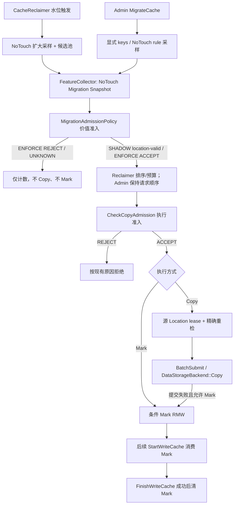

# 基于访问特征的迁移准入策略设计

| 项目 | 内容 |
|---|---|
| 状态 | V1 已实现；202 远端编译、定向回归和 Dummy E2E 已通过，待代码评审与 SHADOW 灰度验证 |
| 更新时间 | 2026-09-02 |
| 上游基线 | `origin/main` HEAD `6a163f93`（包含 #281 squash merge 与跨 Instance 公平驱逐）；实现分支 `rc/feat/write-admission-strategy` 已 rebase 到该提交 |
| 上位设计 | 《KVCM 多层存储》：触发模式与 Copy/Mark 执行方式正交，准入用于降低下沉写量、缓解低层介质 DWPD；不提供硬写入预算 |
| 涉及模块 | `service`、`manager`、`meta`、`config`、`metrics`、`protocol`、`kvcm_ops` |
| 相关文档 | [模块架构与关联关系](module_architecture.md)、[CacheReclaimer 异步删除与过度逐出优化](cache_reclaimer_async_delete.md)、[后台扫描 GC](cache_garbage_collector.md)、[EventReport 主动回收纳入后台扫描 GC](event_report_background_gc.md) |

## 1. 摘要

本文中的“准入”只回答一个问题：

> 一个已经存在于高层存储、正准备向低层存储下沉的 block，是否值得产生这次迁移写入？

它不控制普通新 block 是否允许写入缓存，也不改变首次写入热层的 `StartWriteCache` 行为。

多层存储有两种迁移执行方式：

1. **Copy**：`MigrationManager` 创建目标 WRITING location，并调用 `DataStorageBackend::Copy`；
2. **Mark + StartWriteCache**：先给 block 写入 tiered target Mark，后续 `StartWriteCache` 消费 Mark，引导推理引擎在目标低层补写副本。

无论最终使用 Copy 还是 Mark，都应在分发前经过同一次迁移价值准入。第一阶段采用简单策略：只有最近 X 秒内发生过 metadata touch 的候选才值得下沉；“至少被业务访问 N 次”作为后续策略之一，不将整个抽象绑定在时间和次数两个固定字段上。

Recent-access 是价值过滤器，只能概率性降低低层写量和 DWPD，不是写入速率或每日写入量的硬预算。若后续需要保证 target 的 byte rate、daily bytes 或 DWPD 上限，应增加独立的 target write budget，并让 Copy 与 Mark 共享预算；该能力不属于 V1。

V1 的核心落点是当前两条触发链路共用的 `MigrationManager::DispatchMigrationBatch`。分发前先以 NoTouch 方式取得候选的 location 和 policy-required features（V1 为访问时间）快照，再作价值判断：

```text
Reclaimer / Admin MigrateCache
        -> migration candidates
        -> NoTouch migration snapshot // location + required features
        -> MigrationAdmissionPolicy      // 新增：值不值得迁移
        -> Reclaimer 合格集合排序/预算截断
        -> CheckCopyAdmission            // 现有：能不能安全执行
        -> Copy 源 lease / 条件 Mark
```

被价值准入拒绝的 block：

- 不提交 Copy；
- 不写入 tiered Mark；
- 不创建目标 WRITING metadata；
- 不产生低层存储写入；
- Reclaimer 仍可按原有回收策略删除高层副本。

当前实现同时落地了 ENFORCE 所需的执行安全与可观测性前置：Copy source-generation lease、reservation 后 NoTouch 重检、partial-spec Copy、条件 Mark/逐 key outcome、统一 dispatch outcome、backend capability/readiness gate、`kvcm_ops` 配置透传，以及按缺失 specs 统计的 Copy/Mark 字节指标。普通无 Mark 的 `StartWriteCache` 不进入价值准入；它只延续已有热层写入语义。

## 2. 需求背景

多层存储希望扩大总体容量、延长有复用价值的 KV Cache 生命周期，同时需要降低 SSD 等低层介质的无效写入、缓解 DWPD 压力。

Reclaimer 在高层水位达到迁移阈值时，会从高层选出较冷的 block。如果所有候选都无条件下沉，写入后从未复用、未来也不太可能命中的 block 仍会消耗低层容量和写寿命。

迁移准入位于“选出候选”和“执行迁移”之间：

```text
触发：水位 / 外部 API / 后续策略
                |
                v
候选池：采样 + 初步 LRU 排序
                |
                v
价值准入：是否值得下沉          <- 本文
                |
                v
合格集合：最终 LRU 排序 + 预算截断
                |
                v
执行准入：源/目标/任务状态是否合法 <- 当前已有
                |
          +-----+-----+
          |           |
         Copy        Mark
```

触发模式与执行方式正交：

- Reclaimer 水位触发可以选择 Copy 或 Mark；
- Admin/API 触发可以选择 Copy 或 Mark；
- Copy 失败后可以按现有逻辑 fallback 到 Mark；
- 准入结论不因执行方式不同而改变。

## 3. 设计范围

### 3.1 V1 目标

1. 在 Copy/Mark 分发前，对每个迁移候选做最近访问时间准入。
2. Reclaimer 和 Admin/API 迁移共用同一套策略和统计口径。
3. 准入策略默认关闭，不因缺省配置改变价值过滤结果；NoTouch 和 Admin route 校验的独立影响在兼容性章节显式说明。
4. 支持 SHADOW 和 ENFORCE；SHADOW 在 feature 异常时保持现有迁移行为，先观测预计减少的下沉 block/bytes，再灰度拒绝。
5. 准入本身使用 NoTouch 读取，不得反向刷新访问时间。
6. Copy 和 Mark 使用同一次准入结果；Copy fallback Mark 不重复判断。
7. Mark 一旦写入，后续 `StartWriteCache` 只负责兑现迁移意图，不重新做热度准入。
8. 保持 Instance 隔离和现有 group 级 Copy 并发限制；Copy reservation 同时保护精确的源 Location，避免迁移期间被维护删除。
9. 迁移选样、prepare、Mark 去重等内部操作不得把候选 block 伪造成“刚被业务访问”。
10. 把访问信号采集、单策略判断和迁移分发解耦；未来新增访问次数、复访间隔、模型分数或策略组合时，不修改 `MigrationManager` 的 Copy/Mark 主流程。
11. Reclaimer 扩大候选池，在最终 NoTouch 快照上先做价值过滤，再在合格集合内按 LRU 排序并截取迁移预算，避免最冷但超窗的候选长期占满 batch。
12. Mark 写入采用条件 RMW 并返回逐 key outcome；预查询只用于减少 I/O，不承担并发正确性。
13. ENFORCE 由 backend capability 和运行时 recency warmup gate 保护，不能只依赖人工灰度约定。

### 3.2 V1 非目标

1. 不限制全新 block 正常写入热层。
2. 不对普通 `StartWriteCache` 返回 admission rejection，也不新增 connector mask。
3. 不实现访问次数、衰减计数或复杂预测模型。
4. 不改变“合格候选内优先迁移较冷 block”的原则、迁移水位、Copy/Mark 优先级和 retention 策略；V1 会调整候选池截断与价值过滤的先后顺序。
5. 不持久化新的访问历史，也不跨 Manager 复制进程内统计。
6. 不把所有系统中的 admission 统一成通用规则引擎。
7. V1 不实现在没有 Mark 的情况下由 `StartWriteCache` 主动发现迁移机会；该能力留作后续演进。
8. 不将准入扩展到高层内部的普通写入、副本修复或 Reclaimer 直接删除；它只管理 source -> target 的下沉/迁移写入。
9. 不提供 target byte token bucket、每日写入预算或硬 DWPD 上限；这些属于独立的写入预算控制层。

## 4. 当前实现基线

### 4.1 当前迁移链路

#### Reclaimer 水位触发

`CacheReclaimer` 当前行为：

1. 按 migration strategy 的 source storage 水位判断是否触发；
2. `DoKeySampling` 采样，并通过普通 `GetProperties(PROPERTY_LRU_TIME)` 取排序信号；
3. `MakeBatchByLRU` 选择最冷的一批 block；
4. 投递 `AsyncMigrationPrepareJob`；
5. worker fresh-read 当前配置，并通过普通 `BatchGetLocation` 读 location；
6. 进入 `MigrationManager::DispatchMigrationBatch`；
7. Copy 优先，Copy 失败时可 fallback Mark。

#### Admin/API 触发

`MigrationManager::MigrateCache` 当前行为：

1. 显式 block keys 优先，否则按 rule 采样；
2. 通过普通 `BatchGetLocation` 批量读取 location map；
3. 进入同一个 `DispatchMigrationBatch`；
4. 返回 accepted/rejected 计数。

因此 `DispatchMigrationBatch` 是 Reclaimer 与 API 两路的第一个稳定公共分发点，也是 V1 统一价值准入的推荐位置。但不能只在这里多读一次 NoTouch 时间：上游普通 `GetProperties` 和 `BatchGetLocation` 已经会 touch metadata，使最终读到的时间变成“迁移流程刚访问过”。V1 必须同时修正这些准入前置读取。

### 4.2 当前已有的是“执行准入”

`MigrationManager::CheckCopyAdmission` 已经检查：

- 同一 Instance/block 是否已有活跃 Copy；
- source storage 是否存在 SERVING location；
- target storage 是否已有覆盖所需 specs 的 SERVING location；
- target storage 是否已有 WRITING location。

`DataStorageSelector` 和 `CheckTargetStorageAdmission` 还负责：

- target storage 是否注册、启用、可写；
- Instance Group 和 storage type quota 是否允许分配。

这些规则回答“现在能不能安全执行、是否还需要迁移”，并不回答“这个 block 是否有复用价值、值不值得消耗一次低层写入”。

### 4.3 基线缺少的价值准入抽象与 V1 落点

上游基线中，`MigrationManager` 没有对应的价值策略抽象。原有 admission 逻辑主要内嵌在 `MigrationManager::CheckCopyAdmission` 和 `DispatchMigrationBatch` 中，处理的是执行安全而不是迁移价值。

V1 已在 `MigrationManager` 内部实现 `MigrationAdmissionPolicy` 领域接口、recent-access leaf、typed feature collector 和 factory。它们是 manager 的内部子组件，不构成新的架构模块或对外生产入口；现有 `CheckCopyAdmission` 保持执行安全职责，避免把访问策略、I/O 状态和任务状态混在一个方法中。

### 4.4 当前访问时间和次数能力

| 能力 | 当前状态 | V1/V2 结论 |
|---|---|---|
| `PROPERTY_LRU_TIME` | Local metadata item 维护最后 touch 时间；Reclaimer 已用于 LRU 排序 | V1 可复用，但必须明确 NoTouch 和近似语义 |
| `RevisitIntervalHistogram` | 聚合访问间隔分布 | 不能回答某个 block 是否准入 |
| `PROPERTY_HIT_COUNT` | 只有属性名和通用属性存取能力 | V2 前必须新增真实业务计数 |
| 当前基线 NoTouch | 已有 cache NoTouch、maintenance scan、定向 location 读/存在性检查/删除和 location-level maintenance RMW | V1 在其上补齐通用 NoTouch property/snapshot，并接入完整迁移决策链 |

迁移候选一定是已经存在 source location 的 block，因此不存在“查询 miss 没有 metadata、导致新 key 永远无法 bootstrap”的问题。V1 不需要为查询 miss 建立独立访问索引。

### 4.5 上游基线存在、V1 已一并封闭的上线前置问题

价值准入不能替代迁移执行本身的并发保护。上游基线有三类与 ENFORCE 上线直接相关的问题：

1. `DispatchMigrationBatch` 从 location snapshot 生成 `src_location_id`、`src_create_time` 和 `src_specs` 后，`BatchSubmit` 直接使用这些值创建目标并提交 Copy；源端只在 Copy 完成后再次检查。snapshot 与 Copy 完成之间，Reclaimer/GC 仍可能删除源 Location，导致目标已经发生写入后因 `source_lost` 被丢弃。
2. Mark 去重查询与真正的 Mark RMW 不是一个原子操作；Copy fallback Mark 会进一步扩大窗口。当前 modifier 还会无条件覆盖 target/deadline，并且批量调用方拿不到可靠的逐 key 提交结果。
3. `kvcm_ops` 当前 `CacheConfig` 未完整解析和输出 `migration_config`。更新无关字段时可能把服务端已有迁移配置清空，而 Registry 更新采用完整对象替换语义。

第 1、2 项是原有迁移路径已经存在的竞态，不是 recent-access policy 新制造的。V1 已分别用 source-generation lease + reservation 后重检、条件 Mark + 逐 key outcome 封闭；`kvcm_ops` 也已补齐 `migration_config` 和未知字段的 round-trip。它们仍应作为 ENFORCE 上线回归与灰度验收项。

## 5. 准入语义

### 5.1 准入对象

准入对象必须同时满足：

1. 已被 Reclaimer、Admin/API 或未来迁移触发器选为候选；
2. 在当前 Instance 的 source storage 上存在可用于迁移的 metadata/location；
3. 目标是从 source storage 向 strategy 指定的 target storage 下沉或补副本。

普通新 block 的流程不属于准入对象：

```text
StartWriteCache:
    if 有有效 tiered Mark:
        写 Mark 指定的 target storage       // 兑现已准入迁移
    else if 已有普通可用副本:
        skip
    else:
        写默认热层 storage                  // 新 block 正常写，不做迁移准入
```

### 5.2 V1：最近访问时间策略

V1 配置中唯一 policy 为 `admission.policies[0].recent_access.window_seconds = X`。对候选 block：

```text
age = now_us - last_access_time_us

feature available && last_access_time 合法:
    0 <= age <= X  -> ACCEPT
    age > X         -> REJECT(not_recent)
feature missing / invalid / unsupported / read-error:
    UNKNOWN
```

含义是：只把“虽然已经进入 Reclaimer 的冷候选集合，但在配置窗口内仍发生过 metadata touch”的 block 下沉到低层，完全陈旧或无法证明近期 touch 的 block 不消耗本轮低层迁移写入。

V1 的最近访问时间是一个启发式信号，不等价于“至少被业务读取过一次”：

- metadata 创建、普通 Upsert/RMW 等路径当前可能刷新时间；
- 进程恢复或 cache 回填可能重新建立 item 的时间；
- 因此 V1 可能放过少量从未被业务复用、但刚发生内部 mutation 的 block。

因此 V1 应对外称为“recent metadata-touch TTL 启发式策略”，不能宣称它已经准确识别“至少被业务访问过一次”或真实业务热度。这也是 V2 仍需要独立业务访问计数的原因。

SHADOW 阶段除预计接受率和预计字节外，还应评估准入 cohort 后续是否产生 cold-tier hit。若线上无法低成本逐 key 追踪，可对候选采样并通过事件/离线关联计算；不能只用 metadata touch 命中率证明策略有效。

### 5.3 未知或异常 feature

迁移是可选优化，ENFORCE 无法确认价值时优先保护低层写量；SHADOW 则必须保持现有执行行为，只记录预计结果：

location 是执行迁移的必要数据，feature 只是价值判断输入，两者的读取状态不能合并成一个模糊的 snapshot 成败：

| 状态 | SHADOW | ENFORCE |
|---|---|---|
| location 单 key 不可用 | 该 key 不进入执行准入 | 该 key 不进入执行准入 |
| location 整批 transport/shape 失败 | 停止本批；Admin 返回非 OK，Reclaimer 记录基础设施错误 | 同 SHADOW |
| policy 所需 feature 缺失 | 记录 UNKNOWN/`feature_missing`，但 location 可用时继续现有执行路径 | UNKNOWN，拒绝该 key |
| feature 解析失败或取值非法 | 记录 UNKNOWN/`feature_invalid`，但继续现有执行路径 | UNKNOWN，拒绝该 key |
| backend 不支持所需 feature | 记录 UNKNOWN/`feature_unsupported`，但继续现有执行路径 | 不允许进入 ENFORCE；运行时发现则 route NOT_READY |
| feature provider/read transport 失败 | 记录 projected UNKNOWN/`feature_read_error`，但继续现有执行路径 | 该 key 记为 snapshot `FAILED`，Admin 返回非成功/部分成功；不伪装成普通 value reject |
| V1 时间来自未来或发生溢出 | 记录 UNKNOWN/`feature_invalid`，但继续现有执行路径 | UNKNOWN，拒绝该 key |
| policy 输出 shape/contract 错误且 location 仍可信 | 记录内部错误并继续现有执行路径 | 停止本批并显式报错，不计为普通 value reject |

SHADOW 必须保持行为中性：只要 location 数据仍可信，feature 或 policy 自身的故障不能改变现有迁移结果。ENFORCE 对 feature missing/invalid 等 value UNKNOWN 采用 fail-closed，因为错误放行会增加低层写入；location、feature transport 和 snapshot shape 等基础设施错误属于执行失败，不得伪装成普通策略拒绝。

### 5.4 同一准入结果覆盖 Copy 和 Mark

价值准入发生在 Copy/Mark 分类之前：

- ACCEPT 后，按 strategy 选择 Copy 或 Mark；
- REJECT 后，两种方式都不能执行；
- Copy 提交失败 fallback Mark 时复用原 ACCEPT 结论；
- 已经成功写入 Mark 后，不在 `StartWriteCache` 再次检查最近访问时间。

Mark 本身是一个已经通过准入的迁移意图。其时效性由 `mark.timeout_ms` 控制；如果到期仍未被 `StartWriteCache` 消费，按现有机制清理。

## 6. 总体设计



### 6.1 模块职责

| 模块 | 职责 |
|---|---|
| `CacheReclaimer` | 水位触发、NoTouch 扩大采样和候选池构建；不实现价值策略。Reclaimer/GC 删除路径必须识别活跃 Copy 的源 Location lease |
| `MigrationManager` | 唯一的迁移准入生产入口；解析 immutable route/admission 配置，内部完成 feature 采集、policy 判断和 mode 处理，对 Reclaimer 合格集合最终排序/截断，再编排执行准入、源 lease 与 Copy/条件 Mark 分发 |
| `MetaIndexer` / backend | 提供通用的批量 NoTouch property 读取、location + property 组合读取及彼此独立的状态；通过统一 access intent 支持 mutation NoTouch |
| `config` | 在每条 migration route 上配置 mode 和类型化 policy 列表；V1 列表中只能有一个 recent-access policy |
| `protocol` / `service` / `kvcm_ops` | 负责配置的 proto/JSON 转换、校验和 round-trip；不执行准入算法 |
| `metrics` | 记录 candidate、shadow/enforce accept/reject、feature/readiness 状态、分阶段 outcome、预计/实际字节和 source-lost 浪费写 |
| `CacheManager::StartWriteCache` | 只消费已准入 Mark；普通热层写入行为不变 |

这里按架构模块划分职责，不把 `MigrationAdmissionPolicy`、feature collector 或 factory 单列成与 `manager` 平级的模块。它们都由 `MigrationManager` 私有拥有；可以为控制文件规模和纯逻辑单测拆成 manager 目录下的 internal 文件，但编译进现有 `migration_manager` target，不提供跨模块 API。

依赖仍保持 `service -> manager -> meta -> config` 的现有方向。Reclaimer、service 和 meta 都不能直接构造或调用 policy；Meta 层只暴露中性的 NoTouch 数据结果，不得引用 policy 或其他 manager 内部类型。

### 6.2 MigrationManager 内部策略抽象

V1 不建设跨业务的通用规则引擎，但在 `MigrationManager` 内部为“迁移价值准入”提供稳定扩展点。首期只实现一个 recent-access leaf，不实现 Composite；内部边界仍分为三层：

```text
FeatureCollector  --批量 NoTouch-->  typed features
                                              |
Policy           --单一规则------->  ACCEPT / REJECT / UNKNOWN
                                              |
MigrationManager --mode----------->  SHADOW 记录 / ENFORCE 过滤
```

核心类型建议为：

```cpp
enum class MigrationAdmissionFeature : uint8_t {
    kLastAccessTime = 0,
    kBusinessAccessCount = 1, // V2 启用
    kFeatureCount,
};
using MigrationAdmissionFeatureSet =
    std::bitset<static_cast<size_t>(MigrationAdmissionFeature::kFeatureCount)>;

inline MigrationAdmissionFeatureSet FeatureSetOf(
    MigrationAdmissionFeature feature) {
    MigrationAdmissionFeatureSet features;
    features.set(static_cast<size_t>(feature));
    return features;
}

enum class ObservedFeatureStatus {
    kAvailable,
    kMissing,
    kInvalid,
    kUnsupported,
    kReadError,
};

struct ObservedFeature {
    ObservedFeatureStatus status = ObservedFeatureStatus::kMissing;
    std::variant<std::monostate, int64_t, uint64_t, double> value;
};

class MigrationCandidateFeatures {
public:
    const ObservedFeature &Get(MigrationAdmissionFeature feature) const;

    template <typename T>
    std::optional<T> GetAvailableValue(MigrationAdmissionFeature feature) const;

private:
    std::array<ObservedFeature,
               static_cast<size_t>(MigrationAdmissionFeature::kFeatureCount)> values_;
};

struct MigrationAdmissionContext {
    int64_t now_us = 0;
};

enum class MigrationAdmissionVerdict {
    kAccept,
    kReject,
    kUnknown,
};

enum class MigrationAdmissionPolicyType {
    kRecentAccess,
    kMinimumBusinessAccessCount, // V2 启用
};

enum class MigrationAdmissionReason {
    kSatisfied,
    kNotRecent,
    kInsufficientBusinessAccessCount, // V2 启用
    kFeatureMissing,
    kFeatureInvalid,
    kFeatureUnsupported,
    kFeatureReadError,
};

struct MigrationAdmissionDecision {
    MigrationAdmissionVerdict verdict = MigrationAdmissionVerdict::kUnknown;
    MigrationAdmissionPolicyType policy_type = MigrationAdmissionPolicyType::kRecentAccess;
    MigrationAdmissionReason reason = MigrationAdmissionReason::kFeatureMissing;
};

class MigrationAdmissionPolicy {
public:
    virtual ~MigrationAdmissionPolicy() = default;
    virtual MigrationAdmissionFeatureSet RequiredFeatures() const noexcept = 0;
    virtual std::vector<MigrationAdmissionDecision>
    EvaluateBatch(const std::vector<MigrationCandidateFeatures> &features,
                  const MigrationAdmissionContext &context) const = 0;
};
```

以上类型属于 manager-internal API，不是对外模块接口。具体实现可以放在 `migration_admission_internal.{h,cc}`，也可以在规模较小时留在 `migration_manager.cc`；二者只有物理组织差异，不改变其由 `MigrationManager` 所有的语义边界。不建议做成 `MigrationManager` 的 C++ nested class：嵌套并不会增强模块隔离，反而会让多个 leaf、factory 和纯策略测试更笨重。

策略扩展方向：

- V1 `RecentAccessAdmissionPolicy(window)` 只声明 `kLastAccessTime`；
- V2 `MinimumBusinessAccessCountPolicy(min_count)` 只声明 `kBusinessAccessCount`；
- 后续的复访间隔、衰减热度、生命周期或模型分数策略，通过新 feature 和 leaf policy 扩展。

`MigrationCandidateFeatures` 是类型化 feature bag，不固定暴露 `last_access_time` / `hit_count` 成员。底层用 enum-indexed array 和受限 variant，避免 per-key hash/string 分配；leaf 通过 feature id + 期望值类型读取，类型不匹配统一视为 `kInvalid`。Collector 保证 `kAvailable` 时 variant 必须是该 feature 声明的类型，其他 status 使用 `monostate`。新增 feature 只需扩展 enum/value type 和 collector descriptor，不改 policy 接口或 dispatch snapshot 形状。

Policy 接口以 batch 为粒度，输出必须与输入一一对齐。V1 recency 和后续 count leaf 只需逐 key 计算；batch 接口同时避免 per-key virtual call，并为未来的分位数或相对排名策略保留能力。这些策略仍只能决定迁移价值，不接管 Copy/Mark 执行，也不承担 target 写入预算。接口使用项目 C++17 已支持的 `const std::vector<...> &`，不额外引入 C++20 `std::span` 依赖。

`EvaluateBatch` 返回需要分配内存的 `std::vector`，因此不能声明 `noexcept`；否则分配失败或实现意外抛出会直接 `std::terminate`。若实现阶段要求全链路无异常，应改为调用方预分配输出并返回显式错误，而不是在会分配的接口上保留 `noexcept`。

`RequiredFeatures()` 是策略与采集层之间的唯一依赖。`MigrationAdmissionFeatureCollector` 一次批量获取当前 policy 声明的信号；策略不直接识别 property name、MetaIndexer 或数据来源。feature -> source/property/parser 映射只存在于 collector。未来启用组合时，collector 再对多个 policy 的 feature 求并集，接口无需改变。

V1 collector 只需要 MetaIndexer provider。未来如果模型分数或其他 feature 来自非 metadata 数据源，在 collector 内增加受控 provider adapter，但 policy 仍只消费 typed feature bag，不直接发起 I/O。

manager-internal 的 `MigrationAdmissionPolicyFactory` 将类型化配置构造为 immutable policy；一个 batch 内复用同一实例，不做 per-key 对象分配。V1 factory 只注册 `RecentAccessAdmissionPolicy`，不提前实现 Composite、动态脚本、反射或通用 plugin ABI；未知策略配置直接校验失败。

公开配置仍使用类型化 `policies` 列表以保留 protobuf/JSON 的扩展形状，但 V1 严格校验列表长度等于 1，且只能是 `recent_access`，不公开 `match_mode`。等第二个可用策略落地时，再增加默认值为 ALL 的 `match_mode` 和 manager-internal Composite；这不会改变 feature、policy 或 dispatch 的现有边界。

扩展契约如下：

| 扩展场景 | 需要新增或修改 | 必须保持不变 |
|---|---|---|
| 新策略复用已有 feature | leaf config/proto、policy 实现、factory 注册、单测 | feature collector、dispatch、Copy/Mark、mode 处理 |
| 新策略依赖新 feature | feature id/type/collector descriptor，再加上 leaf config、policy、factory 和单测 | dispatch snapshot 形状、Copy/Mark、`StartWriteCache` |
| 首次启用策略组合 | `match_mode` 配置、Composite 实现及真值表测试 | leaf 与 feature provider、迁移执行状态机 |

因此“访问次数”不是写进 `MigrationManager` 的一个新分支，而只是第二行扩展场景的一个实例；是否和 recency 组合则在该策略真正上线时一并实现。

SHADOW/ENFORCE 不是 leaf policy 的责任：

- DISABLED：不构造/执行 policy，不采集额外 feature；
- SHADOW：计算结果但实际放行，UNKNOWN 按“预计 fail-closed 拒绝”记录；
- ENFORCE：只有 ACCEPT 放行，REJECT/UNKNOWN 都拒绝迁移。

`MigrationAdmissionPolicy` 及其实现不持有 `RegistryManager`、`MetaIndexer` 或 backend，不负责 Copy/Mark。这样可以：

- 用确定输入直接测试边界；
- 避免策略类越过 manager/meta 模块边界；
- 后续增加单策略或策略组合时，不改动 dispatch；
- 保持 `MigrationManager` 是唯一迁移生命周期管理中心。

### 6.3 与现有 CheckCopyAdmission 的关系

两层准入不能合并：

| 层次 | 回答的问题 | 典型拒绝原因 |
|---|---|---|
| Value admission（新增） | 值不值得写入低层？ | leaf 不满足、所需 feature 未知/非法 |
| Execution admission（已有并需补强） | 当前是否还需要且能安全执行？ | 已有任务、源不存在、目标已有 SERVING/WRITING、源 lease/重检失败 |
| Target admission（已有） | 目标 storage 是否可写？ | 未注册、不可用、group/type quota 超限 |

推荐顺序：

1. target route/config 基础校验；
2. batch NoTouch 读取 location + policy-required features 的同一份最终快照；
3. value admission；
4. Reclaimer 触发时，ENFORCE 对 ACCEPT 子集按最终快照中的 LRU 时间排序并截取迁移预算；SHADOW/DISABLED 保持候选池的初步 LRU 顺序，避免 policy/feature 故障改变现有选择。Admin 显式 keys 保持请求顺序；
5. 使用快照中的 location 执行 `CheckCopyAdmission`；
6. Copy 分支先原子 reservation，并把 `(instance_id, block_key, source_location_id, source_create_time)` 注册为源 Location lease；reservation 后、分配目标 URI/WRITING metadata 前，用 NoTouch 精确重检源 id/status/create_time；
7. Mark 分支使用条件 RMW；预查询只作优化；
8. BatchSubmit 继续保留 lifecycle、task dedup、target admission 和 group concurrency 硬限制；所有可能删除普通 Location 的维护路径在最终删除前检查源 lease。

第 6 步的重检可以避免为已经失效的 snapshot 分配目标，但它本身不能封闭重检后的竞态。真正封闭竞态的是第 6、8 步组成的 lease 协议：只要 Copy task 仍处于 preparing/running/completing，自动维护删除就不能移除同一代源 Location。

### 6.4 Dispatch 输入与配置快照

当前 `DispatchMigrationBatch` 接收由上游准备的平行 `batch` 和 `loc_maps`。这使最终 location 读取落在 Reclaimer/Admin 两条分支中，也允许新调用方向 dispatch 传入已被 touch 的结果。

V1 应从共享 dispatch 公开入口移除 `loc_maps` 参数，只传 keys 和 `DispatchBatchParams`。`DispatchMigrationBatch` 内部通过 NoTouch `GetForMaintenance` 组装每 key 快照，再进入价值准入：

```cpp
struct MigrationCandidateSnapshot {
    int64_t block_key = 0;
    CacheLocationMap locations;
    ErrorCode location_ec = EC_OK;
    MigrationCandidateFeatures features;
};

DispatchBatchResult DispatchMigrationBatch(
    const std::string &trace_id,
    const std::string &instance_id,
    const std::string &src_name,
    const std::string &dst_name,
    const std::vector<int64_t> &block_keys,
    const DispatchBatchParams &params);
```

`MigrationCandidateSnapshot` 是 manager 层内部值，不作为上游入参。这样每个 key 的 location 状态、类型化 features 和读取状态始终对齐，且不能绕过共享的 NoTouch prepare/value-admission 阶段。feature 状态保存在各 `ObservedFeature` 中，不用 `location_ec` 代替。

`DispatchBatchParams` 增加四类 immutable 输入：

- 当前 source -> target route 的 `MigrationAdmissionConfig` 值拷贝；
- 触发来源 `RECLAIMER` / `ADMIN`，用于 metrics 和审计；
- 与 keys 对齐的可选 pending location id 排除集；Reclaimer 传入已投递删除的 location，Admin 传空。这些 id 在 NoTouch snapshot 取回后、`CheckCopyAdmission` 前过滤。
- 可选的本批迁移动作预算。Reclaimer 传 `batching_size`，在价值过滤后的合格集合上截断；Admin 显式 keys 默认不做 LRU 重排，其执行数量仍受请求大小、Copy concurrency 和 target admission 限制。

具体传递规则：

1. Reclaimer async worker 像现在一样 fresh-read group config，精确匹配 source/target route，再把该 route 的 admission 值拷贝传入 dispatch；
2. Admin `MigrateCache` 由 `CacheManager` 在已取得的 group config 中精确匹配 source/target route，将同一份配置传给 `MigrationManager`；
3. V1 不允许 Admin 在找不到 route 时隐式使用 DISABLED 绕过准入；未匹配 route 的 source/target 请求返回 `EC_BADARGS`；
4. 配置读取后在分发期间发生更新，当前 batch 使用旧快照，下一 batch 生效。

第 3 条会收紧当前 Admin 可指定任意已注册 target 的行为，但能保证所有下沉写入都有可解释的 route 和准入口径。若评审确认必须保留任意 target，则需新增 group 级 default admission，不能以缺省 DISABLED 代替。

### 6.5 源 Location migration lease

当前活跃 Copy task 已保存 `src_location_id` 和 `src_create_time`，V1 不需要另建一套独立租约存储；应把 task reservation 明确定义为源 Location lease，并向删除路径暴露精确查询，例如：

```cpp
bool HasActiveCopySourceLocation(
    const std::string &instance_id,
    int64_t block_key,
    const std::string &location_id,
    int64_t create_time) const;
```

lease contract：

1. `ReservePreparingTaskLocked` 成功时获取 lease；同一个 task reservation 同时承担 per-block Copy 去重和源保护，不增加第二个生命周期表。
2. reservation 后立即通过 NoTouch 读取精确重检 source id、`CLS_SERVING` 和 create_time；失败则在任何目标分配前回滚 task/lease。
3. Reclaimer、GC 以及其他会删除普通 Location 的自动维护路径，必须在真正的 metadata CAS/物理删除前检查 lease。只在候选采样时检查不够，因为删除请求可能早于 lease 入队、晚于 lease 获取后才执行。
4. 已经排队的删除请求若在执行时发现 lease，必须跳过或延后，并重新读取状态，不能继续使用旧删除快照。
5. Copy 成功后仍保留现有 source id/status/create_time 完成检查。目标 promote 为 SERVING 后，task owner 才能先结束源保护，再按精确 generation 条件删除 retention 指定的源；通用删除路径不能借此获得绕过 lease 的能力。
6. promote、失败、取消、prepare 回滚和超时等所有 terminal path 都必须释放 lease。若 task-owned 源删除异步执行，释放与提交条件删除的顺序必须保证目标已经 SERVING，且删除仍校验 source id/create_time。
7. 显式管理删除若被定义为强制操作，应先取消并收敛对应 Copy，再删除源；不能静默绕过 lease。

该 lease 保护的是“Copy 读取期间源数据仍有效”，不是长期 pin。需记录 source-lease conflict、deferred delete、lease duration 和 `migration_copy_source_lost_written_bytes_total`，以发现任务泄漏或异常写放大。

### 6.6 预计文件级改动

| 区域 | 主要文件 | 设计改动 |
|---|---|---|
| Manager 内部准入 | `manager/migration_admission_internal.{h,cc}`（可选新增）、`manager/migration_manager.{h,cc}`、`manager/BUILD` | 在 manager 内定义 feature/status/verdict/reason、collector、recent-access policy 和 factory；共享 dispatch 组装 snapshot、处理 mode、排序/截断后再 Copy/Mark。internal 文件编译进现有 `migration_manager` target，不新增公共模块或生产入口 |
| 迁移并发与触发 | `manager/cache_reclaimer.{h,cc}`、`manager/cache_garbage_collector.{h,cc}`、`manager/cache_manager.{h,cc}`、`manager/migration_manager.{h,cc}` | Reclaimer 构建扩大候选池；Reclaimer/GC 删除识别源 lease；Admin/Reclaimer 解析 route；Mark 改条件 RMW 和逐 key outcome；普通 StartWrite 不加价值准入 |
| NoTouch meta | `meta/meta_indexer.{h,cc}`、`meta/meta_storage_backend*`、`meta/meta_local_backend*`、`meta/types.h`、`meta/BUILD` | 复用现有 maintenance scan、定向 location 读/删和 RMW；新增通用 NoTouch property/combined snapshot 及分组件状态；扩展共享 block-property RMW 在同一锁内读取现有 properties、条件修改并返回逐 key commit 结果；以端到端 access intent 补齐 block-property/location upsert 不刷新 access time 的能力 |
| 配置与协议 | `config/migration_strategy.{h,cc}`、`protocol/protobuf/admin_service.proto`、`service/util/manager_message_proto_util.*`、`package/kvcm_ops` | 增加 route admission 配置、校验、默认值和完整 round-trip |
| 可观测性 | `metrics/metrics_collector.*`、manager/reclaimer metrics 注册点 | 新增 value-admission、readiness、分阶段 outcome、source lease/浪费写与 NoTouch 异常指标，与现有 execution admission 分开 |
| 测试 | 上述模块 `test/` 和必要的 `integration_test/reclaimer` | 覆盖配置、NoTouch、纯策略、两个触发入口、Copy/Mark/StartWrite 集成语义 |

## 7. NoTouch 访问特征采集

### 7.1 为什么整条迁移决策链都必须 NoTouch

当前 `MetaIndexer::GetProperties(..., PROPERTY_LRU_TIME)` 最终可能走普通 Local Get。普通 Get 会先返回旧时间，再把 item touch 到当前时间。

这会导致：

1. 本轮判断虽然拿到旧值，下一轮却把 admission 自己当成一次新访问；
2. 一个持续被 Reclaimer/准入扫描但没有业务读取的 block，会被周期性“保鲜”；
3. 未来 hit count 如果挂在同一 touch 语义上，也会被虚增。

只把最后一次 admission 读取改成 NoTouch 仍然不正确。当前在到达公共 dispatch 前已经有两个污染点：

1. `CacheReclaimer::DoKeySampling` 的普通 `GetProperties(PROPERTY_LRU_TIME)`；
2. `RunAsyncMigrationPrepare` 和 `MigrateCache` 的普通 `MetaSearcher::BatchGetLocation`。

若这两处任一保留 touch，最终准入读到的就是“迁移流程自己刚访问过”，候选几乎都会通过窗口。

最新基线已经有 `ApplyToEntryNoTouch`、maintenance scan 和定向 location NoTouch 读取，但尚没有面向显式 keys、可读取任意 property 的公开接口，也没有 location + property 的组合快照。V1 应在现有 maintenance read stack 上补充以下中性接口，而不是另建平行机制，更不能让 meta 层识别 `MigrationAdmissionFeature` 或返回 manager 层的 `MigrationCandidateFeatures`：

```cpp
// 迁移候选 LRU 排序使用，不需要读 location body。
MetaIndexer::Result MetaIndexer::GetPropertiesForMaintenance(
    RequestContext *request_context,
    const KeyVector &keys,
    const std::vector<std::string> &property_names,
    PropertyMapVector &out_properties) noexcept;

struct MaintenanceGetResult {
    // 两个 Result 的 error_codes 均与输入 keys 对齐。
    // Local 单 backend 的底层读失败通常会同时反映在二者；
    // cached/dual backend 允许 location 成功而 volatile property provider 失败。
    MetaIndexer::Result locations;
    MetaIndexer::Result properties;
};

// 最终 prepare 使用；一次获取执行准入的 location
// 和价值准入的 property，避免先普通 GetLocation 再读时间。
MaintenanceGetResult MetaIndexer::GetForMaintenance(
    RequestContext *request_context,
    const KeyVector &keys,
    const std::vector<std::string> &property_names,
    CacheLocationMapVector &out_locations,
    PropertyMapVector &out_properties) noexcept;
```

`GetPropertiesForMaintenance` 继续返回 meta 层现有 `Result`；组合接口返回两个彼此独立的 `Result`，分别说明 location 和 property component 的 aggregate/per-key 状态。`MigrationAdmissionFeatureCollector` 根据 `RequiredFeatures()` 将 feature 映射为 property 集合，再按 key 将 meta 结果转换为 `MigrationCandidateSnapshot`，从而保持 `manager -> meta` 的单向依赖。

状态拆分不是要求 Local backend 做两次读取。Local 仍应在一个 `ApplyToEntryNoTouch` callback 中取得同 key 的 location 与 property，只是把读取/投影结果分别表达；cached/dual backend 在 persistent location 成功、hot-cache volatile property 失败时，则可以准确返回“location available + feature read error”。

实现上应扩展现有 `MetaLocalBackend::GetForOneKeyForMaintenance`，使其像普通 `GetForOneKey` 一样支持 `field_names` 和 property 输出，并继续在一次 `ApplyToEntryNoTouch` callback 中取得同 key 的 location 与 property。`GetPropertiesForMaintenance` 和 `GetForMaintenance` 共享该底层实现，不复制第三套读取逻辑。

接口 contract：

- Local backend 使用 `ApplyToEntryNoTouch`；
- 不改变 LRU 链表位置和 `last_access_time_`；
- 不触发 revisit histogram；
- 不新增/回填 miss item；
- `property_names` 允许为空，此时 `GetForMaintenance` 退化为 location-only NoTouch 读取，供 DISABLED mode 使用；
- cached/dual backend 遵循当前在线 point-read 的 view 选择：正常运行时读 hot view，恢复阶段是否 fallback persistent 沿用现有读语义，但任何 fallback 都不得回填/碰热 hot cache；persistent 只能提供 location/持久化 property，不能伪造进程内 LRU 时间；
- hot view miss 或 backend 不支持进程内 LRU 时间时，该 feature 按 missing/unknown 返回，不得用当前时间兜底；
- `out_locations`、`out_properties`、`locations.error_codes` 和 `properties.error_codes` 必须与输入 keys 一一对齐；某个 component 发生 shape mismatch 时先补齐该 component 的空输出和 `EC_MISMATCH`，不得破坏另一个已可信 component 的对齐；
- property 缺失使用“property result 成功但 map 中无该字段”表达；provider 不支持或读取失败使用明确错误，由 collector 分别转换为 `kMissing`、`kUnsupported` 或 `kReadError`；
- location component 不可信时该 key 不能迁移；仅 property component 不可信时，按 5.3 的 SHADOW/ENFORCE 语义处理。

`GetForMaintenance` 是最终准入授权的数据源，其 location 同时供后续 `CheckCopyAdmission` 使用。不允许在它之前通过普通 `BatchGetLocation` “预取” location。

现有 `ScanLocationsForMaintenance` 是 GC 的 cursor 扫描接口，dual-backend 下只遍历 hot view；现有 `GetLocationsFromPersistent` 是物理删除等场景的 source-of-truth 读取。两者都不能直接代替迁移准入的显式-key组合快照：前者不是 point read，后者拿不到 hot-cache 的访问时间且可能与在线迁移 view 不同。

### 7.2 迁移内部 touch 审计

V1 的最小正确性边界不只是一个新查询：

| 迁移内部路径 | 当前/预期问题 | V1 要求 |
|---|---|---|
| `SampleReclaimKeys` | Local 直接看 LRU 结构，本身不应 touch | 保持 NoTouch |
| `DoKeySampling -> GetProperties` | 普通 Get 会刷新候选 | 迁移采样改用 `GetPropertiesForMaintenance` |
| async/Admin prepare -> `BatchGetLocation` | 在价值准入前已刷新 | 以 `GetForMaintenance` 取代 |
| value admission 读取 | 若单独用普通 Get，会影响下轮 | 复用同一份 NoTouch 快照 |
| Copy reservation 后/完成前 source generation 重检 | 当前完成检查走普通 location Get，会刷新时间 | 两次都使用 location-only `GetForMaintenance`，校验 id/status/create_time |
| Mark dedup/query | 本轮决策后仍可能刷新下轮信号 | 改用 NoTouch property query |
| Mark add/clear | 当前走 block-property 普通 RMW，会刷新访问时间 | 共享 RMW 端到端传递 `MetaAccessIntent::kMaintenanceNoTouch` |
| Copy location 状态迁移 | 现有 location maintenance RMW 已支持 NoTouch 读取/删除，但 `MA_OK` upsert 仍走普通 Upsert | 扩展现有 RMW 的 access intent，使 location upsert 也不刷新访问时间 |
| `StartWriteCache` / `FinishWriteCache` | 属于真实写链路，V1 仍可使最近时间变新 | 作为 V1 近似语义保留；V2 不得将其计为业务 hit |

`DoKeySampling` 还被 Reclaimer 删除路径使用。实现时可将它参数化为 `AccessMode::kNoTouchMaintenance`，或拆出迁移专用采样函数；不能让迁移路径继续调普通 `GetProperties`。

最新基线的 `ReadModifyWriteLocationsForMaintenance` 已复用普通 location RMW 的 shard lock、modifier、计费和写入框架，迁移不应再创建第二套 RMW 状态机。但它当前只在定向读取和删除分支选择 maintenance backend；`MA_OK` 仍通过普通 `ExecuteRmwUpsert -> Upsert`，Local backend 会刷新 `last_access_time_`。因此“已有 maintenance RMW”不等于 Mark/Copy 的所有 mutation 已经 NoTouch。

这里的 NoTouch 指“不更新访问/LRU/未来 hit-count 记账”，不是禁止 metadata 变更。Mark 和 Copy 状态机仍然需要写 property/location；实现必须在现有 RMW 内端到端传递统一 access intent，只抑制 access bookkeeping，不改变 shard lock、CAS、Sync 和计费语义。

建议意图至少区分：

```cpp
enum class MetaAccessIntent {
    kBusinessRead,       // 更新时间；V2 可增加业务 hit count
    kBusinessWrite,      // V1 可更新时间；V2 不增加业务 hit count
    kMaintenanceNoTouch, // 时间、LRU、revisit 和未来 hit count 均不更新
};
```

intent 必须从 `MetaIndexer` RMW 入口一路传到 `ExecuteRmwUpsert`、backend Upsert 和 Local item callback，并在持有同一 item 锁时决定是否 touch。禁止采用“先保存 access time，mutation 后再恢复”的实现：恢复动作可能覆盖 mutation 期间发生的真实并发业务访问。相同原则同时适用于 Mark property、Location Upsert/CAS 和未来访问次数。

### 7.3 最新上游基线 / #281 的作用边界

#281 已以 squash commit `6a163f93` 合入 main。最新实现不再为 EventReport 维护一套专用 compare-delete/receipt 状态机，而是把 NoTouch 能力收敛进共享 metadata 读写框架，当前已有：

- cache 层 `ApplyToEntryNoTouch`；
- `ScanLocationsForMaintenance`；
- backend 层定向 `GetLocationsForMaintenance`、`ExistsLocationForMaintenance` 和 `DeleteLocationsForMaintenance`；
- `MetaIndexer::ReadModifyWriteLocationsForMaintenance`；
- `MetaSearcher::BatchDeleteLocations(..., maintenance_no_touch=true)`。

因此 V1 没有另建 maintenance RMW 状态机，而是在上述共享实现上补齐并接入迁移链路：

| 基线缺口 | V1 实现状态 |
|---|---|
| 任意 properties 的 NoTouch point read | 已增加 `GetPropertiesForMaintenance` |
| location + properties 的显式-key快照 | 已增加 `GetForMaintenance`，location/feature 分别返回逐 key 状态 |
| Reclaimer LRU 采样 | 已改为 NoTouch，并扩大候选池后过滤、排序、截断 |
| async/Admin migration prepare | 已移除上游普通 `BatchGetLocation`，统一由 dispatch 取最终 NoTouch 快照 |
| Copy source generation 重检 | reservation 后使用 location-only maintenance read 校验 id/status/create_time |
| Mark query | 已改为 NoTouch property query |
| Mark/Copy mutation | 已通过 `MetaAccessIntent::kMaintenanceNoTouch` 贯通 RMW/upsert |

#281 的 main squash commit 只增强了可复用的 meta 基础能力，并未自动覆盖迁移生产路径；本实现分支才完成表 7.2 的迁移 touch 审计与接入。main 同时已合入跨 Instance 公平驱逐：普通回收继续使用其显式 per-instance sampling/batching budget，迁移准入构建完整候选池时复用同一个 `MakeBatchByLRUWithSize` 排序实现，但不改变公平回收预算的分配与消费。

对访问时间，已接入 maintenance API 的 GC/EventReport 路径不会再把内部操作伪装成新访问。对访问次数，当前仍没有业务命中自动累加，所以不能说该 PR “修正了正在运行的 count”；它只是建立了 maintenance 操作不应计入访问的边界。未来实现业务计数时，必须让相同 access intent 同时控制时间与 count。

### 7.4 现有 LRU 时间的局限

`PROPERTY_LRU_TIME` 当前更接近“最后一次 metadata touch”，不是严格的“最后一次用户命中”：

- 新建、Upsert 和部分 RMW 会更新；
- 进程重启/恢复后的时间连续性有限；
- cached backend item 不驻留时可能没有可靠的进程内时间；
- 不同 backend 对该 synthetic property 的支持能力可能不同。

V1 接受它作为低成本近似，但必须：

1. 先跑 SHADOW 验证 false accept 规模和准入 cohort 的后续 cold-tier hit；
2. 通过代码暴露 backend/property capability，不支持可靠时间的 route 不能进入 ENFORCE；
3. 记录 recency epoch，并由运行时 gate 保证 Leader 切换、恢复或进程启动后至少积累一个完整 window；
4. 通过 V2 的业务访问计数解决“是否真正复用过”的精确判断。

### 7.5 Backend capability 与运行时 warmup gate

“先跑 SHADOW、启动后等待一个 window”不能只写成运维约定。Meta 层应以中性 property 语义暴露能力和有效数据起点，例如：

```cpp
enum class MaintenancePropertyCapability {
    kUnsupported,
    kProcessLocalVolatile,
    kDurableAcrossRecovery,
};

struct MaintenancePropertyReadiness {
    MaintenancePropertyCapability capability;
    int64_t valid_since_steady_us = 0;
    uint64_t generation = 0;
};

MaintenancePropertyReadiness GetMaintenancePropertyReadiness(
    const std::string &property_name) const noexcept;
```

Meta 层不识别 `MigrationAdmissionFeature`；manager/collector 把 `kLastAccessTime` 映射到 `PROPERTY_LRU_TIME`，再解释 capability。`valid_since_steady_us` 在进程启动、Leader generation 变化、hot cache 重建或其他破坏时间连续性的恢复事件后重置。warmup 时长使用 monotonic/steady clock，不能受 wall clock 回拨影响；policy 的 access age 仍按 `PROPERTY_LRU_TIME` 的 wall-clock 口径计算并校验未来时间。

ENFORCE readiness 规则：

1. 静态不支持 NoTouch property 或时间语义的 backend，配置校验/激活时拒绝 ENFORCE；SHADOW 可运行并记录 unsupported。
2. process-local 时间只有在 `steady_now - valid_since_steady >= window` 时 ready；窗口被调大后按新窗口重新判断。
3. runtime gate 每个 batch 都检查，不能只在配置写入时检查，因为已存在的 ENFORCE 配置会跨进程重启继续存在。
4. ENFORCE route 未 ready 时进入显式 `NOT_READY`/suspended 状态：不把所有 key 计成普通 UNKNOWN reject。Admin 返回非 OK readiness 错误，Reclaimer 跳过该 route 并记录 reason。
5. SHADOW 未 ready 时仍执行原有迁移，只记录预计 UNKNOWN 和 readiness 状态，保持行为中性。
6. `kDurableAcrossRecovery` 只有在 backend 确实保存同一时间口径并通过恢复测试后才能免 warmup，不能仅因 property 可读取就宣称 durable。

必须提供 route/instance 级 readiness gauge、not-ready reason 和 epoch age，防止 ENFORCE 因重启或误配置静默停止全部迁移。

## 8. 详细流程

### 8.1 Reclaimer 水位触发

```text
TryMigrateOnGroup
  -> 水位超过 migration threshold
  -> DoKeySampling(NoTouch LRU property)
  -> 构建并保留扩大候选池（不先截断到 batching_size）
  -> SubmitAsyncMigrationPrepare
  -> worker fresh-read route/admission config
  -> FeatureCollector NoTouch(location + required features)
  -> MigrationAdmissionPolicy
  -> SHADOW 保留 location-valid 候选 / ENFORCE 保留 ACCEPT
  -> ENFORCE 合格集合按最终 last-access 排序；SHADOW 保持初步 LRU 顺序
  -> 截取 batching_size 动作预算
  -> 用快照 location 进入 CheckCopyAdmission
  -> Copy / Mark
```

最终准入必须在 async worker 的 fresh-read 阶段执行，不能只依赖 Reclaimer cron 线程采样时携带的旧时间。cron 采样时间只用于构建候选池和初步排序，不能跨异步边界作为最终授权。ENFORCE 通过 recent-access 的候选都具有合法 fresh 时间，再在该集合中最终排序；SHADOW/DISABLED 不让 policy feature 影响实际选择，保持候选池输入顺序。

被准入拒绝的 block 不打 Mark、不 Copy。高层水位若继续上升，原有 Reclaimer 仍可在 reclaim threshold 处直接逐出它。

V1 复用当前已经采到的 `sampling_size` 个 key 作为候选池，把 `batching_size` 仅作为最终动作预算。实现必须保留排序后的 vector 顺序，dedup set 只用于判重，不能再从 `unordered_set` 反向生成无序 batch。ENFORCE 过滤后从同一候选池继续取下一名合格候选，直到填满预算或候选池耗尽；不会因为最冷的前 N 个全部超窗就直接产生空 batch。

扩大 pool 会把最终 NoTouch location/property 读取从原来的 `batching_size` 放大到至多 `sampling_size`，因此必须保持有界、继续走 MetaIndexer batch，并观测 prepare latency/bytes。DISABLED 可只提交初步排序后的前 `batching_size`，不承担额外读取；SHADOW/ENFORCE 才使用完整 bounded pool。若 admission 配置在 pool 构建后变化，本轮使用已构建输入，下一轮按新 mode 调整，不做同步重采样。

配置应保证 SHADOW/ENFORCE 的 candidate pool 明显大于动作预算，并记录 pool size、value-qualified size、最终 dispatched size 和 budget-unfilled reason。候选池耗尽后本轮不再做无界重采样；若仍频繁选中相同拒绝项，可后续增加短期 cooldown，但 cooldown 不是 V1 正确性的前提。

### 8.2 Admin/API 触发

```text
MigrateCache
  -> 显式 block keys 或 rule 采样
  -> 精确解析 source/target route + admission config
  -> FeatureCollector NoTouch(location + required features)
  -> policy value admission
  -> 用快照 location 做 execution admission
  -> Copy / Mark
  -> legacy accepted/rejected + outcome_counts
```

默认情况下，显式 keys 和 rule 候选都经过准入，保证所有 Copy/Mark 下沉迁移共享同一价值过滤口径。该口径用于降低预计写量，不构成 DWPD 硬预算。

当前 Admin 允许显式指定任意已注册 target；V1 改为必须命中精确 source/target migration route，原因和备选见 6.4。

是否允许管理员显式 force bypass 是待评审项。若需要，应新增显式且可审计的 request 字段和 metrics，不能通过“显式 keys 默认绕过”形成隐式后门。

### 8.3 Copy 路径

只有 value admission 和 execution admission 都 ACCEPT 的 block 才能：

1. 进入 BatchSubmit task reservation，并以快照中的 source id/create_time 获取源 Location lease；
2. reservation 后以 NoTouch 精确重检 source id、`CLS_SERVING` 和 create_time；
3. 分配目标 URI；
4. 创建目标 WRITING metadata；
5. 调用 backend Copy；
6. Copy 期间自动维护删除路径持续识别 lease；
7. 成功后再次检查 source generation，目标转 SERVING，并按 retention 处理源端；
8. 所有成功、失败、取消和超时出口释放 task/lease。

价值拒绝发生在以上状态变化之前，不需要新增清理或回滚。reservation 后的源重检失败也必须发生在目标分配前；但只有删除路径共同遵守 lease 才能封闭重检后的竞态，单独增加一次重读不够。

### 8.4 Mark + StartWriteCache 路径

只有准入通过的 block 才尝试写 tiered Mark。Mark dedup 查询改为 NoTouch，且只作为减少 RMW 的优化；并发正确性由同一个条件 RMW 保证：

当前 `ReadModifyWriteBlock` 的 modifier 只拿到 location ids，拿不到现有 Mark properties，不能直接实现以下条件语义。V1 必须扩展共享 block-property RMW：在同一 shard/item lock 内读取现有 target/deadline，把 existing properties 传给 modifier，并在同一临界区内完成条件 Upsert。不能退化成“先 `GetProperties`、再普通 RMW”，否则仍然是 check-then-write 竞态。

| RMW 中看到的当前 Mark | 行为 | outcome |
|---|---|---|
| 不存在或已过期 | 写入当前 target/deadline | `INSERTED` |
| 有效且 target 相同 | 保留原 Mark，不隐式续期 | `ALREADY_SAME_TARGET` |
| 有效且 target 不同 | 不覆盖 | `CONFLICT_DIFFERENT_TARGET` |
| malformed | fail-closed，不覆盖 | `MALFORMED_EXISTING_MARK` |
| block 不存在 | 不创建空 metadata | `BLOCK_NOT_FOUND` |
| read/write 失败 | 不宣称成功 | `READ_ERROR` / `WRITE_ERROR` |

Copy fallback Mark 复用原 value ACCEPT 结论，但必须进入同一个条件 RMW，不能因为 fallback 绕过冲突检查。是否允许同 target 延长 deadline 如有需求应设计成显式操作；V1 默认不续期，避免周期性 Reclaimer 让 Mark 永不过期。

`MarkForTieredWrite` 返回与 keys 对齐的逐 key outcome。modifier 只能表达计划动作，不能在 backend commit 前把 key 标记为成功；最终 inserted/already/conflict/error 必须结合 MetaIndexer 的逐 key 写结果计算。Dispatch、metrics、expiry queue 和 event 只按实际 outcome 更新，不能因整批 `EC_OK` 就把所有请求 key 计为成功。

成功存在 Mark 后：

1. `StartWriteCache` 读取 Mark；
2. target storage 尚无所需 SERVING/WRITING coverage 时，返回目标低层 location；
3. `FinishWriteCache` 成功后按 mark clear policy 清理；
4. 长时间未消费则由 mark timeout 清理。

`StartWriteCache` 不重新检查访问窗口。否则一个已经通过迁移准入的 Mark 可能因排队时间变长被拒绝，Copy 和 Mark 将出现不一致语义。

Mark 的查询、新增和清理属于迁移管理操作，不得更新下一轮准入所依赖的访问信号。`StartWriteCache` / `FinishWriteCache` 本身的 V1 近似语义不在本阶段改动。

Mark 在未来何时、写入多少低层字节取决于 `StartWriteCache` 的实际缺失 coverage，准入时不能把 source 总大小当成已经发生的写量。实际 target 写字节应在 Start/FinishWrite 链路按成功写入 specs 记录。

### 8.5 后续 StartWrite 主动识别迁移

上位设计允许未来在重复 `StartWriteCache` 时直接调用算法，决定是否为已有 block 在低层补副本。

该能力不属于 V1。后续实现时必须满足：

- 只对已有 source location 的 block 调用迁移准入；
- 全新 block 仍写默认热层；
- 复用同一个 `MigrationAdmissionPolicy`；
- 生成一个显式迁移决策/Mark，再走现有 target 和 FinishWrite 状态机；
- 不把普通 StartWrite 的所有 key 直接交给迁移准入。

## 9. 配置设计

准入配置属于具体 source -> target migration route，应放在每条 `MigrationStrategy` 下：

```json
{
  "migration_config": {
    "copy_max_concurrency": 4,
    "strategies": [
      {
        "source_storage_name": "pace_mempool_01",
        "target_storage_name": "pace_ssd_01",
        "trigger_threshold": 0.70,
        "methods": {
          "copy": {"enabled": true},
          "mark": {"enabled": true, "timeout_ms": 60000}
        },
        "retention": "DELETE_SOURCE",
        "admission": {
          "mode": "SHADOW",
          "policies": [
            {
              "recent_access": {
                "window_seconds": 3600
              }
            }
          ]
        }
      }
    ]
  }
}
```

| 字段 | 默认值 | 说明 |
|---|---:|---|
| `admission.mode` | `DISABLED` | `DISABLED`、`SHADOW`、`ENFORCE` |
| `admission.policies` | `[]` | 类型化策略列表；V1 在 SHADOW/ENFORCE 时必须且只能有一个 `recent_access` |
| `admission.policies[].recent_access.window_seconds` | 无 | V1 策略；必须大于 0 |

建议在 `config/migration_strategy.h` 增加类型化配置，由 `MigrationStrategy` 持有：

```cpp
enum class MigrationAdmissionMode {
    DISABLED = 0,
    SHADOW = 1,
    ENFORCE = 2,
};

struct RecentAccessAdmissionConfig {
    int64_t window_seconds = 0;
};

using MigrationAdmissionLeafConfig =
    std::variant<RecentAccessAdmissionConfig /*, future configs... */>;

class MigrationAdmissionConfig : public Jsonizable {
public:
    MigrationAdmissionMode mode() const;
    const std::vector<MigrationAdmissionLeafConfig> &policies() const;
    // FromRapidValue / ToRapidWriter / ValidateRequiredFields
};
```

`admin_service.proto` 中使用 `repeated MigrationAdmissionPolicyConfig policies`，每个 policy config 以 `oneof` 承载 `recent_access`、未来的 `minimum_business_access_count` 等类型。V1 保留 repeated 的 wire shape，但校验长度只能为 1；`match_mode` 等到第二个真实策略落地时再新增，避免首期同时实现无实际用途的 Composite。`manager_message_proto_util`、HTTP/GRPC 配置接口和 `kvcm_ops` 同步处理。这是配置面变更，不是普通 `StartWriteCache` 数据面协议变更。

兼容规则：

- 老配置缺少 admission 时等价于 DISABLED；
- DISABLED 不构造 policy、不读取额外 feature，不改变候选的价值准入结果；迁移内部 location/Mark 改用 NoTouch 是独立的准确性修正，在 DISABLED 下也保留；
- SHADOW 读取并计算策略，但仍让候选进入现有执行准入；
- ENFORCE 才从 Copy/Mark 候选中删除 policy REJECT/UNKNOWN 的 key；
- SHADOW/ENFORCE 下 policies 为空、长度不等于 1、未知/empty oneof、非 recent-access 类型或参数非法，配置校验失败；
- V1 只接受一个 `recent_access` leaf，配置形状和内部 policy/factory 为后续策略保留扩展点，但不实现组合；
- JSON/proto/`kvcm_ops` Create/Update/Get/List 必须完整 round-trip；
- Admin source/target 必须精确匹配一条 route，不匹配时不得用默认 DISABLED 继续分发；
- 同一 route 配置动态更新后，下一批 dispatch 使用新值。

`kvcm_ops` round-trip 是配置投放的 P0 前置，不只是配套测试。修复必须保证：从服务端读取含 `migration_config` 的 InstanceGroup，修改任意无关字段，再序列化并 Update 后，原有 strategies、copy concurrency、mark clear policy、admission 及客户端尚不认识的可透传字段均不丢失。可以采用完整类型化模型加 unknown-field passthrough，但不能继续用只认识部分字段的 `CacheConfig` 重建整个对象。

推荐配置与运行时状态迁移：

```text
DISABLED -> SHADOW -> capability READY + 至少观察一个 window -> ENFORCE
ENFORCE -> SHADOW / DISABLED：下一批立即停止价值拒绝
ENFORCE --进程/Leader/恢复导致 epoch 重置--> NOT_READY(suspended) --满一个 window--> ENFORCE
```

静态不支持所需 property 的 backend 拒绝 ENFORCE 配置/激活；动态 warmup 未满足时由每批 runtime gate 进入 NOT_READY，不能依赖操作者记得手工切回 SHADOW。

## 10. 算法

### 10.1 Batch value admission

```text
EvaluateMigrationValueAdmission(admission_config, keys):
    if mode == ENFORCE and runtime readiness != READY:
        return ROUTE_NOT_READY // 不是逐 key value reject

    policy = null when mode == DISABLED
             else MigrationAdmissionPolicyFactory.Build(admission_config)
    required_features = empty when policy == null
                        else policy.RequiredFeatures()
    read = feature_collector.CollectNoTouch(keys, required_features)
    if location transport/shape error:
        return SNAPSHOT_INFRA_ERROR // 所有 mode 都不能安全执行

    snapshots = build aligned location + typed feature statuses
    if mode == DISABLED:
        return every location-valid snapshot without value filtering

    context.now_us = current_time_us once
    decisions = policy.EvaluateBatch(snapshots.features, context)
    if decisions.size != snapshots.size:
        record policy contract error
        if mode == SHADOW:
            return every location-valid snapshot // 保持现有行为
        return POLICY_CONTRACT_ERROR

    if mode == SHADOW:
        report projected decisions; UNKNOWN projects to fail-closed reject
        return every location-valid snapshot to execution admission

    return only snapshots whose verdict == ACCEPT
```

组合读取的两个 component 独立处理：location transport/shape 失败意味着无法安全执行，所有 mode 停止对应 key/批次；property 缺失/非法转换为 value UNKNOWN，property transport 失败在 SHADOW 中转换为 projected UNKNOWN 并继续，在 ENFORCE 中转换为 snapshot `FAILED` 并停止对应 key。Admin 的 snapshot/readiness/policy-contract 基础设施错误返回非 OK/partial header，不能计入普通 rejected。

V1 recent-access leaf 使用与 `PROPERTY_LRU_TIME` 相同的微秒 wall-clock 口径。读取 once-per-batch `now`；将 seconds 换算为 microseconds 和做减法前都使用 checked arithmetic，对负值、未来时间和整数溢出返回 UNKNOWN/invalid reason。

### 10.2 Dispatch

```text
DispatchMigrationBatch(block_keys, params):
    if pending-location shape is neither empty nor aligned with block_keys:
        return without metadata I/O

    value_result = EvaluateMigrationValueAdmission(
        params.admission, block_keys)
    if value_result is infrastructure/readiness error:
        return explicit batch error without Copy/Mark

    value_candidates = value_result.execution_candidates
    if params.trigger == RECLAIMER:
        if mode == ENFORCE:
            stable-sort ACCEPT candidates by fresh last-access ascending
        else:
            preserve provisional NoTouch LRU order from candidate pool
        truncate to params.action_budget

    for candidate in value_candidates:
        remove params.pending_location_ids from candidate.locations
        execution = CheckCopyAdmission(candidate.locations, ...)
        if execution rejected:
            report execution reason
            continue

        if copy enabled and slot available:
            prepare Copy request with exact source generation
        else if mark enabled:
            prepare conditional Mark

    BatchSubmit(copy requests):
        atomically reserve task/source lease
        NoTouch recheck source id/status/create_time
        only then allocate target and submit Copy
    Copy submit failure -> fallback admitted keys to Mark
    ConditionalMarkForTieredWrite(mark keys) -> per-key outcomes
    aggregate final per-key stage/reason/outcome
```

`EvaluateMigrationValueAdmission` 是 `DispatchMigrationBatch` 内部的 NoTouch prepare/value-admission 阶段，不是新增另一个可被 Reclaimer/Admin 分别绕过的生产入口。Reclaimer 的动作预算在 value filter 之后截断，Copy concurrency 则继续在 BatchSubmit reservation 内作原子硬限制；两者不能混为一项。

## 11. 并发、HA 与失败语义

1. policy 无 I/O、无可变状态，只消费当前 batch 的 typed features、evaluation context 和 immutable policy config。
2. Local backend 对单 key 的 NoTouch snapshot 在同一 entry callback 中取 location 和 property；cached/dual backend 遵循在线 point-read 的 view/recovery 选择，可能组合 persistent location 与 hot-cache feature，不承诺跨 backend 事务快照，但必须分别返回两部分状态，也不得把 fallback 伪装成近期访问。
3. NoTouch snapshot 与 task reservation 之间不建立事务。Copy 先用 snapshot 做快速 execution check；reservation 获取源 lease 后再 NoTouch 重检源 generation，随后由删除路径在整个 task 生命周期内遵守 lease。单次重检不能替代 lease。
4. 源 lease 的匹配维度至少是 `(instance_id, block_key, location_id, create_time)`。相同 id 被复用时不能保护新一代 Location；pending delete 在最终执行时也必须重新检查 lease。
5. 临界窗口内一次业务访问与价值准入并发，允许该 block 本轮多迁移或少迁移一次，后续轮次会重新判断；maintenance mutation 不得通过保存/恢复时间覆盖这次真实访问。
6. Instance 相同 block key 不能共享 features、lease 或结果。
7. Leader 切换/进程重启可能重置进程内 LRU 时间；runtime readiness gate 重置 epoch，并让已有 ENFORCE route 进入显式 NOT_READY，而不是依靠人工操作或把所有 key 静默记为 UNKNOWN reject。
8. location 基础设施读取失败不创建 Copy reservation、Mark 或 WRITING metadata；feature/policy 失败在 SHADOW 下继续 location-valid 的现有迁移，在 ENFORCE 下 fail-closed。
9. Copy/Mark 的现有 lifecycle barrier、draining gate、task reservation 和 target quota gate 保持不变；task reservation 扩展承担源 lease。条件 Mark RMW 是最终并发判定点，dedup query 不是。
10. Mark modifier 计划成功不等于 backend commit 成功；所有统计、事件、expiry 和 Admin outcome 使用逐 key commit 结果。
11. 配置在读取后发生变化时，本 batch 使用已取得的 immutable strategy snapshot；下一 batch 生效，但 runtime readiness 仍在执行时检查。
12. recent-access 不限制 byte rate 或 daily bytes；Copy concurrency 也只限制并发任务数。需要硬 DWPD 保证时必须增加独立、Copy/Mark 共享的 target write budget。

## 12. 可观测性

### 12.1 统一 outcome 模型

每个候选在 dispatch 内维护分阶段 outcome，不能只用一个 bool 表示“接受/拒绝”：

| 阶段 | 代表 outcome | 终态分类 | 说明 |
|---|---|---|---|
| Snapshot/readiness | `ROUTE_NOT_READY`、`LOCATION_READ_ERROR`、`FEATURE_READ_ERROR`、`SNAPSHOT_SHAPE_ERROR` | `FAILED` | 基础设施/运行时状态，不计为 value reject；错误使 Admin header 非 OK/partial |
| Value | `VALUE_REJECT_NOT_RECENT` | `REJECTED` | ENFORCE 的策略拒绝 |
| Value | `VALUE_UNKNOWN_*` | SHADOW 仅 projected；ENFORCE 为 `REJECTED` | SHADOW 实际继续执行，不能提前成为终态 |
| Execution | `SOURCE_NOT_FOUND`、`TARGET_ALREADY_COVERED`、`ALREADY_MIGRATING`、quota/target reject | `REJECTED` | 与 value reason 分开 |
| Copy prepare | `SOURCE_RECHECK_FAILED`、reservation/target create/add-location 失败 | `REJECTED` 或 `FAILED` | 状态不再满足属于 rejected，I/O/基础设施错误属于 failed；允许时可继续 fallback Mark |
| Copy dispatch | `COPY_SUBMITTED` | `ACCEPTED` | 仅表示已提交，异步完成结果另记 |
| Mark | `INSERTED` | `ACCEPTED` | 实际新增 Mark |
| Mark | `ALREADY_SAME_TARGET` | `NOOP_ALREADY_SATISFIED` | 不续期、不算新增 Mark |
| Mark | `CONFLICT_DIFFERENT_TARGET`、`MALFORMED_EXISTING_MARK`、`BLOCK_NOT_FOUND` | `REJECTED` | 不覆盖现有状态 |
| Mark | `READ_ERROR`、`WRITE_ERROR` | `FAILED` | 使用逐 key commit 结果 |
| Async Copy completion | `COPY_SUCCEEDED`、`COPY_FAILED`、`SOURCE_LOST_AFTER_WRITE` | 异步结果 | 不回写同步 Admin 响应，但必须进入 metrics/event |

若 Copy 提交失败后 Mark fallback 成功，候选同步终态是 `ACCEPTED/MARK_INSERTED`，同时保留 Copy submit failure 的阶段指标。`accepted`、`rejected`、`noop`、`failed` 四类同步终态应覆盖全部输入候选；不要用 `total - accepted` 推导 rejected。

### 12.2 指标

V1 已实现以下指标：

| 指标 | 主要 tags | 含义 |
|---|---|---|
| `migration_admission_candidates_total` | trigger, src, dst, mode | 进入价值准入的候选数 |
| `migration_admission_accepted_total` | trigger, src, dst, mode | 实际或 shadow 预计接受数 |
| `migration_admission_rejected_total` | trigger, src, dst, mode, reason | 实际或 shadow 预计拒绝数 |
| `migration_admission_policy_evaluations_total` | trigger, src, dst, policy, verdict, reason | policy 结果；V1 只有 recent-access |
| `migration_admission_feature_status_total` | src, dst, feature, status | feature 的 available/missing/invalid/unsupported/read-error 数 |
| `migration_admission_access_age_seconds` | trigger, src, dst | Prometheus histogram；recent-access leaf 的候选访问年龄分布 |
| `migration_admission_read_error_total` | src, dst, component, reason | location/property NoTouch 读取和 shape 异常 |
| `migration_admission_readiness` | instance, src, dst, feature | 0/1 runtime readiness gauge；reason 由独立低基数 counter 记录 |
| `migration_admission_readiness_not_ready_total` | instance, src, dst, feature, reason | ENFORCE 因 capability/warmup 未就绪而暂停的批次数 |
| `migration_candidate_pool_total` | src, dst, stage | sampled/value-qualified/dispatched 候选量 |
| `migration_dispatch_outcomes_total` | trigger, src, dst, stage, class, reason, terminal | 统一分阶段 outcome；terminal=true 的总数应与输入候选数相等 |
| `migration_dispatch_invariant_errors_total` | trigger, src, dst, mode, reason | outcome 终态数量等内部不变量异常 |
| `migration_source_lease_conflicts_total` | src, dst, deleter | 删除因活跃源 lease 被延后/跳过的次数 |
| `migration_source_lease_duration_seconds` | src, dst | Prometheus histogram；lease 生命周期分布 |
| `migration_copy_planned_bytes_total` | src, dst, decision | Copy 预计接受/拒绝字节，按目标缺失 specs 计算 |
| `migration_copy_planned_bytes_unknown_specs_total` | src, dst, decision | Copy projected/dispatched 中无法可靠解析大小的 spec 数 |
| `migration_mark_eligible_source_bytes_total` | src, dst, decision | Mark 候选缺失 specs 的 source 字节上界，不代表实际写入 |
| `migration_mark_eligible_source_bytes_unknown_specs_total` | src, dst, decision | Mark eligible 上界中无法可靠解析大小的 spec 数 |
| `migration_copy_source_lost_written_bytes_total` | src, dst | Copy 已产生目标写后因 source_lost 丢弃的浪费字节 |

拒绝原因至少包括：

- `not_recent`；
- `feature_missing`；
- `feature_invalid`；
- `feature_unsupported`；
- `feature_read_error`；
- 现有 execution reasons 继续使用独立指标，不混入 value reason。

### 12.3 字节口径

1. Copy planned bytes 基于同一 snapshot 的 source specs 和 target coverage，只累加目标尚未由 SERVING/WRITING specs 覆盖的部分；`decision=value_accept/value_reject` 是价值准入阶段的只读投影，`decision=dispatched` 才表示已经交给 `BatchSubmit`。Copy request 本身也只携带这些缺失 specs，不能在 partial coverage 场景复制整个 source block。
2. spec 缺失大小或解析失败时不猜测为 0 或全量，累加 `bytes_unknown` 并从精确 projected bytes 中排除。
3. 对 value reject 的 Copy projected bytes 可用 snapshot 做只读 coverage 计算，但不得因此创建 task/target 或发起额外普通 Get。
4. Mark 在准入时还没有发生低层数据写，只能记录 eligible source bytes 上界；V1 不侵入 Start/FinishWrite 增加一套专用指标，实际目标写量复用 `data_storage.write_bytes_dispatched_total`，并结合 FinishWrite/location 最终状态判断结果。
5. Copy executor 接受后的 dispatched bytes、backend 实际 bytes 和因 `source_lost` 丢弃的 bytes 分开，不能用 admission projected bytes 替代实际 DWPD 数据。

联动观察：

- `migration.copy_bytes_total`；
- marks added/consumed/expired；
- target storage `write_bytes_dispatched_total`；
- source reclaim/delete block 数；
- any-tier、hot-tier、cold-tier hit rate；
- target storage 水位和 DWPD；
- Reclaimer migration prepare backlog。

SHADOW 还需对采样 admission cohort 观察后续 cold-tier hit/bytes hit，至少能区分“metadata touch 后被预计接受”与“之后真的在冷层复用”。

日志按 route、policy type 和 reason 限频聚合，不打印 block key 明细。窗口、阈值或模型名不作为 metric tag，避免高基数。

## 13. 兼容性与灰度

### 13.1 API/connector

- 普通 `StartWriteCacheRequest/Response` 不新增字段；
- connector 不需要识别 admission rejection；
- Mark 已通过准入后，connector 仍按现有 block mask 和 location 写入；
- `MigrateCacheResponse.accepted/rejected` 为兼容旧调用方保留：`accepted` 仍表示实际提交 Copy 或实际新增 Mark 的数量，`rejected` 继续作为“未产生新分发”的 legacy 汇总，因此可能包含策略/执行拒绝、already-satisfied no-op 和失败，不能再作为精确原因口径；
- 新增聚合 `outcome_counts`，按稳定的 protobuf enum stage/class/reason 返回第 12 章定义的互斥终态和必要的中间阶段结果，并用 `terminal` 区分；所有 `terminal=true` 的 count 之和等于输入候选数。不使用自由字符串、不返回 block key 明细；新调用方以该字段为权威口径；
- location snapshot 整批失败、route NOT_READY、policy contract error 等基础设施问题返回非 OK header，不伪装成普通 rejected；若分发已经产生部分副作用，则同时返回实际 outcome counts，禁止把整批覆盖成成功；
- Admin 请求的 `method` 仍决定本次用 Copy、Mark 或 BOTH；匹配到的 route 提供 admission 配置和 Mark timeout，本文不把 route `methods.enabled` 重定义为 Admin 权限列表；
- Admin source/target 未匹配 route 从“可迁移到任意已注册 target”改为 `EC_BADARGS`，属于明确的管理面兼容性改变；
- 聚合 reason 是 V1 必需；若需要逐 key reason 或 block key 明细，另行扩展 Admin API，不在 V1 返回。

建议的 additive proto 形状如下，现有字段号和语义保留：

```proto
enum MigrationOutcomeStage {
    MIGRATION_OUTCOME_STAGE_UNSPECIFIED = 0;
    MIGRATION_OUTCOME_STAGE_SNAPSHOT = 1;
    MIGRATION_OUTCOME_STAGE_VALUE = 2;
    MIGRATION_OUTCOME_STAGE_EXECUTION = 3;
    MIGRATION_OUTCOME_STAGE_COPY = 4;
    MIGRATION_OUTCOME_STAGE_MARK = 5;
}

enum MigrationOutcomeClass {
    MIGRATION_OUTCOME_CLASS_UNSPECIFIED = 0;
    MIGRATION_OUTCOME_CLASS_ACCEPTED = 1;
    MIGRATION_OUTCOME_CLASS_REJECTED = 2;
    MIGRATION_OUTCOME_CLASS_NOOP_ALREADY_SATISFIED = 3;
    MIGRATION_OUTCOME_CLASS_FAILED = 4;
}

enum MigrationOutcomeReason {
    MIGRATION_OUTCOME_REASON_UNSPECIFIED = 0;
    MIGRATION_OUTCOME_REASON_NOT_RECENT = 1;
    MIGRATION_OUTCOME_REASON_FEATURE_MISSING = 2;
    MIGRATION_OUTCOME_REASON_FEATURE_INVALID = 3;
    MIGRATION_OUTCOME_REASON_FEATURE_UNSUPPORTED = 4;
    MIGRATION_OUTCOME_REASON_FEATURE_READ_ERROR = 5;
    MIGRATION_OUTCOME_REASON_ROUTE_NOT_READY = 6;
    MIGRATION_OUTCOME_REASON_LOCATION_READ_ERROR = 7;
    MIGRATION_OUTCOME_REASON_SNAPSHOT_SHAPE_ERROR = 8;
    MIGRATION_OUTCOME_REASON_SOURCE_NOT_FOUND = 9;
    MIGRATION_OUTCOME_REASON_TARGET_ALREADY_COVERED = 10;
    MIGRATION_OUTCOME_REASON_ALREADY_MIGRATING = 11;
    MIGRATION_OUTCOME_REASON_TARGET_REJECTED = 12;
    MIGRATION_OUTCOME_REASON_SOURCE_RECHECK_FAILED = 13;
    MIGRATION_OUTCOME_REASON_COPY_SUBMITTED = 14;
    MIGRATION_OUTCOME_REASON_COPY_SUBMIT_FAILED = 15;
    MIGRATION_OUTCOME_REASON_MARK_INSERTED = 16;
    MIGRATION_OUTCOME_REASON_MARK_ALREADY_SAME_TARGET = 17;
    MIGRATION_OUTCOME_REASON_MARK_CONFLICT_DIFFERENT_TARGET = 18;
    MIGRATION_OUTCOME_REASON_MARK_MALFORMED = 19;
    MIGRATION_OUTCOME_REASON_BLOCK_NOT_FOUND = 20;
    MIGRATION_OUTCOME_REASON_MARK_READ_ERROR = 21;
    MIGRATION_OUTCOME_REASON_MARK_WRITE_ERROR = 22;
    MIGRATION_OUTCOME_REASON_POLICY_CONTRACT_ERROR = 23;
    MIGRATION_OUTCOME_REASON_BUDGET_EXHAUSTED = 24;
    MIGRATION_OUTCOME_REASON_VALUE_ACCEPTED = 25;
    MIGRATION_OUTCOME_REASON_NO_EXECUTION_METHOD = 26;
    MIGRATION_OUTCOME_REASON_COPY_SLOT_EXHAUSTED = 27;
    MIGRATION_OUTCOME_REASON_DISPATCH_NOT_AVAILABLE = 28;
}

message MigrationOutcomeCount {
    MigrationOutcomeStage stage = 1;
    MigrationOutcomeClass outcome_class = 2;
    MigrationOutcomeReason reason = 3;
    int64 count = 4;
    bool terminal = 5;
}

message MigrateCacheResponse {
    CommonResponseHeader header = 1;
    int64 accepted = 2; // legacy projection
    int64 rejected = 3; // legacy not-dispatched projection
    repeated MigrationOutcomeCount outcome_counts = 4;
}
```

### 13.2 灰度步骤

1. 先修复并验证 `kvcm_ops` 对现有 `migration_config` 的完整 round-trip，禁止旧工具清空迁移配置；
2. 部署端到端 AccessIntent、分组件 NoTouch snapshot、源 Location lease、条件 Mark/逐 key outcome 和 policy，所有 route 保持 DISABLED；
3. 验证 DISABLED 不读取 policy feature、不改变价值过滤结果，同时确认选样/prepare/Mark/Copy 管理不再刷新访问时间，源 lease 不泄漏，Mark outcome 与实际 commit 对齐；
4. 部署 backend capability、recency epoch 和 runtime readiness gate；盘点现有 Admin source/target，在收紧 route 校验前补齐配置；
5. 单 route 开 SHADOW，注入 feature provider 故障，确认 location 可用时迁移行为与现网一致；
6. 至少观察一个完整 window，核对 capability/readiness、时间缺失率、预计拒绝率、候选池填充率、Copy planned bytes 和 Mark eligible bytes；
7. 校验实际 target 写字节/DWPD、source-lost 浪费写与 admission cohort 后续 cold-tier hit 的收益曲线；
8. 仅对 runtime READY 的小流量 route 切 ENFORCE；
9. 比较低层实际写量、迁移成功率、源端直接回收量和 any-tier/cold-tier hit rate；
10. 异常时切回 SHADOW/DISABLED，下一批立即停止实际价值拒绝；重启导致 NOT_READY 时验证 route 显式 suspended 并可在 warmup 后恢复。

## 14. 测试计划

### 14.1 Config

1. 缺省 admission 等价于 DISABLED；
2. mode/repeated oneof policies 的 JSON 和 proto round-trip；
3. `kvcm_ops` Get 后修改无关字段再 Update，完整保留已有 migration strategies、copy concurrency、mark clear policy、admission 和 unknown passthrough 字段；
4. 非法 mode、空 policies、长度大于 1、未知/empty oneof、V1 非 recent-access policy 和非法参数被拒绝；
5. 不同 route 使用各自 admission 配置。
6. Admin 精确命中 route 时传递值拷贝，未命中时返回 `EC_BADARGS`。

### 14.2 NoTouch feature collection

1. location、property、两个 component 的 per-key error 与输入 keys 一一对应；
2. 读取前后 `last_access_time` 不变；
3. 不改变 LRU 次序；
4. 不更新 revisit histogram；
5. miss 不创建/回填 item；
6. cached/dual backend 遵循在线 point-read 的 hot/recovery view 选择，persistent fallback 不回填、不碰热，也不伪装成近期访问；覆盖 location 成功而 volatile property provider 失败的分离状态；
7. unsupported/missing/parse/read error 分别转换为稳定状态；
8. 相同 key 的不同 Instance 严格隔离；
9. 迁移采样不调普通 `GetProperties`，prepare 及 Copy source reservation/completion 重检不调普通 `BatchGetLocation`；
10. Mark dedup/add/clear 和 Copy metadata 状态迁移不更新访问时间。
11. collector 只请求当前 policy 的 `RequiredFeatures()`，不采集未用 feature；
12. meta property 缺失、不支持、解析错误和读取错误分别转换为稳定的 typed feature status。
13. feature bag 按 id 读取正确值，期望类型不匹配时返回 invalid，不把原始 property string 传入 policy。
14. 扩展后的 block/property 与 location-upsert maintenance RMW 使用 `kMaintenanceNoTouch` 时不改变 `last_access_time_`，同时保持现有 CAS、计费和 per-key 结果语义；
15. maintenance mutation 与真实 `kBusinessRead` 并发时，不覆盖业务访问产生的新时间或未来 count；测试禁止通过保存/恢复 access time 伪造 NoTouch；
16. `kBusinessRead`、`kBusinessWrite`、`kMaintenanceNoTouch` 在同一 Local item 锁内产生各自预期的 time/revisit/count 行为。

### 14.3 Policy / Factory

1. `RecentAccessAdmissionPolicy::RequiredFeatures()` 只返回 last-access-time；
2. 窗口内 ACCEPT，`age == window` ACCEPT，超窗 REJECT；
3. future time、溢出、缺失、不支持、读取错误返回 UNKNOWN 及稳定 reason；
4. leaf `EvaluateBatch` 输出与输入顺序/数量一致，重复 key 不导致错位；
5. factory 对每个类型化 config 构造正确 leaf，未知/非法 config 不产生部分 policy；
6. V1 factory 只构造 recent-access，不实现或隐式接受 Composite；
7. DISABLED 不执行 policy，SHADOW 不实际过滤，ENFORCE 只放行 ACCEPT；
8. feature/policy 故障且 location 可用时 SHADOW 保持现有行为，ENFORCE fail-closed；
9. 单 batch 复用 immutable policy，无 per-key policy 对象分配；
10. `EvaluateBatch` 接口不声明 `noexcept`；若改为预分配输出，则覆盖显式容量/错误返回路径。

### 14.4 MigrationManager

1. Reclaimer 和 API 均经过同一 value policy；
2. value reject 不调用 `CheckCopyAdmission`、BatchSubmit 或 Mark；
3. value accept 后仍执行 source/target/task 检查；Copy reservation 后重检精确 source generation；
4. Copy 和 Mark 使用相同 value result；
5. Copy 提交失败 fallback Mark 不重复价值准入，但仍进入条件 Mark RMW；
6. Mark dedup query 只作优化；查询与写入间并发出现同 target/different target Mark 时，条件 RMW 分别返回 already/conflict 且不覆盖；
7. target quota/unavailable 仍由 target admission 拒绝；
8. group Copy 原子并发限制不被绕过；
9. 每个输入 key 得到互斥同步终态；legacy accepted/rejected、outcome_counts 和 reason metrics 按定义聚合。
10. DISABLED 不请求额外 feature，SHADOW/ENFORCE 只请求 policy 声明的 feature；
11. location 整批 shape/transport 失败不进入 Copy/Mark 并返回基础设施错误；property transport 失败在 SHADOW 继续并记录 projected UNKNOWN，在 ENFORCE 记为 snapshot failed、返回非成功/部分成功且不计普通 rejected；property 缺失/非法才按 value UNKNOWN fail-closed；
12. Reclaimer 从扩大候选池中过滤后补足下一名合格候选，并在合格集合内按 fresh LRU 排序；候选池耗尽后停止，不做无界重采样；
13. pending-location 排除集 shape 错误时在 metadata I/O 前整批拒绝，正常时在 execution admission 前过滤对应 location。
14. policy 返回 decision shape 错误时，SHADOW 继续 location-valid 的现有迁移，ENFORCE 返回显式 contract error 且不产生 Copy/Mark 副作用；
15. source lease 在 preparing/running/completing 全周期阻止 Reclaimer/GC 删除精确 source generation；同 id 不同 create_time 不被误保护；
16. snapshot 后、reservation 前已经排队的删除，在最终执行时看到新 lease 并延后；reservation 后源重检失败不分配 URI、不创建 WRITING metadata；
17. promote、prepare rollback、Copy 失败、取消、超时和 shutdown 均释放 source lease，无永久 pin；
18. Mark batch 混合 INSERTED/ALREADY/CONFLICT/NOT_FOUND/WRITE_ERROR 时，返回、expiry、event 和 metrics 只按逐 key commit outcome 更新；
19. Copy 成功后 source_lost 会清理目标并记录实际浪费写字节，不把它算成 value reject。

### 14.5 StartWrite/集成

1. 全新 block 未配置 Mark 时正常写热层；
2. 已有普通副本且无 Mark 时保持原 skip 行为；
3. 已准入 Mark 被 `StartWriteCache` 正常消费；
4. Mark 消费时不重新检查最近访问窗口；
5. `min_replica_count` 满足时，有效 Mark 仍按现有优先级补目标层；
6. spec group 只补 target 缺失 coverage；
7. FinishWrite 成功/失败和 mark clear policy 保持现状；
8. ENFORCE 能降低 target write bytes，且普通热层写量不受影响。
9. Mark eligible source bytes 与 Start/FinishWrite 实际 target bytes 分开，partial spec coverage 只统计缺失 specs。

### 14.6 Capability / warmup / HA

1. unsupported backend 拒绝 ENFORCE 激活，SHADOW 仍执行原迁移并记录 unsupported；
2. process-local recency epoch 未满 window 时 ENFORCE route 为 NOT_READY，Admin 返回非 OK、Reclaimer 跳过且不生成大量普通 UNKNOWN reject；
3. 进程重启、Leader generation 变化和 hot cache 重建会重置 epoch；满一个 window 后自动恢复 READY；
4. 动态增大 window 会重新触发 readiness 判断；缩小 window 不伪造历史时间；
5. durable capability 只有通过恢复连续性测试的 backend 才可免 warmup；
6. readiness gauge、reason counter 和 epoch age 与实际 route 状态一致。

### 14.7 API / outcome / bytes

1. snapshot/readiness 基础设施整批失败返回非 OK header，不混入普通 rejected；
2. legacy accepted/rejected 保持兼容投影，新 `outcome_counts` 能区分 value、execution、Copy、Mark、noop 和 failed；
3. Copy fallback Mark 成功时同步终态为 accepted/Mark，同时保留 Copy failure 阶段指标；
4. Copy request 和 planned bytes 都仅包含目标缺失 specs；大小未知进入 unknown-spec counter；
5. Mark eligible bytes 不计入实际 target write，实际写量复用 storage 写入指标并结合 FinishWrite/location 状态观察；
6. source-lost-after-write 单独记录浪费字节。

### 14.8 本次实现验证记录

2026-09-02 在 202 的专用容器中完成验证；本机未执行编译。实现分支已 rebase 到 `origin/main@6a163f93`，验证使用 rebase 后的完整差异并实际构建 `kv_cache_manager_bin`：

1. 14 个定向 Bazel test target 一次性全部通过，覆盖 config、policy、MigrationManager、CacheReclaimer、CacheManager、SchedulePlanExecutor、MetaSearcher、Local/Dummy/Dual meta backend、AdminService 和 `kvcm_ops` round-trip；
2. `CacheManagerTest` 整个 target 以 `--runs_per_test=3` 复跑通过（30 个 shard run）。首次联合回归中出现过一次 `TestStartWriteCacheRecordWriteBytes` 断言失败；对纯 `origin/main@6a163f93` 使用相同 internal stub 和参数做隔离对照，同一断言 3/3 复现，确认它不是本分支引入的回归；
3. Dummy tiered-storage 默认模式运行 12 个场景：6 个 Admin/写路径场景通过，6 个 Reclaimer gated 场景按预期跳过；开启 `KVCM_TIERED_RUN_RECLAIMER_E2E=1` 后 11 个通过，1 个 F-25 场景按文档 intentional skip；
4. main 的公平回收让 Reclaimer 能在 spec-group Admin 用例的两次手工 Copy 之间合法完成剩余 Copy，使第二次 Admin 请求返回 `SOURCE_NOT_FOUND`。这是外部 E2E harness 未隔离两个迁移 actor 的竞态；参照相邻 Admin Copy 用例，验证时仅在远端临时将该 route 的 `trigger_threshold` 设为 `0.99`，确保 Admin 是唯一迁移者。此 harness 调整不进入实现提交；
5. E2E 覆盖 Admin Copy/Mark、spec-group partial coverage、Mark 消费/清理，以及 Reclaimer Copy、DELETE_SOURCE、KEEP_BOTH、BOTH fallback 和 Mark expiry；
6. rebase 前的 `//kv_cache_manager/...` 回归共 114 个 test target：111 个通过、1 个按配置跳过，2 个失败已在干净基线复现为 internal PACE stub 类型问题。rebase 后尝试重跑全量时，main 新增的 Python external repository 依赖未在 202 新 output base 中缓存，清华 PyPI 镜像对 `requests==2.32.5` 返回 HTTP 403，已有 internal output base 又缺少新的 `orjson` repository，因此全量 target 在 analysis/fetch 阶段被环境阻断，不宣称 rebase 后的全量回归已通过；
7. 以上是 Dummy backend 的功能与状态机回归，不替代生产 SHADOW 数据观测、真实 PACE 写量验证或 DWPD 评估。

## 15. V2 及后续：扩展访问策略

### 15.1 业务访问次数与策略组合

“至少被业务访问 N 次”只是未来迁移价值判断的一个 leaf policy，不是下一代准入框架本身。它应以 `MinimumBusinessAccessCountPolicy` 接入：

```cpp
class MinimumBusinessAccessCountPolicy final : public MigrationAdmissionPolicy {
public:
    MigrationAdmissionFeatureSet RequiredFeatures() const noexcept override {
        return FeatureSetOf(MigrationAdmissionFeature::kBusinessAccessCount);
    }

    std::vector<MigrationAdmissionDecision>
    EvaluateBatch(const std::vector<MigrationCandidateFeatures> &features,
                  const MigrationAdmissionContext &context) const override;
};
```

接入该 leaf 时只需：

1. 实现可靠的 `business_access_count` 生产和 NoTouch 采集；
2. 在 config/proto `oneof` 中增加 `minimum_business_access_count` 参数；
3. 在 factory 中注册新 leaf；
4. 增加 leaf 测试；只有需要与 recency 同时启用时才增加 Composite 和组合测试。

`MigrationManager`、`DispatchMigrationBatch`、Copy/Mark 路径和 mode 处理不变。第二个策略真正可用时，再在 admission 中新增默认值为 `ALL` 的 `match_mode`，并实现一层、不可递归嵌套的 Composite：

- ALL：任一子策略 REJECT 则 REJECT；全部 ACCEPT 才 ACCEPT；其余 UNKNOWN；
- ANY：任一子策略 ACCEPT 则 ACCEPT；全部 REJECT 才 REJECT；其余 UNKNOWN；
- primary reason 按配置顺序选取第一个决定性结果，保证 metrics 可聚合；
- collector 对各 policy 的 `RequiredFeatures()` 求并集，仍只做一次 batch collection。

例如未来可配置：

```json
{
  "admission": {
    "mode": "ENFORCE",
    "match_mode": "ALL",
    "policies": [
      {"recent_access": {"window_seconds": 3600}},
      {"minimum_business_access_count": {"minimum_count": 1}}
    ]
  }
}
```

该示例表示“最近一小时内访问过，且累计至少一次业务命中”。如改为 ANY，则任一策略满足即可准入。

当前 `PROPERTY_HIT_COUNT` 只是属性名，没有生产路径在访问时自动加一。增加 count leaf 前必须先定义和实现：

1. 只在用户侧有效 block 查询时计数；
2. StartWrite、FinishWrite、GC、Reclaimer、Migration、ReportEvent、Admin 查询不计数；
3. 一次 batch 中重复 key 是否只计一次；
4. miss 是否计数；迁移候选已有 metadata，推荐只统计对现有 block 的业务查询；
5. counter 是否饱和、是否衰减；
6. 是否持久化；上位设计允许为性能选择不持久化；
7. Leader 切换和进程重启后的清零语义。

不要直接在普通 metadata Get 的公共入口无条件 `PROPERTY_HIT_COUNT++`。应通过显式 access intent 或业务查询专用更新入口实现，否则内部读仍会污染次数。

### 15.2 硬写入预算是独立控制层

若未来验收目标从“降低写量”升级为“保证 target byte rate、daily bytes 或 DWPD 上限”，应在 value admission 之后、实际执行之前增加 target write budget，而不是把预算伪装成另一个价值 policy：

- Copy 按目标缺失 specs 的计划字节申请 token，提交失败/取消按明确规则退还；
- Mark 必须在“打标时预留并随 timeout 释放”与“StartWrite 实际写入时扣费”之间定义一致语义；仅限制 Copy concurrency 不能覆盖 Mark；
- Copy 与 Mark、Admin 与 Reclaimer 必须共享同一 target 预算；
- daily budget、token bucket、持久化/HA 和超卖容忍度需要独立设计与测试。

该控制层回答“当前还有多少写入额度”，与本文 policy 回答的“这个 block 值不值得迁移”正交，不纳入 V1。

## 16. 备选方案与取舍

| 方案 | 优点 | 问题 | 结论 |
|---|---|---|---|
| 在所有 StartWrite 上做准入 | 实现入口看似统一 | 会阻止普通新 block 热层写入，偏离多层存储目标 | 不采用 |
| 仅 Reclaimer 做准入 | 改动较小 | Admin/API 可绕过，Copy/Mark 口径分裂 | 不采用 |
| 在共享 `DispatchMigrationBatch` 内、执行分发前统一做价值准入 | Reclaimer/API、Copy/Mark 统一 | 需要 batch NoTouch snapshot | V1 推荐 |
| 把热度判断塞进 `CheckCopyAdmission` | 文件改动少 | 价值策略与执行安全耦合，难配置和测试 | 不采用 |
| 在 `MigrationManager` 中硬编码 recency/count `if` | V1 最快 | 每新增访问策略都要修改分发主流程，无法独立组合/测试 | 不采用 |
| 把原始 `PropertyMap<string,string>` 传给策略 | 接口看似通用 | property 名、解析和错误语义泄漏进策略，难做类型安全演进 | 不采用 |
| typed features + policy + factory，第二个策略落地后再加 Composite | 新策略不修改 dispatch，支持按需采集并保留组合扩展点 | 比单个函数多少量领域类型 | 推荐 |
| 只把最终访问时间查询改为 NoTouch | 改动小 | 上游采样/location 读取已经把候选碰热 | 不采用 |
| maintenance mutation 保存并恢复 access time | 表面上少改接口 | 会覆盖并发真实业务访问 | 不采用；必须端到端 AccessIntent |
| 只在 Copy reservation 后重检一次源 Location | 能过滤部分 stale snapshot | 重检后删除仍可竞态，无法保护已排队删除 | 不单独采用；重检与源 lease 同时实现 |
| Mark 先查询再无条件写 | 常态下减少重复写 | 查询与写之间可被并发覆盖，fallback 窗口更大 | 不采用；查询只优化，条件 RMW 保正确性 |
| 先截最冷 N 个再做 recent-access | 实现改动小 | 超窗候选占满 batch，合格候选饥饿 | 不采用；扩大候选池后过滤、排序、截断 |
| Mark 消费时再次准入 | 决策更新鲜 | Copy/Mark 语义不一致，已写 Mark 可能无法兑现 | 不采用 |
| 每次访问持久化时间/次数 | 跨 Leader 连续 | 增加高频 metadata 写，反向制造写压力 | V1 不采用 |
| V1 同时实现 target byte token bucket | 可提供硬写入额度 | Copy/Mark 预算、退款、HA 是独立复杂状态机 | 不纳入 V1；硬预算另行设计 |

## 17. 灰度前待确认决策

核心 V1 代码已经按本文默认选择实现；开放 ENFORCE 或确定生产参数前仍需确认：

1. **Admin 显式 block keys 是否允许 force bypass**：本文默认不绕过；如需运维强制迁移，增加显式、可审计字段。
2. **Admin 任意 target 的兼容性**：本文选择精确 route 校验；如必须保留当前能力，先设计 group 级 default admission，不能默认绕过。
3. **Backend capability matrix**：逐 backend 确认 `PROPERTY_LRU_TIME` 属于 unsupported、process-local volatile 还是 durable；未完成验证的 route 只能 SHADOW。warmup 行为已确定由 runtime epoch gate 保证，不再作为人工约定。
4. **Reclaimer candidate pool 大小**：V1 复用现有 sampling pool 并在过滤后截断；具体 sampling/batching 比例由 SHADOW qualified ratio 和空预算比例确定，不能默认二者相等。
5. **显式强制删除与 source lease**：本文默认先取消并收敛 Copy 再删除；若管理面需要无条件覆盖，必须确认可接受 Copy 浪费写并提供审计指标。
6. **V1 的窗口默认值**：不拍固定值，由 route 级 SHADOW age 分布、实际 target write bytes 和 cold-tier hit 收益确定。
7. **未来 StartWrite 主动迁移是否纳入下一阶段**：若做，只对已有 source location 使用同一策略，不能扩展到普通新 block。

第 1～3 项会影响外部行为或 ENFORCE 可用范围，必须在开放 ENFORCE 前确认；NoTouch、AccessIntent、源 lease、条件 Mark、outcome 和 `kvcm_ops` round-trip 等前置能力已经实现，应先在 DISABLED/SHADOW 下完成回归和数据验证。
