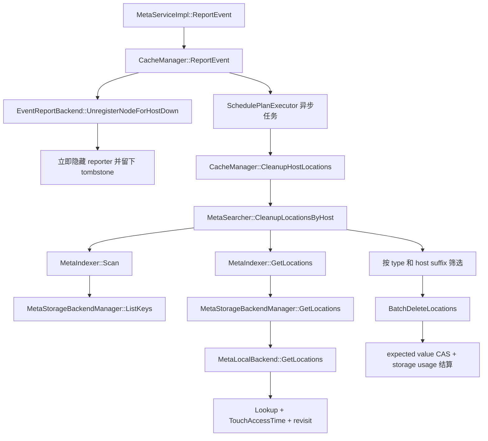
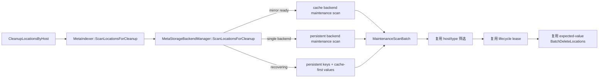

# ReportEvent HOST_DOWN 清理不扰动 LRU 设计

| 项目 | 内容 |
|---|---|
| 状态 | 已实现并完成设计自审、代码审查与关联测试 |
| 更新时间 | 2026-08-29 |
| 涉及模块 | `manager`、`meta` |
| 目标 | HOST_DOWN 稳态全量扫描不刷新无关 key 的访问时间与 LRU 顺序 |

## 1. 结论

问题成立。`EVENT_HOST_DOWN` 会先把 reporter 从节点生命周期表中注销，再异步执行全量 metadata 清理。当前清理按页执行 `Scan/ListKeys -> GetLocations`，而 cached/local backend 的 `GetLocations` 走在线读取路径，会同时：

- 调用 LRU cache 的 `Lookup`，把读到的 key 移到 LRU 头部；
- 调用 `MetaMemCacheItem::TouchAccessTime()`；
- 记录 revisit interval。

因此稳态下的一次 HOST_DOWN 会把扫描到的所有 key 伪装成刚被业务访问过。即使绝大多数 key 不包含该 host 的 Location，它们的 LRU、`PROPERTY_LRU_TIME` 和 revisit 统计也会被改写，后续容量回收顺序和访问统计失真。

修复复用已有 `MaintenanceScanBatch` 和各 backend 的 `ScanLocationsForMaintenance`，只在 `MetaStorageBackendManager`/`MetaIndexer` 增加一个当前可见视图的窄转发接口。稳态和 single-backend 使用无访问副作用扫描；双 backend recovery 期间保留原 cache-first Location 可见性。HOST_DOWN 的筛选、生命周期 lease、expected-value CAS、批量删除、storage usage 结算均保持不变。

## 2. 当前调用链与根因



具体行为如下：

1. `CacheManager::ReportEvent` 要求 HOST_DOWN 是请求中的唯一事件。
2. `UnregisterNodeForHostDown` 原子捕获 generation、注销 reporter 并留下 tombstone；查询从此立即隐藏该 reporter。
3. 清理任务调用 `CleanupHostLocations`，校验当前 backend incarnation 和 generation，然后取得 lifecycle cleanup lease。
4. `CleanupLocationsByHost` 分页扫描 instance 内 key，对每页再调用普通 `GetLocations`，筛选 `storage_type` 匹配且 location id 以后缀形式归属于目标 host 的 Location。
5. 删除携带扫描时的完整 Location JSON。若同一稳定 location id 已被新生命周期刷新，现有 RMW 返回 `EC_MISMATCH`，不会误删新值。

根因不是 HOST_DOWN 的注销、筛选或删除逻辑，而是后台维护扫描复用了带在线访问语义的 `GetLocations`。

### 2.1 影响边界

- 受影响：local backend，以及 Redis 前带完整 local cache mirror 且处于 `kRunning` 的双 backend 模式。
- 直接影响：扫描 key 的 cache LRU 链、`last_access_time`、revisit histogram，以及依赖这些状态的回收顺序/分析。
- 不影响：reporter 的立即不可见、Location expected-value CAS、实际 metadata 删除正确性。
- 删除命中的 key 仍会经过既有 RMW/写入链路。该 key 本身发生 metadata mutation，沿用原写路径的访问时间行为；本方案消除的是对所有未命中、未修改 key 的全量扰动。

## 3. 设计约束

1. 不给在线 `Get`/`GetLocations` 增加 `touch_lru` 布尔参数，避免热路径新增分支并把维护语义扩散到所有调用方。
2. 不复制一套 backend 扫描实现，复用已有 `MaintenanceScanBatch` 和 `MetaStorageBackend::ScanLocationsForMaintenance`。
3. HOST_DOWN 必须保持原可见视图：cache mirror 完成后扫描 cache；recovery 期间以 persistent key 集合配合 cache-first Location 读取；single-backend 直接扫描 persistent。
4. 不把双 backend HOST_DOWN 无条件改成 authoritative persistent scan。异步 Redis 写可能已经被请求接受并进入本地 cache，但尚未被 consumer 刷入 Redis；persistent-only Location 读取会漏掉较新的值，进而缺少排在异步 ADD 后面的 DELETE。
5. 不改变生命周期锁序、异步调度、host/type 筛选、条件删除和错误聚合语义。
6. Instance 隔离保持不变；扫描仍由对应 instance 的 `MetaIndexer` 完成。

## 4. 方案

### 4.1 复用 backend 的无副作用扫描

各 `MetaStorageBackend` 已实现：

```cpp
ErrorCode ScanLocationsForMaintenance(RequestContext *request_context,
                                      const std::string &cursor,
                                      int64_t limit,
                                      MaintenanceScanBatch &out) noexcept;
```

其约定是一次返回位置对齐的 `next_cursor`、`keys`、`locations` 和 `location_results`，并且不更新在线 LRU/access/revisit，也不回填其他 cache tier。本地实现通过 `ApplyToSingleShard` 在 item 读锁下复制 LocationMap，不调用 `Lookup` 或 `TouchAccessTime`；Redis/Async Redis 实现直接从 Redis 读取，本身没有 local LRU 副作用。

### 4.2 新增当前可见视图路由

现有 `MetaStorageBackendManager::ScanLocationsForMaintenance` 固定读 persistent backend，服务于后台 GC 的 authoritative scan，不能修改其语义。

新增窄接口 `ScanLocationsForCleanup`：

```text
无 cache backend
  -> persistent_backend->ScanLocationsForMaintenance(...)
cache backend 存在 && recover_state == kRunning
  -> cache_backend->ScanLocationsForMaintenance(...)
cache backend 存在 && recover_state == kRecover
  -> persistent_backend->ListKeys(...)
  -> 既有 cache-first GetLocations(...)（cache miss 回源 persistent）
```

稳态与 single-backend 路径把 `ListKeys + online GetLocations` 融合为 backend 已有的无副作用扫描。recovery 期间保留原来的混合视图，因为此时 accepted async write 可能已经更新 cache、对应 Redis 命令仍在队列中；改成 persistent-only 会漏读新值。recovery 尚未完成时 LRU 本身仍在被 backfill 构建，该短暂路径允许继续触碰 cache，避免为了消除初始化阶段副作用而改变清理正确性。

多页扫描在首个非终止 cursor 中编码所选扫描源，后续页先还原 backend 原始 cursor，再继续使用同一来源。这样 recovery 在清理过程中晋升为 running 时，不会把 persistent cursor 误传给 cache backend；扫描完成仍返回既有的 `SCAN_BASE_CURSOR`，上层循环无需增加状态或分支。

为避免重复清空和返回 shape 校验，`MetaStorageBackendManager` 提取私有 `ScanLocationsFromBackend` 与 `FinalizeLocationScan`；authoritative maintenance scan 与 cleanup scan 只负责选择或组装 backend 结果，公共 helper 只做一次结果契约校验。

`MetaIndexer::ScanLocationsForCleanup` 只做窄转发。批大小已经由 `CleanupLocationsByHost` 将 0 归一为 1000，返回 shape 已由 backend manager 保证，因此这一层不重复做相同校验。

### 4.3 HOST_DOWN 清理循环

`MetaSearcher::CleanupLocationsByHost` 将每页：

```text
Scan -> GetLocations -> filter -> conditional delete
```

替换为：

```text
ScanLocationsForCleanup -> filter -> conditional delete
```

处理规则：

- `location_results[i] != EC_OK`：本页标记 partial failure，跳过该 key；
- Location 指针为空：保持现有 fail-closed 行为，标记 partial failure；
- type 或 host suffix 不匹配：跳过，不产生删除请求；
- 匹配：继续携带 `ToJsonString()` 作为 expected value；
- scan 调用失败：保持现有行为，终止后续分页并返回 partial failure；
- `next_cursor == SCAN_BASE_CURSOR`：结束扫描。

生命周期控制不变：每页开始检查 `should_abort`，真正删除前获取 cleanup lease；generation 或 backend incarnation 已变化时成功取消旧清理。

### 4.4 修复后调用链



## 5. 并发与一致性

无副作用扫描不是事务快照，保持现有 cursor/SCAN 的弱一致语义：并发写入可能使一轮重复或漏过 key。HOST_DOWN 的安全性来自已有两层 fencing，而不是依赖扫描快照：

1. lifecycle cleanup lease 保证旧 generation 的清理不能跨过重新 REGISTER；
2. expected Location JSON 保证扫描后被刷新过的同名 Location 不会被旧任务删除。

双 backend `kRunning` 时继续扫描 local 完整镜像，保留已接受但尚未落 Redis 的异步写。recovery 尚未完成时继续使用 persistent key 集合和 cache-first Location 读取，保持旧链路对已接受更新的可见性。首个分页结果将上述来源固定到本轮 cursor，状态晋升不会跨 backend 解释 cursor。随后删除仍复用原 RMW 写链路，同一 key 的异步队列顺序保持 ADD 在 DELETE 之前。

## 6. 错误处理与可观测性

不新增 retry、降级分支或重复 shape 判断：

- backend manager 统一校验 `next_cursor` 非空及三个向量等长；
- MetaSearcher 只消费已对齐的 batch，并按 `location_results` 维持原 partial failure 语义；
- `EC_NOENT`、读取错误、空 Location 均不作为删除依据；
- `EC_MISMATCH`/`EC_NOENT` 删除结果继续视为并发收敛，不升级为清理失败；
- 沿用现有 HOST_DOWN cleanup 日志，不新增高基数指标。

## 7. 代码改动

| 文件 | 改动 |
|---|---|
| `kv_cache_manager/meta/meta_storage_backend_manager.{h,cc}` | 增加 cleanup-view 扫描路由，并抽取一次公共 backend 调用/shape 校验 |
| `kv_cache_manager/meta/meta_indexer.{h,cc}` | 增加窄转发 `ScanLocationsForCleanup` |
| `kv_cache_manager/manager/meta_searcher.cc` | HOST_DOWN cleanup 改为直接消费 `MaintenanceScanBatch` |
| `kv_cache_manager/manager/test/meta_searcher_test.cc` | 增加 HOST_DOWN host cleanup 不刷新无关 key LRU/access time 的回归测试 |
| `kv_cache_manager/meta/test/meta_storage_backend_manager_test.cc` | 覆盖 cleanup-view 路由、recovery 可见性和跨页来源固定 |
| `docs/README.md` | 索引本文档 |

不修改 service/protocol、EventReportBackend、CacheManager 调度和 backend 虚接口，也不更新模块依赖图，因为模块职责和依赖方向没有变化。

## 8. 测试方案

### 8.1 RED 回归测试

在 pure-local `MetaSearcherTest` 中写入三个 key：一个包含目标 host Location，两个只包含其他 host Location。记录两个无关 key 的 `MetaMemCacheItem::last_access_time`，等待时间戳可区分后调用 `CleanupLocationsByHost`。

修复前：普通 `GetLocations` 会刷新两个无关 key，测试失败。

修复后验证：

- 目标 host Location 被删除；
- 其他 host Location 保留；
- 两个无关 key 的 `last_access_time` 与清理前完全一致。

该断言同时覆盖导致顺序污染的 `Lookup/TouchAccessTime` 路径；已有 backend 单测继续保证 maintenance scan 自身不 touch LRU。

### 8.2 定向与关联测试

1. `MetaSearcherTest`：清理筛选、expected-value CAS、storage usage 和新增 LRU 回归。
2. `MetaStorageBackendManagerTest`：authoritative maintenance scan 语义不变，并覆盖 cleanup-view 在 cache ready 时扫描 cache、recover 时使用 persistent keys/cache-first values，以及 recovery 在分页间晋升时仍固定原扫描源。
3. `CacheManagerTest`：HOST_DOWN generation/backend incarnation/snapshot 并发回归。
4. `MetaLocalBackendTest`：无副作用 maintenance scan 回归。

最终验证使用 `--cache_test_results=no --test_output=errors`，确保不是 Bazel 缓存结果。

## 9. 设计自审

已按以下风险完成设计复核：

- **不能 persistent-only**：会漏掉已 accepted、仍在 Async Redis 队列中的较新 Location；方案在稳态扫描完整 cache mirror，在 recovery 期间保留 persistent keys/cache-first values。
- **recovery 不能强求完全 no-touch**：cache 尚未形成完整镜像，又没有按给定 key 无副作用读取的通用原语；保留旧读取链路比引入全 cache 重扫、热路径模式参数或漏删异步更新更安全。稳态和 single-backend 才使用融合 no-touch scan。
- **不能改变现有 maintenance API 语义**：GC 依赖 authoritative persistent scan；方案新增 cleanup-view 窄接口，不改旧接口。
- **不能给 Get 增加模式开关**：会增加在线热路径分支并扩散调用方；方案复用 backend 已有无副作用扫描。
- **不能仅扫描 key 后逐 key no-touch get**：backend 已能融合返回 key+Location，重复接口和 I/O 没有必要。
- **不能移除并发保护**：lifecycle lease、backend incarnation、generation、expected-value CAS 全部保留。
- **不能在分页中切换 backend**：Redis/dummy 与 local cursor 都是 backend 私有语义；cleanup cursor 固定首选来源，防止 recovery 晋升时跨 backend 续扫。
- **不重复校验**：batch shape 只在 backend manager 校验；上层只处理每项业务错误。
- **范围控制**：本次只修复 HOST_DOWN 全量扫描。Snapshot stale cleanup 的 `Scan + GetLocations` 也属于后台读取，可后续复用同一 cleanup-view 接口；为降低本次行为变更面，不在同一改动中重构其删除/提交语义。
