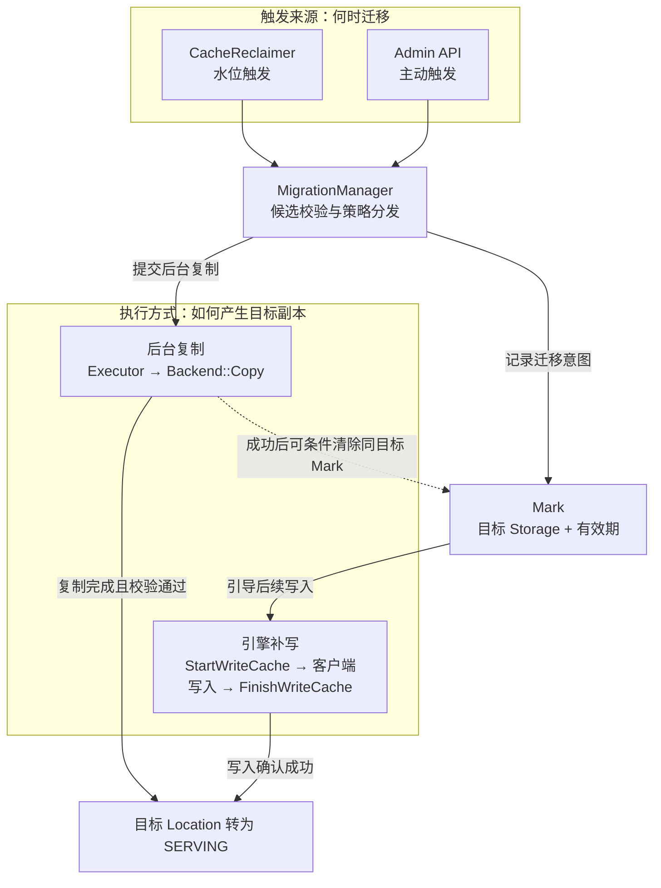

# 分层存储设计

本文描述 KVCache Manager（KVCM）的分层存储方案，以 Tair MemPool DRAM 热层和 SSD 冷层为例。

更新日期：2026-10-08。接口与配置示例基于 `6c463548`；完整配置见附录 A，迁移操作见附录 B。

相关文档：[基本概念](basic_concepts.md)、[模块架构](module_architecture.md)、[配置指南](../configuration.md)。

## 1. 背景与目标

热层容量有限，单层缓存达到水位后需要逐出数据；这些数据再次被访问时，可能需要重新计算 KVCache。引入容量更大、单位成本更低的冷层后，可以把部分数据保留下来，扩大可复用的缓存范围。

分层存储需要解决三个问题：何时迁移、如何产生目标副本，以及何时回收源副本。目标是在控制热层容量的同时提高整体命中率，并限制后台迁移对在线读写的影响。实际收益需要结合访问分布、层间读写性能和迁移成本验证。

## 2. 总体方案

在 manager 层新增 MigrationManager，统一处理水位触发和 Admin 主动触发的迁移请求，负责候选校验、执行方式分发、Copy 任务生命周期和目标写入标记的管理。

MigrationManager 与现有模块协作：CacheReclaimer 根据水位选择迁移候选，Admin 请求经 CacheManager 转交；后台复制复用 SchedulePlanExecutor，引擎补写复用 StartWriteCache / FinishWriteCache，副本位置和状态由 meta 层维护。

触发来源决定何时选择哪些 Block 迁移，执行方式决定如何产生目标副本，两者相互独立。水位触发和 Admin 主动触发都可以提交 Copy 或记录 Mark。



Mark 只记录目标副本需求。已打标的 Block 既可以通过后续引擎写入满足需求，也可以由后来独立发起的 Copy 产生副本；图中的虚线表示条件清标，不表示 Mark 会自动派生 Copy。

| 产生副本的方式 | 数据来源与适用场景 | 主要代价或条件 |
|---|---|---|
| 后台 Copy | 从已有源副本复制，适合主动建立目标副本 | 产生源层读取和目标层写入，需要控制后台并发 |
| 引擎补写 | 复用引擎持有的 KVCache，在后续写入时按 Mark 补到目标层 | 依赖后续写请求，并增加该次写入的数据量 |

迁移沿用现有元数据模型：同一个 Block 可以有多个 CacheLocation，分别位于不同 Storage。目标数据写入期间为 `WRITING`，确认可读后转为 `SERVING`。一个 Location 可以只包含部分 specs，即 Block 的数据组成部分，例如不同 TP 分片的数据。

迁移和缓存复用都限定在同一 Instance 内。Instance Group（下文简称 Group）是共享配额和迁移配置的范围，属于同一 Group 不代表跨 Instance 复用缓存。

## 3. 读写与迁移流程

### 3.1 前台读写

读取沿用原有 Block key 和位置查询接口。Manager 从可服务的副本中选择 CacheLocation，客户端按返回位置加载数据。普通查询过滤状态、数据存在性和可用性后按权重随机选择；DRAM 和 SSD 的默认权重相同，当前没有热层优先的读取策略。冷层命中也不会自动在热层补副本。

普通写入从 Group 的 `storage_candidates` 中，结合可用性、配额和写入偏好选择 Storage，继续使用 `StartWriteCache → 客户端写数据 → FinishWriteCache`。`data_storage_strategy`（内部名为 `cache_prefer_strategy`）只影响写入选择，配置分层不会让每次写入自动写穿两层。

有有效 Mark 时，写入流程会检查指定目标上的数据覆盖情况，缺少时申请目标位置。它表达的是“指定层需要一份副本”，与 `min_replica_count` 表达的普通副本数量不同：即使普通副本数已满足，仍可能需要补写目标层。

### 3.2 触发迁移

自动触发由 CacheReclaimer 周期检查水位，采样后按 LRU 选择候选。迁移阈值和回收阈值分别配置。例如，迁移阈值设为 70%、回收阈值设为 85%：

| 源类型水位 | 行为示例 |
|---|---|
| 低于 70% | 不触发该规则的自动迁移 |
| 达到 70%、低于 85% | 允许迁移，尽量在逐出前产生冷层副本 |
| 达到或超过 85% | 回收和迁移都可运行，同一轮优先提交回收 |

阈值判断包含相等，代码比较使用 `1e-9` 的浮点容差。水位是 Group 内源 Storage 对应类型的逻辑用量除以该类型配额，同类型的多个 Storage 共享统计。上表假设其他回收维度未超限，且没有在途删除量抵扣；回收还会检查 Group 总字节数、总 key 数和其他类型用量，不能只根据这一比例判断是否回收。

同一轮已经提交删除的 Location 会从迁移候选中排除。元数据复核、目标空间创建和 Copy 在后台执行，避免阻塞回收调度线程。

主动触发通过 Admin `MigrateCache` 指定 Instance、源、目标和 `COPY / MARK / BOTH`，候选可以是指定 Block，也可以按数量采样。它不受自动迁移水位限制，但仍做候选、目标和并发校验；`MARK/BOTH` 要求 Group 已配置迁移规则。接口只返回提交或打标结果，具体示例见附录 B。

### 3.3 Copy：后台复制

1. 选中源 Location，校验其可读、目标尚未覆盖所需 specs，并检查目标存储、配额及 Group Copy 并发限制。
2. 按源 Location 的 specs 申请目标空间，创建 `WRITING` Location，由 Executor 调用 Backend 的 `Copy`。一次 Copy 可以只复制 Block 的部分 specs。
3. 复制完成后，复核源 Location 的身份和可读状态；校验通过才把目标转为 `SERVING`。
4. 条件清除同目标的既有 Mark，并按保留策略处理源副本。

| 保留策略 | 行为与取舍 |
|---|---|
| `DELETE_SOURCE` | 目标可读后异步提交源副本删除，用于释放源层空间；Copy 成功时物理删除可能尚未完成 |
| `KEEP_BOTH` | 保留冷热两份副本，后续由容量回收处理；需要同时占用两层容量 |

自动迁移使用规则中的 `retention`。Admin `MigrateCache` 没有 retention 参数，Copy 默认使用 `DELETE_SOURCE`。

Copy 和 Mark 同时启用时，优先提交 Copy；符合条件但未获得 Copy 名额或同步提交失败的 Block 可以回退为 Mark。已提交 Copy 的异步失败按失败清理流程处理。

### 3.4 Mark：引导后续补写

1. 将目标 Storage 和有效期写入 Block 元数据；一个 Block 同时保存一个目标标记。
2. 后续 `StartWriteCache` 检查目标上 `SERVING/WRITING` Locations 的联合 specs。指定 spec group 时检查该组，否则检查 Instance 注册的全部 specs；覆盖不足才申请补写。
3. 客户端完成写入，由 `FinishWriteCache` 确认目标可读，并按 Group 的清标策略处理 Mark。

| FinishWrite 清标策略 | 含义 |
|---|---|
| `CLEAR_ON_NEXT_WRITE_SUCCESS` | 本次目标 Location 成功变为 `SERVING` 后清标，默认策略 |
| `CLEAR_ON_FULL_BLOCK_COVERED` | 目标 Storage 上可读 Locations 合计覆盖完整 Block 的 specs 后清标 |

如果目标已覆盖所需 specs，不再因 Mark 申请补写，但普通副本数不足时仍可能写入。仅打标而没有后续写入或独立 Copy，不会产生目标副本。

引擎补写完成后只处理 Mark，源副本由容量回收处理；若由独立 Copy 完成，则使用该 Copy 的源副本保留策略。并发清标和失败场景见 5.2 节。

### 3.5 与容量回收协同

Copy 的“目标可读后再删除源副本”只约束迁移任务自身。容量回收独立运行，不会等待每个 Block 都迁移成功；达到回收阈值时，即使尚无冷层副本，热层副本也可能被逐出。当前没有必须保留最后一份缓存的约束。

| 容量限制 | 回收行为 |
|---|---|
| 仅 Group 总量超限 | 对冷热层都有可读副本的 Block，保留冷副本，只回收其 specs 已被冷层完整覆盖的热副本 |
| 某个 Storage Type 超限 | 回收该类型的数据，不要求另一层已有完整副本；SSD 超限时也会回收冷层缓存 |

仍在写入的冷副本不能作为完整可读副本使用。活跃 Copy 的 `WRITING` 目标会被回收和 GC 识别，避免被当成无人继续写入的残留数据清理；源副本仍可能被回收，Copy 完成时会再次复核。

## 4. 配置与运行期变更

### 4.1 关键配置

附录 A 给出“注册两层 Storage → 创建 Group”的完整 Admin 请求。示例将两层都加入 `storage_candidates`，普通写入优先 DRAM，允许按写入策略回退到 SSD；自动迁移为 DRAM → SSD，Copy 和 Mark 同时开启。

| 配置项 | 作用与默认行为 |
|---|---|
| `storage_candidates` | 普通写入候选，也参与后端不可用时的读写选址；完整例子包含冷热两层 |
| `quota.capacity` / `quota.quota_config` | Group 总容量及各 Storage Type 容量，单位 byte；自动迁移需要源类型的正配额 |
| `migration_config.strategies` | 默认空，不启用自动迁移；同一 Group 中源/目标组合必须唯一，源和目标不同 |
| `trigger_threshold` | 自动迁移阈值，必须显式设置，范围为 `0 < 值 < 1` |
| `method_configs.copy/mark.enabled` | 单条规则至少开启一种方式；同时开启时 Copy 优先 |
| `copy_max_concurrency` | Group 的活跃 Copy 上限，默认 `1`，必须大于 `0` |
| `mark.timeout_ms` | 新 Mark 的有效期，默认 `86400000`（24 小时）；开启 Mark 时必须大于 `0` |
| `mark_clear_policy` | 默认 `MIGRATION_MARK_CLEAR_ON_NEXT_WRITE_SUCCESS`，控制 FinishWrite 清标 |
| `retention` | 开启 Copy 时必须明确指定，取值与行为见 3.3 节 |

DRAM 使用 `ST_TAIRMEMPOOL`（`media_type=2`），SSD 使用 `ST_TAIRMEMPOOL_SSD`（`media_type=5`）。示例为两类存储都配置正容量，使两层都纳入类型水位和配额管理。配额按逻辑用量检查，不为每笔迁移预留字节。

SSD 仅作为迁移目标时可以不在 `storage_candidates` 中，但后端不可用时的选址以及删除规则后的客户端配置都会受该列表影响，见 4.2 和 5.2 节。多条 `hot → warm → cold` 规则分别触发，不构成一次原子的多跳迁移。

本文 JSON 使用 Admin protobuf 字段：`data_storage_strategy`、`method_configs` 和枚举名。startup / 内部模型使用 `cache_prefer_strategy`、`methods` 和整数枚举，两种格式不能直接混用。

### 4.2 默认行为、修改与停用

| 操作 | 对后续流程和已有任务的影响 |
|---|---|
| 不配置迁移规则 | 不自动迁移，也不在前台消费 Mark；普通读写继续运行，Admin `COPY` 仍可主动提交 |
| 修改阈值、方式或保留策略 | 后续调度读取新配置；排队中的 Prepare 会复核路由及执行配置，但不重新计算触发水位。配置更新不是所有任务的原子切换点 |
| 删除一条规则 | 后续不再按该规则迁移；尚未执行的 Prepare 发现路由已删除后退出，已提交 Copy 按任务快照继续执行 |
| 关闭某条规则的 Mark | 停止该规则后续自动打标；只要 Group 仍有迁移规则，前台仍会消费有效的既有 Mark |
| 清空全部规则 | 停止后续自动迁移和前台 Mark 引导/Finish 清标；不主动删除既有 Mark、在途 Copy 或已迁移副本 |

单条规则不能同时关闭 Copy 和 Mark，也不能将并发设为 0；停用自动迁移应删除对应规则。调整 Mark timeout 只影响新标记，已有标记保留原有效期。关闭自动 Copy 不限制独立 Admin `COPY` 请求。

删除规则前需确认冷层仍在所需客户端的存储配置中：下发配置来自 `storage_candidates` 与迁移规则源/目标的并集。规则删除也会改变回收时识别“冷层”的范围，因此停用迁移不等于冻结已有副本的访问与回收行为。

更新 Group 是完整对象替换，并带版本校验；应先读取当前对象、保留其他字段、修改后提交，再回读确认，步骤见附录 A。

## 5. 并发、异常与观测

### 5.1 并发控制

`copy_max_concurrency` 在 Group 内由自动迁移和 Admin Copy 共享。迁移准备、Copy 和清理共用 SchedulePlanExecutor；进程级 `migration_worker_budget` 必须小于总 worker 数，为回收和系统任务保留执行机会。服务参数见[配置指南](../configuration.md)。

### 5.2 异常处理与恢复

| 场景 | 处理方式 |
|---|---|
| Copy 失败或完成时源副本已失效 | 目标不转为可读，异步尝试清理；已提交 Copy 的失败不自动转为 Mark |
| 源删除或失败目标清理失败 | 清理可能停留在中间状态，Copy 成功不代表容量已经释放 |
| Mark 查询失败、目标暂时不可用或配额已满 | 在写入过滤阶段改用普通写入判定，保留 Mark；本次写入能否成功仍取决于后续分配 |
| Mark 过期、畸形或目标已注销 | 尝试条件清标，不再按该标记引导写入 |
| Leader 降级或进程重启 | 停止接收新迁移，旧代次准备任务退出；Copy 任务表不持久化，重启不续跑原任务 |
| 遗留 `WRITING` | 有可扫描元数据时，可在满足容量回收条件或达到 GC 孤儿宽限期后被异步清理；没有元数据的物理孤儿和长期 `DELETING` 不在这条恢复路径内 |

清标只更新目标和有效期仍匹配的标记。Copy 使用提交时的快照，成功时可以清除同目标 Mark，不受 FinishWrite 的清标策略或完整 Block 覆盖要求约束。FinishWrite 读取完成时的当前标记，因此先开始的普通写入，也可能满足后来建立的 Mark。标记随元数据保存，恢复能力服从所选元数据后端的持久化语义。

停止或取消管理侧任务不代表底层 Copy I/O 已被强制终止。GC 的完整扫描与清理范围见[后台 GC 设计](cache_garbage_collector.md)。

后端可用状态与写满需要区分：逻辑配额耗尽限制新分配，不会因此把后端标记为不可用；物理写满是否影响 `Available()`，取决于具体后端。只要后端仍可用，热层写满本身不会阻断冷副本读取。

当前还有一个候选配置边界：若 `storage_candidates` 只有 DRAM，而 SSD 仅作为迁移目标，DRAM 被判定为不可用后，普通查询可能在查询副本位置前就因“没有可用候选”报错。写入在处理 Mark 前也经过该检查。附录 A 将两层都加入候选列表，避免这种配置组合。

### 5.3 观测

| 指标 | 观察内容 |
|---|---|
| `migration.tasks_submitted_total` / `migration.tasks_active` | Copy 提交量与当前活跃量 |
| `migration.tasks_completed_total` | Copy 完成量，按 `status` 区分成功、失败和取消 |
| `migration.copy_bytes_total` | 成功 Copy 的逻辑字节数 |
| `migration.copy_duration_ms` | 最近一次成功 Copy 的耗时，Gauge |
| `migration.marks_active` / `migration.marks_consumed_total` / `migration.marks_expired_total` | Mark 的活跃、消费和过期情况；活跃数是进程内近似统计 |

这些指标用于观察当前进程的整体迁移情况，不能代替单个任务状态或 SSD 实际写入量。定位具体 Block 时需结合日志、目标层位置查询和实际数据读取，示例见附录 B。

## 6. 验证范围

仓库中的 [MigrationManager 测试](../../kv_cache_manager/manager/test/migration_manager_test.cc)、[CacheManager 测试](../../kv_cache_manager/manager/test/cache_manager_test.cc)和 [Reclaimer 测试](../../kv_cache_manager/manager/test/cache_reclaimer_test.cc)覆盖以下行为：

- Copy 成功、失败、源副本变化，以及源副本保留策略。
- Mark 消费、过期、条件清标和不同 spec 覆盖情况。
- 并发限制、在途任务保护及容量回收协同。

部署验收还需提供端到端结果：

| 场景 | 验证重点 |
|---|---|
| Copy 与引擎补写 | 目标数据内容正确，写完前不可读，完成后可通过位置查询加载 |
| 容量压力 | 热层容量变化、冷热副本回收，以及迁移期间已有缓存的读取 |
| 配置变更与异常 | 删除规则、后端不可用、Leader 切换和任务失败时符合本文行为 |
| 性能对比 | 同资源和负载下，对比单层、分层未迁移、分层迁移中的命中率、前台 p99、数据带宽与 TTFT |

代码测试覆盖不代表目标部署已经完成上述验收。性能结果需注明版本、容量配额、负载与并发配置；元数据接口耗时不能代替实际数据加载耗时。

## 附录 A：完整配置示例

Storage 和 Group 配置请求发往 Leader 的 Admin HTTP 端口，Instance 注册发往 Meta HTTP 端口，均使用 `POST` 和 `Content-Type: application/json`。服务启动参数沿用[配置指南](../configuration.md)。域名、容量和名称均为示例，需按部署替换。

### A.1 注册 DRAM 和 SSD

`POST /api/addStorage`，注册 DRAM：

```json
{
  "trace_id": "tiered-add-dram",
  "storage": {
    "global_unique_name": "hot_dram",
    "storage_type": "ST_TAIRMEMPOOL",
    "tair_mem_pool": {
      "domain": "mempool-meta.example:8080",
      "timeout": 5000,
      "media_type": 2
    }
  }
}
```

再次调用 `POST /api/addStorage`，注册 SSD：

```json
{
  "trace_id": "tiered-add-ssd",
  "storage": {
    "global_unique_name": "cold_ssd",
    "storage_type": "ST_TAIRMEMPOOL_SSD",
    "tair_mem_pool": {
      "domain": "mempool-meta.example:8080",
      "timeout": 5000,
      "media_type": 5
    }
  }
}
```

两层可使用同一 Tair MemPool 服务地址、不同介质。SSD 必须同时指定 `ST_TAIRMEMPOOL_SSD` 和 `media_type=5`，两层的数据面 URI 仍使用 `pace://`。

### A.2 创建 Group

`POST /api/createInstanceGroup`。以下为完整请求，容量单位为 byte。示例使用 local 元数据后端，其索引不跨进程持久化；实际部署应沿用所需的元数据持久化配置。

```json
{
  "trace_id": "tiered-create-group",
  "instance_group": {
    "name": "tiered_demo",
    "storage_candidates": ["hot_dram", "cold_ssd"],
    "global_quota_group_name": "tiered_demo_quota",
    "max_instance_count": "100",
    "version": "1",
    "quota": {
      "capacity": "1000000000000",
      "quota_config": [
        {"storage_type": "ST_TAIRMEMPOOL", "capacity": "200000000000"},
        {"storage_type": "ST_TAIRMEMPOOL_SSD", "capacity": "800000000000"}
      ]
    },
    "cache_config": {
      "data_storage_strategy": "CPS_PREFER_TAIR_MEMPOOL",
      "reclaim_strategy": {
        "storage_unique_name": "hot_dram",
        "reclaim_policy": "POLICY_LRU",
        "instance_reclaim_budget_policy": "GROUP_LRU",
        "trigger_strategy": {"used_percentage": 0.85},
        "delay_before_delete_ms": 1000
      },
      "meta_indexer_config": {
        "max_key_count": "1000000",
        "mutex_shard_num": "16",
        "batch_key_size": "128",
        "meta_storage_backend_config": {
          "storage_type": "local",
          "storage_uri": ""
        }
      },
      "migration_config": {
        "copy_max_concurrency": 4,
        "mark_clear_policy": "MIGRATION_MARK_CLEAR_ON_NEXT_WRITE_SUCCESS",
        "strategies": [
          {
            "source_storage_name": "hot_dram",
            "target_storage_name": "cold_ssd",
            "trigger_threshold": 0.70,
            "method_configs": {
              "copy": {"enabled": true},
              "mark": {"enabled": true, "timeout_ms": "60000"}
            },
            "retention": "MIGRATION_RETENTION_KEEP_BOTH"
          }
        ]
      }
    }
  }
}
```

本例使用 `KEEP_BOTH`：达到迁移水位后先补充 SSD 副本，DRAM 容量由后续水位回收释放。`reclaim_strategy.storage_unique_name` 虽为必填字段，回收仍按 Group 和 Storage Type 水位判断，不只针对该名称的 Storage。

示例中的元数据数值字段需要保留，不能把内部模型默认值直接套用到省略字段的 Admin 请求。

### A.3 注册 Instance

向 Meta HTTP 端口发送 `POST /api/registerInstance`：

```json
{
  "trace_id": "tiered-register-instance",
  "instance_group": "tiered_demo",
  "instance_id": "instance-a",
  "block_size": 16,
  "location_spec_infos": [
    {"name": "tp0", "size": "1048576"}
  ],
  "model_deployment": {
    "model_name": "demo-model",
    "dtype": "float16"
  }
}
```

模型名、dtype 和 1 MiB 的 spec 大小仅用于说明接口；真实接入应使用 Connector 按实际模型生成的注册参数。注册完成后按现有写入流程产生缓存；附录 B 假设待迁移 Block 已有源副本。

### A.4 修改已有 Group

先调用 `POST /api/getInstanceGroup`：

```json
{
  "trace_id": "tiered-get-group",
  "name": "tiered_demo"
}
```

取出响应中的完整 `instance_group`，保留其他配置并修改迁移字段。假设读到版本 `N`，将对象的 `version` 改为 `N+1`，用以下字段向 `POST /api/updateInstanceGroup` 提交：

| 请求字段 | 填写内容 |
|---|---|
| `trace_id` | 本次更新的跟踪标识 |
| `current_version` | 刚读取的版本 `N` |
| `instance_group` | 修改后的完整对象，包含 `version=N+1` |

清空 `cache_config.migration_config.strategies` 可停用自动迁移，影响见 4.2 节。更新成功后再次 `getInstanceGroup` 确认；版本冲突时重新读取并合并修改。

## 附录 B：迁移操作与结果检查

Admin HTTP 和 Meta HTTP 使用不同的监听端口，虽然路径都以 `/api/` 开头。以下请求中的 int64 值使用字符串，避免 JSON 大整数精度损失。接口定义见 [Admin proto](../../kv_cache_manager/protocol/protobuf/admin_service.proto)和 [Meta proto](../../kv_cache_manager/protocol/protobuf/meta_service.proto)。

### B.1 指定 Block 迁移

向 Admin HTTP 端口发送 `POST /api/migrateCache`：

```json
{
  "trace_id": "migrate-copy-001",
  "instance_id": "instance-a",
  "source_storage_name": "hot_dram",
  "target_storage_name": "cold_ssd",
  "block_keys": ["123456789", "123456790"],
  "method": "MIGRATION_METHOD_COPY"
}
```

`method` 必须明确指定，可选 `MIGRATION_METHOD_COPY`、`MIGRATION_METHOD_MARK`、`MIGRATION_METHOD_BOTH`。Admin Copy 默认在目标可读后删除源副本，不继承附录 A 自动规则中的 `KEEP_BOTH`。

### B.2 按数量采样迁移

同样调用 Admin `POST /api/migrateCache`，不传 `block_keys`，改用采样规则：

```json
{
  "trace_id": "migrate-sample-001",
  "instance_id": "instance-a",
  "source_storage_name": "hot_dram",
  "target_storage_name": "cold_ssd",
  "rule": {"sample_count": 100},
  "method": "MIGRATION_METHOD_BOTH"
}
```

显式 `block_keys` 非空时优先使用这些 key，并忽略采样规则。采样数量省略或不大于 0 时默认 100，实际接受数取决于候选及准入结果。`BOTH` 表示 Copy 优先、未提交的候选可回退 Mark，不表示每个 Block 都同时执行两者。

`MARK/BOTH` 要求 Group 至少有一条迁移规则。新 Mark 的有效期优先取匹配且开启 Mark 的规则，否则使用默认 24 小时。

两种请求都需检查 `header.status` 和 `accepted/rejected`。返回 `OK` 可以伴随 `accepted=0`；`accepted` 表示已提交 Copy 或已打标的数量，不表示数据已经迁移完成。响应不包含任务 ID。

### B.3 查看整体指标

向 Admin HTTP 端口发送 `POST /api/getMetrics`：

```json
{
  "trace_id": "migration-metrics-001"
}
```

响应的 `metrics[]` 包含 `metric_name`、`metric_value` 和 `metric_tags`，可筛选 5.3 节的 `migration.*` 指标。开启 Prometheus 后也可读取 `/metrics`。这些是进程级指标，不能按本次请求的 `trace_id` 得到逐任务进度。

### B.4 检查目标层是否可读

向 Meta HTTP 端口发送 `POST /api/getCacheLocationsByBackend`，只查询 SSD 类型：

```json
{
  "trace_id": "migration-check-ssd",
  "instance_id": "instance-a",
  "query_type": "QT_BATCH_GET",
  "block_keys": ["123456789", "123456790"],
  "block_mask": {"offset": 0},
  "backend_selectors": [
    {
      "backend_type": "ST_TAIRMEMPOOL_SSD",
      "strategy": "LSS_WEIGHTED_RANDOM"
    }
  ]
}
```

检查 `key_locations` 中各 Block 返回的位置及 URI 是否属于目标 Storage，再由客户端加载数据验证内容。如果配置多个 SSD Storage，按类型查询不保证选中本次迁移的目标；该接口也不是 Copy 任务状态查询。

当前没有公开的逐迁移任务查询、取消或单独清 Mark 的 Admin API。`RemoveCache` 用于删除缓存，不能作为取消迁移使用。
