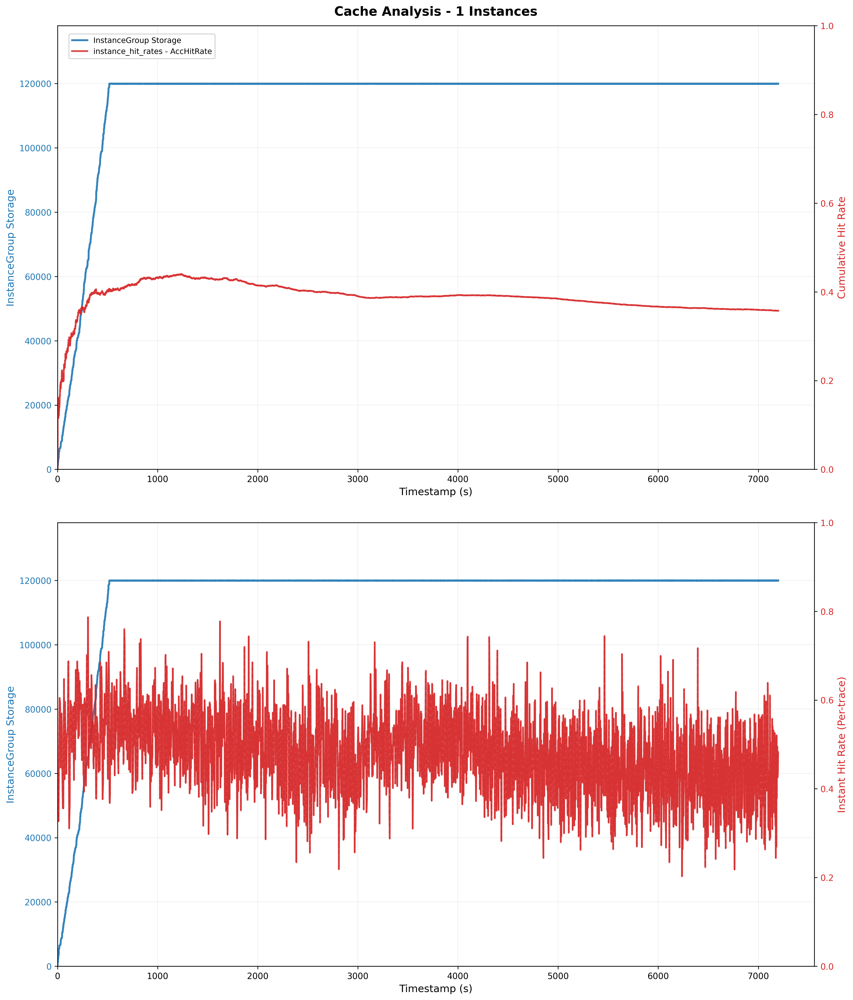
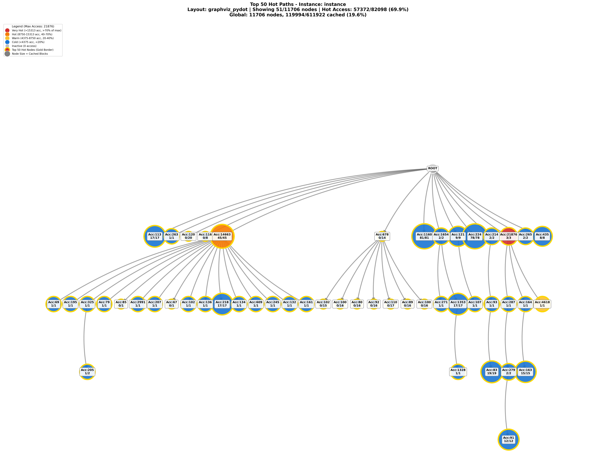
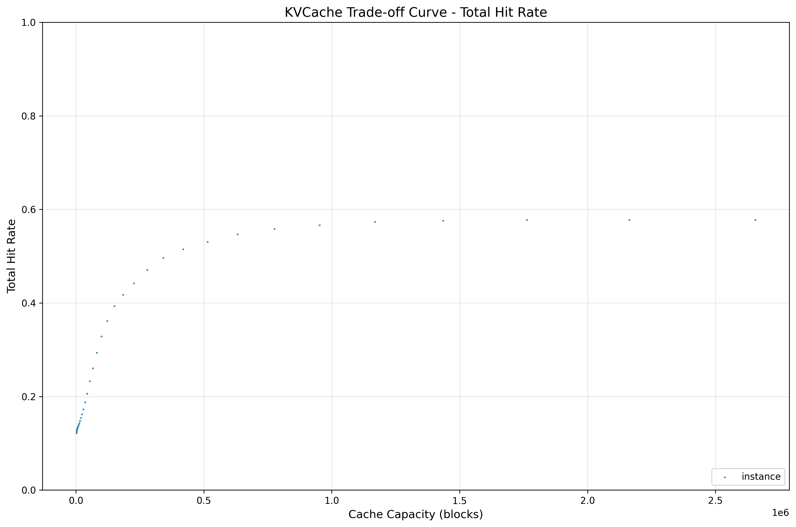
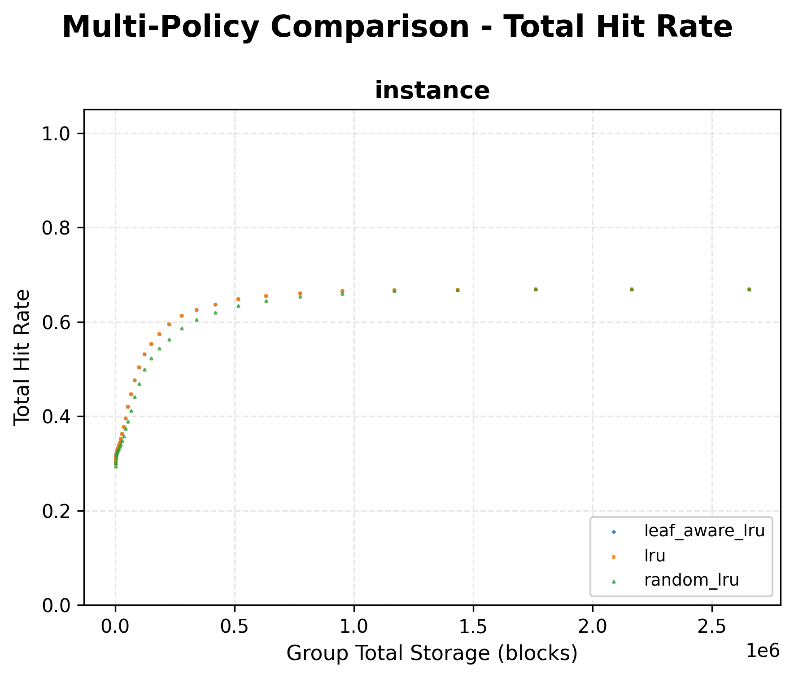

# KVCacheManager Optimizer
## 概述
KVCacheManager Optimizer 是一个独立的缓存优化分析模块，通过回放 trace 数据来模拟缓存读写操作，评估不同驱逐策略和配置对缓存命中率的影响，并为 KVCacheManager 主程序提供参数优化能力。

核心功能包括：
- Trace 数据的解析和回放
- 多种驱逐策略的模拟和对比
- 缓存命中率的实时统计和分析
- Radix Tree 索引结构的可视化

## 动机

在大语言模型（LLM）推理场景中，KV Cache 的管理对系统性能至关重要。不同的驱逐策略、缓存容量配置和存储层级设置会显著影响缓存命中率和整体推理效率。Optimizer 模块的设计动机包括：

1. **策略评估**：在生产环境部署前，通过 trace 回放评估不同驱逐策略的效果，选择最优配置
2. **参数调优**：分析缓存访问模式，为驱逐策略参数（如采样率、TTL 等）提供优化建议
3. **性能预测**：预测不同容量配置下的缓存命中率，辅助资源规划
4. **问题诊断**：通过 Radix Tree 可视化和详细统计，帮助理解缓存行为和性能瓶颈

## 特性与架构

### 核心特性

- **多种驱逐策略**：支持 LRU、RandomLRU、LeafAwareLRU 等驱逐算法
- **分层存储**：支持多层级存储配置，目前功能不完备
- **Trace 回放**：支持 Publisher Log、Qwen Bailian 等多种 trace 格式
- **详细统计**：提供命中率、缓存使用情况等详细统计
- **灵活配置**：通过 JSON 配置文件灵活配置实例、存储和策略
- **可视化分析**：支持 Radix Tree 可视化和命中率图表生成

### 架构设计

```
OptimizerManager (核心协调器)
    ├── OptEvictionManager (驱逐管理器)
    ├── OptIndexerManager (索引管理器)
    └── OptimizerRunner (Trace 执行器)
        ↓
    ├── Eviction Policies (驱逐策略)
    ├── RadixTreeIndex (索引)
    └── Trace Converter (转换器)
        ↓
    HitAnalysis (结果分析)
```


### 驱逐策略

**LRU (Least Recently Used)**
- 维护双向链表记录块的访问顺序，最近访问的块在链表头部，最久未访问的块在链表尾部

**RandomLRU**
- 结合随机采样和 LRU 策略，从缓存中随机采样一定数量的块，选择最久未访问的块进行驱逐

**LeafAwareLRU**
- 在 LRU 基础上增加了对叶子节点的感知，优先驱逐叶子节点中的块

### Trace 类型

```
OptimizerSchemaTrace (基类)
    ├── GetLocationSchemaTrace (读操作)
    │   └── DialogTurnSchemaTrace (对话轮次)
    └── WriteCacheSchemaTrace (写操作)
```

**支持的 Trace 格式**
- **Publisher Log**：KVCacheManager Event Publisher 日志，区分读写请求
- **Qwen Bailian**：百炼开源数据集格式，不区分读写请求

## 快速开始

目前 optimizer 模块的编译依赖于kvcm主程序的各种bazel配置

```bash
bazel build //kv_cache_manager/optimizer:optimizer_main
```


创建 JSON 配置文件（参考 `optimizer_startup_config_load.json`）：

```json
{
    "trace_file_path": "/path/to/trace_file",
    "trace_type": "qwen_bailian",
    "output_result_path": "/path/to/output/result/",
    "eviction_params": {
        "eviction_mode": 1,
        "eviction_batch_size_per_instance": 100
    },
    "instance_groups": [
        {
            "group_name": "instance_group_01", // 需要分析的实例组名称
            "quota_capacity": 12000,
            "used_percentage": 1.0,
            "hierarchical_eviction_enabled": false,
            "storages": [
                {
                    "unique_name": "pace_00",
                    "storage_type": "pace",
                    "band_width_mbps": 20000,
                    "priority": 0,
                    "capacity": 100000
                }
            ],
            "instances": [
                {
                    "instance_id": "instance", //需要分析的实例名称
                    "block_size": 16,
                    "eviction_policy_type": "random_lru",
                    "eviction_policy_params": {
                        "sample_rate": 0.1
                    }
                }
            ]
        }
    ]
}
```


```bash
bazel run //kv_cache_manager/optimizer:optimizer_main -- /path/to/config.json
```


运行完成后，会在 `output_result_path` 指定的目录下生成：

- `{instance_id}_hit_rates.csv` - 每个 instance 的命中率数据

### 可视化分析

Optimizer 模块提供多种可视化分析工具，用于分析缓存性能、命中率和 Radix Tree 结构。

#### 命中率随时间变化图表

运行optimizer，分析trace并绘制多实例缓存分析图表，展示所有 instance 的存储容量总和以及各自命中率随时间的变化。

```bash
bazel run //kv_cache_manager/optimizer/analysis/script:optimizer_run -- \
    -c /path/to/config.json \
    --draw-chart
```

**输出**：`{output_result_path}/multi_instance_cache_analysis.png`

#### Radix Tree 可视化

导出并可视化前缀树结构，统计并展示热节点以及所属节点的前缀路径。
具体配置见 analysis/scripts 中 export_and_visualize_tree.py

```bash
bazel run //kv_cache_manager/optimizer/analysis/script:visualize_tree -- \
    -c /path/to/config.json
```

**输出**：
- `{output_result_path}/radix_tree_{instance_id}.json` - Radix Tree 导出数据
- `{output_result_path}/radix_tree_{instance_id}.png` - Radix Tree 可视化图表

#### 单策略 Trade-off 曲线分析

生成在不同容量配置下的多个instance命中率曲线，用于评估容量与命中率的权衡关系，仅使用配置中的驱逐策略。

```bash
bazel run //kv_cache_manager/optimizer/analysis/script:tradeoff_analysis_run_by_instances -- \
    -c /path/to/config.json \
    --warmup-capacity 30000000 \
    --num-points 40 \
    --hit-rate-type total \
    --max-workers 4
```

**参数说明**：
- `-c, --config` - 配置文件路径
- `--warmup-capacity` - Warmup 阶段使用的大容量（默认 30000000）
- `--num-points` - 容量采样点数量（默认 40）
- `--hit-rate-type` - 命中率类型：total/internal/external/all（默认 total）
- `--max-workers` - 并行执行的最大线程数（默认 4）

**输出**：`{output_result_path}/pareto_curve_{hit_rate_type}.png`

#### 多策略对比分析

对比每个instance多个驱逐策略在不同容量配置下的性能表现，所有instance统一用一种类型的驱逐策略。

```bash
bazel run //kv_cache_manager/optimizer/analysis/script:tradeoff_analysis_run_by_policies -- \
    -c /path/to/config.json \
    --warmup-capacity 30000000 \
    --eviction-policies lru random_lru leaf_aware_lru \
    --num-points 40 \
    --hit-rate-type total \
    --max-workers 4
```

**参数说明**：
- `-c, --config` - 配置文件路径
- `--warmup-capacity` - Warmup 阶段使用的大容量（默认 30000000）
- `--eviction-policies` - 要对比的驱逐策略列表（默认 lru random_lru leaf_aware_lru）
- `--num-points` - 容量采样点数量（默认 40）
- `--hit-rate-type` - 命中率类型：total/internal/external/all（默认 total）
- `--max-workers` - 并行执行的最大线程数（默认 4）

**输出**：`{output_result_path}/multi_policy_{hit_rate_type}.png`

### Python 接口示例

```python
from kv_cache_manager.optimizer import OptimizerConfigLoader, OptimizerLoader, OptimizerManager

# 加载配置
config_loader = OptimizerConfigLoader()
config = config_loader.Load("/path/to/config.json")

# 创建优化器
optimizer = OptimizerManager(config)
optimizer.Init()

# 运行
optimizer.DirectRun()

# 分析结果
optimizer.AnalyzeResults()

# 单次读写操作（需要指定instance_id）
write_res = optimizer.WriteCache("instance_id", "trace_001", timestamp, block_ids, token_ids)
read_res = optimizer.GetCacheLocation("instance_id", "trace_002", timestamp, block_ids, token_ids, block_mask)

# 清空缓存（保留统计）
optimizer.ClearCache("instance_id")        # 清空指定实例
optimizer.ClearAllCaches()                 # 清空所有实例

# 清空缓存并重置统计
optimizer.ClearCacheAndResetStats("instance_id")  # 清空指定实例并重置统计
optimizer.ClearAllCachesAndResetStats()           # 清空所有实例并重置统计
```

### 配置参数说明

| 参数 | 说明 |
|------|------|
| trace_type | Trace 类型：qwen_bailian、publisher_log 或 optimizer_schema |
| eviction_mode | 驱逐模式：1=GROUP_ROUGH, 2=INSTANCE_ROUGH, 3=INSTANCE_PRECISE |
| eviction_policy_type | 驱逐策略类型：lru、random_lru、leaf_aware_lru |

### 示例

以 [Qwen-Bailian 开源数据集](https://github.com/alibaba-edu/qwen-bailian-usagetraces-anon) 为例，目前qwen-bailian数据集中没有说明instance，所以默认为1个instance，如有需要可自行修改

配置文件：
```json
{
    "trace_file_path" : "/path/to/qwen-bailian-usagetraces-anon/qwen_traceA_blksz_16.jsonl",
    "trace_type": "qwen_bailian",
    "output_result_path": "/mnt/baiyi/KVCacheManager/kv_cache_manager/optimizer/analysis/result/qwen_bailian",
    "eviction_params": {
        "eviction_mode": 1,
        "eviction_batch_size_per_instance": 100
    },
    "instance_groups" : [
        {
            "group_name": "instance_group_01",
            "quota_capacity" : 120000,
            "used_percentage" : 1.0,
            "hierarchical_eviction_enabled": false,
            "storages": [
                        {
                            "unique_name": "pace_00",
                            "storage_type": "pace",
                            "band_width_mbps": 20000,
                            "priority": 0,
                            "capacity": 100000
                        },
                        {
                            "unique_name": "hf3fs_00",
                            "storage_type": "hf3fs",
                            "band_width_mbps": 20000,
                            "priority": 1,
                            "capacity": 20000
                        }
                    ],
            "instances": [
                {
                    "instance_id": "instance",
                    "block_size": 16,
                    "eviction_policy_type": "lru",
                    "eviction_policy_params": {
                                "sample_rate": 0.1
                            }

                }
            ]
        }
    ]
}
```
#### 命中率随时间变化图
```bash
bazel run //kv_cache_manager/optimizer/analysis/script:optimizer_run -- \
    -c /path/to/KVCacheManager/kv_cache_manager/optimizer/optimizer_startup_config_load.json \
    --draw-chart
```
脚本会先运行optimizer回放trace生成命中率csv，随后调用plot脚本；
上子图为整个trace的累积命中率变化，下子图为每个trace的smooth命中率变化





#### 前缀树可视化
```bash
bazel run //kv_cache_manager/optimizer/analysis/script:visualize_tree -- -c /path/to/KVCacheManager/kv_cache_manager/optimizer/optimizer_startup_config_load.json --show-hot-paths --hot-nodes 50 --show-blocks
```
脚本会先运行optimizer回放trace生成前缀树结构json，随后调用plot脚本；
节点过多，只展示最热的50个节点,其中 0/14 表示当前节点包含14个blocks，但实际只存在0个，14个blocks被驱逐



具体统计信息见终端输出

#### 单策略 Trade-off 曲线分析
```bash
bazel run //kv_cache_manager/optimizer/analysis/script:tradeoff_analysis_run_by_instances -- \
    -c /path/to/KVCacheManager/kv_cache_manager/optimizer/optimizer_startup_config_load.json
```
脚本会先预热统计整个trace的block数量，随后自动选取容量quota列表来循环回放trace，并获取每个instance的最终命中率对比散点图



#### 多策略对比分析
```bash
bazel run //kv_cache_manager/optimizer/analysis/script:tradeoff_analysis_run_by_policies -- \
    -c /path/to/KVCacheManager/kv_cache_manager/optimizer/optimizer_startup_config_load.json
```
脚本会先预热统计整个trace的block数量，随后自动选取容量quota列表以及遍历给定驱逐策略来循环回放trace；
值得注意的是给定的驱逐策略针对所有instance；
每个instance都会生成一张子图来对比不同驱逐策略对命中率的影响



## Trace 输入格式

### 概述

Optimizer 支持三种输入格式，可以直接使用原始格式或预转换的标准格式。

### 三种输入方式

#### 方式1：直接使用 Qwen Bailian 格式

适用于 Qwen Bailian 开源数据集。

**配置文件**:
```json
{
    "trace_file_path": "qwen_trace.jsonl",
    "trace_type": "qwen_bailian",
    "output_result_path": "/path/to/output",
    "instance_groups": [...]
}
```

**运行**:
```bash
./optimizer_main config.json
```

**内部处理**: 使用 `QwenBailianConverter` 自动转换为 `DialogTurnSchemaTrace`，以 `rw_separation=false` 模式运行。

---

#### 方式2：直接使用 Publisher Log 格式

适用于 KVCacheManager Event Publisher 日志。

**配置文件**:
```json
{
    "trace_file_path": "publisher.log",
    "trace_type": "publisher_log",
    "output_result_path": "/path/to/output",
    "instance_groups": [...]
}
```

**运行**:
```bash
./optimizer_main config.json
```

**内部处理**: 使用 `PublisherLogConverter` 转换为混合类型的 trace（`GetLocationSchemaTrace` + `WriteCacheSchemaTrace` + `DialogTurnSchemaTrace`），以 `rw_separation=true` 模式运行。

---

#### 方式3：使用 trace_anonymous_tool 导出的标准格式

适用于使用 Python 工具处理的文本 trace。

**步骤**:

1. **Token 化**:
   ```bash
   python tokenizer.py --file_path trace.jsonl --time_field time --content_field text
   ```

2. **转换为标准格式**:
   ```bash
   python optimizer_schema_anonymizer.py --file_path tokenids_trace.jsonl --block_size 16
   ```

3. **配置文件**:
   ```json
   {
       "trace_file_path": "optimizer_trace_xxx.jsonl",
       "trace_type": "optimizer_schema",
       "output_result_path": "/path/to/output",
       "instance_groups": [...]
   }
   ```

4. **运行 Optimizer**:
   ```bash
   ./optimizer_main config.json
   ```

**内部处理**: 使用 `OptimizerSchemaConverter` 直接加载标准格式的 `DialogTurnSchemaTrace`，以 `rw_separation=false` 模式运行。

---

### 配置参数说明

| 参数 | 说明 | 可选值 |
|------|------|--------|
| trace_file_path | Trace 文件路径 | 任意有效路径 |
| trace_type | Trace 格式类型 | `qwen_bailian`, `publisher_log`, `optimizer_schema` |
| output_result_path | 结果输出目录 | 任意有效路径 |


---

### 导出标准 Trace 文件

如果需要将原始格式的 trace 转换并导出为标准格式（用于分享、调试或其他工具使用），可以使用 `OptimizerLoader::DumpSchemaTracesToFile()` 接口。

生成的文件可以使用 `trace_type: "optimizer_schema"` 重新加载。

---

### 添加自定义 Trace Converter

如果需要支持新的 trace 格式，可以自行添加 converter：

1. **创建 Converter 类**：在 `trace_converter/` 目录创建新的 converter 文件，继承 `BaseConverter` 基类
   ```cpp
   class MyCustomConverter : public BaseConverter {
   public:
       std::vector<std::shared_ptr<OptimizerSchemaTrace>>
       ConvertLogFileToTraces(const std::string &log_file_path) override;
       // 实现转换逻辑
   };
   ```

2. **注册新类型**：在 `config/types.h` 添加新的 `TraceType` 枚举值

3. **更新工厂**：在 `converter_factory.cc` 的 `CreateConverter()` 中添加新的分支

4. **更新 BUILD**：将新文件添加到 `trace_converter` 库的 srcs 和 hdrs

这样就可以支持自定义格式的 trace 文件了。

---

### 相关文档

- [trace_anonymous_tool文档](./analysis/script/trace_anonymous_tool/README.md) - Python转换工具详细说明
